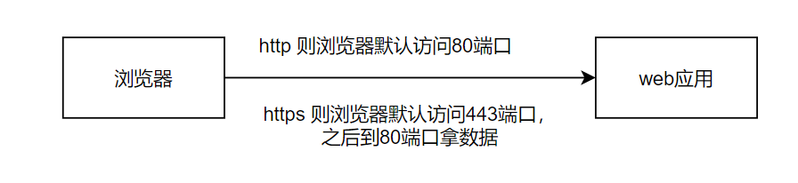
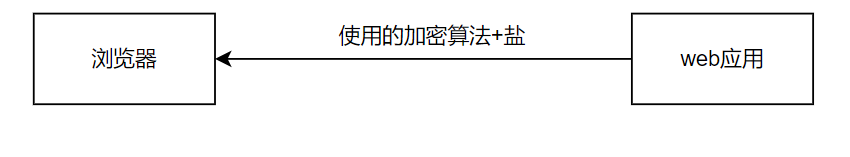
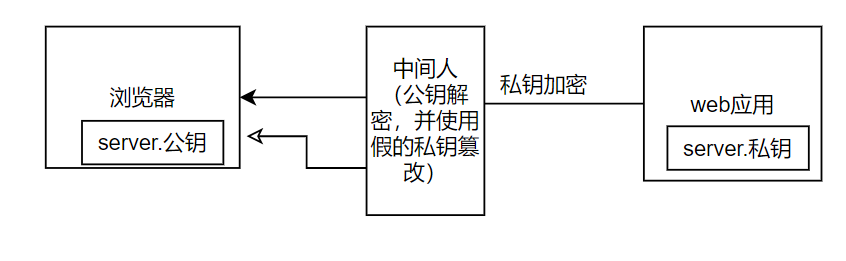
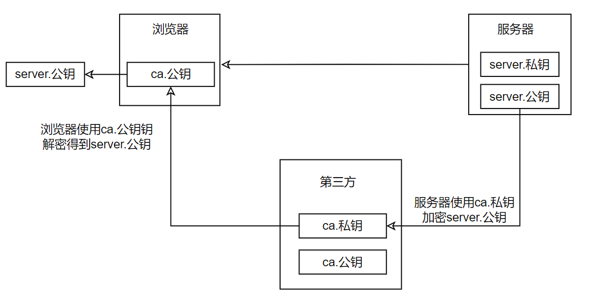
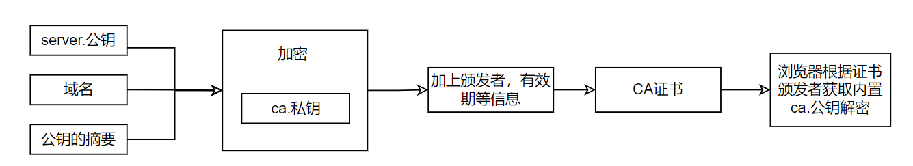
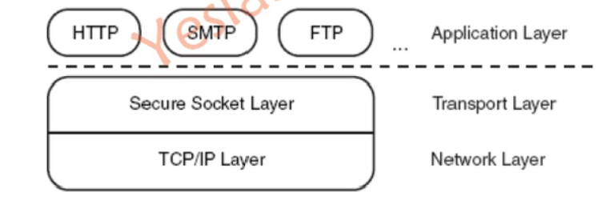

1. HTTPS

   HTTP 端口80

   HTTPS端口443， 80端口是使用的，HTTPS只是在HTTP协议上加了SSL或TLS层，80端口传数据，443端口增加些操作。

当是https协议时：

1. 浏览器访问443端口

   加密算法协商：（这个过程要保证安全，不被拦截）

   1. 浏览器向服务器发送 client hello, 并携带自己支持的加密算法列表
   2. 服务器收到后，回复一个server hello, 并根据浏览器支持的加密算法返回一个要使用的加密算法。

2. 有些事

3. 到80端口拿数据

   1. 浏览器使用协商的加密算法解密。

加密算法协商：（这个过程要保证安全，不被拦截）怎么解决呢？

如何让中间人即时获取到使用的算法，也解不开密文呢？那就是加盐。每次加盐都不一样。保证盐不被拦截就可以了。

那怎么保证盐不被拦截呢？盐就是**密钥**

被拦截的主要原因是使用的对称加密算法**。那就是在传输密钥（也就是盐）时使用非对称加密算法。**

非对称加密算法有私钥和公钥，私钥只有自己有，不传播。

服务器端：私钥加密数据，公钥解密。

中间人虽然可以拦截到公钥解开密文为原文，但是原文需要使用私钥加密，私钥在服务器里，中间人不知道，所以中间人改数据后就发送不到客户端了（它无法使用私钥加密篡改后的原文）。但是：中间人也生成了一对公私钥，使用自己的公私钥与客户端通信，也可以篡改数据。

客户端：公钥加密数据，私钥解密

怎么说公钥都不能随便传输。直接将server.公钥内置在浏览器中不就可以了吗。那怎么做方面的，就引入了第三方CA

第三方有ca.私钥和cas.公钥。浏览器中只要内置ca.公钥就可以安全的传输server.公钥了。

ca.公钥怎么传？别人也有吗？

有些信任证书操作系统中就有，别人也会有的。也不安全啊。CA并不是防止数据偷窥的，而是认证访问的网站是真正的网站，不是伪造的。网站绑定到CA中。ca.私钥加密是：ca.私钥(server.公钥+网站域名+公钥的摘要)==CA证书

虽然中间人也可以解开，但是不能篡改。

# 2. HTTP

## 2.1 URL 组成

就以下面这个URL为例，介绍下普通URL的各部分组成

http://www.aspxfans.com:8080/news/index.asp?boardID=5&ID=24618&page=1#name

从上面的URL可以看出，一个完整的URL包括以下几部分：
**1、**协议部分：该URL的协议部分为“http：”，这代表网页使用的是HTTP协议。在Internet中可以使用多种协议，如HTTP，FTP等等本例中使用的是HTTP协议。在"HTTP"后面的“//”为分隔符

**2、**域名部分：该URL的域名部分为“www.aspxfans.com”。一个URL中，也可以使用IP地址作为域名使用

**3、**端口部分：跟在域名后面的是端口，域名和端口之间使用“:”作为分隔符。端口不是一个URL必须的部分，如果省略端口部分，将采用默认端口80

**4、**虚拟目录部分：从域名后的第一个“/”开始到最后一个“/”为止，是虚拟目录部分。虚拟目录也不是一个URL必须的部分。本例中的虚拟目录是“/news/”

**5、**文件名部分：从域名后的最后一个“/”开始到“？”为止，是文件名部分，如果没有“?”,则是从域名后的最后一个“/”开始到“#”为止，是文件部分，如果没有“？”和“#”，那么从域名后的最后一个“/”开始到结束，都是文件名部分。本例中的文件名是“index.asp”。文件名部分也不是一个URL必须的部分，如果省略该部分，则使用默认的文件名

**6、**锚部分：从“#”开始到最后，都是锚部分。本例中的锚部分是“name”。锚部分也不是一个URL必须的部分

**7、**参数部分：从“？”开始到“#”为止之间的部分为参数部分，又称搜索部分、查询部分。本例中的参数部分为“boardID=5&ID=24618&page=1”。参数可以允许有多个参数，参数与参数之间用“&”作为分隔符

## 3. SSL

### 3.1 介绍

SSL是一个不依赖于平台和应用程序的协议，用于保障TCP-based应用安全，SSL在TCP层和应用层之间，就像应用层连接到TCP的一个插口。

HTTPS工作在TCP的443号端口，HTTP工作在TCP的80端口。

### 3.2 SSL握手

