# Java IO流

## 1. 流分类

* 按照流向：
  * 输入流：存储设备中数据读入内存中
  * 输出流：内存中数据写入存储设备中。
* 按照单位：
  * 字节流：以字节为单位进行读写，可以读写所有数据
  * 字符流：以字符为单位进行存储，只能读写文本数据
* 按照功能：
  * 节点流：具体实际传输数据的读写功能
  * 过滤流：在节点流的基础上的增强功能

## 2. 字节流

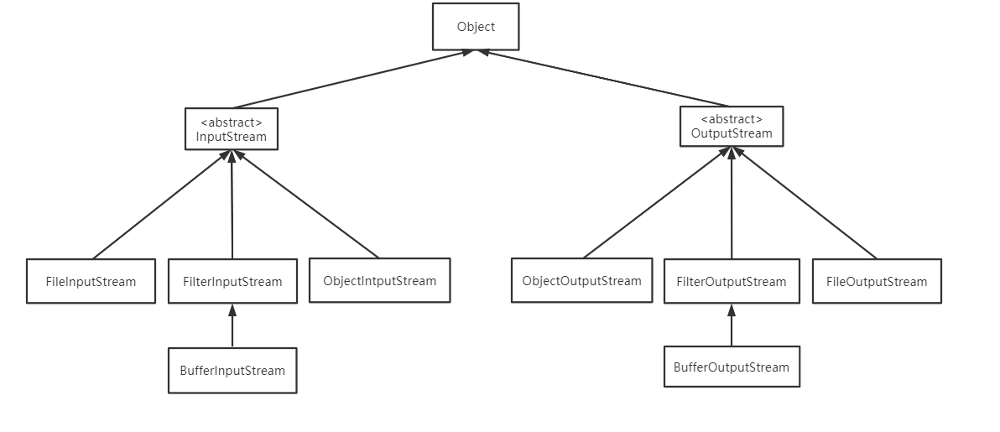

### 2.1 **字节流的抽象父类：**

* InputStream: 字节输入流

  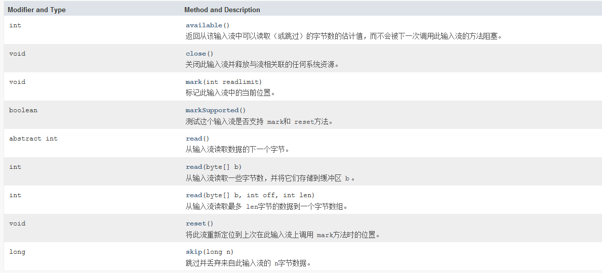

* OutputStream: 字节输出流

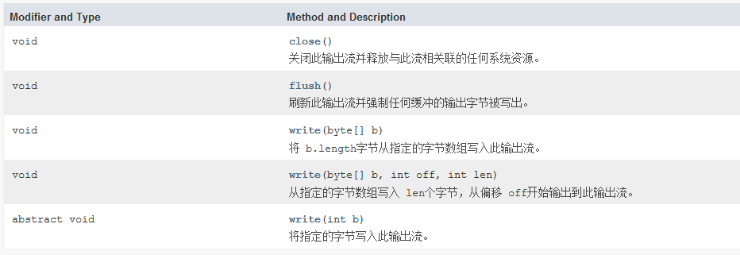

### 2.2 **字节流抽象类的子类：**

* FileInputStream:  文件输入字节流

  ```java
  FileInputStream(File file) 
  通过打开与实际文件的连接创建一个 FileInputStream ，该文件由文件系统中的 File对象 file命名。 
  FileInputStream(String name) 
  通过打开与实际文件的连接来创建一个 FileInputStream ，该文件由文件系统中的路径名 name命名。 
  ```

* FileOutputStream: 文件输出字节流

  ```java
  FileOutputStream(File file) 
  创建文件输出流以写入由指定的 File对象表示的文件。  
  FileOutputStream(File file, boolean append) 
  创建文件输出流以写入由指定的 File对象表示的文件。append=true 表示追加的方式写入  
  FileOutputStream(FileDescriptor fdObj) 
  创建文件输出流以写入指定的文件描述符，表示与文件系统中实际文件的现有连接。  
  FileOutputStream(String name) 
  创建文件输出流以指定的名称写入文件。  
  FileOutputStream(String name, boolean append) 
  创建文件输出流以指定的名称写入文件。 append=true 表示追加的方式写入  
  ```

示例：

```java
public class FileStream {

    public static void main(String[] args) throws IOException {

        String str="Hello World";
        FileOutputStream fout = new FileOutputStream("test");
        fout.write(str.getBytes());
        fout.close();

        byte[] buffer=new byte[1024];
        int count=0;
        FileInputStream fin = new FileInputStream("test");
        while((count=fin.read(buffer))!=-1){
            System.out.println(new String(buffer,0,count));
        }
        fin.close();
    }
}
```

字节流复制文件:

```java
import java.io.FileInputStream;
import java.io.FileNotFoundException;
import java.io.FileOutputStream;
import java.io.IOException;

public class CopyFileByFileStream {

    public static void main(String[] args) throws IOException {

        String inputFileName="test";
        String outputFileName="test_copy";
        FileInputStream fin = new FileInputStream(inputFileName);
        FileOutputStream fout = new FileOutputStream(outputFileName);

        // 一边读取一边写入
        byte[] buffer=new byte[1024];
        int count=0;
        while ((count=fin.read(buffer))!=-1){
            fout.write(buffer,0,count);
        }
        fin.close();
        fout.close();
    }
}
```


### 2.3 字节缓存流

缓存流：

* BufferedInputStream

  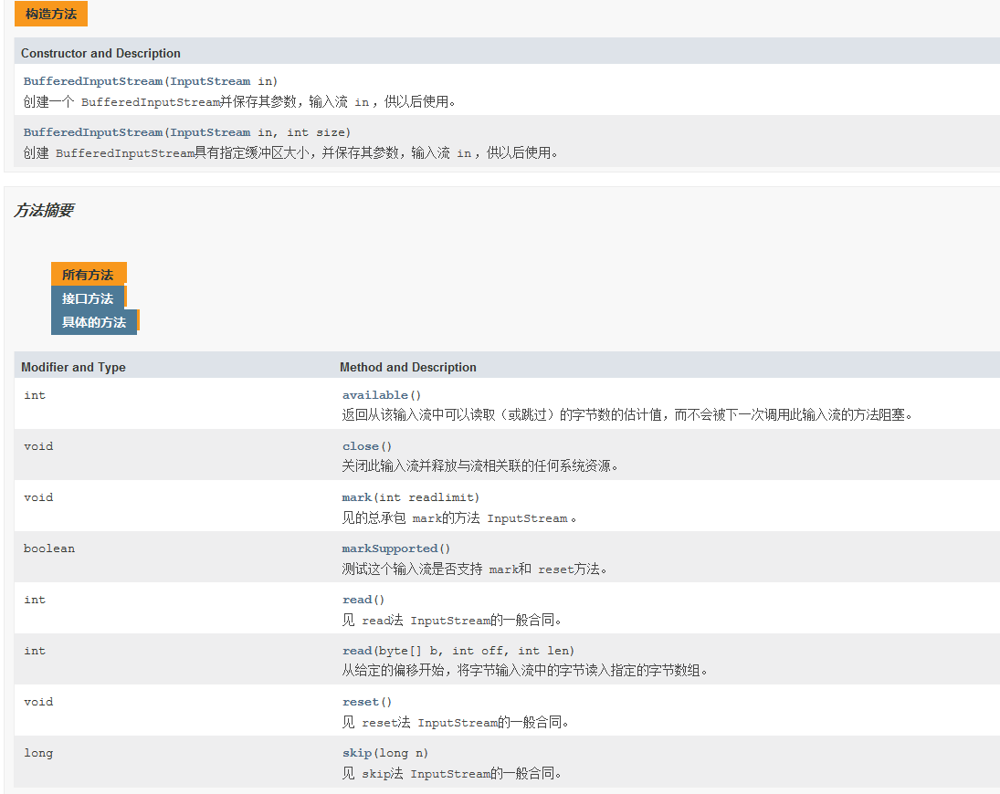

* BufferedOutputStream

  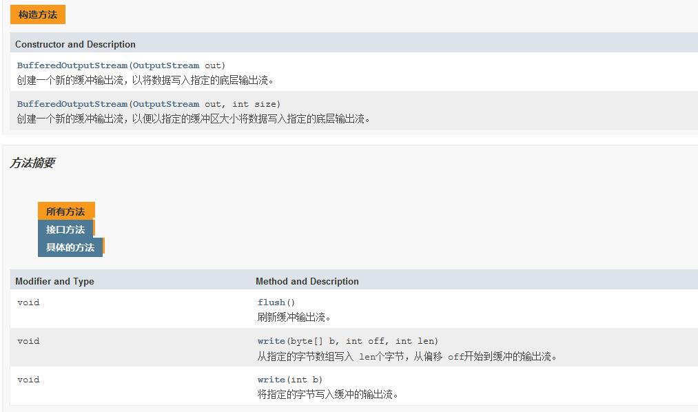

提高IO效率，减少访问磁盘的次数

数据存储在缓存区，flush是将缓冲区的内容写入文件中，也可以直接close.

```java
public class BufferFileRead {
    public static void main(String[] args) throws IOException {

        BufferedInputStream fis = new BufferedInputStream(new FileInputStream("test"));

        byte[] buffer=new byte[1024];
        int count=0;
        while ((count=fis.read(buffer))!=-1){
            System.out.println(new String(buffer,0,count));
        }
        fis.close();// 只需关缓存流，就可以，内部会自动关输入节点流
    }
}
```

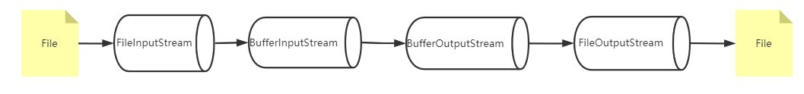

### 2.4 对象流

* ObjectOutputStream
* ObjectInputStream

增强了缓冲区功能

增强了读写8种基本数据类型和字符串功能

增强了读写对象的功能：readObject(), writeObject()

**使用流传输对象的过程称为序列化和反序列化。**

```java
public class ObjectStreamTest {

    public static void main(String[] args) throws IOException, ClassNotFoundException {
        ObjectOutputStream out=new ObjectOutputStream(new FileOutputStream("student"));

        Student s1=new Student("Lili",20);
        Student s2=new Student("Zhangsan",21);
        out.writeObject(s1);
        out.writeObject(s2);
        out.close();

        ObjectInputStream in=new ObjectInputStream(new FileInputStream("student"));
        Student s3 =(Student) in.readObject();
        Student s4 =(Student) in.readObject();
        System.out.println(s3);
        System.out.println(s4);
        in.close();
    }
}
```


## 3 字符流

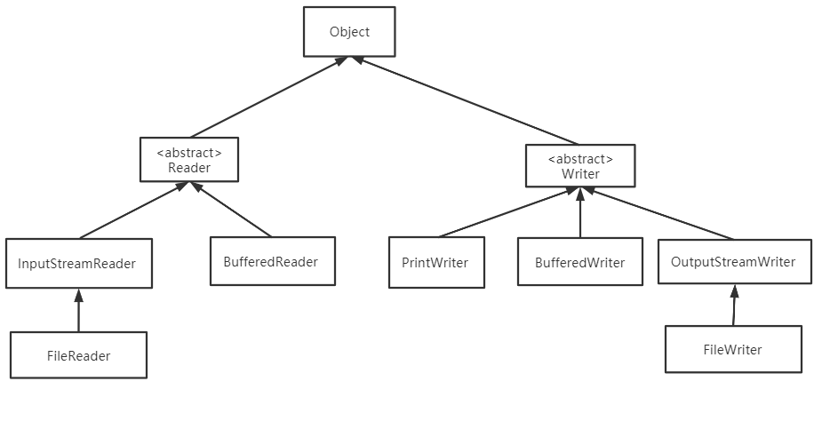

### 3.1 字符流抽象父类

* Reader： 字符输入流

  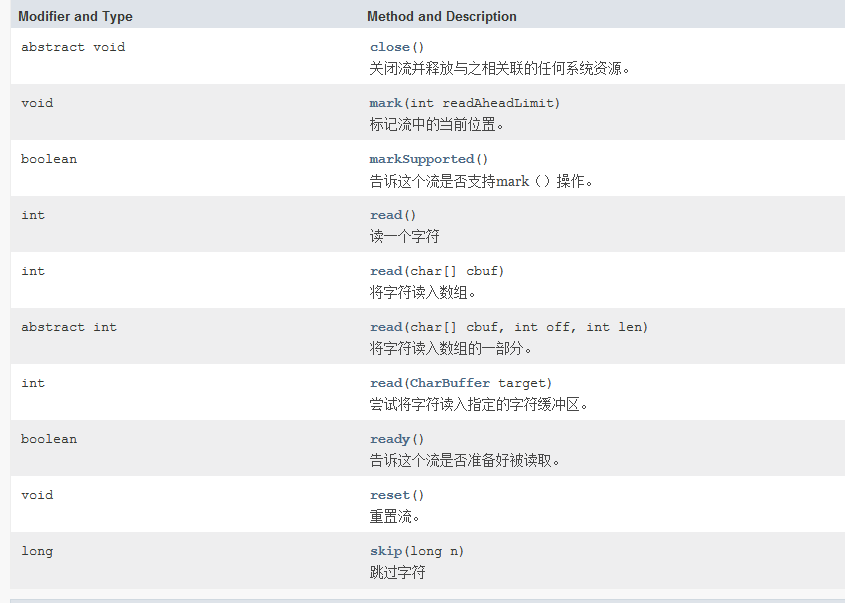

* Writer：字符输出流

  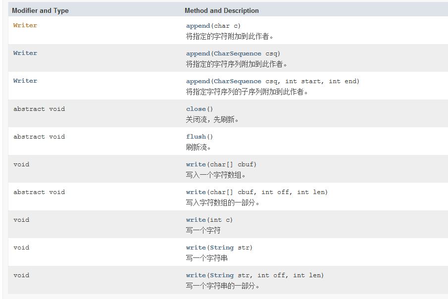

### 3.2 字符流的实现子类

* FileReader
* FileWriter

```java
public class FilerReaderAndWriter {

    public static void main(String[] args) throws IOException {

        FileReader fileReader = new FileReader("test");

        int count=0;
        char[] buffer=new char[1024];
        while ((count=fileReader.read(buffer))!=-1){
            System.out.println(new String(buffer,0,count));
        }
        fileReader.close();

        FileWriter fileWriter = new FileWriter("test", true);
        String str="你好\n";
        fileWriter.write(str);
        fileWriter.close();
    }
}
```

### 3.3 字符缓存流

* BufferedReader, 还可以使用readLine方法一次读取一行
* BufferedWriter

```java
public class FilerReaderAndWriterByBuffer {

    public static void main(String[] args) throws IOException {
        FileReader fileReader = new FileReader("test");
        BufferedReader reader = new BufferedReader(fileReader);
        int count=0;
        char[] buffer=new char[1024];
        while ((count=reader.read(buffer))!=-1){
            System.out.println(new String(buffer,0,count));
        }
        reader.close();

        FileWriter fileWriter = new FileWriter("test", true);
        BufferedWriter writer = new BufferedWriter(fileWriter);
        String str="你好\n";
        writer.write(str);
        writer.close();
    }
}
```

### 3.4 PrintWriter 打印流

还可以使用print 和println 方法输出。实现了printStream中的方法，System.out 就是PrintStream。

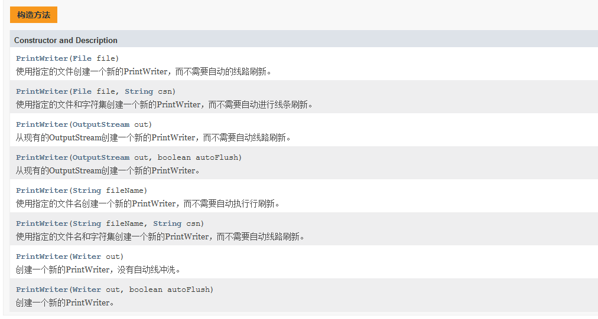

```java
public class PrintWriterTest {
    public static void main(String[] args) throws FileNotFoundException {

        PrintWriter out = new PrintWriter("test2");
        out.println("hello world");
        out.println("你好");
        out.close();
    }
}
```

### 3.5 转换流

可将字节流转为字符流

可设置字符的编码方式。

* InputStreamReader

  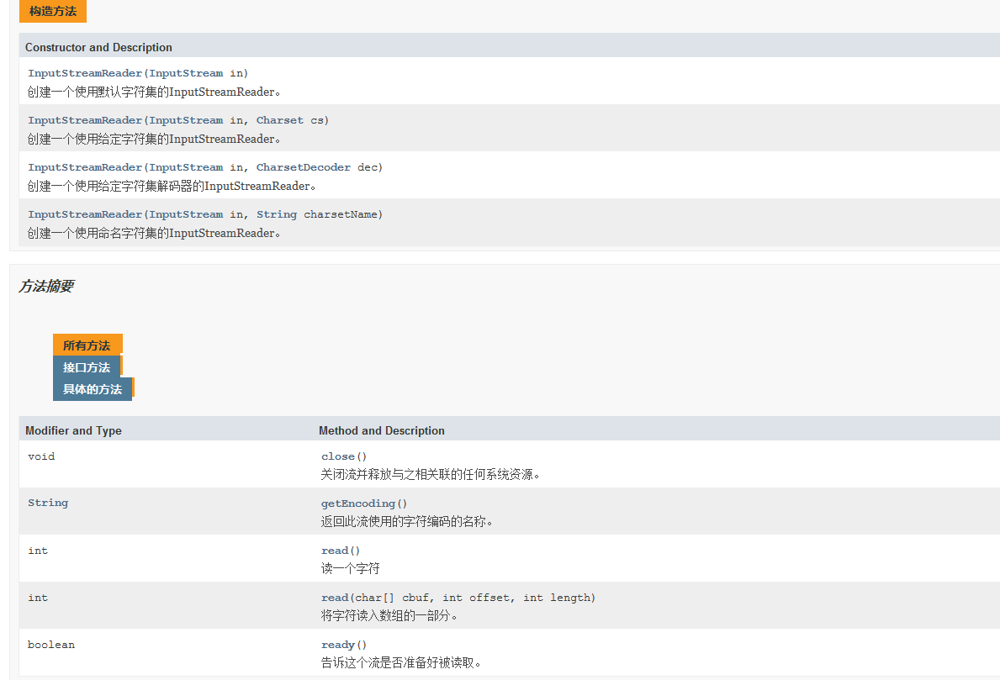

* OutputStreamWriter

  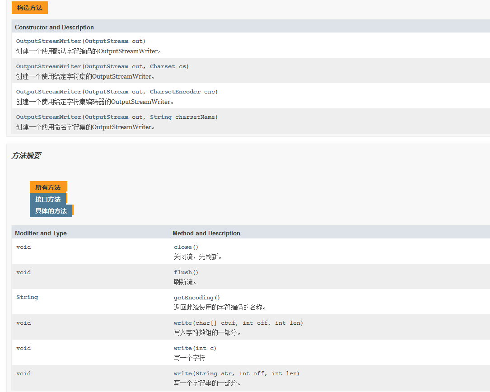


## 4 FileFilter 接口

```java
public interface FileFilter{
    boolean accept(File pathname);
}
```

文件过滤器，当调用File类中的listFiles()方法时，支持传入FileFilter接口实现类，对获取文件进行过滤，只有满足条件的文件才可以出现在listFiles()的返回值中。

```java
File file = new File(".");
File[] files = file.listFiles(new FileFilter() {
    @Override
    public boolean accept(File pathname) {
        return pathname.getName().lastIndexOf(".")>0;
    }
});
for(File f:files){
    System.out.println(f.getPath());
}
```

## 5 Properties

Properties 属性集合，继承自Hashtable

特点：

* 存储属性名和属性值
* 属性名和属性值都是字符串类型
* 没有泛型
* 和流有关

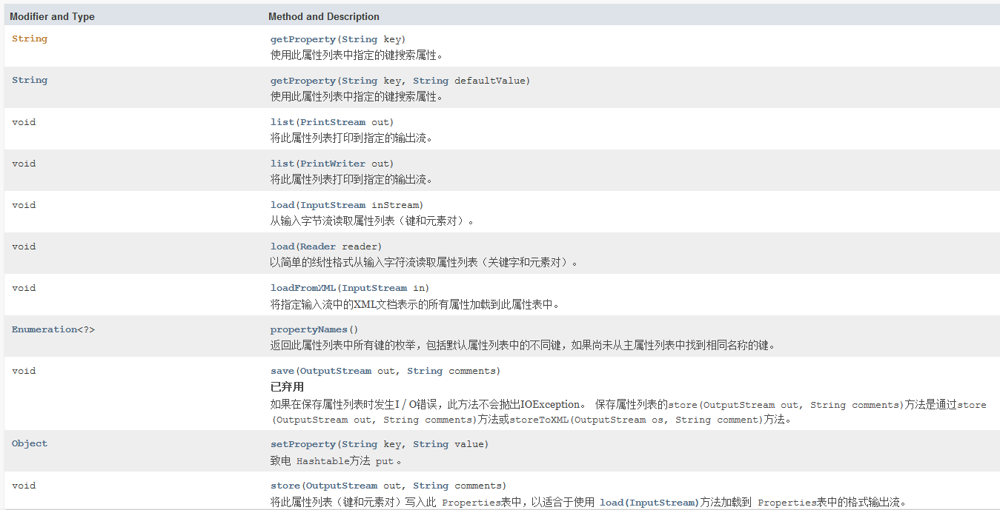

```java
public class PropTest {

    public static void main(String[] args) throws IOException {

        Properties prop = new Properties();
        prop.load(new FileInputStream("config.properties"));
        String username = prop.getProperty("username");
        String address = prop.getProperty("address");
        System.out.println(username);
        System.out.println(address);
        prop.list(System.out);
    }
}
```

