# **Java**

## 0 注解与反射

### 0.1 注解

* 注解 Annotation是从JDK5.0开始引用的新技术，它的作用是：
  * 不是程序本身，可以对程序作出解释（这一点和注释没有区别）
  * **可以被其他程序（比如编译器）读取**

* Annotation格式：

  以 “@注解名” 在代码中存在，还可以添加参数。

* 注解可以在哪里：

  可以在package、class、method和field上。

#### 0.1.1 内置注解

* @Override   ：定义在 java.lang.Override,此注解只是修饰方法，表明一个方法打算重写超类中的另一个方法
* @Deprecated：定义在Java.lang.Deprecated  ,用于修饰方法、属性、类，表示不鼓励程序员使用，通常是因为它很危险或存在更好的选择，或者将要被丢弃
* @SuppressWarnings：定义在java.lang.SuppressWarnings，用来抑制编译时的警告信息，需要添加合适的参数来使用
  * @SuppressWarnings("all")
  * @SuppressWarnings("unchecked")
  * @SuppressWarnings(value={"unchecked","deprecation"})
  * .........................

#### 0.1.2 元注解

元注解的作用就是负责注解其他的注解，java定义了4个标准的meta-annotation类型，他们被用来提供对其他annotation类型作说明。

这些注解在java.lang.annotation中。

* @Target: 用于描述注解的使用范围（即被描述的注解可以用在什么地方）
* @Retention：表示需要在什么级别该注解有效，用于描述注解的生命周期（source<class<runtime）
* @Document：说明该注解将被包含在javadoc中
* @Inherited：说明子类可以继承分类中的注解

```java
// 定义一个注解
@Target(value = ElementType.METHOD) // 定义注解只能在方法上使用
public @interface MyAnnotation{

}

// 也可定义注解只能在方法和类上使用
@Target(value = {ElementType.METHOD,ElementType.TYPE})
public @interface MyAnnotation{

}

@Target(value = {ElementType.METHOD,ElementType.TYPE})
@Retention(value = RetentionPolicy.RUNTIME)
@interface MyAnnotation{

}
```

#### 0.1.3 自定义注解

使用 @interface 自定义注解，自动继承了java.lang.annotation.Annotation接口。

* @interface 用来声明一个注解，格式: public @interface 注解名 {定义内容}
* 其中的每一个方法实际上是声明一个参数配置
* 方法的名称就是参数的名称
* 返回值类型就是参数的类型（返回值只能是基本类型，Class,String，enum）
* 可以通过default来声明参数的默认值
* 如果只有一个参数成员，一般参数名为value
* 注解元素必须要有值，我们定义注解元素时，经常使用空字符串，0作为默认值。

```java
@Target({ElementType.METHOD,ElementType.TYPE})
@Retention(RetentionPolicy.RUNTIME)
public @interface UserAnnotation {

    // 注解的参数，参数类型+参数名(),并不是一个方法,没默认值使用时一定要赋值
    String name() default "";

    int age() default 0;

    int id() default -1;  // 如果默认值为-1，代表不存在

    String[] schools() default {"A","B"};
}

class  Test02{
    @UserAnnotation(name="liyajie",age = 1,schools = {"USTC","NAU"})
    public void test(){
    }
}
```


### 0.2 反射

#### 0.2.1 java反射机制概述

反射使java变成了动态语言。反射机制允许程序在执行期间借助ReflectAPI 取得任何类的内部信息，并能直接操作任意对象的内部属性及方法。

```java
Class c=Class.forName("java.lang.String")
```

加载一个类后，在堆内存的方法区中就会产生一个Class类型的对象（一个类就是一个Class对象），这个对象久包含了完整的类的结构信息。我们可以通过这个对象看到类的结构。这个对象就像一面镜子，透过这个镜子可以看到类的结构，所以，我们形象的称之为：反射。

正常方式： 引入需要的”包类“名------> 通过new实例化-------> 取得实例化对象

反射方式：实例化对象---------> getClass() 方法---------> 得到完整的”包类“名

* Java反射机制提供的功能
  1. 在运行时判断任意一个对象所属的类
  2. 在运行时构造任意一个类的对象
  3. 在运行时判断任意一个类所具有的成员变量和方法
  4. 在运行时获取泛型信息
  5. 在运行时调用任意一个对象的成员变量和方法
  6. 在运行时处理注解
  7. 生成动态代理
  8. 。。。。。。

**反射对性能有影响**，总是慢于直接执行相同的操作。

* 反射的主要API

  **java.lang.Class   代表一个类**

  java.lang.reflect.Method  代表类的方法

  java.lang.reflect.Field   代表类的成员变量

  java.lang.reflect.Constructor 代表类的构造器

  。。。

例子：

一个实体类

```java
package com.liyajie.pojo;

public class User {
    private String name;
    private  int id;
    private  int age;
    public User() {
    }
    public User(String name, int id, int age) {
        this.name = name;
        this.id = id;
        this.age = age;
    }
    public String getName() {return name;}
    public void setName(String name) { this.name = name; }
    public int getId() {return id; }
    public void setId(int id) { this.id = id;}
    public int getAge() { return age;}
    public void setAge(int age) {this.age = age;}

    @Override
    public String toString() {
        return "User{" +
                "name='" + name + '\'' +
                ", id=" + id +
                ", age=" + age +
                '}';
    }
}
```

反射得到类的Class对象

一个类在内存中只有一个Class对象，所以hasCode一样。
一个类被加载后，类的整个结构都会被封装在Class对象中。

```java
public class Test1 {
    public static void main(String[] args) throws ClassNotFoundException {
        // 通过反射获取类的Class对象
        Class c1=Class.forName("com.liyajie.pojo.User");
        System.out.println(c1);
        Class c2=Class.forName("com.liyajie.pojo.User");
        
        // 一个类在内存中只有一个Class对象，所以hasCOde一样。
        // 一个类被加载后，类的整个结构都会被封装在Class对象中。
        System.out.println(c1.hashCode());
        System.out.println(c2.hashCode());
    }
}
```

#### 0.2.2 理解Class类并获取Class实例

* Class 类

  在Object类中定义了以下的方法，此方法将被所有子类继承

  ```java
  public final Class getClass()
  ```

  该方法返回的是一个Class类，此类是java反射的源头，实际上所谓反射从程序的运行结构来看也很好理解，即：可以通过对象反射求出类的名称。

  Class本身也是一个类

  Class对象只能由系统建立对象

  一个加载的类在JVM中只会由一个Class实例

  一个Class对象对应的是一个加载到JVM中的一个 .class文件

  每个类的实例都会记得自己是由哪个Class实例生成

  通过Class可以完整的得到一个类中的所有被加载的结构

  Class类是Reflection的根源，针对任何你想动态加载、运行的类、唯有先获得相应的Class对象。

* Class常用方法:

  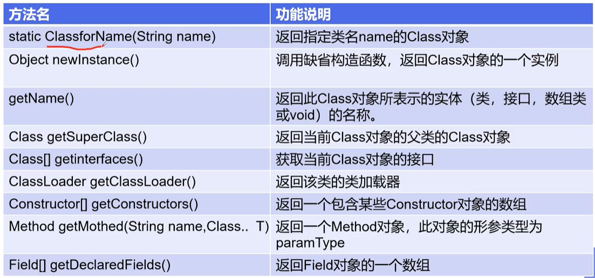

* 获取Class类的实例

  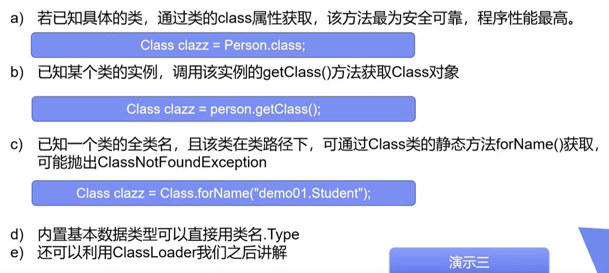

* 哪些类型可以有Class对象：

  * class : 外部类，成员，局部内部类，匿名内部类
  * interface：接口
  * []：数组
  * enum：枚举
  * annotation：注解
  * primitive type：基本数据类型
  * void

  ```java
  System.out.println(void.class);
  System.out.println(int.class);
  System.out.println(String.class);
  System.out.println(int[].class);
  System.out.println(Comparator.class);
  System.out.println(Target.class);
  System.out.println(Enum.class);
  System.out.println(Class.class);
  // out
  void
  int
  class java.lang.String
  class [I
  interface java.util.Comparator
  interface java.lang.annotation.Target
  class java.lang.Enum
  class java.lang.Class
  ```

#### 0.2.3 类的加载与ClassLoader

##### 0.2.3.1 类的加载过程

当程序主动使用某个类时，如果该类还没有被加载到内存中，则系统会通过如下三个步骤来对该类进行初始化。

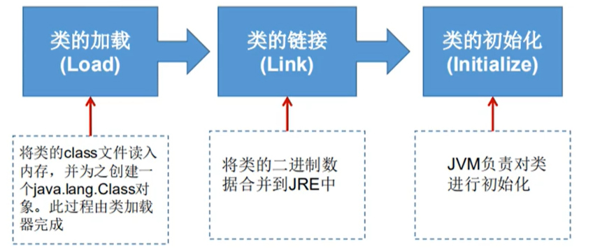

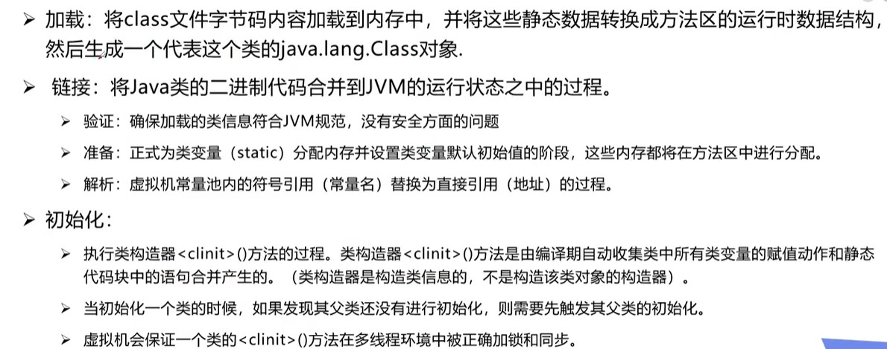


```java
class A{
    static {
        System.out.println("静态初始化");
        m=200;
    }
    static int m=100;    // m最终为多少，取决于顺序，当上面代码在后，则m=200

    A(){
        System.out.println("构造函数初始化");
    }
}
public class Test3 {
    public static void main(String[] args) {
        A a=new A();
        System.out.println(A.m);
    }
}
// out
静态初始化
构造函数初始化
100
```

在链接的准备阶段：m被分配内存，然后初始化为0;

z在初始化阶段，会将：

```java
static {
        System.out.println("静态初始化");
        m=200;
    }
static int m=100;
```

合并为：

```java
<clinit>(){
    System.out.println("静态初始化");
    m=200;
    m=100;
}
```

执行。所有m=100，当顺序反时，m=200。

##### 0.2.3.2 分析类的初始化

* 类的主动引用（一定会发生类的初始化）

  * 当虚拟机启动，先初始化main方法所在的类
  * 当new一个类的对象
  * 当调用类的静态成员（除了final 常量）和静态方法
  * 当使用java.lang.reflect包的方法对类进行反射调用
  * 当初始化一个类，如果其父类没有被初始化，则先会初始化它的父类

  ```java
  class Father{
      static {
          System.out.println("Father 初始化");
          m=200;
      }
      static int m=100;
      static final int M=1;
  }
  class Son extends Father{
      static {
          System.out.println("Son 初始化");
      }
      static int s=20;
  }
  public class Test4 {
      static {
          System.out.println("Main 初始化");
      }
      public static void main(String[] args) throws ClassNotFoundException {
          // 1 new 一个对象时，主动引用初始化
          // Son son=new Son();
          // 2 反射时，主动引用初始化
          Class.forName("com.liyajie.pojo.Son");
      }
  }
  // out:
  Main 初始化
  Father 初始化
  Son 初始化
  ```

  

* 类的被动引用（不会发生类的初始化）

  * 当访问一个静态域时，只有真正声明这个域的类才会被初始化。如：当通过子类引用父类的静态变量，不会导致子类初始化
  * 通过数组定义类引用，不会触发此类的初始化
  * 引用常量不会触发此类的初始化（常量在链接阶段就存入调用类的常量池中）

```java
public class Test4 {
    static {
        System.out.println("Main 初始化");
    }
    public static void main(String[] args) throws ClassNotFoundException {
        // 调用父类的静态域，只有父类被初始化
        // out: Main 初始化
        //      Father 初始化
        // int m=Son.m;

        // 调用子类的静态域，父类先被初始化，然后子类初始化
        // out: Main 初始化
        //      Father 初始化
        //      Son 初始化
        // int m=Son.s;

        // 通过数组定义引用，不会触发初始化
        // out: Main 初始化
        // Son[] sons=new Son[4];

        // 引用常量，不会触发初始化
        // out: Main 初始化
        int t=Father.M;
    }
}
```

##### 0.3.2.3 类加载器

* 类加载器的作用：将class字节码内容加载到内存中，并将这些静态数据转换成方法区的运行时数据结构，然后再堆中生成一个代表这个类的java.lang.Class对象，作为方法区中类数据的访问入口。
* 类缓存：标准的java SE类加载器可以按要求查找类，一旦某个类被加载到类加载器中，它将维持加载（缓存）一段时间。不过JVM垃圾回收机制可以回收这些Class对象。
* 类加载器的类型：
  1. 引导类加载器：用C++编写，是JVM自带的类加载器，**负责java平台核心库**，用来装载核心类库。该加载器无法直接获取。
  2. 扩展类加载器：负责jre/lib/ext目录下的jar包或-D java.ext.dirs指定目录下的jar包装入工作库
  3. 系统加载器：负责java -classpath 或-D java.class.path 指定的目录下的类与jar包装入工作，是最常见的加载器。

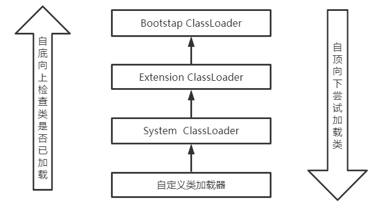

```java
public class Test5 {
    public static void main(String[] args) {
        ClassLoader systemLoader=ClassLoader.getSystemClassLoader();
        System.out.println(systemLoader);

        ClassLoader extLaoder=systemLoader.getParent();
        System.out.println(extLaoder);

        ClassLoader bootLoader=extLaoder.getParent();
        System.out.println(bootLoader);
        
        // 查看该类的类加载器
        ClassLoader thissLoader=Class.forName("com.liyajie.pojo.Test5").getClassLoader();
        System.out.println(thissLoader);
    }
}
// out:
jdk.internal.loader.ClassLoaders$AppClassLoader@2f0e140b
jdk.internal.loader.ClassLoaders$PlatformClassLoader@16b98e56
null   // boot加载器是得不到的
jdk.internal.loader.ClassLoaders$AppClassLoader@2f0e140b
```

如何获得系统类加载器可以加载的路径

```java
System.out.println(System.getProperty("java.class.path"));
// E:\Java\reflect\out\production\reflect-01
```

双亲委派机制：不允许你的包的名和我的一样，否则你的无效。

如你写了 java.lang.String的包，类加载器会从底层一直往引导加载器中找，如果找到了一个一样的包，则你的包就不会被使用。

#### 0.2.4 创建运行时类的对象

##### 0.2.4.1 获取运行时类的完整结构

通过反射获取运行时类的完整结构

Field，Method，Constructor，Superclass，Interface，Annotation

* 实现的所有接口
* 所继承的父类
* 全部的构造器
* 全部的方法
* 全部的Field
* 注解
* 。。。

```java
// 获取类的信息                                                                                                     
public class Test6 {                                                                                          
    public static void main(String[] args) throws ClassNotFoundException, NoSuchMethodException {             
        Class c1 = Class.forName("com.liyajie.pojo.User");                                                    
                                                                                                              
        // 获取类名                                                                                               
        System.out.println(c1.getName());                                                                     
        System.out.println(c1.getSimpleName());                                                               
                                                                                                              
        // 获取类的属性                                                                                             
        Field[] fields = c1.getFields(); // 获取public 属性                                                       
        for (Field field : fields) {                                                                          
            System.out.println(field);                                                                        
        }                                                                                                     
                                                                                                              
        fields=c1.getDeclaredFields();   // 获取本类的所有属性                                                         
        for (Field field : fields) {                                                                          
            System.out.println(field);                                                                        
        }                                                                                                     
                                                                                                              
        // 获取类的方法                                                                                             
        Method[] methods = c1.getMethods();   // 获取本类及其父类的所有public方法                                          
        for (Method method : methods) {                                                                       
            System.out.println(method);                                                                       
        }                                                                                                     
        methods=c1.getDeclaredMethods();     // 获取本类的所有方法                                                     
        for (Method method : methods) {                                                                       
            System.out.println(method);                                                                       
        }                                                                                                     
                                                                                                              
        // 根据方法名获取方法                                                                                          
        System.out.println(c1.getMethod("setName",String.class));                                             
                                                                                                              
        // 获取指定的构造器                                                                                           
        Constructor[] constructors = c1.getConstructors();                                                    
        for (Constructor constructor : constructors) {                                                        
            System.out.println(constructor);                                                                  
        }                                                                                                     
        constructors = c1.getDeclaredConstructors();                                                          
        for (Constructor constructor : constructors) {                                                        
            System.out.println(constructor);                                                                  
        }                                                                                                     
    }                                                                                                         
}                                                                                                             
```


##### 0.2.4.2 调用运行时类的指定结构

* 创建类的对象：调用Class对象的newInstance()方法。（1）类必须有一个无参构造器，（2）类的构造器的访问权限需要足够
* 没有无参构造器创建对象，只需在操作时明确调用类的构造器，并将参数传递进行：
  1. 通过Class类的getDeclaredConstructor( Class... parameterTypes) 取得本类的指定形参类型的构造器
  2. 向构造器的形参中传递一个对象数组进去，里面包含了构造器中所需的各个参数
  3. 通过Constructor实例化对象。

```java
public class Test7 {
    public static void main(String[] args) throws ClassNotFoundException, IllegalAccessException, InstantiationException, NoSuchMethodException, InvocationTargetException, NoSuchFieldException {
        Class aClass = Class.forName("com.liyajie.pojo.User");

        // 实例化一个对象
        User user = (User) aClass.newInstance(); // 调用了类的无参构造器
        System.out.println(user);

        //获取有参构造器,使用有参构造器，实例化
        Constructor declaredConstructor = aClass.getDeclaredConstructor(String.class, int.class, int.class);
        Object liyakoe = declaredConstructor.newInstance("Liyakoe", 13, 25);
        System.out.println(liyakoe);

        // 通过反射调用方法
        User user2 = (User) aClass.newInstance();
        Method setName = aClass.getDeclaredMethod("setName", String.class);
        setName.invoke(user2,"Mike"); // 通过反射调用方法
        System.out.println(user2);

        // 通过反射操作属性
        User user3 = (User) aClass.newInstance();
        Field name = aClass.getDeclaredField("name");
        name.setAccessible(true); // 关掉访问权限检查，私有的也可直接访问
        name.set(user3,"Joke");// 赋值
        System.out.println(name.get(user3)); // 获取
    }
}
```

Method,Filed和Constructor对象都有一个setAccessible()方法，用于启动和关闭权限检测。关闭检测可提高效率

#### 0.2.5 性能对比分析

关闭检测可提高反射效率。

```java
public class Test8 {
    public static void main(String[] args) throws ClassNotFoundException, IllegalAccessException, InstantiationException, NoSuchMethodException, InvocationTargetException {

        User user1=new User();
        Instant start = Instant.now();
        for(int i=0;i<1000000000;i++)
        {
            user1.getName();
        }
        Instant end = Instant.now();
        System.out.println("time1: "+Duration.between(start,end).toMillis() +"ms"); // 5ms

        Class c1 = Class.forName("com.liyajie.pojo.User");
        User user2=(User) c1.newInstance();
        Method getName = c1.getDeclaredMethod("getName", null);
        start = Instant.now();
        for(int i=0;i<1000000000;i++)
        {
            getName.invoke(user2);
        }
        end = Instant.now();
        System.out.println("time2: "+Duration.between(start,end).toMillis()+"ms");// 3433ms


        getName.setAccessible(true);
        start = Instant.now();
        for(int i=0;i<1000000000;i++)
        {
            getName.invoke(user2);
        }
        end = Instant.now();
        System.out.println("time3: "+Duration.between(start,end).toMillis()+"ms"); //1314ms
    }
}
```


#### 0.2.6 获取泛型信息

java采用泛型擦除的机制引入泛型，java中的泛型仅仅是给编译器javac使用的，确保数据的安全性和免去强制类型转换的问题，但是，一旦编译完成，所有和泛型有关的类型全部擦除。

为了通过反射操作这些类型，java新增ParameterizedType，GenericArrayType，TypeVariable和 WildcardType 几种类型来代表不能被归一到Class类中的类型，但是又和原始类型齐名的类型。

* ParameterizedType：表示一种参数化类型，比如Collection<String>
* GenericArrayType：表示一种元素类型是参数化类型或者类型变量的数组类型
* TypeVariable：是各种类型变量的公共接口
* WildcardType ：代表一种通配符类型表达式

```java
public class Test9 {

    public void test01(Map<String,User> map, List<User> list){
        System.out.println("test01");
    }

    public Map<String,User> test02(){
        System.out.println("test02");
        return null;
    }

    public static void main(String[] args) throws NoSuchMethodException {

        Method method = Test9.class.getDeclaredMethod("test01", Map.class, List.class);
        // 获取泛型参数信息
        Type[] genericParameterTypes = method.getGenericParameterTypes();
        for(Type type:genericParameterTypes){
            System.out.println("# :"+type);
            if(type instanceof ParameterizedType){
                Type[] actualTypeArguments = ((ParameterizedType) type).getActualTypeArguments();
                for(Type type1:actualTypeArguments){
                    System.out.println(type1);
                }
            }
        }

        Method method2 = Test9.class.getDeclaredMethod("test02", null);
        Type t = method2.getGenericReturnType();
        System.out.println("# :"+t);
        if(t instanceof ParameterizedType){
            Type[] actualTypeArguments = ((ParameterizedType) t).getActualTypeArguments();
            for(Type type1:actualTypeArguments){
                System.out.println(type1);
            }
        }
    }
}
// out
# :java.util.Map<java.lang.String, com.liyajie.pojo.User>
class java.lang.String
class com.liyajie.pojo.User
# :java.util.List<com.liyajie.pojo.User>
class com.liyajie.pojo.User
# :java.util.Map<java.lang.String, com.liyajie.pojo.User>
class java.lang.String
class com.liyajie.pojo.User
```


#### 0.2.7 获取注解信息

* ORM: Object relationship Mapping  对象关系映射

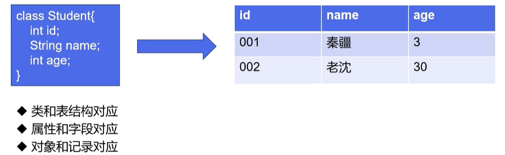

```java
// 类名的注解
@Target(ElementType.TYPE)
@Retention(RetentionPolicy.RUNTIME)
public @interface Tablevalue {
    String value();
}

// 属性的注解
@Target(ElementType.FIELD)
@Retention(RetentionPolicy.RUNTIME)
@interface Filedname{
    String columnName();
    String type();
    int length();
}

@Tablevalue("DB_Student")
public class Student {
    @Filedname(columnName = "db_name",type = "string",length = 14)
    private String name;
    @Filedname(columnName = "db_age",type = "int",length = 32)
    private int age;
    @Filedname(columnName = "db_id",type = "string",length = 8)
    private int id;
    ....
}
```

```java
public class Test10 {
    public static void main(String[] args) throws ClassNotFoundException, NoSuchFieldException {
        Class c1 = Class.forName("com.liyajie.pojo.Student");

        // 获取注解
        Annotation[] annotations = c1.getAnnotations();
        for(Annotation annotation:annotations){
            System.out.println(annotation);
        }   // ---> @com.liyajie.pojo.Tablevalue("DB_Student")

        // 获取注解的value的值
        Tablevalue tb = (Tablevalue) c1.getAnnotation(Tablevalue.class);
        System.out.println(tb.value());  // ---> DB_Student

        // 获取类指定的注解
        Field f = c1.getDeclaredField("name");
        Filedname annotation = f.getAnnotation(Filedname.class);
        System.out.println(annotation.columnName()); // ----> db_name
        System.out.println(annotation.type()); // ----> string
        System.out.println(annotation.length()); // ----> 14
    }
}
```


## 1 Java中常用的容器与集合的使用

Java集合框架图：

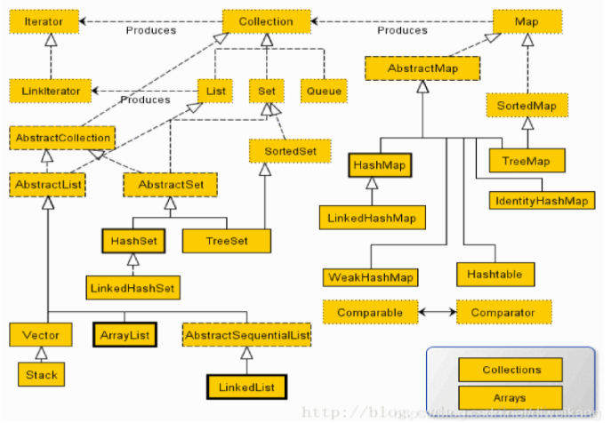

### 1.1 集合的概念

集合：对象的容器，定义了对对象进行操作的方法，类似数组的功能。

和数组的区别：

* 数组长度固定，集合长度不固定。
* 数组可以存储基本类型和引用类型，集合只能存储引用类型（存储基本类型要使用装箱操作）。

位置：java.util.*


### 1.2 Collection接口

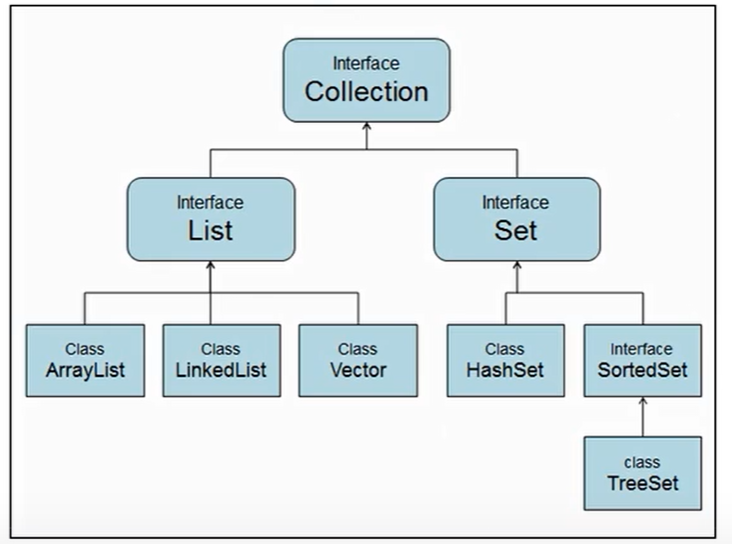

Collection 为根接口，代表一组对象，称为“集合”。

List接口：有序，有下标、元素可重复使用。

Set接口：无序，无下标，元素不能重复。

* 定义的方法：
  * boolean add(Object obj)  //添加一个对象
  * boolean addAll(Collection c) //将一个集合中的所有元素添加到此集合中
  * void clear() //清空集合中的所有对象
  * boolean contains(Object o)   //检查集合中是否包含o对象
  * boolean equals(Object o)   // 比较集合是否与指定对象相等
  * boolean isEmpty()    // 判断集合是否为空
  * boolean remove(Object o)   // 移除o对象
  * int size()    // 返回集合元素个数。
  * Object[] toArray()  // 将集合转化成数组
  * iterator()  //返回一个集合的迭代器，Iterator 方法：hasNext(),next(),remove().

``` java
public class Main {

    public static void main(String[] args) {
	// write your code here
        Collection collection=new ArrayList();
        collection.add("Apple");
        collection.add("Banana");
        collection.add("Tree");
        System.out.println(collection.size());
        System.out.println(collection);

        collection.remove("Tree");
        System.out.println(collection);

        System.out.println("======元素遍历=========");
        System.out.println("======使用增强for=========");
        for (Object obj:collection){
            System.out.println(obj);
        }
        System.out.println("======使用迭代器=========");
        Iterator it=collection.iterator();
        while (it.hasNext()){
            String s=(String) it.next();
            System.out.println(s);
            // collection.remove(s); // 迭代过程不允许使用collection方法删除元素,可以使用it.remove(s)删除
            // it.remove();
        }
        System.out.println("size: "+collection.size());
    }
}
```

### 1.3 List接口与实现类

#### 1.3.1 List子接口

新加的方法：

* void add(int index, Object o)   // 在index位置插入对象
* boolean addAll(int index, Collection c)   // 将一个集合中的元素添加到此集合中的index位置
* Object get(int index)   // 返回集合中指定位置的元素
* List subList(int fromIndex, int toIdex)   // 返会从fromIndex到toIndex之间的元素, 包头不包尾 [fromIndex,toIndex)
* ListIterator listIterator()  // 返回列表的迭代器，该迭代器比Collection中的还强大,允许按任意方向遍历
* int indexOf(Object o)  // 获取元素的位置

可以使用下标访问，因此也就可以使用for(int i=0,;;i_++)进行遍历

```java
public class Main {
    public static void main(String[] args) {
	// write your code here
        List list=new ArrayList();
        list.add("Apple");
        list.add("Banana");
        list.add("Tree");
        System.out.println(list.size());
        System.out.println(list);

        System.out.println("======元素遍历=========");
        System.out.println("======使用for=========");
        for(int i=0;i<list.size();i++){
            String s=(String) list.get(i);
            System.out.println(s);
        }
        System.out.println("======使用增强for=========");
        for (Object obj:list){
            System.out.println(obj);
        }

        System.out.println("======使用迭代器=========");
        Iterator it1=list.iterator();
        while (it1.hasNext()){
            String s=(String) it1.next();
            System.out.println(s);
        }

        System.out.println("======使用列表迭代器从前往后=========");
        ListIterator it2=list.listIterator();
        while (it2.hasNext()){
            System.out.println(it2.nextIndex()+" : "+it2.next());
        }

        System.out.println("======使用列表迭代器从后往前=========");
        while (it2.hasPrevious()){
            System.out.println(it2.previousIndex()+" : "+it2.previous());
        }

    }
}
```

#### 1.3.2 List实现类

* ArrayList : 数组结构实现的，里面其实是一个数组，查询速度快，增删慢。JDK1.2版本加入的，运行效率快，线程不安全。

  默认容量大小为DEFAULT_CAPACITY = 10(默认容量是添加元素之后，如果没有添加任何元素，容量就为0，每次扩容为原来的1.5倍)，存放元素的数组elementData，元素个数 size，

* Vector : 里面也是数组实现的，查询速度快，增删慢，JDK1.0版本加入的，运行效率慢，线程安全。
* LinkedList：双向链表结构实现，增删快，查询慢。


### 1.4 泛型和工具类

JDK1.5引入，用于参数化类型，把类型(只能是引用类型)作为参数传递。常见形式：泛型类、泛型接口和泛型方法。

* 泛型类语法：

```java
public class ClassName<T>{   // 多个类型使用逗号隔开，<T1,T2,T3>
    private T t;
    public T getT(){
        return t;
    }
    public void setT(T outT){
        // T tmpT=new T() ;  泛型无法具体实例化
        t=outT;
    }
}
```

* 泛型接口语法：

```java
// 定义接口
public interface InterfaceName<T>{
    T t;
    T server(T outT);
}

// 接口实现
public class MyInterface implements InterfaceName<String>{
    @Override
    public String server(String outT){
        System.out.println(outT);
        return outT;
    }
}

// 在定义泛型类
public class MyInterface<T> implements InterfaceName<T>{
    @Override
    public T server(T outT){
        System.out.println(outT);
        return outT;
    }
}
```

* 泛型方法：

<T> 放在方法返回值前面

```java
public class MyClass{
    
    // 泛型方法
    public <T> void show(T t){
        System.out.println("泛型方法"+t);
    }
    
    public <T> T getT(T t){
        System.out.println("泛型方法"+t);
        return t;
    } 
    
    public static void main(String args[]){
        // 泛型方法在使用时，根据传入的参数类型确定
		MyClass test=new MyClass();
        test.show("String");
        test.show(120);
    }
}
```

泛型在使用是可以不传入类型参数，默认则是Object类型。但是可能在需要时要把类型强制转化成需要的数据类型(可能会出现错误)

```java
public class TestClass{
     public static void main(String args[]){
     	 ArrayList arrayList=new ArrayList();
         arrayList.add("Kile");
         arrayList.add(10);
         for(Object o:arrayList){
             String s=(String) o;  // 会出错，里面有整型
             System.out.println(s);
         }
     }
}
```

### 1.5 Set接口与实现类

特点：无序、无下标、元素不可重复。方法为Collection中的方法，无新增。有两个重要实现的类：HashSet和TreeSet.

```java
Set<String> set=new HashSet<>();
set.add("Kile");
set.add("Money");
set.add("Pig");
System.out.println("set size: "+set.size());
System.out.println(set);
System.out.println("============Set删除===========");
set.remove("Pig");
System.out.println(set);
System.out.println("============Set使用增强for===========");
for(String s:set){
    System.out.println(s);
}
System.out.println("============Set使用迭代器===========");
Iterator<String> it=set.iterator();
while (it.hasNext()){
    System.out.println(it.next());
}
```

* HashSet：由哈希表实现，根据HashCode计算元素存放的位置。JDK1.8后 哈希表结构为数组+链表+红黑树（之前为数组+链表）

要使用new 来进行同一元素的判断时，必须重写hashCode方法和equals方法，两者都一样时，两个对象才一样。hashCode相同则存放位置相同，然后判断equal，equals为ture时则表明为一个元素，就不添加，否则添加到链表后。

```java
public class Student {
    private String name;
    private int age;
    public Student(String name, int age) {
        this.name = name;
        this.age = age;
    }
    public String toString(){
        return "Student: name="+name+" age="+age;
    }
    @Override
    public boolean equals(Object o) {
        if (this == o) return true;
        if (o == null || getClass() != o.getClass()) return false;
        Student student = (Student) o;
        return age == student.age && Objects.equals(name, student.name);
    }
    @Override
    public int hashCode() {
        return Objects.hash(name, age);
    }
}
HashSet<Student> studentSet=new HashSet<>();
Student st1=new Student("Kili",13);
Student st2=new Student("Jili",12);
Student st3=new Student("Moki",14);
studentSet.add(st1);
studentSet.add(st2);
studentSet.add(st3);
System.out.println(studentSet);
studentSet.add(new Student("Moki",14)); // 与st3为重复元素，不添加。
System.out.println(studentSet);
```

* TreeSet：由红黑树实现

实现了SortedSet接口，对元素自动排序，元素对象的类型必须实现Comparable接口，指定排序规则(实现Comparable中的CompareTo方法)。CompareTo返回值为0则表明两个元素相等，为重复元素，不会添加。

```java
public class Student implements Comparable<Student>{
    private String name;
    private int age;
    public Student(String name, int age) {
        this.name = name;
        this.age = age;
    }
    public String toString(){
        return "Student: name="+name+" age="+age;
    }
    @Override
    public int compareTo(Student o) {
        int n1=this.name.compareTo(o.name);
        int n2=this.age-o.age;
        return n1==0?n2:n1;
    }
}

TreeSet<Student> studentsTree=new TreeSet<>();
studentsTree.add(st1);
studentsTree.add(st2);
studentsTree.add(st3);
System.out.println(studentsTree);
```

* Comparator接口：

实现定制比较（是一个比较器）。元素就可以不用实现Comparable接口，创建集合时指定比较规则。

```java
TreeSet<Student> stree=new TreeSet<>(new Comparator<Student>() {
            @Override
            public int compare(Student o1, Student o2) {
                int n1=o1.name.compareTo(o2.name);
                int n2=o1.age-o2.age;
                return n1==0?n2:n1;
            }
        }); // 使用匿名类实现Comparator接口
```

### 1.6 Map接口与实现类

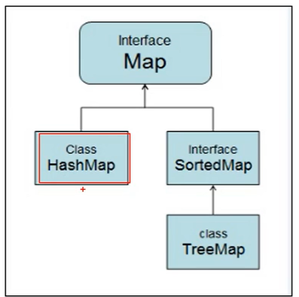

#### 1.6.1 Map接口

Map接口的特点：

* 用于存储任意的键值对
* 键：无序，无下标，不允许重复
* 值：无序、无下标、允许重复

常用方法：

* V put(K key, V value)    // 将对象存入集合中，关联键值。key存在则修改value.
* Object get(Object key)   // 根据键获取对应的值
* boolean containsKey(Object key)  // 集合中是否有对应的key。
* boolean containsValues(Object value) // 集合中始于有key对应的value为value。
* boolean remove(Object key)   // 删除对应的key-vaue
* Set<K>  keySet()   // 返回所有的key
* Collection<V> values() // 返回所有值的Collection集合
* Set<Map.Entry<K,V>> entrySet()  // 键值匹配的Set集合

```java
Map<String,String> map=new HashMap<>();
map.put("cn","China");
map.put("uk","England");
map.put("usa","American");
System.out.println(map);
System.out.println("=========KeySet遍历===============");
for(String key :map.keySet()){
    System.out.println(key+" = "+map.get(key));
}

System.out.println("=========entrySet遍历===============");
Set<Map.Entry<String,String>> entries=map.entrySet();
for(Map.Entry<String,String> entry:entries){
    System.out.println(entry.getKey()+" = "+entry.getValue());
}

// entrySet方式要比keySet遍历效率高。keySet在拿到key后还要在Map中根据key寻找对应的value，而entrySet直接得到key-value。
```

#### 1.6.2 Map的实现类

* HashMap :  JDK1.2后加入，线程不安全的，运行效率高，允许使用null作为key或者value。默认初始容量为16，当size大于0.75倍的容量时，就会扩容到2倍。存储结构是哈希表（当链表的长度大于8，并且数组的长度大于64，则会将链表变成红黑树，当链表长度小于6就会又变成链表，1.8之前链表是头插入，1.8后是尾插入）。加入key的方式和HashSet一样，要重写hashCode和equals。其实HashSet里面用的是HashMap，只用到key。
* Hashtable: 基本上不使用了，线程安全的，运行效率慢，不允许使用null作为key或者value。
* Properties: 是Hashtable的子类，使用的还是挺多的。要求key和value都是String.通常用于配置文件的读取。
* TreeMap：红黑树结构，可以对key自动排序。其实TreeSet里面用的是TreeMap。

### 1.7 Collections 工具类

定义了除了存取以外的集合常用的算法。

一些方法：

* public static void reverse(List<?> list)  // 反转集合中元素
* public static void shuffle(List<?> list)  // 随机打乱集合中元素
* public static void sort(List<?> list)      // 升序排序（元素必须实现Comparable接口）

```java
List<Integer> integerList =new ArrayList<>();
integerList.add(10);
integerList.add(12);
integerList.add(8);
integerList.add(7);
integerList.add(15);
System.out.println(integerList);
Collections.sort(integerList);
System.out.println(integerList);
System.out.println(Collections.binarySearch(integerList,8));

// COPY
List<Integer> desc =new ArrayList<>();
for(int i=0;i<integerList.size();i++){
    desc.add(0);
}
Collections.copy(desc,integerList); // COPY前两个集合size必须要一样
System.out.println(desc);
Collections.shuffle(integerList);
System.out.println(integerList);
```


## 2 Java中的泛型

JDK1.5引入泛型。

* 泛型类语法：

```java
public class ClassName<T>{   // 多个类型使用逗号隔开，<T1,T2,T3>
    private T t;
    public T getT(){
        return t;
    }
    public void setT(T outT){
        // T tmpT=new T() ;  泛型无法具体实例化
        t=outT;
    }
}
```

* 泛型接口语法：

```java
// 定义接口
public interface InterfaceName<T>{
    T t;
    T server(T outT);
}

// 接口实现
public class MyInterface implements InterfaceName<String>{
    @Override
    public String server(String outT){
        System.out.println(outT);
        return outT;
    }
}

// 在定义泛型类
public class MyInterface<T> implements InterfaceName<T>{
    @Override
    public T server(T outT){
        System.out.println(outT);
        return outT;
    }
}
```

* 泛型方法：

<T> 放在方法返回值前面

```java
public class MyClass{
    
    // 泛型方法
    public <T> void show(T t){
        System.out.println("泛型方法"+t);
    }
    
    public <T> T getT(T t){
        System.out.println("泛型方法"+t);
        return t;
    } 
    
    public static void main(String args[]){
        // 泛型方法在使用时，根据传入的参数类型确定
		MyClass test=new MyClass();
        test.show("String");
        test.show(120);
    }
}
```

静态方法中不能使用泛型，异常类不能声明为泛型类。

* 多态在继承中的体现

类A是类B的父类，G<A>和G<B> 不存在子父类关系，但是A<G>和B<G>是子父类关系。

```java
Object obj=null;
String str=null;
obj=str;   // IS OK

Object[] obj=null;
String[] str=null;
obj=str;   // IS OK

List<Object> obj=null;
List<String> str=null;
obj=str;   // IS ERROR,以上两个具有子父类关系，而这个不具有子父类关系的
```

* 通配符的使用

通配符： ”?“。

```java
List<Object> obj=null;
List<String> str=null;

List<?> list=null;
list=obj;
list=str; // List<?> 相当于作为List<Object>和List<String>的通用父类
```

使用通配符后，就不能向集合中添加数据了,除了添加null之外。允许读取数据，为Object。

```java
List<?> list=null;
List<String> listStr=new ArrayList<>();
listStr.add("AA");

list=listStr;
list.add("BB"); // IS ERROR
```

* 有限制条件的通配符

1. <? extends Number>  : 只允许泛型为Number及Number子类的引用调用
2. <? super Number> : 只允许泛型为Number及Number的父类引用调用
3. <? extens Comparable> ： 只允许泛型为实现Comparable接口的类。


## 3 Lambda表达式与Stream

### 3.1 Lambda表达式

Lambda是一个**匿名函数**，我们可以把Lambda表达式理解为是**一段可以传递的代码**（将代码向数据一样进行传递）。可以写出更简洁、更灵活的代码。作为一种更紧凑的代码风格，使Java的语言表达能力得到了提升。

```java
public class TestLambda {
    public static void main(String[] args) {
        // 原来的匿名内部类
        Comparator<Integer> com=new Comparator<Integer>() {
            @Override
            public int compare(Integer o1, Integer o2) {
                return Integer.compare(o1,o2);
            }
        };
        TreeSet<Integer> tree=new TreeSet<>(com);

        // Lambda 表达式
        Comparator<Integer> comparator=(x,y)->Integer.compare(x,y);
        TreeSet<Integer> treeSet=new TreeSet<>(comparator);
    }
}
```

例子：对学生进行过滤

```java
public class TestLambda {
    // 获取年龄大于20的学生
    public ArrayList<Student> filterStudents(ArrayList<Student> list){
        ArrayList<Student> temp=new ArrayList<Student>();
        for (Student stu:list) {
            if(stu.getAge()>20){
                temp.add(stu);
            }
        }
        return temp;
    }
    // 获取分数大于80的学生
    public ArrayList<Student> filterStudents2(ArrayList<Student> list){
        ArrayList<Student> temp=new ArrayList<Student>();
        for (Student stu:list) {
            if(stu.getScore()>80){
                temp.add(stu);
            }
        }
        return temp;
    }
    public static void main(String[] args) {
        ArrayList<Student> studentArrayList=new ArrayList<>();
        studentArrayList.add(new Student("Mike",20,78.0f));
        studentArrayList.add(new Student("Marry",18,56.9f));
        studentArrayList.add(new Student("Tom",25,89.5f));
        studentArrayList.add(new Student("Jason",28,90.f));
        // 获取年龄大于20的学生
        TestLambda testLambda=new TestLambda();
        ArrayList<Student> filters=testLambda.filterStudents(studentArrayList);
        //获取分数大于80的学生
        filters=testLambda.filterStudents2(studentArrayList);
    }
}
```

对不同的过滤方式，要写不同的方法，且只要改一行代码，太复杂，一种优化方式是使用策略设计模式：定义一个比较接口，然后实现不同的策略。

```java
public interface Filter<T> {
    public boolean test(T t);
}
class AgeFilter implements Filter<Student>{
    @Override
    public boolean test(Student student) {
        return student.getAge()>20;
    }
}
class ScoreFilter implements Filter<Student>{
    @Override
    public boolean test(Student student) {
        return student.getScore()>80;
    }
}
```

然后只需写一个方法即可：

```java
public ArrayList<Student> filterStudents3(ArrayList<Student> list,Filter<Student> filter){
    ArrayList<Student> temp=new ArrayList<Student>();
    for (Student stu:list) {
        if(filter.test(stu)){
            temp.add(stu);
        }
    }
    return temp;
}
// 获取年龄大于20的学生
filters=testLambda.filterStudents3(studentArrayList,new AgeFilter());
//获取分数大于80的学生
filters=testLambda.filterStudents3(studentArrayList,new ScoreFilter());
```

缺点：对不同的策略每次都要实现不同的接口。

优化方式2：使用匿名内部类

```java
// 使用匿名内部类
filters=testLambda.filterStudents3(studentArrayList, new Filter<Student>() {
    @Override
    public boolean test(Student student) {
        return student.getScore()>70;
    }
});
```

优化方式3：使用Lambda表达式（要有策略接口）

```java
filters=testLambda.filterStudents3(studentArrayList,(x)->x.getScore()>70);
```

优化方式4：Stream API,无需设计模式定义接口

```java
filters.stream()
       .filter( (x)->x.getScore>60 )
       .foreach(System.out.println);
```

Lambda表达式：

* 语法1：无参，无返回值    

  ```java
   () -> System.out.println("Hello Lambda");
  ```

* 语法2：有一个参数，无返回值  

  ```java
   (x) -> System.out.println(x);
  ```

* 语法3：若只要一个参数，小括号可以省略不写   

  ```java 
  x -> System.out.println(x);
  ```

* 语法4：有多个参数，并有多条语句（使用大括号），有返回值   

  ```java
  (x,y) -> {
      System.out.println(x); 
      return Integer.compare(y);
  };
  ```

* ###### 语法5：有多个参数，只有一条语句，有返回值   （大括号和return都可省略）

  ```java
  (x,y) -> Integer.compare(y);
  ```

* 语法6：参数列表的数据类型可以省略不写,因为JVM编译器可以通过上下文推断出数据类型

  ```java
  (Integer x, Integer y) -> Integer.compare(y);
  ```

  

### 3.2 函数式接口

Lambda 表达式需要函数式接口的支持。接口中只有一个抽象方法的接口称为函数式接口。

可以使用注解 @FunctionalInterface修饰检查是不是函数式接口

```java
@FunctionalInterface
public interface Filter<T> {
    public boolean test(T t);
}
```

* 四大内置核心函数式接口

1. Consumer<T>  消费者接口，   参数类型T，    返回类型void，       包含方法 void  accept( T t )
2. Supplier<T>      供给型接口，   无参数类型，  返回类型T ,              包含方法 T get() ;
3. Function<T,R>  函数型接口，   参数类型T，    返回类型R，            包含方法 R apply( T t);
4. Predicate<T>    断定型接口，   参数类型T，    返回类型boolean    包含方法 boolean test(T t).

* 其他接口

|                          接口                          |    参数类型    |    返回类型    | 用途 |
| :----------------------------------------------------: | :------------: | :------------: | :--: |
|                   BiFunction<T,U,R>                    |      T,U       |       R        |      |
|                    UnaryOperator<T>                    |       T        |       T        |      |
|                   BinearyOperator<T>                   |      T,T       |       T        |      |
|                    BiConsumer<T,U>                     |      T,U       |      void      |      |
| ToIntFunction<T> ToLongFunction<T> ToDoubleFunction<T> |       T        | int log double |      |
|    IntFunction<R> LongFunction<R> DoubleFuction<R>     | int long doule |       R        |      |


### 3.3 方法引用与构造器引用

* 方法引用：如果Lambda体中的内容已经有方法实现了，我们可以使用方法引用。使用方法引用时，接口的参数列表和返回值类型要和要引用的方法的参数列表和返回值类型相同。

引用格式1：对象:: 实例方法名

```java
Consumer<String> con=(x) -> System.out.println(x);
// ===> 方法引用
PrintStream ps=System.out;
Consumer<String> con2=ps::println;
Consumer<String> con3=System.out::println;
```

引用格式2：类:: 静态方法名

```java
Comparatr<Integer> com=(x,y)->Integer.compare(x,y);
// ===> 方法引用
Comparatr<Integer> com1=Integer::compare;
```

引用格式3：类:: 实例方法名,第一个参数是实例方法的使用者，其余参数是方法的参数，就可以使用.

```java
Predicate<String,String> com=(x,y)->x.equals(y);
// ===> 方法引用
Predicate<String,String> com1=String::equals;  // 第一个参数是实例方法的使用者，其余参数是方法的参数，就可以使用
```

* 构造器引用： 

格式：ClassName::new

```java
Supplier<Student> sup=()-> new Student();
//=====>构造器引用
Supplier<Student> sup=Student::new;
```

接口参数列表和构造器参数列表一致，则调用对应的构造器。

```java
Function<Integer,Student> sup=(x)-> new Student(x);
//=====>构造器引用
Function<Integer,Student> sup=Student::new;
sup.apply(10);
```

### 3.4 Stream API

#### 3.4.1 Stream

Stream是JAVA8中处理集合的关键抽象概念，它可以指定你希望对集合进行的操作，可以执行非常复杂的查找、过滤和映射数据等操作。使用Stream API对集合进行操作，就类似使用SQL执行的数据库查询。也可是使用Stream API来并行执行操作。

Stream 先将数据转化成一个流，然后对数据进行流水线式的中间操作，数据源的数据不会改变，最后会产生一个新流。

注：Stream自己不会存储元素。Stream不会改变源对象，相反，它们会返回一个持有结果的新Stream。Stream操作是延迟执行的，这意味着它们会等到需要结果的时候才执行。

Stream的三个步骤：

1. **创建Stream**，有四种方式：

```java
// 方法1：可以通过Collection集合提供的stream()和paralelStream()获取串行流和并行流。
List<String> list=new ArrayList<>();
Stream<String> stream=list.stream();

// 方法2：通过Arrays的静态方法stream（）获取数组流。
Student[] stus=new Student[10];
Stream<Student> stream=Arrays.stream(stus);

// 方法3：通过Stream中的静态方法 of()创建流
Stream<String> stream=Stream.of("aa","bb","cc","dd");

// 方法4：创建无限流，
// 迭代
Stream<Integer> stream=Stream.iterate(0,(x)->x+2); // 第一个参数为初始值，后面为迭代方式
stream.limit(10).foreach(System.out::println); //中间操作，limit只要前10个
// 生成
Stream<Double> stream=Stream.generate(()->Math.random());
```

1. **中间操作**

   多个中间操作可以连接起来形成一个流水线，**除非流水线上触发终止操作，否则中间操作不会执行任何的处理。而在终止操作时一次性全部处理**，称为**惰性求值**。

   * 删选于切片

     filter(Predicate p)  接收Lambda，从流中排除某些元素

     distinct( )                  筛选，通过流所生成元素的hashCode()和equals()去除重复元素

     limit(long maxSize) 截断流，使其呀u盛怒不超过给定的数量

     skip(long n)               跳过元素，返回一个扔掉了前n个元素的流。若流中元素不足n个，则返回一个空流。与limit(n)互补。

   * 映射

     map(Function f)    接受一个函数作为参数，该函数会被应用到每个元素上，并将其映射成一个新的元素

     mapToDouble(ToDoubleFunction f)   接受一个函数作为参数，该函数会被应用到每个元素上，并将其映射成一个新的DoubleStream

     mapToInt(ToIntFunction f)  接受一个函数作为参数，该函数会被应用到每个元素上，并将其映射成一个新的IntStream

     mapToLong(ToLongFunction f)  接受一个函数作为参数，该函数会被应用到每个元素上，并将其映射成一个新的LongStream

     flatMap(Function f)   接受一个函数作为参数，将流中的每个值都换成另一个流，然后把所有流连成一个流。

   * 排序

     sorted( )    产生一个新流，其中按照自然顺序排序

     sorted(Comparator comp)   产生一个新流，其中按照比较器排序

   ```java
   Stream<Integer> stream3=Stream.generate(()->(int)(Math.random()*20));
   stream3.filter((x)->x>10).map((x)->x*3).limit(50).sorted().forEach(System.out::println);
   ```

   

1. **终止操作**（终端操作）

   终止操作会从流的流水线生成结果，器结果可以是任意不是流的值，如 List,Integer,或void boolean。

   * 查找与匹配

     allMatch(Predicate p)    检查是否匹配所有元素

     anyMatch(predicate p)  检查是否至少匹配一个元素

     noneMatch(Predicate p) 检查是否没有匹配所有元素

     Optional<T> findFirst( )     返回第一个元素   ,Optional是对元素的封装，防止返回空值，通过Optional的get()可以得到元素

     Optional<T> findAny( )    返回当前流中的任意元素

     count( )       返回流中元素的个数

     Optional<T> max(Comparator c )         返回流中最大值

     Optional<T> min(Comparator c )           返回流中最小值

     void forEach(Consumer c)      内部迭代器。

   * 归约

     T reduce(...)    将流中元素结合起来，得到一个值。

   * 收集

     collect(Collector c)     将流转化为其他形式，接受一个Collector接口的实现，用于给Stream中的元素做汇总的方法。

     Collector接口中方法的实现决定了如何对流执行收集操作(如收集到List,Set,Map)。Collectors实用类提供了很多静态方法，可以方便的创建常见收集器实例。如Collectors.toList()  ，Collectors.toSet()，Collectors.toCollection(HashSet::new)等.

#### 3.4.2 并行Stream

并行流就是把一个内容分成多个数据块，并用不同的线程分别处理每个数据快的流。Stream API可以声明型的通过parallel()和sequential()在并行流与顺序流之间进行切换。

了解Fork/Join框架：就是在必要的情况下，将一个大任务进行拆分(fork)成若干个小任务(拆到不能拆时)，再将一个个小任务运算的结果进行join汇总。

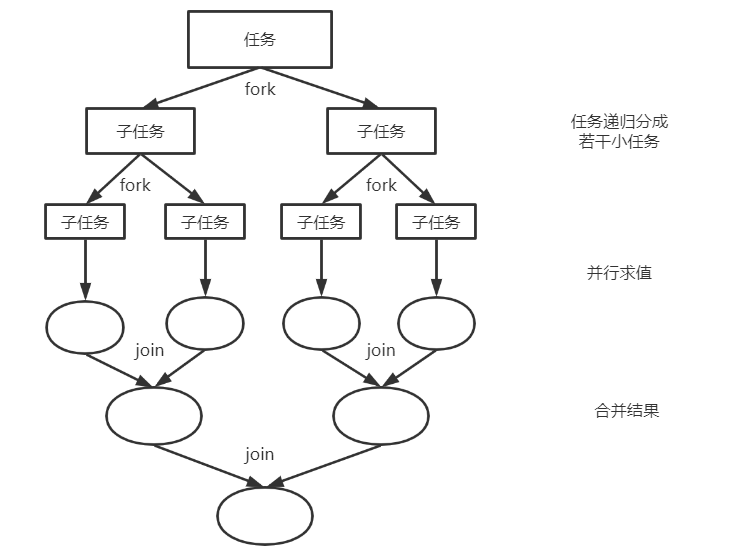

fork/join框架与传统线程池的区别：采用“工作窃取”模式，当执行新的任务时它可以将其拆分成更小的任务执行，并将小人物加到任务队列中，然后再从一个随机线程队列中偷一个并把它放在自己的队列中。

```java
// FORK/JOIN求和
public class ForkJoinCalculate  extends RecursiveTask<Long> {
    private long start;
    private long end;
    private static final long THREAD=10000;

    public ForkJoinCalculate(long start, long end) {
        this.start = start;
        this.end = end;
    }
    @Override
    protected Long compute() {
        if(end-start<=THREAD){
            long sum=0;
            for(long i=start;i<=end;i++){
                sum+=i;
            }
            return sum;
        } else{
            long middle=(start+end)/2;
            ForkJoinCalculate left=new ForkJoinCalculate(start,middle);
            left.fork();
            ForkJoinCalculate right=new ForkJoinCalculate(middle+1,end);
            right.fork();
            return left.join()+right.join();
        }
    }
    public static void main(String[] args) {
        long begin=0;
        long tail=1000000000L;
        long sum=0;
        
        Instant start=Instant.now();
        for(long i=0;i<=tail;i++){
            sum+=i;
        }
        Instant end=Instant.now();
        System.out.println(sum);
        System.out.println("时间："+ Duration.between(start,end).toMillis());  // 569ms

        start=Instant.now();
        ForkJoinPool pool=new ForkJoinPool();  // fork/join需要线程池的支持
        ForkJoinCalculate task=new ForkJoinCalculate(begin,tail);
        sum=pool.invoke(task);
        System.out.println(sum);
        end=Instant.now(); 
        System.out.println("时间："+ Duration.between(start,end).toMillis());   // 197ms
    }
}
```

java8中并行流

```java
start=Instant.now();
LongStream.rangeClosed(begin,tail)
    .parallel()
    .reduce(0,Long::sum);
end=Instant.now();
System.out.println("时间："+ Duration.between(start,end).toMillis());  // 152ms
```

#### 3.4.3 Optional 类

Optional<T> 类是一个容器类，代表一个值存在或者不存在，原来用null表示一个值不存在，现在Optional可以更好的表达这个概念。并且可以避免空指针异常。

常用方法：

```java  
Optinal.of(T t)   : 常见一个Optional实例； 当传入的t为null时则就会报空指针异常，可以快速锁定异常，便于调试。
Optinal.empty()   : 创建一个空的Optional实例；
Optinal.ofNullable(T t)  :  若t部位null，创建Optional实例，否则创建空实例；
get()  : 获取包含的值，当没值时会报一个没有值的异常
isPresent()  : 判断是否包含值
orElse(T t)  : 如果调用对象包含值，返回该值，否则返回t;
orElseGet(Supplier s) : 如果调用对象包含值，返回该值，否则返回s获取值;
map(Function f)   : 如果有值对其处理，并返回处理后的Optional，否则返回Optional.empty();
flatMap(Function mapper) : 与map类似，要求返回值必须是Optional.
```


### 3.5 接口中默认方法与静态方法

默认方法：java8中允许接口中有已经实现的方法。使用default修饰。

```java
public interface MyFun{
    default String getName(){
        return "MyFun";
    }
}

public class MyClass{
    public String getName(){
        return "MyClass"
    }
}

public class SubClass extends MyClass implements MyFun{
    public static void main(String[] args){
        SubClass sub=new SubClass();
        System.out.println(sub.getName());  // 调用的是MyClass的方法getName()
    }
}
```

接口默认方法的类优先原则。若定义一个接口中定义了一个默认方法，而另外一个父类或接口中又定义一个同名的方法时：

* 选择父类中的方法，如果一个父类提供了具体的实现，那么接口中具有相同名称和参数的默认方法会被忽略
* 接口冲突。如果一个父接口提供一个默认方法，而另一个接口也提供一个具有相同名称和参数列表的方法(不管是不是默认方法)，那么必须覆盖该方法来解决冲突。

静态方法：java8中允许接口中有静态方法。使用static修饰。

```java
public interface MyFun{
    public static String getName(){
        return "MyFun";
    }
}
Myfun.show();
```

其实接口和类差不多了，就是关键字不一样，然后类只能单继承，接口可以多继承，接口是抽象的。

### 3.6 新时间日期API

是线程安全的。在java.time包下。

## 4 Java spring框架

### 4.1 简介

Spring: ---》春天，给软件开发带来了春天，创始人; Rod Johnson

理念：使现有的技术更加容易使用，本身是一个大杂烩，整合了现有的技术框架。

SSH：Struct2+Spring+Hibernate

SSM：SpringMvc+Spring+Mybatis

开源的免费的框架，一个轻量级、非入侵式的框架，**控制反转（IOC），面向切面编程（AOP）**。支持事务处理。

maven导入jar包：

```xml
<dependency>
    <groupId>org.springframework</groupId>
    <artifactId>spring-webmvc</artifactId>
    <version>5.2.0.RELEASE</version>
</dependency>
<dependency>
    <groupId>org.springframework</groupId>
    <artifactId>spring-jdbc</artifactId>
    <version>5.2.0.RELEASE</version>
</dependency>
```

### 4.2 Spring 组成


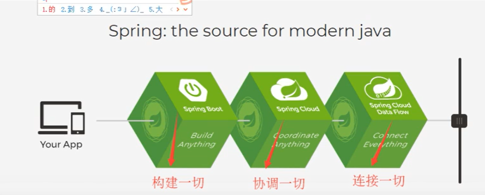

* SpringBoot 

  快速开发的脚手架，基于它可以快速的开发单个微服务，约定大于配置。

* SpringCloud

  基于SpringBoot实现的。

学习SpringBoot的前提需要完全掌握Spring及SpringMVC!。

弊端：发展太久，违背了原来的理念，配置十分繁琐，人称：”配置地狱“

### 4.3 IOC理论推导

1. UserDao接口

   ```java
   public interface UserDao {
       void getUser();
   }
   ```

2. UserDaoImpl  实现类

   ```java
   public class UserDaoImpl implements UserDao{
   
       @Override
       public void getUser() {
           System.out.println("默认获取用户的数据");
       }
   }
   
   public class UserDaoMysqlImpl implements UserDao{
       @Override
       public void getUser() {
           System.out.println("MySql 获取用户数据。");
       }
   }
   ```

3. UserService  业务接口 

   ```java
   public interface UserService {
       void getUser();
   }
   ```

4. UserServiceImpl业务实现类

   ```java
   public class UserServiceImpl implements UserService {
   
   //    private UserDao userDao=new UserDaoImpl(); // 之前的，原来对象由程序写死的，没有set注入
       private UserDao userDao;
       // 利用set进行动态实现值的注入
       public void setUserDao(UserDao userDao) {
           this.userDao = userDao;
       }
   
       @Override
       public void getUser() {
           userDao.getUser();
       }
   }
   ```

   ```java
   // 用户
   public class MyTest {
       public static void main(String[] args) {
           // 用户实际调用的是业务层，dao层他们不需要接触
           UserService userService=new UserServiceImpl();
           ((UserServiceImpl) userService).setUserDao(new UserDaoImpl()); // set接口注入不同的UserDao实现
           userService.getUser();
           ((UserServiceImpl) userService).setUserDao(new UserOracleImpl());
           userService.getUser();
       }
   }
   ```

   

在我们之前的业务中，用户的需求可能会影响我们原来的代码，我们需要根据用户的需求去修改源代码，如果程序代码量十分大，修改一次的成本代价十昂贵。

我们使用一个set接口实现，已经发生了革命性的变化：

```java
private UserDao userDao;
// 利用set进行动态实现值的注入
public void setUserDao(UserDao userDao) {
    this.userDao = userDao;
}
```

之前程序是主动创建对象，控制权在程序员身上，

```java
private UserDao userDao=new new UserDaoImpl()；// 之前程序是主动创建对象
```

使用了set注入后，程序不在具有主动性，而是变成了被动的接收对象。这就叫**控制反转IOC**。主动权交给用户。

这种思想，我们程序元不用管理对象的创建，由用户自己控制，系统的耦合性大大降低，可以更加专注在业务的实现上。（对象的创建交给第三方）

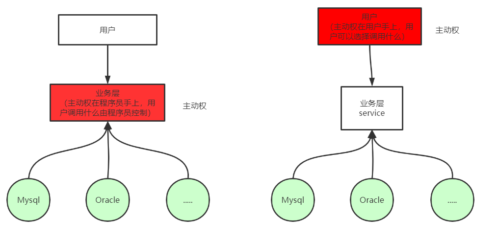

**IOC本质：**

控制反转时一种设计思想，DI(依赖注入) 是实现IOC的一种方法，也可以认为DI只是IoC的另一种说法。没有IoC的程序中，我们使用面向对象编程，对象的创建与对象之间的依赖关系完全靠硬编码在程序中，对象的创建由程序自己控制，控制反转后，将对象的创建移转给第三方，个人认为所谓的控制反转就是：获得依赖对象的方式反转了。


采用XML方式配置Bean的时候，Bean的定义信息是和实现分离的，而采用注解的方式可以把两者合为一体，Bean的定义信息直接以注解的形式定义在实现类中，从而达到了零配置的目的。


**控制反转时一种通过描述（XML或注解）并通过第三方去生产或获取特定对象的方式。在spring中实现控制反转的是IoC容器，其实现方法就是依赖注入（Dependency Injection, DI）。**


* Spring hello world

1. 先实现一个类

```java
package com.liyajie.pojp;

public class Hello {
    private String str;
    public String getStr() {
        return str;
    }
    public void setStr(String str) {
        this.str = str;
    }
    @Override
    public String toString() {
        return "Hello{" +
                "str='" + str + '\'' +
                '}';
    }
}
```

2. 在resource中创建一个xml文件 ，如beans.xml

   一个bean标签 就等于new 了一个对象， id就是对象引用名，property为对象的属性设置值（通过set方法设置）。

   bean 等同于 Hello hello =new Hello()

   ```xml
   <?xml version="1.0" encoding="UTF-8"?>
   <beans xmlns="http://www.springframework.org/schema/beans"
          xmlns:xsi="http://www.w3.org/2001/XMLSchema-instance"
          xsi:schemaLocation="http://www.springframework.org/schema/beans
           http://www.springframework.org/schema/beans/spring-beans.xsd">
   
       <!-- 使用Spring来创建对象，在spring这些都称为Bean-->
       <!-- bean 等同于 Hello hello =new Hello()-->
       <bean id="hello" class="com.liyajie.pojp.Hello">      // Hello hello =new Hello()
           <property name="str" value="Spring"/>             // hello.setStr("Spring")
       </bean>
   
   </beans>
   ```

3. 测试，从Spring容器中获取对象

   ```java
   public class MyTest {
       public static void main(String[] args) {
           // 获取spring的上下文对象
           ApplicationContext context = new ClassPathXmlApplicationContext("beans.xml");
   
           // 我们的对象都在spring管理了，要使用直接取出来就可以了。
           Hello hello=(Hello) context.getBean("hello");
           System.out.println(hello);
       }
   }
   ```

最上面业务的spring：

```xml
<?xml version="1.0" encoding="UTF-8"?>
<beans xmlns="http://www.springframework.org/schema/beans"
       xmlns:xsi="http://www.w3.org/2001/XMLSchema-instance"
       xsi:schemaLocation="http://www.springframework.org/schema/beans
        http://www.springframework.org/schema/beans/spring-beans.xsd">


    <bean id="mySqlImpl" class="com.liyajie.dao.UserDaoMysqlImpl" />
    <bean id="myOracleImpl" class="com.liyajie.dao.UserOracleImpl" />

    <bean id="userServiceImpl" class="com.liyajie.service.UserServiceImpl">
        <!-- ref 引用spring中创建好的对象, value用在传入具体的值-->
        <property name="userDao" ref="myOracleImpl"/>  // 改这里就可以了，不需改代码
    </bean>

</beans>
```

```java
public class MyTest {
    public static void main(String[] args) {
        // 用户实际调用的是业务层，dao层他们不需要接触
        ApplicationContext context = new ClassPathXmlApplicationContext("beans.xml");

        UserServiceImpl userService=(UserServiceImpl) context.getBean("userServiceImpl");
        userService.getUser();
    }
}
```

只需要修改spring的配置，对象由spring创建了，就可以了，用户也不需改代码。

### 4.4 IOC创建对象的方式（构造注入）

1. 默认使用无参构造函数创建对象，若没有无参构造函数，则错误。

2. ###### 构造函数参数解析

   * 构造函数参数解析匹配通过使用参数的类型进行。

     如果 Bean 定义的构造函数参数中不存在潜在的歧义，则在实例化 Bean 时，在 Bean 定义中定义构造函数参数的 Sequences 就是将这些参数提供给适当的构造函数的 Sequences。考虑以下类别：

   ```java
   package x.y;
   
   public class ThingOne {
   
       public ThingOne(ThingTwo thingTwo, ThingThree thingThree) {
           // ...
       }
   }
   ```

   假设`ThingTwo`和`ThingThree`类没有通过继承关联，则不存在潜在的歧义。因此，以下配置可以正常工作，并且您无需在`<constructor-arg/>`元素中显式指定构造函数参数索引或类型。

   ```xml
   <beans>
       <bean id="thingOne" class="x.y.ThingOne">
           <constructor-arg ref="thingTwo"/>
           <constructor-arg ref="thingThree"/>
       </bean>
   
       <bean id="thingTwo" class="x.y.ThingTwo"/>
   
       <bean id="thingThree" class="x.y.ThingThree"/>
   </beans>
   ```

   当引用另一个 bean 时，类型是已知的，并且可以发生匹配(与前面的示例一样)。当使用简单类型(例如`<value>true</value>`)时，Spring 无法确定值的类型，因此在没有帮助的情况下无法按类型进行匹配。考虑以下类别：

   ```java
   package examples;
   
   public class ExampleBean {
   
       // Number of years to calculate the Ultimate Answer
       private int years;
   
       // The Answer to Life, the Universe, and Everything
       private String ultimateAnswer;
   
       public ExampleBean(int years, String ultimateAnswer) {
           this.years = years;
           this.ultimateAnswer = ultimateAnswer;
       }
   }
   ```

   * 构造函数参数类型匹配

   在上述情况下，如果您使用`type`属性显式指定了构造函数参数的类型，则容器可以使用简单类型的类型匹配。如下例所示：

   ```xml
   <bean id="exampleBean" class="examples.ExampleBean">
       <constructor-arg type="int" value="7500000"/>
       <constructor-arg type="java.lang.String" value="42"/>
   </bean>
   ```

   * 构造函数参数索引

   您可以使用`index`属性来显式指定构造函数参数的索引，如以下示例所示：

   ```xml
   <bean id="exampleBean" class="examples.ExampleBean">
       <constructor-arg index="0" value="7500000"/>
       <constructor-arg index="1" value="42"/>
   </bean>
   ```

   除了解决多个简单值的歧义性之外，指定索引还可以解决歧义，其中构造函数具有两个相同类型的参数。

   * 构造函数参数名称

   您还可以使用构造函数参数名称来消除歧义，如以下示例所示：

   ```xml
   <bean id="exampleBean" class="examples.ExampleBean">
       <constructor-arg name="years" value="7500000"/>
       <constructor-arg name="ultimateAnswer" value="42"/>
   </bean>
   ```

   请记住，要立即使用该功能，必须在启用调试标志的情况下编译代码，以便 Spring 可以从构造函数中查找参数名称。如果您不能或不想使用 debug 标志编译代码，则可以使用[@ConstructorProperties](https://download.oracle.com/javase/6/docs/api/java/beans/ConstructorProperties.html) JDK注解 显式命名构造函数参数。然后，该示例类必须如下所示：

   ```java
   package examples;
   
   public class ExampleBean {
   
       // Fields omitted
   
       @ConstructorProperties({"years", "ultimateAnswer"})
       public ExampleBean(int years, String ultimateAnswer) {
           this.years = years;
           this.ultimateAnswer = ultimateAnswer;
       }
   }
   ```

### 4.5 Spring配置

#### 4.5.1 alias 别名

```xml
<bean id="hello" class="com.liyajie.pojp.Hello">
    <property name="str" value="Spring"/>
</bean>

<alias name="hello" alias="hello2"/>
```

可以通过别名取出对象：

```java
ApplicationContext context = new ClassPathXmlApplicationContext("beans.xml");

// 我们的对象都在spring管理了，要使用直接取出来就可以了。
// Hello hello=(Hello) context.getBean("hello");
Hello hello=(Hello) context.getBean("hello2");
System.out.println(hello);
```

#### 4.5.2 Bean的配置

```xml
<bean id="hello" class="com.liyajie.pojp.Hello" name="hello2">
    <property name="str" value="Spring"/>
</bean>
```

id 是bean的唯一标识，也就是变量名。class 为bean所对应的类型（全限定名：包名+类名）,name 也可以取别名，且可以取多个别名，如`name="hello1,hello2,hello3"`，使用逗号或空格或分号分割。

#### 4.5.3 import 导入

一般用于团队开发使用，它可以将多个配置文件导入，合并为一个配置文件。

```xml
// file beans.xml
<import resource="beans1.xml"/>
<import resource="beans2.xml"/>
<import resource="beans3.xml"/>
```

则beans.xml就包含了beans1.xml，beans2.xml和beans3.xml的配置内容。只需使用beans.xml就可以了。

### 4.6 DI 依赖注入

#### 4.6.1 构造器注入

就是4.4节

#### 4.6.2 setter方式注入 【重点】

* 依赖注入： setter注入

  * 依赖： bean对象的创建依赖于spring容器(容器可以认为就是配置文件)
  * 注入：bean对象中的所有属性，由容器来注入。

  ```java
  public class Address {
      private String address;
      public void setAddress(String address) {
          this.address = address;
      }
  
      @Override
      public String toString() {
          return address;
      }
  }
  
  package com.liyajie.pojo;
  
  import java.util.*;
  
  public class Student {
      private String name;
      private Address address;
      private String[] books;
      private List<String> hobbys;
      private Map<String,String> card;
      private Set<String> games;
      private Properties info;
      private String wife;
  
      public void setName(String name) {this.name = name; }
      public void setAddress(Address address) {this.address = address;}
      public void setBooks(String[] books) { this.books = books;}
      public void setHobbys(List<String> hobbys) {this.hobbys = hobbys;}
      public void setCard(Map<String, String> card) { this.card = card;}
      public void setGames(Set<String> games) {this.games = games;}
      public void setInfo(Properties info) {this.info = info;}
      public void setWife(String wife) {this.wife = wife; }
  
      @Override
      public String toString() {
          return "Student{" +
                  "name='" + name + '\'' +
                  ", address=" + address +
                  ", books=" + Arrays.toString(books) +
                  ", hobbys=" + hobbys +
                  ", card=" + card +
                  ", games=" + games +
                  ", info=" + info +
                  ", wife='" + wife + '\'' +
                  '}';
      }
  }
  
  ```

spring 配置文件：

```xml
<?xml version="1.0" encoding="UTF-8"?>
<beans xmlns="http://www.springframework.org/schema/beans"
       xmlns:xsi="http://www.w3.org/2001/XMLSchema-instance"
       xsi:schemaLocation="http://www.springframework.org/schema/beans
        http://www.springframework.org/schema/beans/spring-beans.xsd">

    <bean id="student" class="com.liyajie.pojo.Student">
        <!--第1种：普通值注入-->
        <property name="name" value="Liyajie"/>
        <!--第2种：引用对象注入方法，bean注入-->
        <property name="address" ref="address"/>
        <!--第3种：数组注入方法-->
        <property name="books">
            <array>
                <value>C++</value>
                <value>Java</value>
                <value>Python</value>
            </array>
        </property>
        <!--第4种：List注入方法-->
        <property name="hobbys">
            <list>
                <value>Music</value>
                <value>Movie</value>
            </list>
        </property>
        <!--第5种：Map注入方法-->
        <property name="card">
            <map>
                <entry key="ID" value="123456"/>
                <entry key="PWD" value="liyajie"/>
            </map>
        </property>
        <!--第6种：Set注方法-->
        <property name="games">
            <set>
                <value>GTA</value>
                <value>LOL</value>
                <value>PUPG</value>
            </set>
        </property>
        <!--第7种：null值注入-->
        <property name="wife">
            <null/>
        </property>
        <!--第8种：Properties注入-->
        <property name="info">
            <props>
                <prop key="adima">ustc@mail</prop>
                <prop key="development">ustc.edu.cn</prop>
            </props>
        </property>
    </bean>

    <bean id="address" class="com.liyajie.pojo.Address">
        <property name="address" value="Beijing"/>
    </bean>
</beans>
```

#### 4.6.3 拓展方式注入

p-namespace, p就是property

c-namespace,c 就是constructor-arg

这两个不能直接使用，需要导入xml约束。

```xml
 xmlns:p="http://www.springframework.org/schema/p"
 xmlns:c="http://www.springframework.org/schema/c"
```

### 4.7 Bean scopes

| Scope                                                        | Description                                                  |
| ------------------------------------------------------------ | ------------------------------------------------------------ |
| [singleton](https://www.docs4dev.com/docs/zh/spring-framework/5.1.3.RELEASE/reference/core.html#beans-factory-scopes-singleton) | (默认)将每个 Spring IoC 容器的单个 bean 定义范围限定为单个对象实例。 |
| [prototype](https://www.docs4dev.com/docs/zh/spring-framework/5.1.3.RELEASE/reference/core.html#beans-factory-scopes-prototype) | 将单个 bean 定义的作用域限定为任意数量的对象实例。           |
| [request](https://www.docs4dev.com/docs/zh/spring-framework/5.1.3.RELEASE/reference/core.html#beans-factory-scopes-request) | 将单个 bean 定义的范围限定为单个 HTTP 请求的生命周期。也就是说，每个 HTTP 请求都有一个在单个 bean 定义后面创建的 bean 实例。仅在可感知网络的 Spring `ApplicationContext`中有效。 |
| [session](https://www.docs4dev.com/docs/zh/spring-framework/5.1.3.RELEASE/reference/core.html#beans-factory-scopes-session) | 将单个 bean 定义的范围限定为 HTTP `Session`的生命周期。仅在可感知网络的 Spring `ApplicationContext`上下文中有效。 |
| [application](https://www.docs4dev.com/docs/zh/spring-framework/5.1.3.RELEASE/reference/core.html#beans-factory-scopes-application) | 将单个 bean 定义的范围限定为`ServletContext`的生命周期。仅在可感知网络的 Spring `ApplicationContext`上下文中有效。 |
| [websocket](https://www.docs4dev.com/docs/zh/spring-framework/5.1.3.RELEASE/reference/web.html#websocket-stomp-websocket-scope) | 将单个 bean 定义的范围限定为`WebSocket`的生命周期。仅在可感知网络的 Spring `ApplicationContext`上下文中有效。 |

#### 4.7.1 单例模式：singleton


仅仅只有一个实例对象。

```java
public class User {
    private String name;
    private int age;

    public void setName(String name) {
        this.name = name;
    }
    public void setAge(int age) {
        this.age = age;
    }
    @Override
    public String toString() {
        return "User{" +
                "name='" + name + '\'' +
                ", age=" + age +
                '}';
    }
}
```

```xml
<bean id="user" class="com.liyajie.pojo.User" scope="singleton">  // scope 属性设置单例模式
    <property name="name" value="Liyajie"/>
    <property name="age" value="25"/>
</bean>
```

在使用时，都是引用一个对象。

```java
public class MyTest {
    public static void main(String[] args) {
        ApplicationContext context=new ClassPathXmlApplicationContext("beans.xml");
        User user1=(User) context.getBean("user");
        User user2=(User) context.getBean("user");
        System.out.println(user2==user1);  // 两个引用一个对象。true
    }
}
```

#### 4.7.2 原型模式：prototype

```xml
<bean id="user" class="com.liyajie.pojo.User" scope="prototype">  // scope 属性设置原型模式
    <property name="name" value="Liyajie"/>
    <property name="age" value="25"/>
</bean>
```

在使用时，每次从容器中获取，都会产生一个新的对象。一个引用一个对象。

```java
public class MyTest {
    public static void main(String[] args) {
        ApplicationContext context=new ClassPathXmlApplicationContext("beans.xml");
        User user1=(User) context.getBean("user");
        User user2=(User) context.getBean("user");
        System.out.println(user2==user1);  // 两个引用一个对象。false
    }
}
```

其余request、session、application只能在web开发中使用

### 4.8 Bean自动装配

自动装配是Spring满足bean依赖一种方式，spring会在上下文中自动寻找，并自动给bean装配属性。（上面都是手动装配，每个都要自己设置）。spring中有三种装配的方式：

1. 在xml中显示配置（上面讲的beans.xml）
2. 在java中显示配置
3. **隐式的自动装配bean [重要,也就是本节内容]**

测试例子：

```java
public class Dog {
    public void bark(){
        System.out.println("Wang Wang...");
    }
}

public class Cat {
    public void bark(){
        System.out.println("Miao Miao ....");
    }
}

public class People {
    private Dog dog;
    private Cat cat;
    private String name;
    public void setDog(Dog dog) {this.dog = dog;}
    public void setCat(Cat cat) {this.cat = cat;}
    public void setName(String name) {this.name = name;}
    public Dog getDog() {return dog;}
    public Cat getCat() {return cat;}
    @Override
    public String toString() {
        return "People{" +
                "dog=" + dog +
                ", cat=" + cat +
                ", name='" + name + '\'' +
                '}';
    }
}
```

手动装配：

```xml
bean id="cat" class="com.liyajie.pojo.Cat"/>
<bean id="dog" class="com.liyajie.pojo.Dog"/>
<bean id="people" class="com.liyajie.pojo.People">
    <property name="name" value="MeiLi"/>
    <property name="dog" ref="dog"/>
    <property name="cat" ref="cat"/>
</bean>
```

测试：

```java
public class MyTest {
    public static void main(String[] args) {
        ApplicationContext context= new ClassPathXmlApplicationContext("beans.xml");

        People people=context.getBean("people",People.class);
        people.getCat().bark();
        people.getDog().bark();
    }
}
```

#### 4.8.1 byName自动装配

ref的id要和类里的对象名一样，pepole.cat 的id为 cat, people.dog 的id为dog。

```xml
<bean id="cat" class="com.liyajie.pojo.Cat"/>
<bean id="dog" class="com.liyajie.pojo.Dog"/>
<bean id="people" class="com.liyajie.pojo.People" autowire="byName"> // autowire byName自动装配
    <property name="name" value="MeiLi"/>
</bean>
```

byName会自动在容器上下文查找和自己对象set方法后的值对象的bean id。setName（）方法后的值为name，setAge()方法后的值为age。

#### 4.8.2 byType自动装配

```xml
<bean id="cat" class="com.liyajie.pojo.Cat"/>
<bean id="dogggg" class="com.liyajie.pojo.Dog"/>
<bean id="people" class="com.liyajie.pojo.People" autowire="byType">
    <property name="name" value="MeiLi"/>
</bean>
```

byType会自动在容器上下文查找和自己对象类型相同的bean，即使id不一样（id可以不设置）。必须保证类型全局唯一。

#### 4.8.3 使用注解自动装配

大部分都是使用注解装配，而不是使用XML装配。

使用注解须知：

1. 导入约束：
2. 配置注解的支持。

```xml
<?xml version="1.0" encoding="UTF-8"?>
<beans xmlns="http://www.springframework.org/schema/beans"
    xmlns:xsi="http://www.w3.org/2001/XMLSchema-instance"
    xmlns:context="http://www.springframework.org/schema/context"   <!--导入约束-->
    xsi:schemaLocation="http://www.springframework.org/schema/beans
        http://www.springframework.org/schema/beans/spring-beans.xsd
        http://www.springframework.org/schema/context                <!--导入约束-->
        http://www.springframework.org/schema/context/spring-context.xsd">   <!--导入约束-->

    <context:annotation-config/>      <!--配置注解支持-->

</beans>
```

例子：

```xml
<?xml version="1.0" encoding="UTF-8"?>
<beans xmlns="http://www.springframework.org/schema/beans"
       xmlns:xsi="http://www.w3.org/2001/XMLSchema-instance"
       xmlns:context="http://www.springframework.org/schema/context"
       xsi:schemaLocation="http://www.springframework.org/schema/beans
        http://www.springframework.org/schema/beans/spring-beans.xsd
        http://www.springframework.org/schema/context
        http://www.springframework.org/schema/context/spring-context.xsd">

    <context:annotation-config/>
    <bean id="cat" class="com.liyajie.pojo.Cat"/>
    <bean id="dog" class="com.liyajie.pojo.Dog"/>
    <bean id="people" class="com.liyajie.pojo.People"/>

</beans>
```

类中加入注解：也可以注解在set方法上，不用注解在属性上。

```java
public class People {
    // 加入自动装配注解
    @Autowired   
    private Dog dog;
    @Autowired
    private Cat cat;
    private String name;
    
   // @Autowired  或注解在这
    public void setDog(Dog dog) {this.dog = dog;}
   // @Autowired  或注解在这
    public void setCat(Cat cat) {this.cat = cat;}
    
    public void setName(String name) {this.name = name;}
    public Dog getDog() {return dog;}
    public Cat getCat() {return cat;}
    @Override
    public String toString() {
        return "People{" +
                "dog=" + dog +
                ", cat=" + cat +
                ", name='" + name + '\'' +
                '}';
    }
}
```

注解其实可以连set方法都不需要，前提是你这个自动装配的属性在IOC容器中存在。

```java
public class People {
    // 加入自动装配注解
    @Autowired   
    private Dog dog;
    @Autowired
    private Cat cat;
    private String name;
    
    public void setName(String name) {this.name = name;}
    public Dog getDog() {return dog;}
    public Cat getCat() {return cat;}
    @Override
    public String toString() {
        return "People{" +
                "dog=" + dog +
                ", cat=" + cat +
                ", name='" + name + '\'' +
                '}';
    }
}
```

扩展：

@Nullable   //字段标记了这个注解，说明这个字段可以为null

```java
@Nullable   //字段标记了这个注解，说明这个字段可以为null

public class User {
    private String name;

    public User(@Nullable String name){
        this.name=name
    }
}
```

@Autowired   注解可以跟一个属性：required，默认为true,当为false时：说明这个属性可以为null。

```java
@Autowired(required=false)
private String name;
```

@Autowired 默认时按照byType装配,，如果想要按照byName方式则再使用 @Qualifier(value =id_name )

```java
<bean id="cat" class="com.liyajie.pojo.Cat"/>
<bean id="cat1" class="com.liyajie.pojo.Cat"/>

@Autowired
@Qualifier(value = "cat1")
private Cat cat;
```

另一种是java提供的注解：@Resource，默认会按byName来找，没有则按类型来找，可以指定参数name来指定装配的name. `@Resource(name="cat1")`

### 4.9 Spring注解开发

spring4 之后要使用注解开发，必须要导入aop的jar包。

注解的支持：beans.xml

```xml
<?xml version="1.0" encoding="UTF-8"?>
<beans xmlns="http://www.springframework.org/schema/beans"
       xmlns:xsi="http://www.w3.org/2001/XMLSchema-instance"
       xmlns:context="http://www.springframework.org/schema/context"
       xsi:schemaLocation="http://www.springframework.org/schema/beans
        http://www.springframework.org/schema/beans/spring-beans.xsd
        http://www.springframework.org/schema/context
        http://www.springframework.org/schema/context/spring-context.xsd">
    
	<!-- 指定要扫描的包  ，这个包下的注解就会生效-->
    <context:component-scan base-package="com.liyajie.pojo"/>
    
    <context:annotation-config/>
</beans>
```

1. bean

   @Component：

   // 等价于再beans里注册了一个bean <bean id="user" class="com.liyajie.dao.User"/>

   ```java
   package com.liyajie.pojo;
   
   import org.springframework.beans.factory.annotation.Value;
   import org.springframework.stereotype.Component;
   // 等价于再beans里注册了一个bean <bean id="user" class="com.liyajie.dao.User"/>
   @Component
   public class User {
   
       @Value("LiYajie")
       public String name;
   
       @Override
       public String toString() {
           return "User{" +
                   "name='" + name + '\'' +
                   '}';
       }
   }
   
   // test
   ApplicationContext context= new ClassPathXmlApplicationContext("beans.xml");
   User user=context.getBean("user",User.class);
   ```

   

2. 属性如何注入

   @Value(value)：

   // 相当于 <property name="name" value="Liyajie"/> 简单的注解

   ```java
   @Value("LiYajie") // 相当于 <property name="name" value="Liyajie"/> 简单的注解
   public String name;
   ```

3. 衍生的注解

   @Component 有几个衍生注解。我们在web开发中，会按照mvc三层架构分层！

   * dao       层习惯使用@Repository 注解代替@Component ，作用一样只不过相当于是别名，便于程序员区分
   * service  层习惯使用@Service 注解代替@Component ，作用一样只不过相当于是别名，便于程序员区分
   * controller  层习惯使用@@Controller注解代替@Component ，作用一样只不过相当于是别名，便于程序员区分

4. 自动装配

   @AutoWired, @Nullable 和 @Resource

5. 作用域

   @Scope

   ```java
   @Component
   @Scope(value = "singleton")  // 设为单例
   public class User {
   
       @Value("LiYajie")
       public String name;
   
       @Override
       public String toString() {
           return "User{" +
                   "name='" + name + '\'' +
                   '}';
       }
   }
   ```

6. 小结

xml与注解：

* XML更加万能，适合于一切场合，维护简单方便
* 注解:  不是自己的类使用不了，维护相对复杂。

xml与注解的最佳实践：XML用来管理bean，注解只负责属性注入。

### 4.10 JavaConfig实现配置

完全使用java的方式配置spring，不使用xml配置了，其实就是把xml配置文件换成了java类配置。

```java
@Configuration
public class AppConfig{
    
    @Bean
    public MyService myService(){
        return new MyServiceImpl();
    }
}
```

等价于：

```xml
<beans>
	<bean id="myService" class="com.acme.services.MyServiceImpl"/>
</beans>
```

例子：

测试类User

```java
public class User {
    @Value("Liyajie")  // 属性注入值
    private String name;
    
    @Override
    public String toString() {
        return "User{" +
                "name='" + name + '\'' +
                '}';
    }
}
```

javaConfig配置类

```java
@Configuration   // 代表javaConfig配置类，和beans.xml文件时一样的，这个会被ispring容器托管，注册到spring容器中，它本身也是个@Component
public class AppConfig {

    @Bean   // 注册一个bean,接相当于在xml中写一个bean，方法名就相当于 bean中的id
    public User getUser(){
        return new User();
    }
}
```

测试结果

```java
public class MyTest {
    public static void main(String[] args) {
        ApplicationContext context=new AnnotationConfigApplicationContext(AppConfig.class);// 使用注解获得上下文

        User user=context.getBean("getUser",User.class); // 方法名是变量名
        System.out.println(user);
    }
}
```

@Import(class) 可以引入配置类到一个类中

```java
@Configuration
public class AppConfig2 {
    .....
}

@Configuration
@ComponentScan("com.liyajie.pojo") // 显示要生效的包
@Import(AppConfig2.class)
public class AppConfig {

    @Bean
    public User getUser(){
        return new User();
    }
    .....
}
```


### 4.11 代理模式

代理模式是Spring AOP的底层。

代理模式的分类：

* 静态代理
* 动态代理

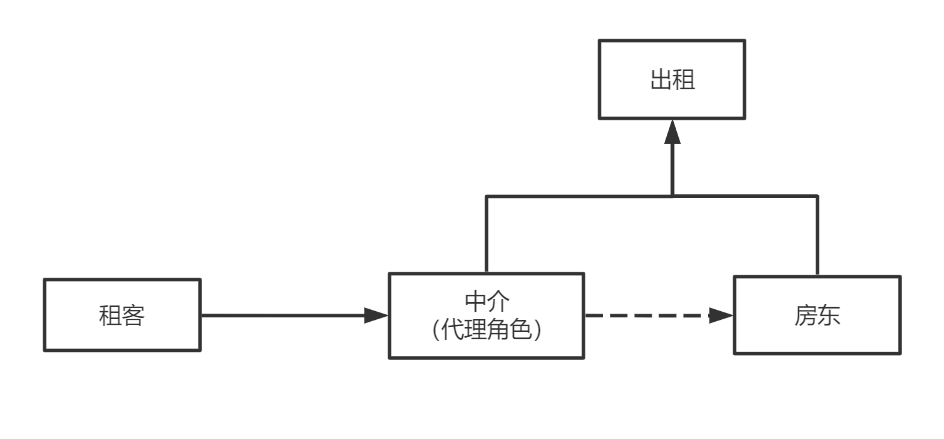

#### 4.11.1 静态代理

角色分析：

* 抽象角色：一般会使用接口或者抽象类来解决
* 真实角色：被代理的角色
* 代理角色：代理真实的角色，代理真实角色后，我们一般会做一些附属操作
* 客户：访问代理对象的人

```java
// 1. 接口
public interface Rent {
    public void rent();
}
// 2. 真实角色
public class Host implements Rent{
    @Override
    public void rent() {
        System.out.println("房东出租的房子");
    }
}
// 3. 代理角色
public class Proxy implements Rent{
    private Host host;

    public Proxy() {}
    public Proxy(Host host) {
        this.host = host;
    }
    // 大力会增加附属操作，增加公共业务
    @Override
    public void rent() {
        watchHouse(); // 增加的公共业务
        host.rent(); // 真实角色的操作
        getPay();    //增加的公共业务
    }

    public void watchHouse(){
        System.out.println("中介带你看房");
    }

    public void getPay(){
        System.out.println("收中介费");
    }
}
// 4. 客户访问代理角色
public class Client {
    public static void main(String[] args) {

        Host host=new Host();
        Proxy proxy=new Proxy(host);
        proxy.rent();
    }
}
```

代理模式的好处：

* 可以使真实角色的操作更加纯粹(只处理租房子)，不用去关注一些公共的业务
* 公共业务也就交给了代理角色，实现了业务的分工
* 公共业务发生扩展的时候，方便集中管理。

缺点：

* 一个真实的角色就会产生一个代理角色，代码量翻倍，开发效率低


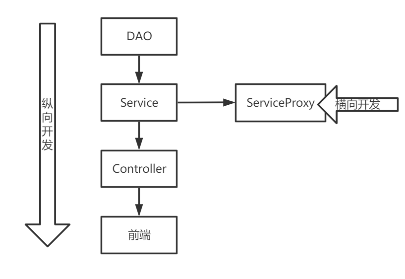

无需改变原有的代码，使用代理，就可以在横向上扩展业务。

### 4.12 动态代理

解决静态代理的缺点：动态代理，使用了反射。

动态代理和静态代理的角色一样。动态代理的代理类是动态生成的，不是直接写好的。

动态代理分为两大类：基于接口的动态代理，基于类的动态代理。

* **基于接口： JDK动态代理** (这里使用的)
* 基于类：cglib
* java字节码实现： javassist

需要使用两个类 Proxy （代理）和 InvocationHandler （调用处理程序接口）。

一个动态代理类代理的是一个接口，一般就是对应的一类业务。

一个动态代理类，可以代理多个类。

```java
public interface UserService {
    public void  add();
    public void  delete();
    public void  insert();
    public void query();
}

public class UserServiceImpl implements UserService {
    @Override
    public void add() {
        System.out.println("add a number");
    }

    @Override
    public void delete() {
        System.out.println("delete a number");
    }

    @Override
    public void insert() {
        System.out.println("insert a number");
    }

    @Override
    public void query() {
        System.out.println("query a number");
    }
}
```

* InvocationHandler 

  ```java
  public class ProxyInvocationHandler implements InvocationHandler {
      private Object target; // 要代理的真实角色
  
      public void setTarget(Object target) {
          this.target = target;
      }
  	
      // 生成得到代理类的实例
      public Object getProxy(){
          return Proxy.newProxyInstance(this.getClass().getClassLoader(), target.getClass().getInterfaces(),this);
      }
  	
      // 处理代理实例上的方法调用并返回结果
      @Override
      public Object invoke(Object proxy, Method method, Object[] args) throws Throwable {
          log(method.getName());
          Object result=method.invoke(target,args);
          return result;
      }
  
      public void log(String msg){
          System.out.println("Log: "+  msg+ " operator:");
      }
}
  ```
  
  ```java
  public class Client {
      public static void main(String[] args) {
          UserServiceImpl userService = new UserServiceImpl();
  
          ProxyInvocationHandler phi=new ProxyInvocationHandler();
          phi.setTarget(userService);
  
          UserService user=(UserService) phi.getProxy();
          user.add();
          user.delete();
          user.insert();
          user.query();
      }
  }
  ```

### 4.13 AOP实现方式一

使用Spring的API接口实现

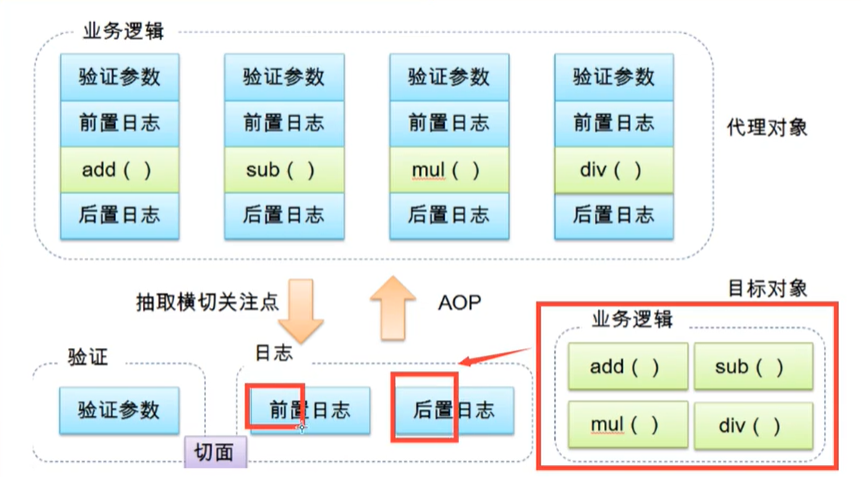

#### 4.13.1 AOP在Spring中的作用

**提供声明式事务；允许用户自定义切面**

* 横切关注点：跨越应用程序多个模块的方法或功能。即是，与我们业务逻辑无关的，但是我们需要关注的部分，就是横切关注点。如日志、安全、缓存、事务等。
* 切面（ASPECT）：横切关注点被模块化的特殊对象，即，它是一个类
* 通知（Advice）：切面必须完成的工作，即，它是类中的方法
* 目标（Target）：被通知的对象
* 代理（Proxy）：向目标对象应用通知之后创建的对象
* 切入点（PointCut）：切面通知，执行的“地点”的定义
* 连接点（JoinPoint）：与切入点匹配的执行点。

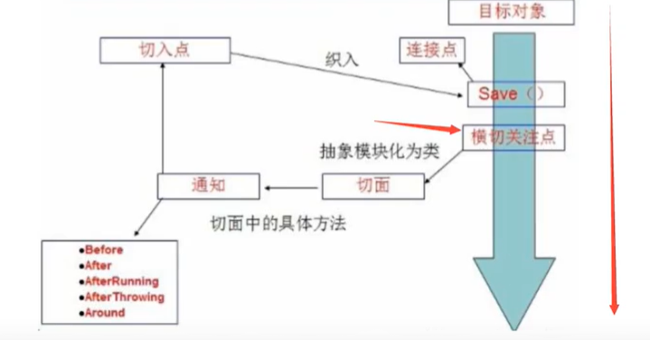

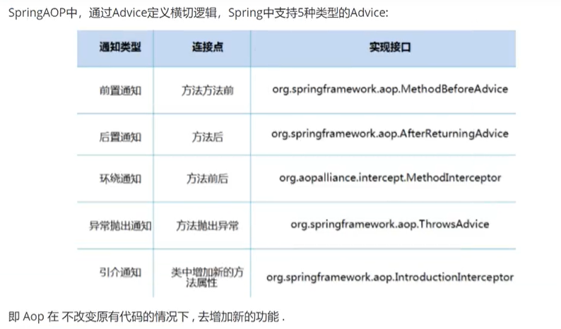

* 基本业务逻辑

```java
public interface UserService {
    public void add();
    public void delete();
    public void select();
    public void update();
}
package com.liyajie.service;

public class UserServiceImpl implements UserService {
    @Override
    public void add() {
        System.out.println("增加一个用户");
    }

    @Override
    public void delete() {
        System.out.println("删除一个用户");
    }

    @Override
    public void select() {
        System.out.println("查询一个用户");
    }

    @Override
    public void update() {
        System.out.println("更新一个用户");
    }
}
```

* 定义横切逻辑,在方法前增加log，和方法后增加log

```java
public class Log implements MethodBeforeAdvice { // 方法前增加

    /**
     *
     * @param method 要执行的目标对象的方法
     * @param args   参数
     * @param target 目标对象
     * @throws Throwable
     */
    @Override
    public void before(Method method, Object[] args, Object target) throws Throwable {
        System.out.println(target.getClass().getName()+"的"+method.getName()+"被执行");
    }
}
```

```java
public class AfterLog implements AfterReturningAdvice { // 方法后增加
    @Override
    public void afterReturning(Object returnValue, Method method, Object[] args, Object target) throws Throwable {
        System.out.println(target.getClass().getName()+"的"+method.getName()+"被执行. 返回结果为 "+returnValue);
    }
}
```

* spring xml文件配置，（先增加aop约束）

```xml
<?xml version="1.0" encoding="UTF-8"?>
<beans xmlns="http://www.springframework.org/schema/beans"
       xmlns:xsi="http://www.w3.org/2001/XMLSchema-instance"
       xmlns:aop="http://www.springframework.org/schema/aop"
       xsi:schemaLocation="http://www.springframework.org/schema/beans
        http://www.springframework.org/schema/beans/spring-beans.xsd
        http://www.springframework.org/schema/aop
        http://www.springframework.org/schema/aop/spring-aop.xsd" >

	<!--注册bean-->
    <bean id="userService" class="com.liyajie.service.UserServiceImpl"/>
    <bean id="log" class="com.liyajie.log.Log"/>
    <bean id="afterLog" class="com.liyajie.log.AfterLog"/>

	<!--方式1：使用原生的Spring API接口-->
	<!--配置AOP, 需要先导入aop的约束-->
    <aop:config>
		<!--切入点（在哪个地方执行）,expression:表达式， execution(要执行的位置！ * * * * *)-->
        <aop:pointcut id="pointcut" expression="execution(* com.liyajie.service.UserServiceImpl.*(..))"/>

		<!--执行环绕通知-->
        <aop:advisor advice-ref="log" pointcut-ref="pointcut"/>
        <aop:advisor advice-ref="afterLog" pointcut-ref="pointcut"/>
    </aop:config>

</beans>
```

com.liyajie.service.UserServiceImpl.*(..)) 表示UserServiceImpl的任意方法。（..）代表任意参数。

* 开始测试：

```java
public class MyTest {
    public static void main(String[] args) {
        ApplicationContext context=new ClassPathXmlApplicationContext("application.xml");
        UserService userService = context.getBean("userService", UserService.class);

        userService.add();
    }
}

// out
com.liyajie.service.UserServiceImpl的add被执行
增加一个用户
com.liyajie.service.UserServiceImpl的add被执行. 返回结果为 null
```


### 4.14 AOP实现方式二

使用自定义来实现AOP

* 自定义类

  ```java
  public class Log {
      public void before(){
          System.out.println("=========方法执行前=======");
      }
  
      public void after(){
          System.out.println("=========方法执行后=======");
      }
  }
  ```

* 配置spring xml文件

  ```xml
  <?xml version="1.0" encoding="UTF-8"?>
  <beans xmlns="http://www.springframework.org/schema/beans"
         xmlns:xsi="http://www.w3.org/2001/XMLSchema-instance"
         xmlns:aop="http://www.springframework.org/schema/aop"
         xsi:schemaLocation="http://www.springframework.org/schema/beans
          http://www.springframework.org/schema/beans/spring-beans.xsd
          http://www.springframework.org/schema/aop
          http://www.springframework.org/schema/aop/spring-aop.xsd" >
  
  	<!--注册bean-->
      <bean id="userService" class="com.liyajie.service.UserServiceImpl"/>
  
  	<!--方式2：使用自定义的类-->
      <bean id="diy" class="com.liyajie.diy.Log"/>
      <aop:config>
  	<!--自定义切面（就是一个类）-->
          <aop:aspect ref="diy">
  			<!--切入点(就是执行的位置)-->
              <aop:pointcut id="point" expression="execution(* com.liyajie.service.UserServiceImpl.*(..))"/>
  			<!--通知（在切入点执什么，前还是后执行）-->
              <aop:before method="before" pointcut-ref="point"/>
              <aop:after method="after" pointcut-ref="point"/>
          </aop:aspect>
      </aop:config>
  </beans>
  ```

* 测试

  ```java
  public class MyTest {
      public static void main(String[] args) {
          ApplicationContext context=new ClassPathXmlApplicationContext("application.xml");
          UserService userService = context.getBean("userService", UserService.class);
  
          userService.add();
      }
  }
  // out
  =========方法执行前=======
  增加一个用户
  =========方法执行后=======
  ```

### 4.15 注解方式实现AOP

* 实现带注解的类

```java
@Aspect   // 标注这个类是一个切面
public class AnnotationPointcut {

    @Before("execution(* com.liyajie.service.UserServiceImpl.*(..))")  // 插入切入点
    public void before(){
        System.out.println("=========方法执行前=======");
    }

    @After("execution(* com.liyajie.service.UserServiceImpl.*(..))")  // 插入切入点
    public void after(){
        System.out.println("=========方法执行后=======");
    }

    // 在环绕增强中，我们可以给定一个参数，代表我们要获取处理切入的点
    @Around("execution(* com.liyajie.service.UserServiceImpl.*(..))")
    public void around(ProceedingJoinPoint joinPoint) throws Throwable {
        System.out.println("环绕前");  // 早于@Before被执行
        // 执行方法
        joinPoint.proceed();   // @Before和@After之间被执行
        System.out.println("环绕后"); // 晚于@After被执行
    }
}

```

* xml 配置

  ```xml
  <?xml version="1.0" encoding="UTF-8"?>
  <beans xmlns="http://www.springframework.org/schema/beans"
         xmlns:xsi="http://www.w3.org/2001/XMLSchema-instance"
         xmlns:aop="http://www.springframework.org/schema/aop"
         xsi:schemaLocation="http://www.springframework.org/schema/beans
          http://www.springframework.org/schema/beans/spring-beans.xsd
          http://www.springframework.org/schema/aop
          http://www.springframework.org/schema/aop/spring-aop.xsd" >
  
  	<!--注册bean-->
      <bean id="userService" class="com.liyajie.service.UserServiceImpl"/>
  
      <bean id="annotationPointcut" class="com.liyajie.diy.AnnotationPointcut"/>
  	<!--自动配置 开启注解支持-->
      <aop:aspectj-autoproxy/>
  
  </beans>
  ```

### 4.16 整合Mybatis

* 步骤：

  1. 导入相关jar包
     * junit
     * mybatis
     * mysql数据库
     * spring相关
     * aop相关
     * mybatis-spring (新知识点)
  2. 编写配置文件
  3. 测试

  ```xml
  <dependencies>
      <dependency>
          <groupId>junit</groupId>
          <artifactId>junit</artifactId>
          <version>4.12</version>
          <scope>test</scope>
      </dependency>
  
      <dependency>
          <groupId>mysql</groupId>
          <artifactId>mysql-connector-java</artifactId>
          <version>5.1.47</version>
      </dependency>
  
      <dependency>
          <groupId>org.mybatis</groupId>
          <artifactId>mybatis</artifactId>
          <version>3.5.2</version>
      </dependency>
  
      <dependency>
          <groupId>org.springframework</groupId>
          <artifactId>spring-webmvc</artifactId>
          <version>5.2.0.RELEASE</version>
      </dependency>
  
      <!--spring操作数据库，还需要一个spring-jbdc-->
      <dependency>
          <groupId>org.springframework</groupId>
          <artifactId>spring-jdbc</artifactId>
          <version>5.3.4</version>
      </dependency>
  
      <dependency>
          <groupId>org.aspectj</groupId>
          <artifactId>aspectjweaver</artifactId>
          <version>1.9.4</version>
      </dependency>
  
      <dependency>
          <groupId>org.mybatis</groupId>
          <artifactId>mybatis-spring</artifactId>
          <version>2.0.2</version>
      </dependency>
  </dependencies>
  ```

* 回忆mybatis
  1. 编写实体类
  2. 编写核心配置文件
  3. 编写接口
  4. 编写Mapper.xml
  5. 测试


## 5 JDBC

### 5.1 数据库驱动

程序通过数据库驱动和数据库打交道。

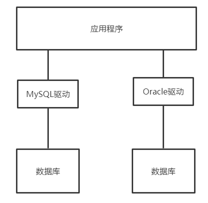

不同的数据库有不同的驱动，不便于管理，为了简化开发人员对数据库的同意操作，提供了一个（java操作数据库的）规范 JDBC。这些规范的实现由具体的厂商去做。对于开发人员，只需要学习JDBC的接口就可以了。

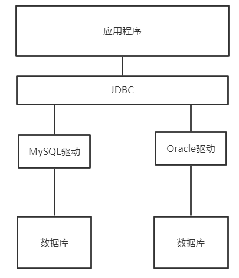

* 需要的包：

  java.sql

  javax.sql

  还需要导入数据库驱动的包 mysql-connector-java-xxx.jar

### 5.2 第一个JDBC程序

* 创建测试数据库

```SQL
CREATE DATABASE jdbcStudy CHARACTER SET utf8 COLLATE utf8_general_ci;
USE jdbcStudy;
CREATE TABLE users(
    id INT PRIMARY KEY,
    NAME VARCHAR(40),
    PASSWORD VARCHAR(40),
    email VARCHAR(60),
    birthday DATE
);

INSERT INTO users(id,NAME,PASSWORD,email,birthday)
VALUES(1,"zhangsan" ,"123456","zs@qq.com","1980-12-04"),
(2,"lisi" ,"123456","lisi@qq.com","1981-12-04"),
(3,"wangwu" ,"123456","wangwu@qq.com","1979-12-04");
```

* 导入数据库驱动

* 编写测试代码

  ```java
  public class JdbcFisrtDemo {
      public static void main(String[] args) throws ClassNotFoundException, SQLException {
          // 1. 加载驱动, 8.0 后可以不用加载
          Class.forName("com.mysql.cj.jdbc.Driver");//固定写法，加载驱动
  
          // 2. 连接数据库的用户信息和url,设置编码方式，和ssl安全
          // mysql:  jdbc:mysql://主机地址:端口号/数据库名?参数1&参数2&参数3
          String url="jdbc:mysql://localhost:3306/jdbcStudy?useUnicode=true&characterEncoding=utf8&useSSL=true";
          String userName="root";
          String passWord="";
  
          // 3. 连接成功，得到数据库对象,connection就代表数据库
          Connection connection = DriverManager.getConnection(url, userName, passWord);
  
          // 4. 创建执行SQL的对象 statement
          Statement statement = connection.createStatement();
  
          // 5. 执行SQL
          String sql="SELECT * FROM users";
          ResultSet resultSet = statement.executeQuery(sql); // 返回链表形式
  		
          // statement.executeQuery(sql) 执行查询
          // statement.execute(sql) 执行任何SQL
          // statement.executeUpdate(sql) 执行更新、删除、插入
          // statement.executeBatch(sql)  执行多个SQL
          
          while (resultSet.next()){
              System.out.print("id= "+resultSet.getObject("id"));
              System.out.print(" name= "+resultSet.getObject("NAME"));
              System.out.println(" password= "+resultSet.getObject("PASSWORD"));
          }
  
          // 6. 关闭数据库连接，释放资源
          resultSet.close();
          statement.close();
          connection.close();
      }
  }
  //out
  id= 1 name= zhangsan password= 123456
  id= 2 name= lisi password= 123456
  id= 3 name= wangwu password= 123456
  ```

### 5.3 JDBC配置信息解藕，放在单独文件中

* 配置文件 db.properties

```
driver=com.mysql.cj.jdbc.Driver
url=jdbc:mysql://localhost:3306/jdbcStudy?useUnicode=true&characterEncoding=utf8&useSSL=true
username=root
password=
```

* 读取配置文件类

```java
// 读取配置文件类
public class JdbcUtils {
    private static String driver=null;
    private static String url=null;
    private static String username=null;
    private static String password=null;

    static {
        try{
            InputStream resourceAsStream = JdbcUtils.class.getClassLoader().getResourceAsStream("db.properties");
            Properties properties=new Properties();
            properties.load(resourceAsStream);

            driver=properties.getProperty("driver");
            url=properties.getProperty("url");
            username=properties.getProperty("username");
            password=properties.getProperty("password");

            // 加载驱动，驱动只用加载一次
            Class.forName(driver);

        } catch (IOException | ClassNotFoundException ex){
            ex.printStackTrace();
        }
    }

    // 获取连接
    public static Connection getConnection() throws SQLException {
        return DriverManager.getConnection(url, username, password);
    }

    // 释放资源
    public static void release(Connection connection, Statement statement, ResultSet resultSet){
        if(resultSet!=null) {
            try {
                resultSet.close();
            } catch (SQLException throwables) {
                throwables.printStackTrace();
            }
        }
        if(statement!=null){
            try {
                statement.close();
            } catch (SQLException throwables) {
                throwables.printStackTrace();
            }
        }
        if(connection!=null){
            try {
                connection.close();
            } catch (SQLException throwables) {
                throwables.printStackTrace();
            }
        }
    }
}
```

* 测试

```java
public class TestInsert {
    public static void main(String[] args) {
        Connection connection=null;
        Statement statement=null;
        ResultSet resultSet=null;

        try {
            connection= JdbcUtils.getConnection();
            statement=connection.createStatement();
            String sql="INSERT INTO users (id,NAME,PASSWORD,email,birthday)" +
                    "VALUES (5,'liuzhi','678542','liuz@qq.com','1994-11-03')";
            int n=statement.executeUpdate(sql);
            if(n>0){
                System.out.println("插入成功");
            }
        } catch (SQLException throwables) {
            throwables.printStackTrace();
        } finally {
            JdbcUtils.release(connection,statement,resultSet);
        }
    }
}
```

### 5.4 SQL注入问题

#### 5.4.1 Sql注入样例

sql存在漏洞，会被攻击导致数据泄露。（sql字符串拼接）

```java
package com.liyajie.demo;

import com.liyajie.demo.utils.JdbcUtils;

import java.sql.Connection;
import java.sql.ResultSet;
import java.sql.SQLException;
import java.sql.Statement;

// SQL注入
public class SqlHack {
    public  static void login(String username,String password){
        Connection connection=null;
        Statement statement=null;
        ResultSet resultSet=null;

        try {
            connection= JdbcUtils.getConnection();
            statement=connection.createStatement();

            String sql="select * from users where NAME='"+username+ "'AND PASSWORD= '"+ password+"'";

            resultSet=statement.executeQuery(sql);
            while (resultSet.next()){
                System.out.println(resultSet.getObject("NAME"));
            }
        } catch (SQLException throwables) {
            throwables.printStackTrace();
        } finally {
            JdbcUtils.release(connection,statement,resultSet);
        }
    }

    public static void main(String[] args) {
        login("'or '1=1","123456"); // sql注入，不合法字符串传入，获得所有的用户信息
    }
}
```

不是使用Statement对象执行SQL，而是**使用PreparedStatement防止SQL注入。**

#### 5.4.2 PreparedStatement防注入

```java
public class TestQuery {
    public static void main(String[] args) {
        Connection connection=null;
        PreparedStatement statement=null;
        ResultSet resultSet=null;

        try {
            connection= JdbcUtils.getConnection();
            // ? 号是占位符
            String sql="select * from users where NAME=? AND PASSWORD=?";
            statement = connection.prepareStatement(sql);// 需要一个预编译的SQL，先写SQL，不执行

            // 手动给占位符赋值，参数下标从1开始
            statement.setString(1,"lisi"); // NAME赋值
            statement.setString(2,"123456"); // PASSWORD赋值

            // 执行
            resultSet=statement.executeQuery();
            while (resultSet.next()){
                System.out.print(resultSet.getObject("id")+" ");
                System.out.print(resultSet.getObject("NAME")+" ");
                System.out.println(resultSet.getObject("email"));
            }
        } catch (SQLException throwables) {
            throwables.printStackTrace();
        }  finally {
            JdbcUtils.release(connection,statement,resultSet);
        }
    }
}
```


### 5.5 JDBC操作事务

* 事务：

  ACID原则：原子性（要么完成，要么不做）、一致性（总数不变）、隔离性（多个进行互不干扰）、持久性（一旦提交不可回滚，持久到数据库）。

* 隔离性的问题

  脏读：一个事务读取了另一没有提交的事务

  不可重复读：在同一个事务内，重复读取表中的数据，数据发生了改变

  虚读：在一个事务内，读取到了别人插入的数据，导致结果不一致。

```java
public class TestTracnsaction {

    public static void main(String[] args) {
        Connection connection=null;
        PreparedStatement statement=null;
        ResultSet resultSet=null;

        try {
            connection= JdbcUtils.getConnection();

            // 关闭数据库的自动提交,会自动开启事务
            connection.setAutoCommit(false);

            String sql1="update users set email='qwer@sina.com' where name='lisi'";
            statement= connection.prepareStatement(sql1);
            statement.executeUpdate();

            String sql2="update users set email='qwer@sina.com' where name='wangwu'";
            statement= connection.prepareStatement(sql2);
            statement.executeUpdate();

            // 业务完毕，提交事务
            connection.commit();
            System.out.println("操作成功");

        } catch (SQLException throwables) {
            try {
                connection.rollback(); // 事务失败，则回滚
            } catch (SQLException e) {
                e.printStackTrace();
            }
            throwables.printStackTrace();
        } finally {
            JdbcUtils.release(connection,statement,resultSet);
        }
    }
}
```

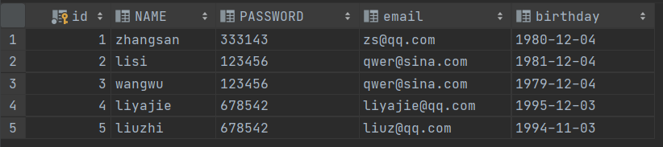

### 5.6 数据库连接池

数据库需要连接---执行完毕后----释放。

连接---释放十分浪费资源，因此开发了数据库连接池化技术。即准备一些预先连接的资源，每次使用从里面取，使用完就放回。

编写连接池，只需要实现一个接口：`DataSource`


一些开源的数据源实现：

1. DBCP        (依赖jar包：commons-dbcp, commons-pool)
2. C3P0        (依赖jar包：c3p0, mchange-commons-java)
3. Druid

使用了这些数据库连接池之后，我们在项目开发中就可以不需要编写连接数据库的代码了

* DBCP

  配置文件  dbcpconfig.properties：

  ```
  driverClassName=com.mysql.cj.jdbc.Driver
  url=jdbc:mysql://localhost:3306/jdbcStudy?useUnicode=true&characterEncoding=utf8&useSSL=true
  username=root
  password=
  
  #<!-- 初始化连接-->
  initialSize=10
  
  # 最大连接数量
  maxActive=50
  
  # 最大空闲连接
  maxIdle=20
  
  # 最小空闲连接
  minIdle=5
  
  # 超时等待时间，以毫秒为单位
  maxWait=60000
  
  # JDBC驱动建立连接时附带的连接属性，属性格式必须为这样：[属性名=property;]
  # 注意: "user" 与“password”连个属性会被明确的传递，因此这里不需要包含他们
  connectionProperties=useUnicode=true;characterEncoding=utf8
  
  # 指定由连接池所创建的连接的自动提交状态
  defaultAutoCommit=true
  
  # driver default 指定由连接池所创建的连接的只读状态
  # 如果没有设置该值，则 "setReadOnly" 方法将不被调用，
  defaultReadOnly=
  
  # driver default 指定由连接池所创建的连接的事务级别
  defaultTransactionIsolation=READ_UNCOMMITTED
  
  ```

  读取工具类

  ```java
  // 读取配置文件类
  public class JdbcUtils {
  
      private static  DataSource dataSource;
  
      static {
          try{
              InputStream in = JdbcUtils.class.getClassLoader().getResourceAsStream("dbcpconfig.properties");
              Properties properties=new Properties();
              properties.load(in);
  
              // 创建数据源
              dataSource = BasicDataSourceFactory.createDataSource(properties);
  
          } catch (Exception ex){
              ex.printStackTrace();
          }
      }
  
      public static Connection getConnection() throws SQLException {
          return dataSource.getConnection();
      }
  
      // 释放资源
      public static void release(Connection connection, Statement statement, ResultSet resultSet){
          if(resultSet!=null) {
              try {
                  resultSet.close();
              } catch (SQLException throwables) {
                  throwables.printStackTrace();
              }
          }
          if(statement!=null){
              try {
                  statement.close();
              } catch (SQLException throwables) {
                  throwables.printStackTrace();
              }
          }
          if(connection!=null){
              try {
                  connection.close();
              } catch (SQLException throwables) {
                  throwables.printStackTrace();
              }
          }
      }
  }
  ```

  测试

  ```java
  public class MyTest {
      public static void main(String[] args) {
          Connection connection=null;
          PreparedStatement statement=null;
          ResultSet resultSet=null;
  
          try {
              connection= JdbcUtils.getConnection();
              // ? 号是占位符
              String sql="select * from users where NAME=? AND PASSWORD=?";
              statement = connection.prepareStatement(sql);// 需要一个预编译的SQL，先写SQL，不执行
  
              // 手动给占位符赋值，参数下标从1开始
              statement.setString(1,"lisi"); // NAME赋值
              statement.setString(2,"123456"); // PASSWORD赋值
  
              // 执行
              resultSet=statement.executeQuery();
              while (resultSet.next()){
                  System.out.print(resultSet.getObject("id")+" ");
                  System.out.print(resultSet.getObject("NAME")+" ");
                  System.out.println(resultSet.getObject("email"));
              }
          } catch (SQLException throwables) {
              throwables.printStackTrace();
          }  finally {
              JdbcUtils.release(connection,statement,resultSet);
          }
      }
  }
  ```

* C3P0


## 6 Mybatis开发


MyBatis 是一款优秀的**持久层框架**，它支持**自定义 SQL、存储过程以及高级映射**。MyBatis 免除了几乎所有的 JDBC 代码以及设置参数和获取结果集的工作。MyBatis 可以**通过简单的 XML 或注解来配置和映射原始类型、接口和 Java POJO**（Plain Old Java Objects，普通老式 Java 对象）为数据库中的记录。

* 持久化

  数据持久化，持久化就是将程序的数据在持久状态和瞬时状态转化的过程。

  内存：断电即失

  数据库（jdbc）,io文件持久化

* 为什么需要持久化？

  内存断电即失，而需要一些对象不能丢失。

* 为啥需要MyBatis?

  ban关注程序猿将数据存入数据库。

  方便

  JDBC代码复杂，简化，架构，自动化操作。

### 6.1 第一个MyBatis程序

搭建环境---->导入mybatis-->编写代码--->测试

#### 6.1.1 搭建环境

* 搭建数据库

  创建一个数据库 mybatis, 并创建一个表 users:

  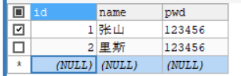

* 使用Maven创建项目

  导入依赖,mybatis,mysql驱动，junit：

  ```xml
  <dependency>
      <groupId>org.mybatis</groupId>
      <artifactId>mybatis</artifactId>
      <version>3.5.3</version>
  </dependency>
  <dependency>
      <groupId>junit</groupId>
      <artifactId>junit</artifactId>
      <version>4.12</version>
      <scope>test</scope>
  </dependency>
  <dependency>
      <groupId>mysql</groupId>
      <artifactId>mysql-connector-java</artifactId>
      <version>8.0.23</version>
  </dependency>
  ```

* 编写代码

  编写配置文件 mybatis-config.xml文件：当 encoding="UTF-8"时会出现中文注释时，报错，改成utf8

  ```xml
  <?xml version="1.0" encoding="utf8" ?>
  <!DOCTYPE configuration
          PUBLIC "-//mybatis.org//DTD Config 3.0//EN"
          "http://mybatis.org/dtd/mybatis-3-config.dtd">
  
  <!--核心配置-->
  <configuration>
      <environments default="development">
          <environment id="development">
              <transactionManager type="JDBC"/>
              <dataSource type="POOLED">
                  <property name="driver" value="com.mysql.cj.jdbc.Driver"/>
                  <property name="url" value="jdbc:mysql://localhost:3306/mybatis?useUnicode=true&amp;characterEncoding=utf8&amp;useSSL=true"/>
                  <property name="username" value="$root"/>
                  <property name="password" value=""/>
              </dataSource>
          </environment>
      </environments>
  </configuration>
  ```

  编写mybatis读取配置类

  ```java
  public class MybatisUtils {
  
      private static SqlSessionFactory sqlSessionFactory;
      static {
          // 获取可以创建SqlSession的SqlSessionFactory对象
          try {
              String resource = "mybatis-config.xml";
              InputStream inputStream = Resources.getResourceAsStream(resource);
              sqlSessionFactory = new SqlSessionFactoryBuilder().build(inputStream);
          } catch (IOException e) {
              e.printStackTrace();
          }
      }
  
      // 从工场中获取，sql session,可以使用该session对象执行SQL，类似JDBC中的PreparedStatement
      public static SqlSession getSqlSession(){
          return sqlSessionFactory.openSession();
      }
  }
  ```

  编码代码

  1. 实体类

     ```java
     public class User {
         // 要和数据库表中的字段名字一样
         private int id;
         private String name;
         private String pwd;
     
         public User() {
         }
     
         public User(int id, String name, String pwd) {
             this.id = id;
             this.name = name;
             this.pwd = pwd;
         }
     
         public int getId() {
             return id;
         }
     
         public void setId(int id) {
             this.id = id;
         }
     
         public String getName() {
             return name;
         }
     
         public void setName(String name) {
             this.name = name;
         }
     
         public String getPwd() {
             return pwd;
         }
     
         public void setPwd(String pwd) {
             this.pwd = pwd;
         }
     
         @Override
         public String toString() {
             return "User{" +
                     "id=" + id +
                     ", name='" + name + '\'' +
                     ", pwd='" + pwd + '\'' +
                     '}';
         }
     }
     ```

  2. Dao接口定义

     ```java
     public interface UserDao {
     	// 获取全部用户
         public List<User> getUserList();
     }
     ```

  3. 编写mybatis  UserMapper.xml文件来实现Dao接口，而不是使用java实现UserDaoImpl实现类

     返回值是集合还是单个值，只看泛型中的类型，如List<User>为User，是一个对象不是集合

     ```xml
     <?xml version="1.0" encoding="utf8" ?>
     <!DOCTYPE mapper
             PUBLIC "-//mybatis.org//DTD Mapper 3.0//EN"
             "http://mybatis.org/dtd/mybatis-3-mapper.dtd">
     
     <!--namespace 等于命名空间，绑定一个对应的Dao/Mapper接口（实现一个接口）-->
     <mapper namespace="com.liyajie.dao.UserDao">
     	<!--sql查询，id对应方法名,实现接口中的方法，resultType返回一个元素，resultMap返回一个集合-->
         <select id="getUserList" resultType="com.liyajie.pojo.User">
             select * from mybatis.users
         </select>
     </mapper>
     ```

  4. 在mybatis核心配置文件 mybatis-config.xml中注册这个mapper.

     ```xml
     <?xml version="1.0" encoding="utf8" ?>
     <!DOCTYPE configuration
             PUBLIC "-//mybatis.org//DTD Config 3.0//EN"
             "http://mybatis.org/dtd/mybatis-3-config.dtd">
     
     <!--核心配置-->
     <configuration>
         <environments default="development">
             <environment id="development">
                 <transactionManager type="JDBC"/>
                 <dataSource type="POOLED">
                     <property name="driver" value="com.mysql.cj.jdbc.Driver"/>
                     <property name="url" value="jdbc:mysql://localhost:3306/mybatis?useUnicode=true&amp;characterEncoding=utf8&amp;useSSL=true"/>
                     <property name="username" value="$root"/>
                     <property name="password" value=""/>
                 </dataSource>
             </environment>
         </environments>
         
     	<!--注册mapper-->
         <mappers>
             <mapper resource="com/liyajie/dao/UserMapper.xml"></mapper>
         </mappers>
         
     </configuration>
     ```

  5. 在maven的pom.xml配置文件中解决 UserMapper.xml配置文件无法使用的情况

     ```xml
     <!--    解决在srx/main/java目录中的配置无法使用的情况-->
     <build>
         <resources>
             <resource>
                 <directory>src/main/resources</directory>
                 <includes>
                     <include>**/*.properties</include>
                     <include>**/*.xml</include>
                 </includes>
                 <filtering>true</filtering>
             </resource>
             <resource>
                 <directory>src/main/java</directory>
                 <includes>
                     <include>**/*.properties</include>
                     <include>**/*.xml</include>
                 </includes>
                 <filtering>true</filtering>
             </resource>
         </resources>
     </build>
     ```

  6. 使用Junit测试

     ```java
     public class UserDaoTest {
     
         @Test
         public void test(){
             // 获取sqlSession
             SqlSession sqlSession = MybatisUtils.getSqlSession();
     
             // 获取实现的接口类实例，执行对应的sql方法
             UserDao mapper = sqlSession.getMapper(UserDao.class);
             List<User> userList = mapper.getUserList();
     
             for(User user:userList){
                 System.out.println(user);
             }
             
             // 关闭session
             sqlSession.close();
         }
     }
     // out
     User{id=1, name='张山', pwd='123456'}
     User{id=2, name='里斯', pwd='123456'}
     ```

     

#### 6.1.2 增删改实现

Dao就是Mapper，**增删改需要提交事务**

* Mapper

```java
public interface UserMapper {

    // 获取全部用户
    List<User> getUserList();

    // 根据id查询用户
    User getUserById(int id);

    // 增加一个用户
    int addUser(User user);

    // 修改用户
    int updateUser(User user);

    // 删除一个用户
    int deleteUser(int id);
}
```

* sql实现

```xml
<?xml version="1.0" encoding="utf8" ?>
<!DOCTYPE mapper
        PUBLIC "-//mybatis.org//DTD Mapper 3.0//EN"
        "http://mybatis.org/dtd/mybatis-3-mapper.dtd">

<!--namespace 等于命名空间，绑定一个对应的Dao/Mapper接口（实现一个接口）-->
<mapper namespace="com.liyajie.dao.UserMapper">
    <!--sql查询，id对应方法名,实现接口中的方法，resultType返回一个，resultMap返回一个集合-->
    <select id="getUserList" resultType="com.liyajie.pojo.User">
        select * from users
    </select>

    <!--parameterType 表示传入的参数类型，还有一个parameterMap传入多个参数-->
    <select id="getUserById" resultType="com.liyajie.pojo.User" parameterType="int">
        select * from users where id=#{id}  <!-- #{id}代表传入的参数，{}里为接口中的方法的参数名 -->
    </select>

    <!--插入用户,对象中的属性可以直接取出来-->
    <insert id="addUser" parameterType="com.liyajie.pojo.User">
        insert into users (id,name,pwd) values (#{id},#{name},#{pwd})
    </insert>

    <!--修改用户-->
    <update id="updateUser" parameterType="com.liyajie.pojo.User">
        update users set name=#{name},pwd=#{pwd} where id=#{id}
    </update>

    <!--删除用户-->
    <delete id="deleteUser" parameterType="int">
        delete from users where id=#{id}
    </delete>
</mapper>
```

* 测试

```java
public class UserDaoTest {

    @Test
    public void test(){
        // 获取sqlSession
        SqlSession sqlSession = MybatisUtils.getSqlSession();

        // 方式1：获取实现的接口类实例，执行对应的sql方法
        UserMapper mapper = sqlSession.getMapper(UserMapper.class);
        List<User> userList = mapper.getUserList();

        for(User user:userList){
            System.out.println(user);
        }
        System.out.println("====================================");

        // 关闭session
        sqlSession.close();
    }

    @Test
    public void getUserById(){
        SqlSession sqlSession=MybatisUtils.getSqlSession();

        UserMapper mapper = sqlSession.getMapper(UserMapper.class);
        User user = mapper.getUserById(1);
        System.out.println(user);

        sqlSession.close();
    }

    // 增删改需要提交事务
    @Test
    public void addUser(){
        SqlSession sqlSession=MybatisUtils.getSqlSession();

        UserMapper mapper = sqlSession.getMapper(UserMapper.class);
        mapper.addUser(new User(3,"李总","23145"));

        // 提交事务
        sqlSession.commit();
        sqlSession.close();
    }

    @Test
    public void updateUser(){
        SqlSession sqlSession=MybatisUtils.getSqlSession();

        UserMapper mapper = sqlSession.getMapper(UserMapper.class);
        mapper.updateUser(new User(2,"里斯","333143"));

        // 提交事务
        sqlSession.commit();
        sqlSession.close();
    }

    @Test
    public void deleteUser(){
        SqlSession sqlSession=MybatisUtils.getSqlSession();

        UserMapper mapper = sqlSession.getMapper(UserMapper.class);
        mapper.deleteUser(3);

        // 提交事务
        sqlSession.commit();
        sqlSession.close();
    }
}
```


### 6.2 万能的Map和模糊查询

#### 6.2.1 Map传参

```xml
<insert id="addUser" parameterType="com.liyajie.pojo.User">
    insert into users (id,name,pwd) values (#{id},#{name},#{pwd})
</insert>
```

假设上面User由一百个字段，则插入就要写一把个 #{} 吗？

使用map传参数，可以使用key值作为辨识传入，则我们想传什么就传什么。

```java
public interface UserMapper {
    // 万能的map
    int addUserByMap(Map<String,Object> map);
}
```

```xml
<!--插入一个用户,使用万能的map-->
<insert id="addUserByMap" parameterType="java.util.Map">
    insert into users (id,name,pwd) values (#{userid},#{userName},#{passWd})  
</insert>
```

```java
@Test
public void addUserByMap(){
    SqlSession sqlSession=MybatisUtils.getSqlSession();

    UserMapper mapper = sqlSession.getMapper(UserMapper.class);
    HashMap<String, Object> map = new HashMap<>();
    map.put("userid",4);
    map.put("userName","李桑");
    map.put("passWd","324156");
    mapper.addUserByMap(map);

    // 提交事务
    sqlSession.commit();
    sqlSession.close();
}
```


#### 6.2.2 模糊查询

```java
public interface UserMapper {
    // 模糊查询
    List<User> getUserListByLike(String value);
}
```

```xml
<!--模糊查询-->
<select id="getUserListByLike" resultType="com.liyajie.pojo.User">
    select * from users where name like "%"#{value}"%"   写死
</select>
```

```java
@Test
public void getUserListByLike(){
    SqlSession sqlSession=MybatisUtils.getSqlSession();

    UserMapper mapper = sqlSession.getMapper(UserMapper.class);
    List<User> users = mapper.getUserListByLike("李");  // 不在java中实现通配符，

    for(User user:users){
        System.out.println(user);
    }

    // 提交事务
    sqlSession.commit();
    sqlSession.close();
}
```

要在xml中写死通配 （select * from users where name like %#{value}%），而不是在java中实现通配符，否则存在SQL注入。

### 6.3 配置解析

####  6.3.1 核心配置文件

* mybatis-config.xml      也可以不叫这个名字，只要内容是就好

配置文档的顶层结构如下：

- configuration（配置）
  - [properties（属性）](https://mybatis.org/mybatis-3/zh/configuration.html#properties)
  - [settings（设置）](https://mybatis.org/mybatis-3/zh/configuration.html#settings)
  - [typeAliases（类型别名）](https://mybatis.org/mybatis-3/zh/configuration.html#typeAliases)
  - [typeHandlers（类型处理器）](https://mybatis.org/mybatis-3/zh/configuration.html#typeHandlers)
  - [objectFactory（对象工厂）](https://mybatis.org/mybatis-3/zh/configuration.html#objectFactory)
  - [plugins（插件）](https://mybatis.org/mybatis-3/zh/configuration.html#plugins)
  - environments（环境配置）
    - environment（环境变量）
      - transactionManager（事务管理器）
      - dataSource（数据源）
  - [databaseIdProvider（数据库厂商标识）](https://mybatis.org/mybatis-3/zh/configuration.html#databaseIdProvider)
  - [mappers（映射器）](https://mybatis.org/mybatis-3/zh/configuration.html#mappers)

#### 6.3.2 环境配置（environments）

**尽管可以配置多个环境，但每个 SqlSessionFactory 实例只能选择一种环境。**

```xml
<environments default="development">    // 选择默认环境，使用哪个环境选择哪个id就可
  
    <!--第一个环境-->
  <environment id="development">
    <transactionManager type="JDBC">
      <property name="..." value="..."/>
    </transactionManager>
    <dataSource type="POOLED">
      <property name="driver" value="${driver}"/>
      <property name="url" value="${url}"/>
      <property name="username" value="${username}"/>
      <property name="password" value="${password}"/>
    </dataSource>
  </environment>
    
  <!--第二个环境-->
  <environment id="test">
    <transactionManager type="JDBC">
      <property name="..." value="..."/>
    </transactionManager>
    <dataSource type="POOLED">
      <property name="driver" value="${driver}"/>
      <property name="url" value="${url}"/>
      <property name="username" value="${username}"/>
      <property name="password" value="${password}"/>
    </dataSource>
  </environment>
    
</environments>
```

注意一些关键点:

- 默认使用的环境 ID（比如：default="development"）。
- 每个 environment 元素定义的环境 ID（比如：id="development"）。
- 事务管理器(transactionManager)的配置 （比如：type="JDBC",还可以是“MANAGED”）。
- 数据源(dataSource)的配置（比如：type="POOLED"）。

默认环境和环境 ID 顾名思义。 环境可以随意命名，但务必保证默认的环境 ID 要匹配其中一个环境 ID。


dataSource 元素使用标准的 JDBC 数据源接口来配置 JDBC 连接对象的资源。

- 大多数 MyBatis 应用程序会按示例中的例子来配置数据源。虽然数据源配置是可选的，但如果要启用延迟加载特性，就必须配置数据源。

有**三种内建的数据源**类型（也就是 type="[UNPOOLED|POOLED|JNDI]"）：

**POOLED**– 这种数据源的实现利用“池”的概念将 JDBC 连接对象组织起来，避免了创建新的连接实例时所必需的初始化和认证时间。 这种处理方式很流行，能使并发 Web 应用快速响应请求。

#### 6.3.3 属性（properties）

可以通过properties属性来实现引用配置文件。

这些属性可以在外部进行配置，并可以进行动态替换。你既可以在典型的 Java 属性文件中配置这些属性，也可以在 properties 元素的子元素中设置。例如：

```xml
<properties resource="org/mybatis/example/config.properties">
  <property name="username" value="dev_user"/>
  <property name="password" value="F2Fa3!33TYyg"/> 重复配置，则优先使用propetries文件中的。
</properties>
```

设置好的属性可以在整个配置文件中用来替换需要动态配置的属性值。比如:

```xml
<dataSource type="POOLED">
  <property name="driver" value="${driver}"/>
  <property name="url" value="${url}"/>
  <property name="username" value="${username}"/>
  <property name="password" value="${password}"/>
</dataSource>
```

这个例子中的 username 和 password 将会由 properties 元素中设置的相应值来替换。 driver 和 url 属性将会由 config.properties 文件中对应的值来替换。

例子：

1. 创建 db.properties文件

```
driver=com.mysql.cj.jdbc.Driver
url=jdbc:mysql://localhost:3306/mybatis?useUnicode=true&characterEncoding=utf8&useSSL=true
username=root
password=
```

2. 在mybatis-config.xml中引入：

   `<properties resource="db.properties"/>`

```xml
<?xml version="1.0" encoding="utf8" ?>
<!DOCTYPE configuration
        PUBLIC "-//mybatis.org//DTD Config 3.0//EN"
        "http://mybatis.org/dtd/mybatis-3-config.dtd">

<!--核心配置-->
<configuration>

    <!--引入外部配置文件-->
    <properties resource="db.properties"/>

    <environments default="development">
        <environment id="development">
            <transactionManager type="JDBC"/>
            <dataSource type="POOLED">
                <property name="driver" value="${driver}"/>
                <property name="url" value="${url}"/>
                <property name="username" value="${username}"/>
                <property name="password" value="${password}"/>
            </dataSource>
        </environment>
    </environments>
    <!--    注册mapper-->
    <mappers>
        <mapper resource="com/liyajie/dao/UserMapper.xml"></mapper>
    </mappers>
</configuration>
```

* 可以直接引入外部文件

  `<properties resource="db.properties"/>`

* 可以在其中增加一些属性配置

  `<properties resource="org/mybatis/example/config.properties">
    <property name="username" value="dev_user"/>
    <property name="password" value="F2Fa3!33TYyg"/> 重复配置，则优先使用propetries文件中的。
  </properties>`

* 如果两个文件有相同的字段，则优先使用外部配置文件。

#### 6.3.4 类型别名（typeAliases）

类型别名可为 Java 类型**设置一个缩写名字**。 它仅用于 XML 配置，意在**降低冗余**的全限定类名书写。

* 第一种方式，一个类一个别名：

```xml
<typeAliases>
  <typeAlias alias="Author" type="domain.blog.Author"/>
  <typeAlias alias="Blog" type="domain.blog.Blog"/>
  <typeAlias alias="Comment" type="domain.blog.Comment"/>
  <typeAlias alias="Post" type="domain.blog.Post"/>
  <typeAlias alias="Section" type="domain.blog.Section"/>
  <typeAlias alias="Tag" type="domain.blog.Tag"/>
</typeAliases>
```

当这样配置时，`Blog` 可以用在任何使用 `domain.blog.Blog` 的地方。

例子：

1. mybatis-config.xml

```xml
<?xml version="1.0" encoding="utf8" ?>
<!DOCTYPE configuration
        PUBLIC "-//mybatis.org//DTD Config 3.0//EN"
        "http://mybatis.org/dtd/mybatis-3-config.dtd">

<!--核心配置-->
<configuration>

    <!--引入外部配置文件,要放在第一位置-->
    <properties resource="db.properties"/>

	<!--类型别名，放在setting后,即第三个位置，没seting，则放在第二个位置-->
    <typeAliases>
        <typeAlias type="com.liyajie.pojo.User" alias="User"/>
    </typeAliases>

    <environments default="development">
        <environment id="development">
            <transactionManager type="JDBC"/>
            <dataSource type="POOLED">
                <property name="driver" value="${driver}"/>
                <property name="url" value="${url}"/>
                <property name="username" value="${username}"/>
                <property name="password" value="${password}"/>
            </dataSource>
        </environment>
    </environments>
    <!--    注册mapper-->
    <mappers>
        <mapper resource="com/liyajie/dao/UserMapper.xml"></mapper>
    </mappers>
</configuration>
```

2. UserMapper.xml

```xml
<?xml version="1.0" encoding="utf8" ?>
<!DOCTYPE mapper
        PUBLIC "-//mybatis.org//DTD Mapper 3.0//EN"
        "http://mybatis.org/dtd/mybatis-3-mapper.dtd">

<!--namespace 等于命名空间，绑定一个对应的Dao/Mapper接口（实现一个接口）-->
<mapper namespace="com.liyajie.dao.UserMapper">
    <!-- 直接使用别名User,而不是全名-->
    <select id="getUserList" resultType="User">
        select * from users
    </select>
</mapper>
```


* 第二种方式，直接处理一个包：

也可以指定一个包名，MyBatis 会在包名下面搜索需要的 Java Bean，比如：

```xml
<typeAliases>
  <package name="domain.blog"/>
</typeAliases>
```

每一个在包 `domain.blog` 中的 Java Bean，在没有注解的情况下，会使用 Bean 的首字母小写的非限定类名来作为它的别名。 比如 `domain.blog.Author` 的别名为 `author`；若有注解，则别名为其注解值。见下面的例子：

```java
@Alias("author")
public class Author {
    ...
}
```

例子：

1. mybatix-config.xml

```xml
<?xml version="1.0" encoding="utf8" ?>
<!DOCTYPE configuration
        PUBLIC "-//mybatis.org//DTD Config 3.0//EN"
        "http://mybatis.org/dtd/mybatis-3-config.dtd">

<!--核心配置-->
<configuration>

    <!--引入外部配置文件,要放在第一位置-->
    <properties resource="db.properties"/>

	<!--类型别名，使用包，没注解下类的小写为别名-->
    <typeAliases>
        <package name="com.liyajie.pojo"/>
    </typeAliases>

    <environments default="development">
        <environment id="development">
            <transactionManager type="JDBC"/>
            <dataSource type="POOLED">
                <property name="driver" value="${driver}"/>
                <property name="url" value="${url}"/>
                <property name="username" value="${username}"/>
                <property name="password" value="${password}"/>
            </dataSource>
        </environment>
    </environments>
    <!--    注册mapper-->
    <mappers>
        <mapper resource="com/liyajie/dao/UserMapper.xml"></mapper>
    </mappers>
</configuration>
```

2. UserMapper.xml

```xml
<?xml version="1.0" encoding="utf8" ?>
<!DOCTYPE mapper
        PUBLIC "-//mybatis.org//DTD Mapper 3.0//EN"
        "http://mybatis.org/dtd/mybatis-3-mapper.dtd">

<!--namespace 等于命名空间，绑定一个对应的Dao/Mapper接口（实现一个接口）-->
<mapper namespace="com.liyajie.dao.UserMapper">
    <!-- 直接使用别名user,而不是全名-->
    <select id="getUserList" resultType="user">
        select * from users
    </select>
</mapper>
```


#### 6.3.5 设置 （settings）

这是 MyBatis 中**极为重要的调整设置**，它们会改变 MyBatis 的运行时行为。

一个配置完整的 settings 元素的示例如下：

| **设置名**                   | **描述**                                                     | **有效值**                                                   | **默认值** |
| :--------------------------- | :----------------------------------------------------------- | :----------------------------------------------------------- | :--------- |
| **cacheEnabled**             | 全局性地开启或关闭所有映射器配置文件中已配置的任何缓存。     | true \| false                                                | true       |
| **lazyLoadingEnabled**       | 延迟加载的全局开关。当开启时，所有关联对象都会延迟加载。 特定关联关系中可通过设置 `fetchType` 属性来覆盖该项的开关状态。 | true \| false                                                | false      |
| **mapUnderscoreToCamelCase** | 是否开启驼峰命名自动映射，即从经典数据库列名 A_COLUMN 映射到经典 Java 属性名 aColumn。 | true \| false                                                | False      |
| **logPrefix**                | 指定 MyBatis 增加到日志名称的前缀。                          | 任何字符串                                                   | 未设置     |
| **logImpl**                  | 指定 MyBatis 所用日志的具体实现，未指定时将自动查找。        | SLF4J \| LOG4J \| LOG4J2 \| JDK_LOGGING \| COMMONS_LOGGING \| STDOUT_LOGGING \| NO_LOGGING | 未设置     |

```xml
<settings>
  <setting name="cacheEnabled" value="true"/>
  <setting name="lazyLoadingEnabled" value="true"/>
  <setting name="mapUnderscoreToCamelCase" value="false"/>
</settings>
```

以下配置基本上都用不到。

- [typeHandlers（类型处理器）](https://mybatis.org/mybatis-3/zh/configuration.html#typeHandlers)
- [objectFactory（对象工厂）](https://mybatis.org/mybatis-3/zh/configuration.html#objectFactory)
- [plugins（插件）](https://mybatis.org/mybatis-3/zh/configuration.html#plugins)

#### 6.3.6 映射器（mappers）

既然 MyBatis 的行为已经由上述元素配置完了，我们现在就要来定义 SQL 映射语句了。 但首先，我们需要告诉 MyBatis 到哪里去找到这些语句。 在自动查找资源方面，Java 并没有提供一个很好的解决方案，所以最好的办法是直接告诉 MyBatis 到哪里去找映射文件。 你可以使用相对于类路径的资源引用，或完全限定资源定位符（包括 `file:///` 形式的 URL），或类名和包名等。例如：

```xml
<!-- 使用相对于类路径的资源引用 -->
<mappers>
  <mapper resource="org/mybatis/builder/AuthorMapper.xml"/>
  <mapper resource="org/mybatis/builder/BlogMapper.xml"/>
  <mapper resource="org/mybatis/builder/PostMapper.xml"/>
</mappers>

<!-- 使用完全限定资源定位符（URL） -->
<mappers>
  <mapper url="file:///var/mappers/AuthorMapper.xml"/>
  <mapper url="file:///var/mappers/BlogMapper.xml"/>
  <mapper url="file:///var/mappers/PostMapper.xml"/>
</mappers>

<!-- 使用映射器接口实现类的完全限定类名，xml文件名要和类名一样，且和类在一个目录下 -->
<mappers>
  <mapper class="org.mybatis.builder.AuthorMapper"/>
  <mapper class="org.mybatis.builder.BlogMapper"/>
  <mapper class="org.mybatis.builder.PostMapper"/>
</mappers>

<!-- 将包内的映射器接口实现全部注册为映射器，xml文件名要和类名一样 -->
<mappers>
  <package name="org.mybatis.builder"/>
</mappers>
```

### 6.4 生命周期和作用域

生命周期类别是至关重要的，因为错误的使用会导致非常严重的并发问题。

#### SqlSessionFactoryBuilder

这个类可以被实例化、使用和丢弃，一旦创建了 SqlSessionFactory，就不再需要它了。 因此 SqlSessionFactoryBuilder 实例的最佳作用域是方法作用域（也就是局部方法变量）。 你可以重用 SqlSessionFactoryBuilder 来创建多个 SqlSessionFactory 实例，但最好还是不要一直保留着它，以保证所有的 XML 解析资源可以被释放给更重要的事情。

#### SqlSessionFactory

SqlSessionFactory 一旦被创建就应该在应用的运行期间一直存在，没有任何理由丢弃它或重新创建另一个实例。 使用 SqlSessionFactory 的最佳实践是在应用运行期间不要重复创建多次，多次重建 SqlSessionFactory 被视为一种代码“坏习惯”。因此 SqlSessionFactory 的最佳作用域是应用作用域。 有很多方法可以做到，最简单的就是使用单例模式或者静态单例模式。

#### SqlSession

每个线程都应该有它自己的 SqlSession 实例。SqlSession 的实例不是线程安全的，因此是不能被共享的，所以它的最佳的作用域是请求或方法作用域。 绝对不能将 SqlSession 实例的引用放在一个类的静态域，甚至一个类的实例变量也不行。 也绝不能将 SqlSession 实例的引用放在任何类型的托管作用域中，比如 Servlet 框架中的 HttpSession。 如果你现在正在使用一种 Web 框架，考虑将 SqlSession 放在一个和 HTTP 请求相似的作用域中。 换句话说，每次收到 HTTP 请求，就可以打开一个 SqlSession，返回一个响应后，就关闭它。 这个关闭操作很重要，为了确保每次都能执行关闭操作，你应该把这个关闭操作放到 finally 块中。 下面的示例就是一个确保 SqlSession 关闭的标准模式：

```
try (SqlSession session = sqlSessionFactory.openSession()) {
  // 你的应用逻辑代码
}
```

在所有代码中都遵循这种使用模式，可以保证所有数据库资源都能被正确地关闭。

#### 映射器实例

映射器是一些绑定映射语句的接口。映射器接口的实例是从 SqlSession 中获得的。虽然从技术层面上来讲，任何映射器实例的最大作用域与请求它们的 SqlSession 相同。但方法作用域才是映射器实例的最合适的作用域。 也就是说，映射器实例应该在调用它们的方法中被获取，使用完毕之后即可丢弃。 映射器实例并不需要被显式地关闭。尽管在整个请求作用域保留映射器实例不会有什么问题，但是你很快会发现，在这个作用域上管理太多像 SqlSession 的资源会让你忙不过来。 因此，最好将映射器放在方法作用域内。就像下面的例子一样：

```
try (SqlSession session = sqlSessionFactory.openSession()) {
  BlogMapper mapper = session.getMapper(BlogMapper.class);
  // 你的应用逻辑代码
}
```

### 6.5  ResultMap结果集

解决属性名与数据库字段不一致问题。

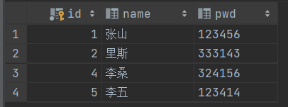

如User定义如下：

```java
public class User {
    private int id;
    private String name;
    private String password;// 数据库表中的字段名字不一样
```

使用下面方式，查询结果的password可能为null。

```xml
<!--parameterType 表示传入的参数类型，还有一个parameterMap传入多个参数-->
<select id="getUserById" resultType="com.liyajie.pojo.User" parameterType="int">
    select * from users where id=#{id}  <!-- #{id}代表传入的参数，{}里为接口中的方法的参数名 -->
</select>
```

因为：

```sql
select * from users where id=#{id}
等价于：
select id,name,pwd from users where id=#{id}
```

* 一种简单的解决方式时可以改为：

```sql
select id,name,pwd as password from users where id=#{id}
```

* 另一种解决：使用resultMap解决，结果集映射, 在UserMapper.xml中增加结果集映射

```xml
<mapper namespace="com.liyajie.dao.UserMapper">

    <!--结果集映射,type为要映射的结果-->
    <resultMap id="UserMap" type="com.liyajie.pojo.User">
        <!--column为数据库中字段， property为实体类中的属性, id 和name其实可以不用，只映射不一样的即可-->
        <result column="id" property="id"/>
        <result column="name" property="name"/>
        <result column="pwd" property="password"/>
    </resultMap>

    <!--resultMap 为上面定义的映射 id-->
    <select id="getUserById" resultMap="UserMap" parameterType="int">
        select * from users where id=#{id} 
    </select>

</mapper>
```


### 6.6 日志

如果一个数据库操作出现异常，我们需要排错，日志时最好的方法。可使用maybaits中的settings设置：


掌握：LOG4J，STDOUT_LOGGING(标准日志输出)

#### 6.6.1 STDOUT_LOGGING

```xml
<?xml version="1.0" encoding="utf8" ?>
<!DOCTYPE configuration
        PUBLIC "-//mybatis.org//DTD Config 3.0//EN"
        "http://mybatis.org/dtd/mybatis-3-config.dtd">

<!--核心配置-->
<configuration>

    <!--引入外部配置文件,要放在第一位置-->
    <properties resource="db.properties"/>

    <settings>
        <!--设置日志-->
        <setting name="logImpl" value="STDOUT_LOGGING"/>
    </settings>

    <environments default="development">
        <environment id="development">
            <transactionManager type="JDBC"/>
            <dataSource type="POOLED">
                <property name="driver" value="${driver}"/>
                <property name="url" value="${url}"/>
                <property name="username" value="${username}"/>
                <property name="password" value="${password}"/>
            </dataSource>
        </environment>
    </environments>
    <!--    注册mapper-->
    <mappers>
        <mapper resource="com/liyajie/dao/UserMapper.xml"></mapper>
    </mappers>
</configuration>
```


#### 6.6.2 LOG4J  

通过使用Log4j，我们可以控制日志信息输送的目的地是[控制台](https://baike.baidu.com/item/控制台/2438626)、文件、[GUI](https://baike.baidu.com/item/GUI)组件，甚至是套接口服务器、[NT](https://baike.baidu.com/item/NT/3443842)的事件记录器、[UNIX](https://baike.baidu.com/item/UNIX) [Syslog](https://baike.baidu.com/item/Syslog)[守护进程](https://baike.baidu.com/item/守护进程/966835)等；

我们也可以控制每一条日志的输出格式；

通过定义每一条日志信息的级别，我们能够更加细致地控制日志的生成过程；

可以通过一个[配置文件](https://baike.baidu.com/item/配置文件/286550)来灵活地进行配置，而不需要修改应用的代码。

1. 导入 jar  包： log4j-1.2.8.jar

   pom.xml中加入：

   ```xml
   <dependency>
       <groupId>log4j</groupId>
       <artifactId>log4j</artifactId>
       <version>1.2.17</version>
   </dependency>
   ```

2. 在resources下建立一个  log4j.properties 文件，内容如下：

   ```properties
   # 将等级为DEBUG的日志信息输出到console和file这俩个目的地，console和file的定义在下面的代码
   log4j.rootLogger=DEBUG,console,file
   
   # 控制台输出的相关设置
   log4j.appender.console=org.apache.log4j.ConsoleAppender
   log4j.appender.console.Target=System.out
   log4j.appender.console.Threshold=DEBUG
   log4j.appender.console.layout=org.apache.log4j.PatternLayout
   log4j.appender.console.layout.ConversionPattern=[%c]-%m%n
   
   # 文件输出相关设置
   log4j.appender.file=org.apache.log4j.RollingFileAppender
   log4j.appender.file.File=./log/jie.log
   log4j.appender.file.Threshold=DEBUG
   log4j.appender.file.MaxFileSize=10mb
   log4j.appender.file.layout=org.apache.log4j.RollingFileAppender
   log4j.appender.file.layout.ConversionPattern=[%p][%d{yy-MM-dd}][%c]%m%n
   
   # 日志输出级别
   log4j.logger.org.mybatis=DEBUG
   log4j.logger.java.sql=DEBUG
   log4j.logger.java.sql.Statement=DEBUG
   log4j.logger.java.sql.ResultSet=DEBUG
   log4j.logger.java.sql.PreparedStatement=DEBUG
   ```

3. 配置settings:

   ```xml
   <settings>
       <!--设置日志-->
       <setting name="logImpl" value="LOG4J"/>
   </settings>
   ```

4. 在要输出日志的类中声明静态loger, 就可以自定义输出的log信息，导入的包 import org.apache.log4j.Logger;

   ```java
   package dao;
   
   import com.liyajie.dao.UserMapper;
   import com.liyajie.pojo.User;
   import com.liyajie.utils.MybatisUtils;
   import org.apache.ibatis.session.SqlSession;
   import org.apache.log4j.Logger;
   import org.junit.Test;
   
   
   public class UserMapperTest {
   
       static Logger logger=Logger.getLogger(UserMapperTest.class);
   
       @Test
       public void testLog4j(){
           logger.info("info: 进入log4j 方法");
           logger.debug("debug: 进入log4j方法");
           logger.error("error: 进入log4j 方法");
       }
   }
   
   控制台和日志文件中就会出现：
   [INFO][21-04-10][dao.UserMapperTest]info: 进入log4j 方法
   [DEBUG][21-04-10][dao.UserMapperTest]debug: 进入log4j方法
   [ERROR][21-04-10][dao.UserMapperTest]error: 进入log4j 方法
   ```


### 6.7 分页

就是为了减少数据的处理量。

#### 6.7.1 Limit分页

语法：

pageSize为记录的个数，startIdx为起始的位置，以0开始。只给定一个参数，则为前 n 个。

```sql
SELECT * FROM users LIMIT startIdx,pageSize;  
```


使用Mybatis 实现分页，核心SQL。

1. 接口

```java
public interface UserMapper {
    // limit 实现分页
    List<User> getUsersByLimit(Map<String,Integer> map);
}
```

2. UserMapper.xml

```xml
<!DOCTYPE mapper
        PUBLIC "-//mybatis.org//DTD Mapper 3.0//EN"
        "http://mybatis.org/dtd/mybatis-3-mapper.dtd">

<!--namespace 等于命名空间，绑定一个对应的Dao/Mapper接口（实现一个接口）-->
<mapper namespace="com.liyajie.dao.UserMapper">

    <select id="getUsersByLimit" resultType="com.liyajie.pojo.User" parameterType="map">
        select * from users limit #{startIdx},#{pageSize}
    </select>
</mapper>
```

3. 测试

```java
 @Test
public  void getUsersByLimit(){
    SqlSession sqlSession= MybatisUtils.getSqlSession();

    UserMapper mapper = sqlSession.getMapper(UserMapper.class);
    HashMap<String ,Integer> map=new HashMap<>();
    map.put("startIdx",1);
    map.put("pageSize",2);
    List<User> userList=mapper.getUsersByLimit(map);

    for(User user:userList){
        System.out.println(user);
    }
    sqlSession.close();
}
```

#### 6.7.2 RowBounds分页

很少使用。

### 6.8 注解开发

也就不需要， UserMapper.xml了。注解开发的核心就是使用了反射。s使用反射可以获得接口的方法，传入的参数类型，以及返回值类型等。使用注解久不用我们指定了。

1. 接口mapper类中加入注解：

   ```java
   public interface UserMapper {
   
       // 获取所有用户
       @Select("select * from users")
       List<User> getUsers();
   
       // 根据id查询用户，方法存在多个参数，参数必须加上@Param()注解
       @Select("select * from users where id=#{id_two}") // 则要从Parma注解中取参数
       User getUserById(@Param("id_two") int id);
       
       // 更新用户信息
       @Update("update users set id=#{id},name=#{name},pwd=#{pwd} where id=#{id}")
       int updateUser(User user);
   }
   ```

2. 在mybatis中核心配置文件中 绑定接口

   ```xml
   <mappers>
       <!--绑定接口-->
       <mapper class="com.liyajie.dao.UserMapper"/>
   </mappers>
   ```

3. 测试

   ```java
   public class UserMapperTest {
   
       @Test
       public void testGetUsers(){
           SqlSession sqlSession=MybatisUtils.getSqlSession();
           UserMapper mapper = sqlSession.getMapper(UserMapper.class);
           List<User> users = mapper.getUsers();
           for(User user:users){
               System.out.println(user);
           }
           System.out.println("============================");
   
           sqlSession.close();
       }
   
       @Test
       public void testGetUsersById(){
           SqlSession sqlSession=MybatisUtils.getSqlSession();
           UserMapper mapper = sqlSession.getMapper(UserMapper.class);
           User user = mapper.getUserById(2);
   
           System.out.println(user);
           System.out.println("============================");
   
           sqlSession.close();
       }
       @Test
       public void testUpdateUser(){
           SqlSession sqlSession=MybatisUtils.getSqlSession();
           UserMapper mapper = sqlSession.getMapper(UserMapper.class);
           mapper.updateUser(new User(1,"王八","342871"));
   
           sqlSession.commit();
           sqlSession.close();
       }
   }
   ```

关于 @Param注解：

* 基本类型的参数或者String类型的参数需要加上，

* 引用类型不需要，

* 如果只有一个基本类型可以不加，

* 我们在SQL中引用的就是我们这里的@Param 中设置的属性名。

**#{} 可以防止SQL注入。**， ${} 不能防止SQL注入。


### 6.9 Lombok使用

。。。。

### 6.10 复杂查询环境

学生和老师的关系，多个学生**关联**一个老师，一个老师**集合**多个学生，学生相对老师就是多对一，老师相对学生就是一对多。

* 环境搭建

  1. 创建表

     ```sql
     CREATE TABLE teacher(
     `id` INT NOT NULL,
     `name` VARCHAR(30) DEFAULT NULL,
     PRIMARY KEY (`id`)
     ) ENGINE=INNODB DEFAULT CHARSET=utf8;
     
     INSERT INTO teacher(`id`,`name`) VALUES (1,"李老师");
     
     CREATE TABLE student(
     	`id` INT NOT NULL,
     	`name` VARCHAR(30) DEFAULT NULL,
     	`tid` INT DEFAULT NULL,
     	PRIMARY KEY (`id`),
     	KEY `fktid` (`tid`),
     	CONSTRAINT `fktid` FOREIGN KEY (`tid`) REFERENCES `teacher` (`id`)
     	) ENGINE=INNODB DEFAULT CHARSET=utf8;
     	`teacher`
     	
     INSERT INTO student(`id`,`name`,`tid`) VALUES (1,"小米",1); 
     INSERT INTO student(`id`,`name`,`tid`) VALUES (2,"小红",1); 
     INSERT INTO student(`id`,`name`,`tid`) VALUES (3,"小张",1); 
     INSERT INTO student(`id`,`name`,`tid`) VALUES (4,"小李",1);
     INSERT INTO student(`id`,`name`,`tid`) VALUES (5,"小王",1);  
     ```

     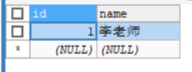

     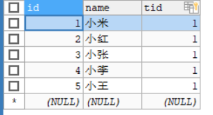


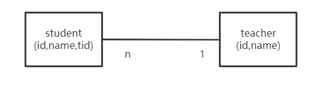


#### 6.10.1 多对一

实体类：

```java
public class Teacher {
    private int id;
    private String name;
}

public class Student {
    private int id;
    private String name;

    // 学生需要关联一个老师
    private Teacher teacher;
}
```

学生中关联一个老师对象，而不是老师tid。

如何获取所有学生的信息，并且获得对应的老师的信息？

* Sql中使用多表查询

  ```sql
  select s.id, s.name,t.id,t.name from student s, teacher t where s.tid=t.id
  ```

  结果：

  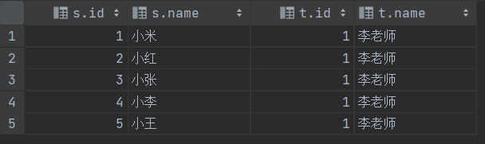

* **Mybatis 方式1： 按照查询嵌套处理**，类似sql中的子查询。

  如何实现：使用结果集映射的 resultMap中的association，

  StudentMapper 接口如下：

  ```java
  public interface StudentMapper {
  
      Teacher getTeacherById(@Param("tid") int id);
      // 查询所有的学生的信息，以及对应的老师的信息
      List<Student> getStudent();
  }
  ```

  SyudentMapper.xml 文件如下：

  思路：
          1. 查询所有学生的信息
                  2. 根据查询出来的学生的tid，寻找对应的老师。

  <!--
       结果集映射中，复杂的属性需要单独处理：
           一个对象使用association,
           一个集合使用collection
           javaType 为对象的类型
           select 为查找对象的函数
  -->

  ```xml
  <?xml version="1.0" encoding="utf8" ?>
  <!DOCTYPE mapper
          PUBLIC "-//mybatis.org//DTD Config 3.0//EN"
          "http://mybatis.org/dtd/mybatis-3-mapper.dtd">
  
  <mapper namespace="com.liyajie.dao.StudentMapper">
      <!--
          思路：
          1. 查询所有学生的信息
          2. 根据查询出来的学生的tid，寻找对应的老师。
      -->
      <resultMap id="StudentTeacher" type="com.liyajie.pojo.Student">
          <result property="id" column="id"/>
          <result property="name" column="name"/>
  
          <!--
              复杂的属性需要单独处理：
                  一个对象使用association,
                  一个集合使用collection
                  javaType 为对象的类型
                  select 为查找对象的函数
          -->
          <association property="teacher" column="tid" javaType="com.liyajie.pojo.Teacher" select="getTeacherById"/>
  
      </resultMap>
  
      <select id="getStudent" resultMap="StudentTeacher">
          select * from student
      </select>
      
      <select id="getTeacherById" resultType="com.liyajie.pojo.Teacher">
          select * from teacher where id=#{tid}
      </select>
  </mapper>
  ```

  测试：

  ```java
   @Test
  public void getStudent() {
      SqlSession sqlSession = MybatisUtils.getSqlSession();
      StudentMapper mapper = sqlSession.getMapper(StudentMapper.class);
      List<Student> students = mapper.getStudent();
      for(Student student:students){
          System.out.println(student);
      }
      sqlSession.close();
  }
  ```

* **Mybatis 方式2：按照结果嵌套查询处理**

  如何实现？直接使用如下sql，使用resultmap 嵌套。

  ```sql
  select s.id sid, s.name sname, t.id tid, t.name tname
  from student s, teacher t
  where s.tid=t.id
  ```

  

  StudentMapper 接口：

  ```java
  public interface StudentMapper {
      // 查询所有的学生的信息，以及对应的老师的信息
      List<Student> getStudent();
  }
  ```

  StudentMapper.xml 

  ```xml
  <?xml version="1.0" encoding="utf8" ?>
  <!DOCTYPE mapper
          PUBLIC "-//mybatis.org//DTD Config 3.0//EN"
          "http://mybatis.org/dtd/mybatis-3-mapper.dtd">
  
  <mapper namespace="com.liyajie.dao.StudentMapper">
      
      <resultMap id="StudentTeacher" type="com.liyajie.pojo.Student">
          <result property="id" column="sid"/>
          <result property="name" column="sname"/>
        	
          <!--嵌套映射-->
          <association property="teacher" javaType="com.liyajie.pojo.Teacher">
              <result property="id" column="tid"/>
              <result property="name" column="tname"/>
          </association>
      </resultMap>
  
      <select id="getStudent">
          select s.id sid,s.name sname,t.id tid,t.name tname
          from student s, teacher t
          where s.tid=t.id
      </select>
  </mapper>
  ```

  

#### 6.10.2 一对多

一个老师拥有多个学生，查询老师和对应的所有学生。

```sql
select t.id tid, t.name tname, s.id sid,s.name sname
from teacher t,student s
where t.id=s.tid and tid=teacher_id
```

* 实体类：

  ```java
  public class Student {
      private int id;
      private String name;
  
      // 学生需要关联一个老师
      private int tid;
  }
  
  public class Teacher {
      private int id;
      private String name;
  
      // 一个老师有多个学生
      private List<Student> studentList;
  }
  ```

* TeacherMapper 接口：

  ```java
  public interface TeacherMapper {
  
      // 获取指定老师下的所有学生
      Teacher getTeacherById(@Param("tid") int id);
  }
  ```

* TeacherMapper.xml

  <!--集合使用 collection 集合中的类中使用 ofType-->

  ```xml
  <resultMap id="TeacherStudent" type="com.liyajie.pojo.Teacher">
      <result property="id" column="tid"/>
      <result property="name" column="tname"/>
  
      <!--集合使用 collection-->
      <collection property="studentList" ofType="com.liyajie.pojo.Student">
          <result property="id" column="sid"/>
          <result property="name" column="sname"/>
          <result property="tid" column="tid"/>
      </collection>
  </resultMap>
  
  <select id="getTeacherById" resultMap="TeacherStudent">
      select t.id tid, t.name tname, s.id sid,s.name sname
      from teacher t,student s
      where t.id=s.tid and tid=#{tid}
  </select>
  ```

* 测试：

  ```java
  @Test
  public void testGetTeacherById(){
      SqlSession sqlSession = MybatisUtils.getSqlSession();
      TeacherMapper mapper = sqlSession.getMapper(TeacherMapper.class);
  
      Teacher teacher = mapper.getTeacherById(1);
  
      System.out.println(teacher);
  
      sqlSession.close();
  }
  ```

另一种方式：

```xml
<resultMap id="TeacherStudent" type="com.liyajie.pojo.Teacher">
    <result property="id" column="id"/>
    <result property="name" column="name"/>

    <!--集合使用 collection， colunmn 为select要使用的id,javaType 为属性真实类型-->
    <collection property="studentList" column="id" javaType="ArrayList" ofType="Student" select="getStudents"/>
</resultMap>

<select id="getStudentsByTid" resultType="com.liyajie.pojo.Student">
    select * from student where tid=#{tid}
</select>

<select id="getTeacherById" resultMap="TeacherStudent">
    select * from teacher where id=#{tid}
</select>
```


javaType：指定实体类中属性的类型

ofType: 指定集合中元素的类型。


### 6.11 动态SQL

根据不同的条件，生成不同的SQL语句。

- if
- choose (when, otherwise)
- trim (where, set)
- foreach

#### 6.11.1 搭建环境

数据库：

```sql
CREATE TABLE blog(
	`id` VARCHAR(50) NOT NULL COMMENT "博客id",
	`title` VARCHAR(100) NOT NULL COMMENT "博客标题",
	`author` VARCHAR(30) NOT NULL COMMENT "博客作者",
	`create_time` DATETIME NOT NULL COMMENT "创建时间",
	`views` INT(30) NOT NULL COMMENT "浏览量"
) ENGINE=INNODB DEFAULT CHARSET=utf8;
```

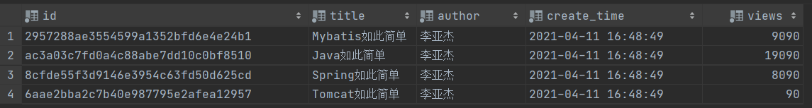

实体类：

```java
public class Blog {
    private String id;
    private String title;
    private String author;
    private Date createTime;  // 要使用java.util.Date
    private int views;
}
```

Id生成工具类：每次生成不同的随机ID：

```java
public class IdUtils {
    public static String getId(){
        return UUID.randomUUID().toString().replaceAll("-","");
    }

    @Test
    public void test(){
        System.out.println(IdUtils.getId());
    }
}
```


#### 6.11.2 if

if 可以根据传入的参数情况，对sql进行动态拼接，如下查询

接口：

```java
public interface BlogMapper {

    List<Blog> queryBlogIf(Map<String,Object> map);
}
```

xml配置: 如果传入title 则拼接，如果传入author 则拼接

```xml
<!--sql 语句拼接-->
<select id="queryBlogIf" parameterType="map" resultType="com.liyajie.pojo.Blog">
    select * from blog
    where 1=1
    <if test="title!=null">
        and title=#{title}
    </if>
    <if test="author!=null">
        and author=#{author}
    </if>

</select>
```

不使用 where 1=1 可以使用where标签解决 当where 后为空时，可以自动去掉where 和 and：

```xml
<select id="queryBlogIf" parameterType="map" resultType="com.liyajie.pojo.Blog">
    select * from blog
    <where>
        <if test="title!=null">
            title=#{title}
        </if>
        <if test="author!=null">
            and author=#{author}
        </if>
    </where>
</select>
```

测试：

```java
@Test
public void queryBlogIf() {
    SqlSession sqlSession = MybatisUtils.getSqlSession();
    BlogMapper mapper = sqlSession.getMapper(BlogMapper.class);

    HashMap<String,Object> map=new HashMap<>();
    map.put("author","李亚杰");
    List<Blog> blogs = mapper.queryBlogIf(map);
    for(Blog blog:blogs){
        System.out.println(blog);
    }
    System.out.println("=========================================");
    map.put("title","Java如此简单");
    blogs = mapper.queryBlogIf(map);
    for(Blog blog:blogs){
        System.out.println(blog);
    }
    sqlSession.close();
}
```

结果：

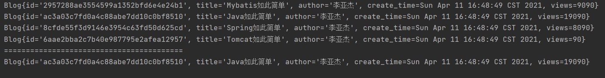


#### 6.11.3  choose (when,otherwise)

MyBatis 提供了 choose 元素，它有点像 Java 中的 switch 语句。

choose 就是直走一条路径。其他都不走，则走 otherwise

传入了 “title” 就按 “title” 查找，传入了 “author” 就按 “author” 查找的情形。若两者都没有传入，就返回标记为 featured 的 BLOG

```xml
<select id="findBlogChoose" resultType="com.liyajie.pojo.Blog" parameterType="map">
    select * from blog
    <where>
        <choose>
            <when test="title!=null">
                title=#{title}
            </when>
            <when test="author!=null">
                author=#{author}
            </when>
            <otherwise>
                views>9000
            </otherwise>
        </choose>
    </where>
</select>
```

测试：

```java
@Test
public void findBlogChoose() {
    SqlSession sqlSession = MybatisUtils.getSqlSession();
    BlogMapper mapper = sqlSession.getMapper(BlogMapper.class);

    HashMap<String,Object> map=new HashMap<>();
    List<Blog> blogs = mapper.findBlogChoose(map);
    for(Blog blog:blogs){
        System.out.println(blog);
    }
    System.out.println("=========================================");

    map.put("author","李亚杰");
    blogs = mapper.findBlogChoose(map);
    for(Blog blog:blogs){
        System.out.println(blog);
    }
    System.out.println("=========================================");
	// 最后一条满足，则走最后一个
    map.put("title","Java如此简单");
    blogs = mapper.findBlogChoose(map);
    for(Blog blog:blogs){
        System.out.println(blog);
    }

    sqlSession.close();
}
```

结果：

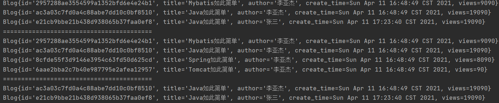


#### 6.11.4 trim (where ,set)

用于动态更新语句的类似解决方案叫做 *set*。*set* 元素可以用于动态包含需要更新的列，忽略其它不更新的列。比如：

```sql
update Author set username=#{username}, password=${password};
```

set 可以使用 <set> 标签，久可以像where一样的作用。

```xml
<update id="updateAuthorIfNecessary">
  update Author
    <set>
      <if test="username != null">username=#{username},</if>
      <if test="password != null">password=#{password},</if>
      <if test="email != null">email=#{email},</if>
      <if test="bio != null">bio=#{bio}</if>
    </set>
  where id=#{id}
</update>
```

这个例子中，*set* 元素会动态地在行首插入 SET 关键字，并会删掉额外的逗号（这些逗号是在使用条件语句给列赋值时引入的）。


可以通过自定义 trim 元素来定制 *where* 元素的功能，<where> 标签等价于：*prefixOverrides* 属性会忽略通过管道符分隔的文本序列（注意此例中的空格是必要的）。上述例子会移除所有 *prefixOverrides* 属性中指定的内容，并且插入 *prefix* 属性中指定的内容。

```
<trim prefix="WHERE" prefixOverrides="AND |OR ">
  ...
</trim>
```

<set> 标签等价于： 覆盖了后缀值设置，并且自定义了前缀值。

```
<trim prefix="SET" suffixOverrides=",">
  ...
</trim>
```


#### 6.11.5 SQL片段

有的时候，我们可能想将一些sql片段复用。可以引入 <sql>标签

如，原本如下：

```xml
<select id="queryBlogIf" parameterType="map" resultType="com.liyajie.pojo.Blog">
    select * from blog
    <where>
        <if test="title!=null">
            title=#{title}
        </if>
        <if test="author!=null">
            and author=#{author}
        </if>
        <if test="views!=null">
            and views>#{views}
        </if>
    </where>
</select>
```

更改如下：使用<inculde> 引用sql 片段

```xml
<sql id="if-title-author">
    <if test="title!=null">
        title=#{title}
    </if>
    <if test="author!=null">
        and author=#{author}
    </if>
</sql>
<!--sql 语句拼接-->
<select id="queryBlogIf" parameterType="map" resultType="com.liyajie.pojo.Blog">
    select * from blog
    <where>
        <include refid="if-title-author"></include>
        <if test="views!=null">
            and views>#{views}
        </if>
    </where>
</select>
```

注意事项：最好基于单表来定义sql片段，提高共用率；片段里不要存在where标签，只要if 判断就好了


#### 6.11.6 Foreach

动态 SQL 的另一个常见使用场景是对集合进行遍历（尤其是在构建 IN 条件语句的时候）

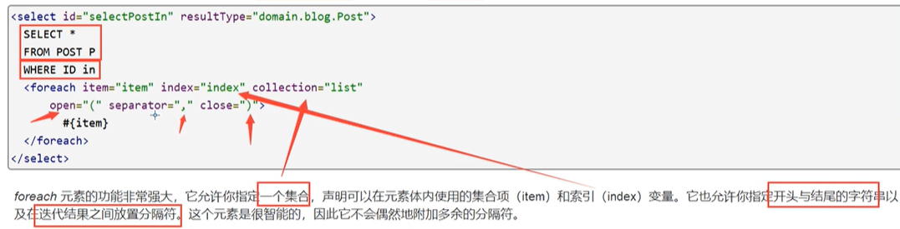

foreach 中的 item 会被拼接到 #{item}。

假设集合 list中元素为 {1，2，3，4，5} 则上式的拼接结果为 （1，2，3，4，5）

如果foreach 为：

```
<foreach item="item" index="index" collection="list"
	open="[" separator="or" close="]">
	#{item}
</foreach>
```

则拼接结果为：[1 or 2 or 3 or 4 or 5]

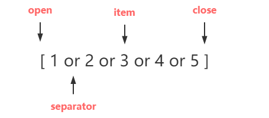

加入如下 sql:

```sql
select * from users where 1=1 and (id=1 or id=2 or id=3)
```

对应foreach:

```xml
select * from users 
where 1=1 and
<foreach item="item" collection="list_ids"       // 没有用于index 可以不写
         open="(" separator="or" close=")">
    id=#{item}
</foreach>
```

例子：查询 id列表中的所有信息

1. 接口：

   ```java
   public interface BlogMapper {
   
       List<Blog> getBlogByList(Map<String,Object> map);
   }
   ```

2. xml 

   ```xml
   <select id="getBlogByList" parameterType="map" resultType="com.liyajie.pojo.Blog">
       select * from blog
       <where>
           <foreach item="id" collection="listIds"
                    open="(" separator="or" close=")">
               id=#{id}
           </foreach>
       </where>
   </select>
   ```

3. 测试

   ```java
   @Test
   public void getBlogByList() {
       SqlSession sqlSession = MybatisUtils.getSqlSession();
       BlogMapper mapper = sqlSession.getMapper(BlogMapper.class);
   
       ArrayList<Integer> ids = new ArrayList<>();
       ids.add(1);
       ids.add(2);
       ids.add(3);
       HashMap<String,Object> map=new HashMap<>();
       map.put("listIds",ids);
   
       List<Blog> blogs = mapper.getBlogByList(map);
       for(Blog blog:blogs){
           System.out.println(blog);
       }
   
       sqlSession.close();
   }
   ```

   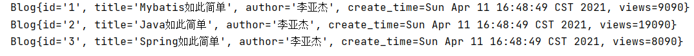

### 6.12 缓存

连接数据库耗资源，一次查询的结果给他暂存在一个可以直接取到的地方！-----> 内存：  缓存。

我们再次查询相同的数据时，就直接走缓存，不需再访问数据库了。

可以缓解并发问题。

* 优点：减少和数据库交互的次数，减少时间的开销，提高系统效率。

* 什么样的数据能使用缓存：经常查询，不经常写，改变的数据库。

* 什么样不要使用缓存：不经常查询，经常写的数据。

* Mybatis 中默认定义了两级缓存：**一级缓存和二级缓存**。

  默认情况下，只有一级缓存开启（SqlSession 级别的缓存，也称本地缓存）

  二级缓存需要手动开启配置，它是基于namespace 级别的缓存，一个mapper

  为了提高扩展性，mybatis 定义了缓存接口 Cache， 我们可以通过实现Cache接口来定义二级缓存。

#### 6.12.1 一级缓存

一级缓存也叫本地缓存：

* 与数据库同一次会话期间查询到的数据会被放在本地缓存中。（获取sqlsession 和sqlsesson.close()之间的查询）
* 以后如果需要获取相同的数据，直接从缓存中拿，没必要再去数据库中取。

```java
@Test
public void getUserById() {
    SqlSession sqlSession = MybatisUtils.getSqlSession();
    UserMapper mapper = sqlSession.getMapper(UserMapper.class);

    User user = mapper.getUserById(2);
    System.out.println(user);

    user = mapper.getUserById(2);  // 会从缓存中取
    System.out.println(user);

    sqlSession.close();
}
```

缓存失效：

* 缓存会不定时刷新，缓存满则清除一些，
* insert,delete,update 操作会刷新缓存。
* 手动清除缓存  `sqlSession.clearCache();`

```java
 @Test
    public void getUserById() {
        SqlSession sqlSession = MybatisUtils.getSqlSession();
        UserMapper mapper = sqlSession.getMapper(UserMapper.class);

        User user = mapper.getUserById(2);
        System.out.println(user);

        mapper.UpdateUser(new User(1,"小米","318992"));  // 修改表 会刷新缓存，不管有没有事务提交
		//  sqlSession.clearCache(); 手动清理缓存
        user = mapper.getUserById(2);
        System.out.println(user);

        sqlSession.close();
    }
```

一级缓存是默认开启的，也关闭不掉。


#### 6.12.2 二级缓存

要启用全局的二级缓存，只需要在你的 SQL 映射文件中添加一行：

```
<cache/>
```

基本上就是这样。这个简单语句的效果如下:

- 映射语句文件中的所有 select 语句的结果将会被缓存。
- 映射语句文件中的所有 insert、update 和 delete 语句会刷新缓存。
- 缓存会使用**最近最少使用算法**（LRU, Least Recently Used）算法来清除不需要的缓存。
- 缓存不会定时进行刷新（也就是说，没有刷新间隔）。
- 缓存会保存列表或对象（无论查询方法返回哪种）的 1024 个引用。
- 缓存会被视为读/写缓存，这意味着获取到的对象并不是共享的，可以安全地被调用者修改，而不干扰其他调用者或线程所做的潜在修改。

**提示** 缓存只作用于 cache 标签所在的映射文件中的语句。如果你混合使用 Java API 和 XML 映射文件，在共用接口中的语句将不会被默认缓存。你需要使用 @CacheNamespaceRef 注解指定缓存作用域。

这些属性可以通过 cache 元素的属性来修改。比如：

```
<cache
  eviction="FIFO"
  flushInterval="60000"
  size="512"
  readOnly="true"/>
```

这个更高级的配置创建了一个 FIFO 缓存，每隔 60 秒刷新，最多可以存储结果对象或列表的 512 个引用，而且返回的对象被认为是只读的，因此对它们进行修改可能会在不同线程中的调用者产生冲突。

可用的清除策略有：

- `LRU` – **最近最少使用**：移除最长时间不被使用的对象。
- `FIFO` – **先进先出**：按对象进入缓存的顺序来移除它们。
- `SOFT` – 软引用：基于垃圾回收器状态和软引用规则移除对象。
- `WEAK` – 弱引用：更积极地基于垃圾收集器状态和弱引用规则移除对象。

**默认的清除策略是 LRU。**

flushInterval（刷新间隔）属性可以被设置为任意的正整数，设置的值应该是一个以毫秒为单位的合理时间量。 **默认情况是不设置，也就是没有刷新间隔，缓存仅仅会在调用语句时刷新。**

size（引用数目）属性可以被设置为任意正整数，要注意欲缓存对象的大小和运行环境中可用的内存资源。默认值是 1024。

readOnly（只读）属性可以被设置为 true 或 false。**只读的缓存会给所有调用者返回缓存对象的相同实例**。 **因此这些对象不能被修改**。这就提供了可观的性能提升。**而可读写的缓存会（通过序列化）返回缓存对象的拷贝**。 速度上会慢一些，但是更安全，因此默认值是 false。

**提示** 二级缓存是事务性的。这意味着，当 SqlSession 完成并提交时，或是完成并回滚，但没有执行 flushCache=true 的 insert/delete/update 语句时，缓存会获得更新。

* 步骤：

  1. 开启全局缓存，核心配置文件中 mybatis-config.xml 中增加配置，并再mapper.xml中开启 <cache/>

     ```
     <settings>
         <setting name="cacheEnabled" value="true"/>
     </settings>
     ```

  2. 实体类要可以序列化。

     ```java
     public class User  implements Serializable {  // 实现序列化接口即可
         private int id;
         private String name;
         private String pwd;
     }
     ```

  3. 测试：

     ```java
     @Test
     public void testGetUserByIdTwo() {
         SqlSession sqlSession1 = MybatisUtils.getSqlSession();
         SqlSession sqlSession2 = MybatisUtils.getSqlSession();
     
         UserMapper mapper = sqlSession1.getMapper(UserMapper.class);
         User user = mapper.getUserById(2);
         System.out.println(user);
     
         sqlSession1.close();
     
     
         mapper = sqlSession2.getMapper(UserMapper.class);
         user = mapper.getUserById(2);
         System.out.println(user);
     
         sqlSession2.close();
     }
     ```

     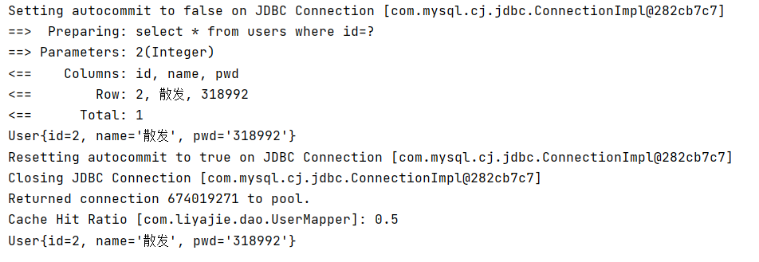

  第二次查询，Cache Hit 了，就从缓存中读取。

  **二级缓存工作机制**：

  * 一个会话查询一条数据，这个数据就会被放在当前会话的一级缓存中
  * 如果当前会话关闭了，这个会话的一级缓存就没了，**一级缓存的数据被保存到二级缓存中**。
  * 新的会话查询信息，就可以从二级缓存中获取数据
  * 不同的mapper查出的数据会放在自己对应的缓存中。
  * **只有当会话提交或者关闭时，才会将一级缓存提交到二级缓存。**

#### 6.12.3 缓存原理

1. 查询时先看二级缓存中有没有
2. 没有则再看一级缓存中有没有
3. 还没有则最后查询数据库

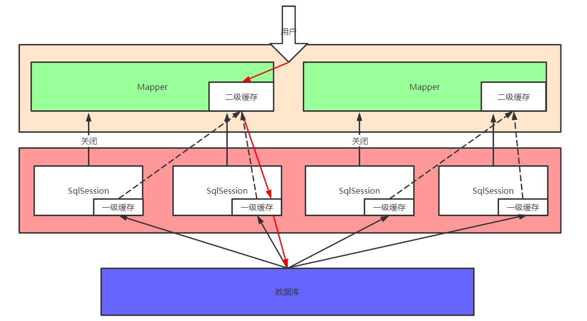

#### 6.12.4 自定义缓存: Ehcache

是一种广泛使用的开源java 分布式缓存，主要面向通用缓存。

使用：

1. 导 jar 包

2. 配置 mybatis核心配置文件

   ```xml
   <cache  type="org.mybatis.caches.ehcache.EbcacheCache"/>
   ```

不怎么使用了。。。。

工作中用Redis 数据库做缓存。


## **7 多线程编程与安全**

**Thread，Runable, Callable(线程可带返回值)**

**三种创建多线程的方式：**

```java
// 方法1：直接继承Thread,重写run
public class TestThread extends Thread{
    @Override
    public void run() {
        for(int i=0;i<5;i++){
            System.out.println(Thread.currentThread().getName()+" run "+i);
        }
    }
    public static void main(String[] args) {
        TestThread thread1=new TestThread();
        TestThread thread2=new TestThread();
        thread1.start();
        thread2.start();
    }
}
// 方法2：实现Runable接口
public class MyRunable implements Runnable{
    @Override
    public void run() {
        for(int i=0;i<5;i++){
            System.out.println(Thread.currentThread().getName()+" run "+i);
        }
    }
    public static void main(String[] args) {
//        Thread thread1=new Thread(new MyRunable());
//        Thread thread2=new Thread(new MyRunable());
//        thread1.start();
//        thread2.start();
// 线程池方式启动线程
//        ExecutorService threadPool= Executors.newSingleThreadExecutor(); // 单一线程
//        ExecutorService threadPool= Executors.newFixedThreadPool(2);    // 固定线程数的线程池
        ExecutorService threadPool= Executors.newCachedThreadPool();     // 动态线程数的线程池
        threadPool.execute(new MyRunable());
        threadPool.execute(new MyRunable());
        threadPool.execute(new MyRunable());
        threadPool.shutdown();   // 线程池停止
    }
}
// 方法3：实现Callable 接口，线程带有返回值
public class MyCallable implements Callable<String> {
    @Override
    public String call() throws Exception {
        Thread.sleep(5000);
        return "3.14159";
    }
    public static void main(String[] args) {
        FutureTask futureTask=new FutureTask(new MyCallable());
        Thread thread1=new Thread(futureTask);
        thread1.start();
        try{
            String result=(String)futureTask.get();
            System.out.println(result);
        } catch (InterruptedException e){
            e.printStackTrace();
        } catch (ExecutionException e){
            e.printStackTrace();
        }
    }
}
```


**syncnronized: 用于原子操作，一个操作同一时间只允许一个线程执行。**

```java
// 300个人拧200个螺丝
public class MyRun implements Runnable{
    private int luosi=200;
    @Override
    public synchronized void run() {  // 一次只允许一个线程执行
        for(int i=1;i<=100;i++){
            if(luosi>0){
                try {
                    Thread.sleep(50);
                } catch (InterruptedException e){
                    e.printStackTrace();
                }
                luosi-=1;
                System.out.println(Thread.currentThread().getName()+"拧了一个螺丝，"+luosi+"还没拧");
            }
        }
    }
    public static void main(String[] args) {
        MyRun myRun=new MyRun();
        Thread thread1=new Thread(myRun);
        Thread thread2=new Thread(myRun);
        Thread thread3=new Thread(myRun);

        thread1.start();
        thread2.start();
        thread3.start();
    }
}
```

**CountDownLatch 工具类，用于线程同步**

**Semaphore 工具类，用于加锁**

```java
// 统计学生考试用时
public class StudentExam implements Runnable{
    private CountDownLatch count;
    private Semaphore desks; 
    public StudentExam(CountDownLatch studentCount, Semaphore desks) {
        count = studentCount;
        this.desks=desks;
    }

    @Override
    public void run() {
        try {
            desks.acquire(); // 请求一个课桌
        } catch (InterruptedException e) {
            e.printStackTrace();
        }
        System.out.println(Thread.currentThread().getName()+" 开始考试。");
        try{
            Thread.sleep((int)(Math.random()*5000)+2000);
        } catch (InterruptedException e){
            e.printStackTrace();
        }
        System.out.println(Thread.currentThread().getName()+" 考试完成。");
        count.countDown(); // 学生数减1
        desks.release();// 释放一个课桌
    }
}
public class TeacherExam implements Runnable{
    @Override
    public void run() {
        System.out.println("考试开始：");
        CountDownLatch studentCount=new CountDownLatch(3); // 学生数
        Semaphore desks=new Semaphore(2); // 课桌数
        Instant start=Instant.now();
        StudentExam student1=new StudentExam(studentCount,desks);
        StudentExam student2=new StudentExam(studentCount,desks);
        StudentExam student3=new StudentExam(studentCount,desks);

        ExecutorService threadPool= Executors.newFixedThreadPool(3);
        threadPool.execute(student1);
        threadPool.execute(student2);
        threadPool.execute(student3);

        try{
            studentCount.await(); // 等待学生数为0
        } catch (InterruptedException e){
            e.printStackTrace();
        }

        Instant end=Instant.now();
        threadPool.shutdown();
        System.out.println("考试结束, 考试时间："+ Duration.between(start,end).toMillis()+"ms");
    }
    public static void main(String[] args) {
        TeacherExam teacherExam=new TeacherExam();
        Thread thread=new Thread(teacherExam);
        thread.start();
    }
}
```


## **8 常用类库和API**

### **Apache Commons Lang3 包常用API**

**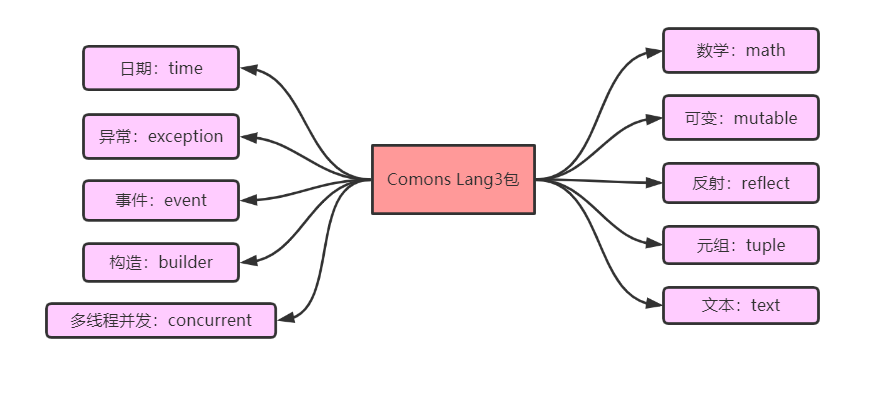**


### **Apache Commons Collections 包常用API**

**// org.apache.commons.collections.CollectionUtils：**

```java
Collection c1=new ArrayList();
c1.add(...);
Collection c2=new ArrayList();
c2.add(...);
// 求两个集合的并集
Collection c3=CollectionUtils.union(c1,c2);

// 求两个集合的交集
Collection c3=CollectionUtils.intersection(c1,c2);

// 求两个集合的差集
Collection c3=CollectionUtils.disjunction(c1,c2);
```

**// org.apache.commons.collections.MapUtils：**

```java
// 判断map是否为空
boolean empty=MapUtils.isEmpty(map);
boolean notEmpty=MapUtils.isNotEmpty(map);

// 将二维数组放入map中
String[][] user={{"names","Zhangfun"},{"sexes","female"}};
Map map1=MapUtils.putAll(map,user);

// 获取Map中指定的key的value
String name=MapUtils.getString(map,"name");
int money=MapUtils.getInteger(map,"money");
int money=MapUtils.getInteger(map,"money",23);
```

### **Apache Commons IO 包常用API**

**// org.apache.commons.io.FileUtils：**

```java
// 复制文件
FileUtils.copyFile(new File("c:\\k.csv"), new File("d:\\k.csv"));

// 写文件
FileUtils.writeStringToFile(new File("c:\\b.txt"), "Hello Wrold");

//读文件
String s=FileUtils.readFileToString(new File("c:\\b.txt"));
```

**// org.apache.commons.io.IOUtils：**

```java
InputStream is=IOUtils.toInputStream("This is a String", "utf-8");

try(InputStream is=IOUtils.toInputStream("This is a String", "utf-8");
   OutputStream os =new FileOutputStream("text.txt")){
    int bytes=IOUtils.copy(is,os);
    System.out.println("File Written with "+ bytes+"bytes");
}
```

**//   org.apache.commons.io.FilenameUtils：**

```java
// 获取文件名
String name=FilenameUtils.getName("d:\\ABC\\a.txt");
// 判断文件名的后缀
boolean b=FilenameUtils.isExtension("Demo.java", "java");
```

### **Jackson组件解析JSON字符串**

**Jackson核心由三个模块组成：**

1. **jackson-core: 核心包，提供基于“流模式”解析的相关API，它包含 JsonPaser 和 JsonGenerator 。Jackson内部实现正是通过高性能的流模式API的JsonPaser 和 JsonGenerator 来解析和生成JSON。**
2. **jackson-annotations, 注解包，提供标准注解功能**
3. **jackson-databind：数据绑定包，提供基于“对象绑定”解析的相关API（ObjectMapper），和“树模型”解析的相关API（JsonNode），基于对象绑定解析的API和树模型解析API依赖基于流模式解析的API。**

```java
// 从json数组，转化为列表对象
String jsonArray="[{\"brand\": \" ford \"},{\"brand\": \" Fiat \"}]";
ObjectMapper objectMapper=new ObjectMapper();
List<Car> cars=objectMapper.readValue(jasonArray, new TypeReference<List<Car>>(){});

// 将Object转化为JsonNode
ObjectMapper objectMapper=new ObjectMapper();
Car car=new Car();
car.brand="Cadillac";
car.doors=4;
JsonNode carJasonNode=objectMapper.valueTotree(car);
```

## **9 初识JVM**

**java虚拟机有自己完善的硬件架构，如处理器、堆栈、寄存器等，还具有相应的指令系统。java虚拟机屏蔽了与具体操作系统平台相关的信息，使得java程序只需生成在java虚拟机上运行的目标代码(字节码) ，就可以在多种平台上不加修改的运行。**

**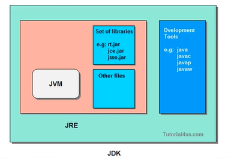**

**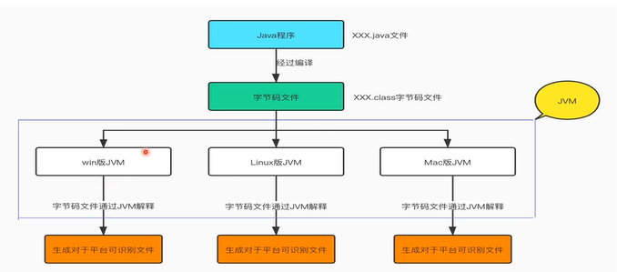**

### **JVM 内存模型以及相关参数**

**JVM内存共分为虚拟机栈、堆、方法区、程序计数器、本地方法栈五个部分。主要介绍栈、堆和元空间。**

**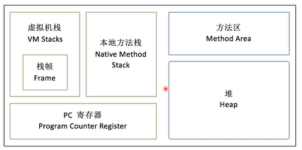**

* **本地方法栈**

  **可以调用第三方语言实现得函数库，主要为这种场景使用。**

* **虚拟机栈**

  **每个线程都有一个私有的栈，随着线程的创建而创建，栈里面存着的是一种加 “栈帧” 的东西，每个方法会创建一个栈帧，栈帧中存放了局部变量表(基本数据类型和对象引用)、操作数栈、方法出口等信息。栈的大小可以固定也可以动态扩展。当栈调用深度大于JVM所允许的范围，会抛出StackOverFlowError错误，不过这个深度范围不是一个恒定值，我们通过下面这段程序可以测试以下这个结果。**

  ```java
  public class StackErrorMock{
      private static int index=1;
      public void call(){
          index++;
          call();
      }
      public static void main(String[] args){
          StackErrorMock mock=new StackErrorMock();
          try{
              mock.call();
          } catch(Throwable e){
              System.out.println("Stack deep: "+index);
              e.printStackTrace();
          }
      }
  }
  ```

* **堆**

  **堆内存是JVM所有线程共享的部分，在虚拟机启动时就已经创建。所有的对象和数组都在堆上进行分配。着部分空间可以通过GC进行回收。当申请不到空间时会抛出OutOfMemorryError。下面模拟一个堆内存溢出：**

  ```java
  public class HeapDomMock{
      public static void main(String[] args){
          List<byte[]> list=new ArrayList<>();
          int i=0;
         	boolean flag=true;
          while(flag){
              try{
                  i++;
                  list.add(new byte[1024*1024]);  
              } catch(Throwable e){
                  e.printStackTrace();
                  flag=false;
                  System.out.println("count="+i);
              }
          }
      }
  }
  ```

* **方法区**

  **主要存放类结构，类成员定义，static静态成员等。里面有个运行常量池（Runtime Constant Pool），比如字符串、int(-128~127)范围的值等。**

* **Metaspace 元空间**

  **元空间的本质是对JVM规范中的方法区的实现。元空间并虚拟机中，而是使用了本地内存。因此默认情况下，元空间的大小仅受本地内存限制，但可以通过以下参数来指定元空间大小。**

  ```java
  public class PermGenMock{
      public static void main(String[] args){
          URL url=null;
          List<ClassLoader> list=new ArrayList<>();
          try{
              utl=new File("D:\\mycode\nnm\target\\calsses").toURI().toURL();
              URL[] urls={url};
              while(true){
                  ClassLoader classLoader=new URLClassLoader(urls);
                  list.add(classLoader);
                  classLoader.loadClass("com.mm");
              }
          } catch( Exception e){
              e.printStackTrack();
          }
      }
  }
  // 执行，指定元空间
  java -XX:MetaspaceSize=8m -XX:MaxMetaspaceSize=8m PermGenMock
  ```
  
* **常用到的配置参数**

  **-XX:MetaspaceSize, 初始化元空间大小，达到该值就会触发垃圾收集器进行类型卸载，同时GC会对该值进行调整：如果释放大量的空间，就适当的降低该值，如果释放了很少的空间，那么在不超过 MaxMetaspaceSizes时,适当提高该值。**

  **-XX:MaxMetaspaceSize, 最大元空间大小，默认时没有限制。**

  **-XX:MinMetaspaceFreeRatio   在GC后，最小的Metasoace剩余空间容量的百分比，减少为分配空间所导致的垃圾收集。**

  **-XX:MaxMetaspaceFreeRatio  在GC之后，最大的Metaspace剩余空间容量的百分比，减少为释放空间所导致的垃圾收集。**

  **-Xms  为 jvm 启动时分配堆内存，比如 -Xms200m， 表示分配200M**

  **-Xmx  为 jvm 允许过程中分配的最大堆内存，比如 -Xms500m，表示 jvm进程最多占用500M内存**

  **-Xss   为 jvm 启动的每个线程分配内存大小。**

## **10 JVM内存初探**

### **10.1 JVM内存管理模型**

**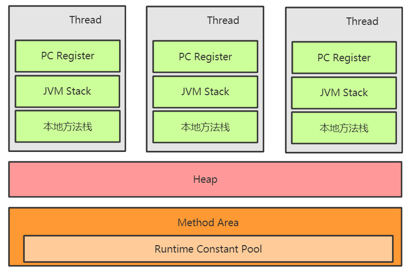**

**Method Area ，虚拟机规范只是说必须有，但是具体怎么实现（比如：是否需要垃圾回收），交给具体的JVN实现去决定，逻辑上讲，是可以视为Heap的一部分。**

* **JVM内存结构：堆内存和堆外内存**

  * **广义的堆外内存：在分代算法下，新生代，老生代和持久代（Metaspace）是连续的虚拟地址，-Xmx和-XX：MaxPermSize的总和，那么剩下的都可以认为是堆外内存了，这些包括jvm本身在运行过程中分配的内存，本地方法调用里分配的内存，DirectByteBuffer分配的内存等。**
  * **侠义的堆外内存：主要是指java.nio.DirectByteBuffer在创建的时候分配内存，XX：maxDirectMemorySize限制上限。**

* **JVM内存结构：Class和对象在内存中的布局**

  ```java
  public class AppMain{
      public static void main(String[] args){
          Sample test=new Sample();
      }
  }
  ```

  **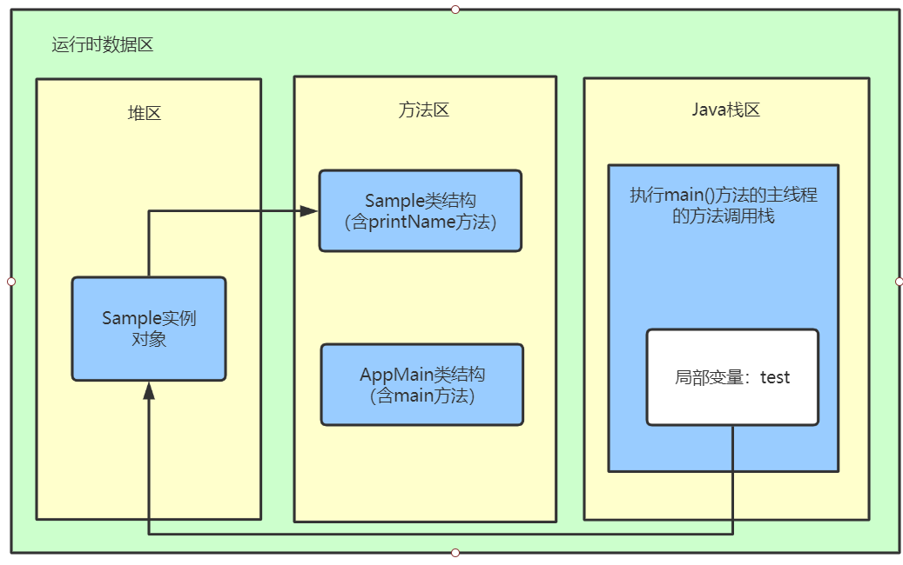**

* **哪些内存需要回收？**
  * **无需GC：原因：编译期间即可知道内存占用大小，内存的分配和回收都具有确定性。特点：随线程而生，随线程而灭。范围：程序计数器、虚拟机栈、本地方法栈。**
  * **需要GC：原因：运行期间动态创建，内存的分配和回收具有不确定性。范围：虚拟机堆、静态区，常量池。**

### **10.2 Class和对象内存分布**

**JVM使用通过GC ROOTS可达的对象为在使用的，不可回收，不可达则可以回收。**

**可以作为GC ROOTS的：**

* **虚拟机栈（栈帧中的本地变量表）中引用的对象**
* **方法区中的类静态属性引用的对象**
* **方法区中常量引用的对象**
* **本地方法栈中JNI中引用的对象。**

****


#### **10.2.1 GC算法&回收器**

**1) mark-sweep 标记清除法**

**就是在分配了大量对象，并且其中只有一小部分存活的情况下，所消耗的时间会大大超过必要的值，这是因为在清除阶段还需要对大量死亡对象进行扫描。会出现大量碎片。**

**2）mark-copy 标记复制法**

**会将从根开始被引用的对象复制到另外的空间中，对非存活的对象直接清除，在将复制的对象所能够引用的对象递归的方式不断复制下去。会浪费空间。**

**3）mark-compact 标记整理法**

**4）generation-collect 分代收集法**

**经过大量实际分析，发现内存中的对象，大致可以分为两类：有些生命周期短，比如一些局部变量、临时变量，而令一些会存活很久。**

**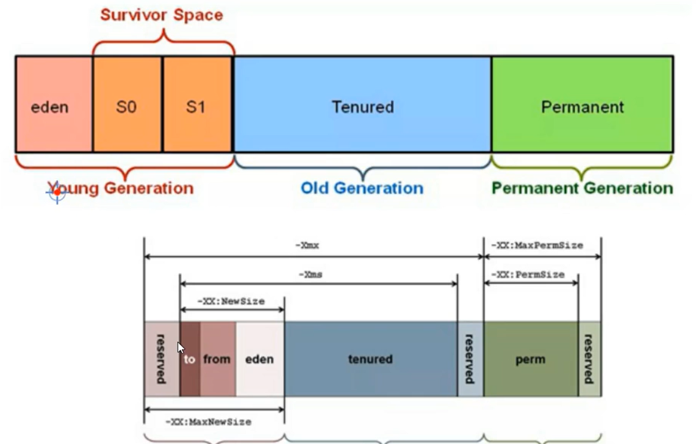**

**工具：**

* **GCViewer 分析gc日志，统计**
* **MAT：分析dump的文件（堆内存分析）**


