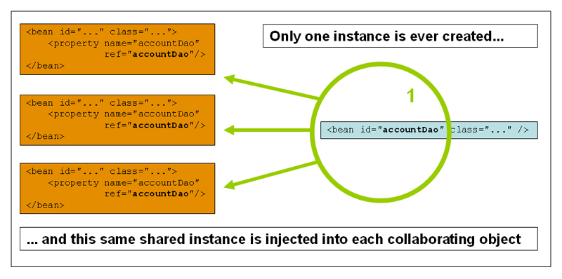

# Java

## 0 注解与反射

### 0.1 注解

* 注解 Annotation是从JDK5.0开始引用的新技术，它的作用是：
  * 不是程序本身，可以对程序作出解释（这一点和注释没有区别）
  * **可以被其他程序（比如编译器）读取**

* Annotation格式：

  以 “@注解名” 在代码中存在，还可以添加参数。

* 注解可以在哪里：

  可以在package、class、method和field上。

#### 0.1.1 内置注解

* @Override   ：定义在 java.lang.Override,此注解只是修饰方法，表明一个方法打算重写超类中的另一个方法
* @Deprecated：定义在Java.lang.Deprecated  ,用于修饰方法、属性、类，表示不鼓励程序员使用，通常是因为它很危险或存在更好的选择，或者将要被丢弃
* @SuppressWarnings：定义在java.lang.SuppressWarnings，用来抑制编译时的警告信息，需要添加合适的参数来使用
  * @SuppressWarnings("all")
  * @SuppressWarnings("unchecked")
  * @SuppressWarnings(value={"unchecked","deprecation"})
  * .........................

#### 0.1.2 元注解

元注解的作用就是负责注解其他的注解，java定义了4个标准的meta-annotation类型，他们被用来提供对其他annotation类型作说明。

这些注解在java.lang.annotation中。

* @Target: 用于描述注解的使用范围（即被描述的注解可以用在什么地方）
* @Retention：表示需要在什么级别该注解有效，用于描述注解的生命周期（source<class<runtime）
* @Document：说明该注解将被包含在javadoc中
* @Inherited：说明子类可以继承分类中的注解

```java
// 定义一个注解
@Target(value = ElementType.METHOD) // 定义注解只能在方法上使用
public @interface MyAnnotation{

}

// 也可定义注解只能在方法和类上使用
@Target(value = {ElementType.METHOD,ElementType.TYPE})
public @interface MyAnnotation{

}

@Target(value = {ElementType.METHOD,ElementType.TYPE})
@Retention(value = RetentionPolicy.RUNTIME)
@interface MyAnnotation{

}
```

#### 0.1.3 自定义注解

使用 @interface 自定义注解，自动继承了java.lang.annotation.Annotation接口。

* @interface 用来声明一个注解，格式: public @interface 注解名 {定义内容}
* 其中的每一个方法实际上是声明一个参数配置
* 方法的名称就是参数的名称
* 返回值类型就是参数的类型（返回值只能是基本类型，Class,String，enum）
* 可以通过default来声明参数的默认值
* 如果只有一个参数成员，一般参数名为value
* 注解元素必须要有值，我们定义注解元素时，经常使用空字符串，0作为默认值。

```java
@Target({ElementType.METHOD,ElementType.TYPE})
@Retention(RetentionPolicy.RUNTIME)
public @interface UserAnnotation {

    // 注解的参数，参数类型+参数名(),并不是一个方法,没默认值使用时一定要赋值
    String name() default "";

    int age() default 0;

    int id() default -1;  // 如果默认值为-1，代表不存在

    String[] schools() default {"A","B"};
}

class  Test02{
    @UserAnnotation(name="liyajie",age = 1,schools = {"USTC","NAU"})
    public void test(){
    }
}
```


### 0.2 反射

反射使java变成了动态语言。

#### 0.2.1 java反射机制概述


#### 0.2.2 理解Class类并获取Class实例


#### 0.2.3 类的加载与ClassLoader


#### 0.2.4 创建允许时类的对象


#### 0.2.5 获取允许时类的完整结构


#### 0.2.6 调用运行时类的指定结构


## 1 Java中常用的容器与集合的使用

Java集合框架图：


### 1.1 集合的概念

集合：对象的容器，定义了对对象进行操作的方法，类似数组的功能。

和数组的区别：

* 数组长度固定，集合长度不固定。
* 数组可以存储基本类型和引用类型，集合只能存储引用类型（存储基本类型要使用装箱操作）。

位置：java.util.*


### 1.2 Collection接口


Collection 为根接口，代表一组对象，称为“集合”。

List接口：有序，有下标、元素可重复使用。

Set接口：无序，无下标，元素不能重复。

* 定义的方法：
  * boolean add(Object obj)  //添加一个对象
  * boolean addAll(Collection c) //将一个集合中的所有元素添加到此集合中
  * void clear() //清空集合中的所有对象
  * boolean contains(Object o)   //检查集合中是否包含o对象
  * boolean equals(Object o)   // 比较集合是否与指定对象相等
  * boolean isEmpty()    // 判断集合是否为空
  * boolean remove(Object o)   // 移除o对象
  * int size()    // 返回集合元素个数。
  * Object[] toArray()  // 将集合转化成数组
  * iterator()  //返回一个集合的迭代器，Iterator 方法：hasNext(),next(),remove().

``` java
public class Main {

    public static void main(String[] args) {
	// write your code here
        Collection collection=new ArrayList();
        collection.add("Apple");
        collection.add("Banana");
        collection.add("Tree");
        System.out.println(collection.size());
        System.out.println(collection);

        collection.remove("Tree");
        System.out.println(collection);

        System.out.println("======元素遍历=========");
        System.out.println("======使用增强for=========");
        for (Object obj:collection){
            System.out.println(obj);
        }
        System.out.println("======使用迭代器=========");
        Iterator it=collection.iterator();
        while (it.hasNext()){
            String s=(String) it.next();
            System.out.println(s);
            // collection.remove(s); // 迭代过程不允许使用collection方法删除元素,可以使用it.remove(s)删除
            // it.remove();
        }
        System.out.println("size: "+collection.size());
    }
}
```

### 1.3 List接口与实现类

#### 1.3.1 List子接口

新加的方法：

* void add(int index, Object o)   // 在index位置插入对象
* boolean addAll(int index, Collection c)   // 将一个集合中的元素添加到此集合中的index位置
* Object get(int index)   // 返回集合中指定位置的元素
* List subList(int fromIndex, int toIdex)   // 返会从fromIndex到toIndex之间的元素, 包头不包尾 [fromIndex,toIndex)
* ListIterator listIterator()  // 返回列表的迭代器，该迭代器比Collection中的还强大,允许按任意方向遍历
* int indexOf(Object o)  // 获取元素的位置

可以使用下标访问，因此也就可以使用for(int i=0,;;i_++)进行遍历

```java
public class Main {
    public static void main(String[] args) {
	// write your code here
        List list=new ArrayList();
        list.add("Apple");
        list.add("Banana");
        list.add("Tree");
        System.out.println(list.size());
        System.out.println(list);

        System.out.println("======元素遍历=========");
        System.out.println("======使用for=========");
        for(int i=0;i<list.size();i++){
            String s=(String) list.get(i);
            System.out.println(s);
        }
        System.out.println("======使用增强for=========");
        for (Object obj:list){
            System.out.println(obj);
        }

        System.out.println("======使用迭代器=========");
        Iterator it1=list.iterator();
        while (it1.hasNext()){
            String s=(String) it1.next();
            System.out.println(s);
        }

        System.out.println("======使用列表迭代器从前往后=========");
        ListIterator it2=list.listIterator();
        while (it2.hasNext()){
            System.out.println(it2.nextIndex()+" : "+it2.next());
        }

        System.out.println("======使用列表迭代器从后往前=========");
        while (it2.hasPrevious()){
            System.out.println(it2.previousIndex()+" : "+it2.previous());
        }

    }
}
```

#### 1.3.2 List实现类

* ArrayList : 数组结构实现的，里面其实是一个数组，查询速度快，增删慢。JDK1.2版本加入的，运行效率快，线程不安全。

  默认容量大小为DEFAULT_CAPACITY = 10(默认容量是添加元素之后，如果没有添加任何元素，容量就为0，每次扩容为原来的1.5倍)，存放元素的数组elementData，元素个数 size，

* Vector : 里面也是数组实现的，查询速度快，增删慢，JDK1.0版本加入的，运行效率慢，线程安全。
* LinkedList：双向链表结构实现，增删快，查询慢。


### 1.4 泛型和工具类

JDK1.5引入，用于参数化类型，把类型(只能是引用类型)作为参数传递。常见形式：泛型类、泛型接口和泛型方法。

* 泛型类语法：

```java
public class ClassName<T>{   // 多个类型使用逗号隔开，<T1,T2,T3>
    private T t;
    public T getT(){
        return t;
    }
    public void setT(T outT){
        // T tmpT=new T() ;  泛型无法具体实例化
        t=outT;
    }
}
```

* 泛型接口语法：

```java
// 定义接口
public interface InterfaceName<T>{
    T t;
    T server(T outT);
}

// 接口实现
public class MyInterface implements InterfaceName<String>{
    @Override
    public String server(String outT){
        System.out.println(outT);
        return outT;
    }
}

// 在定义泛型类
public class MyInterface<T> implements InterfaceName<T>{
    @Override
    public T server(T outT){
        System.out.println(outT);
        return outT;
    }
}
```

* 泛型方法：

<T> 放在方法返回值前面

```java
public class MyClass{
    
    // 泛型方法
    public <T> void show(T t){
        System.out.println("泛型方法"+t);
    }
    
    public <T> T getT(T t){
        System.out.println("泛型方法"+t);
        return t;
    } 
    
    public static void main(String args[]){
        // 泛型方法在使用时，根据传入的参数类型确定
		MyClass test=new MyClass();
        test.show("String");
        test.show(120);
    }
}
```

泛型在使用是可以不传入类型参数，默认则是Object类型。但是可能在需要时要把类型强制转化成需要的数据类型(可能会出现错误)

```java
public class TestClass{
     public static void main(String args[]){
     	 ArrayList arrayList=new ArrayList();
         arrayList.add("Kile");
         arrayList.add(10);
         for(Object o:arrayList){
             String s=(String) o;  // 会出错，里面有整型
             System.out.println(s);
         }
     }
}
```

### 1.5 Set接口与实现类

特点：无序、无下标、元素不可重复。方法为Collection中的方法，无新增。有两个重要实现的类：HashSet和TreeSet.

```java
Set<String> set=new HashSet<>();
set.add("Kile");
set.add("Money");
set.add("Pig");
System.out.println("set size: "+set.size());
System.out.println(set);
System.out.println("============Set删除===========");
set.remove("Pig");
System.out.println(set);
System.out.println("============Set使用增强for===========");
for(String s:set){
    System.out.println(s);
}
System.out.println("============Set使用迭代器===========");
Iterator<String> it=set.iterator();
while (it.hasNext()){
    System.out.println(it.next());
}
```

* HashSet：由哈希表实现，根据HashCode计算元素存放的位置。JDK1.8后 哈希表结构为数组+链表+红黑树（之前为数组+链表）

要使用new 来进行同一元素的判断时，必须重写hashCode方法和equals方法，两者都一样时，两个对象才一样。hashCode相同则存放位置相同，然后判断equal，equals为ture时则表明为一个元素，就不添加，否则添加到链表后。

```java
public class Student {
    private String name;
    private int age;
    public Student(String name, int age) {
        this.name = name;
        this.age = age;
    }
    public String toString(){
        return "Student: name="+name+" age="+age;
    }
    @Override
    public boolean equals(Object o) {
        if (this == o) return true;
        if (o == null || getClass() != o.getClass()) return false;
        Student student = (Student) o;
        return age == student.age && Objects.equals(name, student.name);
    }
    @Override
    public int hashCode() {
        return Objects.hash(name, age);
    }
}
HashSet<Student> studentSet=new HashSet<>();
Student st1=new Student("Kili",13);
Student st2=new Student("Jili",12);
Student st3=new Student("Moki",14);
studentSet.add(st1);
studentSet.add(st2);
studentSet.add(st3);
System.out.println(studentSet);
studentSet.add(new Student("Moki",14)); // 与st3为重复元素，不添加。
System.out.println(studentSet);
```

* TreeSet：由红黑树实现

实现了SortedSet接口，对元素自动排序，元素对象的类型必须实现Comparable接口，指定排序规则(实现Comparable中的CompareTo方法)。CompareTo返回值为0则表明两个元素相等，为重复元素，不会添加。

```java
public class Student implements Comparable<Student>{
    private String name;
    private int age;
    public Student(String name, int age) {
        this.name = name;
        this.age = age;
    }
    public String toString(){
        return "Student: name="+name+" age="+age;
    }
    @Override
    public int compareTo(Student o) {
        int n1=this.name.compareTo(o.name);
        int n2=this.age-o.age;
        return n1==0?n2:n1;
    }
}

TreeSet<Student> studentsTree=new TreeSet<>();
studentsTree.add(st1);
studentsTree.add(st2);
studentsTree.add(st3);
System.out.println(studentsTree);
```

* Comparator接口：

实现定制比较（是一个比较器）。元素就可以不用实现Comparable接口，创建集合时指定比较规则。

```java
TreeSet<Student> stree=new TreeSet<>(new Comparator<Student>() {
            @Override
            public int compare(Student o1, Student o2) {
                int n1=o1.name.compareTo(o2.name);
                int n2=o1.age-o2.age;
                return n1==0?n2:n1;
            }
        }); // 使用匿名类实现Comparator接口
```

### 1.6 Map接口与实现类


#### 1.6.1 Map接口

Map接口的特点：

* 用于存储任意的键值对
* 键：无序，无下标，不允许重复
* 值：无序、无下标、允许重复

常用方法：

* V put(K key, V value)    // 将对象存入集合中，关联键值。key存在则修改value.
* Object get(Object key)   // 根据键获取对应的值
* boolean containsKey(Object key)  // 集合中是否有对应的key。
* boolean containsValues(Object value) // 集合中始于有key对应的value为value。
* boolean remove(Object key)   // 删除对应的key-vaue
* Set<K>  keySet()   // 返回所有的key
* Collection<V> values() // 返回所有值的Collection集合
* Set<Map.Entry<K,V>> entrySet()  // 键值匹配的Set集合

```java
Map<String,String> map=new HashMap<>();
map.put("cn","China");
map.put("uk","England");
map.put("usa","American");
System.out.println(map);
System.out.println("=========KeySet遍历===============");
for(String key :map.keySet()){
    System.out.println(key+" = "+map.get(key));
}

System.out.println("=========entrySet遍历===============");
Set<Map.Entry<String,String>> entries=map.entrySet();
for(Map.Entry<String,String> entry:entries){
    System.out.println(entry.getKey()+" = "+entry.getValue());
}

// entrySet方式要比keySet遍历效率高。keySet在拿到key后还要在Map中根据key寻找对应的value，而entrySet直接得到key-value。
```

#### 1.6.2 Map的实现类

* HashMap :  JDK1.2后加入，线程不安全的，运行效率高，允许使用null作为key或者value。默认初始容量为16，当size大于0.75倍的容量时，就会扩容到2倍。存储结构是哈希表（当链表的长度大于8，并且数组的长度大于64，则会将链表变成红黑树，当链表长度小于6就会又变成链表，1.8之前链表是头插入，1.8后是尾插入）。加入key的方式和HashSet一样，要重写hashCode和equals。其实HashSet里面用的是HashMap，只用到key。
* Hashtable: 基本上不使用了，线程安全的，运行效率慢，不允许使用null作为key或者value。
* Properties: 是Hashtable的子类，使用的还是挺多的。要求key和value都是String.通常用于配置文件的读取。
* TreeMap：红黑树结构，可以对key自动排序。其实TreeSet里面用的是TreeMap。

### 1.7 Collections 工具类

定义了除了存取以外的集合常用的算法。

一些方法：

* public static void reverse(List<?> list)  // 反转集合中元素
* public static void shuffle(List<?> list)  // 随机打乱集合中元素
* public static void sort(List<?> list)      // 升序排序（元素必须实现Comparable接口）

```java
List<Integer> integerList =new ArrayList<>();
integerList.add(10);
integerList.add(12);
integerList.add(8);
integerList.add(7);
integerList.add(15);
System.out.println(integerList);
Collections.sort(integerList);
System.out.println(integerList);
System.out.println(Collections.binarySearch(integerList,8));

// COPY
List<Integer> desc =new ArrayList<>();
for(int i=0;i<integerList.size();i++){
    desc.add(0);
}
Collections.copy(desc,integerList); // COPY前两个集合size必须要一样
System.out.println(desc);
Collections.shuffle(integerList);
System.out.println(integerList);
```


## 2 Java中的泛型

JDK1.5引入泛型。

* 泛型类语法：

```java
public class ClassName<T>{   // 多个类型使用逗号隔开，<T1,T2,T3>
    private T t;
    public T getT(){
        return t;
    }
    public void setT(T outT){
        // T tmpT=new T() ;  泛型无法具体实例化
        t=outT;
    }
}
```

* 泛型接口语法：

```java
// 定义接口
public interface InterfaceName<T>{
    T t;
    T server(T outT);
}

// 接口实现
public class MyInterface implements InterfaceName<String>{
    @Override
    public String server(String outT){
        System.out.println(outT);
        return outT;
    }
}

// 在定义泛型类
public class MyInterface<T> implements InterfaceName<T>{
    @Override
    public T server(T outT){
        System.out.println(outT);
        return outT;
    }
}
```

* 泛型方法：

<T> 放在方法返回值前面

```java
public class MyClass{
    
    // 泛型方法
    public <T> void show(T t){
        System.out.println("泛型方法"+t);
    }
    
    public <T> T getT(T t){
        System.out.println("泛型方法"+t);
        return t;
    } 
    
    public static void main(String args[]){
        // 泛型方法在使用时，根据传入的参数类型确定
		MyClass test=new MyClass();
        test.show("String");
        test.show(120);
    }
}
```

静态方法中不能使用泛型，异常类不能声明为泛型类。

* 多态在继承中的体现

类A是类B的父类，G<A>和G<B> 不存在子父类关系，但是A<G>和B<G>是子父类关系。

```java
Object obj=null;
String str=null;
obj=str;   // IS OK

Object[] obj=null;
String[] str=null;
obj=str;   // IS OK

List<Object> obj=null;
List<String> str=null;
obj=str;   // IS ERROR,以上两个具有子父类关系，而这个不具有子父类关系的
```

* 通配符的使用

通配符： ”?“。

```java
List<Object> obj=null;
List<String> str=null;

List<?> list=null;
list=obj;
list=str; // List<?> 相当于作为List<Object>和List<String>的通用父类
```

使用通配符后，就不能向集合中添加数据了,除了添加null之外。允许读取数据，为Object。

```java
List<?> list=null;
List<String> listStr=new ArrayList<>();
listStr.add("AA");

list=listStr;
list.add("BB"); // IS ERROR
```

* 有限制条件的通配符

1. <? extends Number>  : 只允许泛型为Number及Number子类的引用调用
2. <? super Number> : 只允许泛型为Number及Number的父类引用调用
3. <? extens Comparable> ： 只允许泛型为实现Comparable接口的类。


## 3 Lambda表达式与Stream

### 3.1 Lambda表达式

Lambda是一个**匿名函数**，我们可以把Lambda表达式理解为是**一段可以传递的代码**（将代码向数据一样进行传递）。可以写出更简洁、更灵活的代码。作为一种更紧凑的代码风格，使Java的语言表达能力得到了提升。

```java
public class TestLambda {
    public static void main(String[] args) {
        // 原来的匿名内部类
        Comparator<Integer> com=new Comparator<Integer>() {
            @Override
            public int compare(Integer o1, Integer o2) {
                return Integer.compare(o1,o2);
            }
        };
        TreeSet<Integer> tree=new TreeSet<>(com);

        // Lambda 表达式
        Comparator<Integer> comparator=(x,y)->Integer.compare(x,y);
        TreeSet<Integer> treeSet=new TreeSet<>(comparator);
    }
}
```

例子：对学生进行过滤

```java
public class TestLambda {
    // 获取年龄大于20的学生
    public ArrayList<Student> filterStudents(ArrayList<Student> list){
        ArrayList<Student> temp=new ArrayList<Student>();
        for (Student stu:list) {
            if(stu.getAge()>20){
                temp.add(stu);
            }
        }
        return temp;
    }
    // 获取分数大于80的学生
    public ArrayList<Student> filterStudents2(ArrayList<Student> list){
        ArrayList<Student> temp=new ArrayList<Student>();
        for (Student stu:list) {
            if(stu.getScore()>80){
                temp.add(stu);
            }
        }
        return temp;
    }
    public static void main(String[] args) {
        ArrayList<Student> studentArrayList=new ArrayList<>();
        studentArrayList.add(new Student("Mike",20,78.0f));
        studentArrayList.add(new Student("Marry",18,56.9f));
        studentArrayList.add(new Student("Tom",25,89.5f));
        studentArrayList.add(new Student("Jason",28,90.f));
        // 获取年龄大于20的学生
        TestLambda testLambda=new TestLambda();
        ArrayList<Student> filters=testLambda.filterStudents(studentArrayList);
        //获取分数大于80的学生
        filters=testLambda.filterStudents2(studentArrayList);
    }
}
```

对不同的过滤方式，要写不同的方法，且只要改一行代码，太复杂，一种优化方式是使用策略设计模式：定义一个比较接口，然后实现不同的策略。

```java
public interface Filter<T> {
    public boolean test(T t);
}
class AgeFilter implements Filter<Student>{
    @Override
    public boolean test(Student student) {
        return student.getAge()>20;
    }
}
class ScoreFilter implements Filter<Student>{
    @Override
    public boolean test(Student student) {
        return student.getScore()>80;
    }
}
```

然后只需写一个方法即可：

```java
public ArrayList<Student> filterStudents3(ArrayList<Student> list,Filter<Student> filter){
    ArrayList<Student> temp=new ArrayList<Student>();
    for (Student stu:list) {
        if(filter.test(stu)){
            temp.add(stu);
        }
    }
    return temp;
}
// 获取年龄大于20的学生
filters=testLambda.filterStudents3(studentArrayList,new AgeFilter());
//获取分数大于80的学生
filters=testLambda.filterStudents3(studentArrayList,new ScoreFilter());
```

缺点：对不同的策略每次都要实现不同的接口。

优化方式2：使用匿名内部类

```java
// 使用匿名内部类
filters=testLambda.filterStudents3(studentArrayList, new Filter<Student>() {
    @Override
    public boolean test(Student student) {
        return student.getScore()>70;
    }
});
```

优化方式3：使用Lambda表达式（要有策略接口）

```java
filters=testLambda.filterStudents3(studentArrayList,(x)->x.getScore()>70);
```

优化方式4：Stream API,无需设计模式定义接口

```java
filters.stream()
       .filter( (x)->x.getScore>60 )
       .foreach(System.out.println);
```

Lambda表达式：

* 语法1：无参，无返回值    

  ```java
   () -> System.out.println("Hello Lambda");
  ```

* 语法2：有一个参数，无返回值  

  ```java
   (x) -> System.out.println(x);
  ```

* 语法3：若只要一个参数，小括号可以省略不写   

  ```java 
  x -> System.out.println(x);
  ```

* 语法4：有多个参数，并有多条语句（使用大括号），有返回值   

  ```java
  (x,y) -> {
      System.out.println(x); 
      return Integer.compare(y);
  };
  ```

* ###### 语法5：有多个参数，只有一条语句，有返回值   （大括号和return都可省略）

  ```java
  (x,y) -> Integer.compare(y);
  ```

* 语法6：参数列表的数据类型可以省略不写,因为JVM编译器可以通过上下文推断出数据类型

  ```java
  (Integer x, Integer y) -> Integer.compare(y);
  ```

  

### 3.2 函数式接口

Lambda 表达式需要函数式接口的支持。接口中只有一个抽象方法的接口称为函数式接口。

可以使用注解 @FunctionalInterface修饰检查是不是函数式接口

```java
@FunctionalInterface
public interface Filter<T> {
    public boolean test(T t);
}
```

* 四大内置核心函数式接口

1. Consumer<T>  消费者接口，   参数类型T，    返回类型void，       包含方法 void  accept( T t )
2. Supplier<T>      供给型接口，   无参数类型，  返回类型T ,              包含方法 T get() ;
3. Function<T,R>  函数型接口，   参数类型T，    返回类型R，            包含方法 R apply( T t);
4. Predicate<T>    断定型接口，   参数类型T，    返回类型boolean    包含方法 boolean test(T t).

* 其他接口

|                          接口                          |    参数类型    |    返回类型    | 用途 |
| :----------------------------------------------------: | :------------: | :------------: | :--: |
|                   BiFunction<T,U,R>                    |      T,U       |       R        |      |
|                    UnaryOperator<T>                    |       T        |       T        |      |
|                   BinearyOperator<T>                   |      T,T       |       T        |      |
|                    BiConsumer<T,U>                     |      T,U       |      void      |      |
| ToIntFunction<T> ToLongFunction<T> ToDoubleFunction<T> |       T        | int log double |      |
|    IntFunction<R> LongFunction<R> DoubleFuction<R>     | int long doule |       R        |      |


### 3.3 方法引用与构造器引用

* 方法引用：如果Lambda体中的内容已经有方法实现了，我们可以使用方法引用。使用方法引用时，接口的参数列表和返回值类型要和要引用的方法的参数列表和返回值类型相同。

引用格式1：对象:: 实例方法名

```java
Consumer<String> con=(x) -> System.out.println(x);
// ===> 方法引用
PrintStream ps=System.out;
Consumer<String> con2=ps::println;
Consumer<String> con3=System.out::println;
```

引用格式2：类:: 静态方法名

```java
Comparatr<Integer> com=(x,y)->Integer.compare(x,y);
// ===> 方法引用
Comparatr<Integer> com1=Integer::compare;
```

引用格式3：类:: 实例方法名,第一个参数是实例方法的使用者，其余参数是方法的参数，就可以使用.

```java
Predicate<String,String> com=(x,y)->x.equals(y);
// ===> 方法引用
Predicate<String,String> com1=String::equals;  // 第一个参数是实例方法的使用者，其余参数是方法的参数，就可以使用
```

* 构造器引用： 

格式：ClassName::new

```java
Supplier<Student> sup=()-> new Student();
//=====>构造器引用
Supplier<Student> sup=Student::new;
```

接口参数列表和构造器参数列表一致，则调用对应的构造器。

```java
Function<Integer,Student> sup=(x)-> new Student(x);
//=====>构造器引用
Function<Integer,Student> sup=Student::new;
sup.apply(10);
```

### 3.4 Stream API

#### 3.4.1 Stream

Stream是JAVA8中处理集合的关键抽象概念，它可以指定你希望对集合进行的操作，可以执行非常复杂的查找、过滤和映射数据等操作。使用Stream API对集合进行操作，就类似使用SQL执行的数据库查询。也可是使用Stream API来并行执行操作。

Stream 先将数据转化成一个流，然后对数据进行流水线式的中间操作，数据源的数据不会改变，最后会产生一个新流。

注：Stream自己不会存储元素。Stream不会改变源对象，相反，它们会返回一个持有结果的新Stream。Stream操作是延迟执行的，这意味着它们会等到需要结果的时候才执行。

Stream的三个步骤：

1. **创建Stream**，有四种方式：

```java
// 方法1：可以通过Collection集合提供的stream()和paralelStream()获取串行流和并行流。
List<String> list=new ArrayList<>();
Stream<String> stream=list.stream();

// 方法2：通过Arrays的静态方法stream（）获取数组流。
Student[] stus=new Student[10];
Stream<Student> stream=Arrays.stream(stus);

// 方法3：通过Stream中的静态方法 of()创建流
Stream<String> stream=Stream.of("aa","bb","cc","dd");

// 方法4：创建无限流，
// 迭代
Stream<Integer> stream=Stream.iterate(0,(x)->x+2); // 第一个参数为初始值，后面为迭代方式
stream.limit(10).foreach(System.out::println); //中间操作，limit只要前10个
// 生成
Stream<Double> stream=Stream.generate(()->Math.random());
```

1. **中间操作**

   多个中间操作可以连接起来形成一个流水线，**除非流水线上触发终止操作，否则中间操作不会执行任何的处理。而在终止操作时一次性全部处理**，称为**惰性求值**。

   * 删选于切片

     filter(Predicate p)  接收Lambda，从流中排除某些元素

     distinct( )                  筛选，通过流所生成元素的hashCode()和equals()去除重复元素

     limit(long maxSize) 截断流，使其呀u盛怒不超过给定的数量

     skip(long n)               跳过元素，返回一个扔掉了前n个元素的流。若流中元素不足n个，则返回一个空流。与limit(n)互补。

   * 映射

     map(Function f)    接受一个函数作为参数，该函数会被应用到每个元素上，并将其映射成一个新的元素

     mapToDouble(ToDoubleFunction f)   接受一个函数作为参数，该函数会被应用到每个元素上，并将其映射成一个新的DoubleStream

     mapToInt(ToIntFunction f)  接受一个函数作为参数，该函数会被应用到每个元素上，并将其映射成一个新的IntStream

     mapToLong(ToLongFunction f)  接受一个函数作为参数，该函数会被应用到每个元素上，并将其映射成一个新的LongStream

     flatMap(Function f)   接受一个函数作为参数，将流中的每个值都换成另一个流，然后把所有流连成一个流。

   * 排序

     sorted( )    产生一个新流，其中按照自然顺序排序

     sorted(Comparator comp)   产生一个新流，其中按照比较器排序

   ```java
   Stream<Integer> stream3=Stream.generate(()->(int)(Math.random()*20));
   stream3.filter((x)->x>10).map((x)->x*3).limit(50).sorted().forEach(System.out::println);
   ```

   

1. **终止操作**（终端操作）

   终止操作会从流的流水线生成结果，器结果可以是任意不是流的值，如 List,Integer,或void boolean。

   * 查找与匹配

     allMatch(Predicate p)    检查是否匹配所有元素

     anyMatch(predicate p)  检查是否至少匹配一个元素

     noneMatch(Predicate p) 检查是否没有匹配所有元素

     Optional<T> findFirst( )     返回第一个元素   ,Optional是对元素的封装，防止返回空值，通过Optional的get()可以得到元素

     Optional<T> findAny( )    返回当前流中的任意元素

     count( )       返回流中元素的个数

     Optional<T> max(Comparator c )         返回流中最大值

     Optional<T> min(Comparator c )           返回流中最小值

     void forEach(Consumer c)      内部迭代器。

   * 归约

     T reduce(...)    将流中元素结合起来，得到一个值。

   * 收集

     collect(Collector c)     将流转化为其他形式，接受一个Collector接口的实现，用于给Stream中的元素做汇总的方法。

     Collector接口中方法的实现决定了如何对流执行收集操作(如收集到List,Set,Map)。Collectors实用类提供了很多静态方法，可以方便的创建常见收集器实例。如Collectors.toList()  ，Collectors.toSet()，Collectors.toCollection(HashSet::new)等.

#### 3.4.2 并行Stream

并行流就是把一个内容分成多个数据块，并用不同的线程分别处理每个数据快的流。Stream API可以声明型的通过parallel()和sequential()在并行流与顺序流之间进行切换。

了解Fork/Join框架：就是在必要的情况下，将一个大任务进行拆分(fork)成若干个小任务(拆到不能拆时)，再将一个个小任务运算的结果进行join汇总。


fork/join框架与传统线程池的区别：采用“工作窃取”模式，当执行新的任务时它可以将其拆分成更小的任务执行，并将小人物加到任务队列中，然后再从一个随机线程队列中偷一个并把它放在自己的队列中。

```java
// FORK/JOIN求和
public class ForkJoinCalculate  extends RecursiveTask<Long> {
    private long start;
    private long end;
    private static final long THREAD=10000;

    public ForkJoinCalculate(long start, long end) {
        this.start = start;
        this.end = end;
    }
    @Override
    protected Long compute() {
        if(end-start<=THREAD){
            long sum=0;
            for(long i=start;i<=end;i++){
                sum+=i;
            }
            return sum;
        } else{
            long middle=(start+end)/2;
            ForkJoinCalculate left=new ForkJoinCalculate(start,middle);
            left.fork();
            ForkJoinCalculate right=new ForkJoinCalculate(middle+1,end);
            right.fork();
            return left.join()+right.join();
        }
    }
    public static void main(String[] args) {
        long begin=0;
        long tail=1000000000L;
        long sum=0;
        
        Instant start=Instant.now();
        for(long i=0;i<=tail;i++){
            sum+=i;
        }
        Instant end=Instant.now();
        System.out.println(sum);
        System.out.println("时间："+ Duration.between(start,end).toMillis());  // 569ms

        start=Instant.now();
        ForkJoinPool pool=new ForkJoinPool();  // fork/join需要线程池的支持
        ForkJoinCalculate task=new ForkJoinCalculate(begin,tail);
        sum=pool.invoke(task);
        System.out.println(sum);
        end=Instant.now(); 
        System.out.println("时间："+ Duration.between(start,end).toMillis());   // 197ms
    }
}
```

java8中并行流

```java
start=Instant.now();
LongStream.rangeClosed(begin,tail)
    .parallel()
    .reduce(0,Long::sum);
end=Instant.now();
System.out.println("时间："+ Duration.between(start,end).toMillis());  // 152ms
```

#### 3.4.3 Optional 类

Optional<T> 类是一个容器类，代表一个值存在或者不存在，原来用null表示一个值不存在，现在Optional可以更好的表达这个概念。并且可以避免空指针异常。

常用方法：

```java  
Optinal.of(T t)   : 常见一个Optional实例； 当传入的t为null时则就会报空指针异常，可以快速锁定异常，便于调试。
Optinal.empty()   : 创建一个空的Optional实例；
Optinal.ofNullable(T t)  :  若t部位null，创建Optional实例，否则创建空实例；
get()  : 获取包含的值，当没值时会报一个没有值的异常
isPresent()  : 判断是否包含值
orElse(T t)  : 如果调用对象包含值，返回该值，否则返回t;
orElseGet(Supplier s) : 如果调用对象包含值，返回该值，否则返回s获取值;
map(Function f)   : 如果有值对其处理，并返回处理后的Optional，否则返回Optional.empty();
flatMap(Function mapper) : 与map类似，要求返回值必须是Optional.
```


### 3.5 接口中默认方法与静态方法

默认方法：java8中允许接口中有已经实现的方法。使用default修饰。

```java
public interface MyFun{
    default String getName(){
        return "MyFun";
    }
}

public class MyClass{
    public String getName(){
        return "MyClass"
    }
}

public class SubClass extends MyClass implements MyFun{
    public static void main(String[] args){
        SubClass sub=new SubClass();
        System.out.println(sub.getName());  // 调用的是MyClass的方法getName()
    }
}
```

接口默认方法的类优先原则。若定义一个接口中定义了一个默认方法，而另外一个父类或接口中又定义一个同名的方法时：

* 选择父类中的方法，如果一个父类提供了具体的实现，那么接口中具有相同名称和参数的默认方法会被忽略
* 接口冲突。如果一个父接口提供一个默认方法，而另一个接口也提供一个具有相同名称和参数列表的方法(不管是不是默认方法)，那么必须覆盖该方法来解决冲突。

静态方法：java8中允许接口中有静态方法。使用static修饰。

```java
public interface MyFun{
    public static String getName(){
        return "MyFun";
    }
}
Myfun.show();
```

其实接口和类差不多了，就是关键字不一样，然后类只能单继承，接口可以多继承，接口是抽象的。

### 3.6 新时间日期API

是线程安全的。在java.time包下。

## 4 Java spring框架

### 4.1 简介

Spring: ---》春天，给软件开发带来了春天，创始人; Rod Johnson

理念：使现有的技术更加容易使用，本身是一个大杂烩，整合了现有的技术框架。

SSH：Struct2+Spring+Hibernate

SSM：SpringMvc+Spring+Mybatis

开源的免费的框架，一个轻量级、非入侵式的框架，**控制反转（IOC），面向切面编程（AOP）**。支持事务处理。

maven导入jar包：

```xml
<dependency>
    <groupId>org.springframework</groupId>
    <artifactId>spring-webmvc</artifactId>
    <version>5.2.0.RELEASE</version>
</dependency>
<dependency>
    <groupId>org.springframework</groupId>
    <artifactId>spring-jdbc</artifactId>
    <version>5.2.0.RELEASE</version>
</dependency>
```

### 4.2 Spring 组成


* SpringBoot 

  快速开发的脚手架，基于它可以快速的开发单个微服务，约定大于配置。

* SpringCloud

  基于SpringBoot实现的。

学习SpringBoot的前提需要完全掌握Spring及SpringMVC!。

弊端：发展太久，违背了原来的理念，配置十分繁琐，人称：”配置地狱“

### 4.3 IOC理论推导

1. UserDao接口

   ```java
   public interface UserDao {
       void getUser();
   }
   ```

2. UserDaoImpl  实现类

   ```java
   public class UserDaoImpl implements UserDao{
   
       @Override
       public void getUser() {
           System.out.println("默认获取用户的数据");
       }
   }
   
   public class UserDaoMysqlImpl implements UserDao{
       @Override
       public void getUser() {
           System.out.println("MySql 获取用户数据。");
       }
   }
   ```

3. UserService  业务接口 

   ```java
   public interface UserService {
       void getUser();
   }
   ```

4. UserServiceImpl业务实现类

   ```java
   public class UserServiceImpl implements UserService {
   
   //    private UserDao userDao=new UserDaoImpl(); // 之前的，原来对象由程序写死的，没有set注入
       private UserDao userDao;
       // 利用set进行动态实现值的注入
       public void setUserDao(UserDao userDao) {
           this.userDao = userDao;
       }
   
       @Override
       public void getUser() {
           userDao.getUser();
       }
   }
   ```

   ```java
   // 用户
   public class MyTest {
       public static void main(String[] args) {
           // 用户实际调用的是业务层，dao层他们不需要接触
           UserService userService=new UserServiceImpl();
           ((UserServiceImpl) userService).setUserDao(new UserDaoImpl()); // set接口注入不同的UserDao实现
           userService.getUser();
           ((UserServiceImpl) userService).setUserDao(new UserOracleImpl());
           userService.getUser();
       }
   }
   ```

   

在我们之前的业务中，用户的需求可能会影响我们原来的代码，我们需要根据用户的需求去修改源代码，如果程序代码量十分大，修改一次的成本代价十昂贵。

我们使用一个set接口实现，已经发生了革命性的变化：

```java
private UserDao userDao;
// 利用set进行动态实现值的注入
public void setUserDao(UserDao userDao) {
    this.userDao = userDao;
}
```

之前程序是主动创建对象，控制权在程序员身上，

```java
private UserDao userDao=new new UserDaoImpl()；// 之前程序是主动创建对象
```

使用了set注入后，程序不在具有主动性，而是变成了被动的接收对象。这就叫**控制反转IOC**。主动权交给用户。

这种思想，我们程序元不用管理对象的创建，由用户自己控制，系统的耦合性大大降低，可以更加专注在业务的实现上。（对象的创建交给第三方）


**IOC本质：**

控制反转时一种设计思想，DI(依赖注入) 是实现IOC的一种方法，也可以认为DI只是IoC的另一种说法。没有IoC的程序中，我们使用面向对象编程，对象的创建与对象之间的依赖关系完全靠硬编码在程序中，对象的创建由程序自己控制，控制反转后，将对象的创建移转给第三方，个人认为所谓的控制反转就是：获得依赖对象的方式反转了。


采用XML方式配置Bean的时候，Bean的定义信息是和实现分离的，而采用注解的方式可以把两者合为一体，Bean的定义信息直接以注解的形式定义在实现类中，从而达到了零配置的目的。


**控制反转时一种通过描述（XML或注解）并通过第三方去生产或获取特定对象的方式。在spring中实现控制反转的是IoC容器，其实现方法就是依赖注入（Dependency Injection, DI）。**


* Spring hello world

1. 先实现一个类

```java
package com.liyajie.pojp;

public class Hello {
    private String str;
    public String getStr() {
        return str;
    }
    public void setStr(String str) {
        this.str = str;
    }
    @Override
    public String toString() {
        return "Hello{" +
                "str='" + str + '\'' +
                '}';
    }
}
```

2. 在resource中创建一个xml文件 ，如beans.xml

   一个bean标签 就等于new 了一个对象， id就是对象引用名，property为对象的属性设置值（通过set方法设置）。

   bean 等同于 Hello hello =new Hello()

   ```xml
   <?xml version="1.0" encoding="UTF-8"?>
   <beans xmlns="http://www.springframework.org/schema/beans"
          xmlns:xsi="http://www.w3.org/2001/XMLSchema-instance"
          xsi:schemaLocation="http://www.springframework.org/schema/beans
           http://www.springframework.org/schema/beans/spring-beans.xsd">
   
       <!-- 使用Spring来创建对象，在spring这些都称为Bean-->
       <!-- bean 等同于 Hello hello =new Hello()-->
       <bean id="hello" class="com.liyajie.pojp.Hello">      // Hello hello =new Hello()
           <property name="str" value="Spring"/>             // hello.setStr("Spring")
       </bean>
   
   </beans>
   ```

3. 测试，从Spring容器中获取对象

   ```java
   public class MyTest {
       public static void main(String[] args) {
           // 获取spring的上下文对象
           ApplicationContext context = new ClassPathXmlApplicationContext("beans.xml");
   
           // 我们的对象都在spring管理了，要使用直接取出来就可以了。
           Hello hello=(Hello) context.getBean("hello");
           System.out.println(hello);
       }
   }
   ```

最上面业务的spring：

```xml
<?xml version="1.0" encoding="UTF-8"?>
<beans xmlns="http://www.springframework.org/schema/beans"
       xmlns:xsi="http://www.w3.org/2001/XMLSchema-instance"
       xsi:schemaLocation="http://www.springframework.org/schema/beans
        http://www.springframework.org/schema/beans/spring-beans.xsd">


    <bean id="mySqlImpl" class="com.liyajie.dao.UserDaoMysqlImpl" />
    <bean id="myOracleImpl" class="com.liyajie.dao.UserOracleImpl" />

    <bean id="userServiceImpl" class="com.liyajie.service.UserServiceImpl">
        <!-- ref 引用spring中创建好的对象, value用在传入具体的值-->
        <property name="userDao" ref="myOracleImpl"/>  // 改这里就可以了，不需改代码
    </bean>

</beans>
```

```java
public class MyTest {
    public static void main(String[] args) {
        // 用户实际调用的是业务层，dao层他们不需要接触
        ApplicationContext context = new ClassPathXmlApplicationContext("beans.xml");

        UserServiceImpl userService=(UserServiceImpl) context.getBean("userServiceImpl");
        userService.getUser();
    }
}
```

只需要修改spring的配置，对象由spring创建了，就可以了，用户也不需改代码。

### 4.4 IOC创建对象的方式（构造注入）

1. 默认使用无参构造函数创建对象，若没有无参构造函数，则错误。

2. ###### 构造函数参数解析

   * 构造函数参数解析匹配通过使用参数的类型进行。

     如果 Bean 定义的构造函数参数中不存在潜在的歧义，则在实例化 Bean 时，在 Bean 定义中定义构造函数参数的 Sequences 就是将这些参数提供给适当的构造函数的 Sequences。考虑以下类别：

   ```java
   package x.y;
   
   public class ThingOne {
   
       public ThingOne(ThingTwo thingTwo, ThingThree thingThree) {
           // ...
       }
   }
   ```

   假设`ThingTwo`和`ThingThree`类没有通过继承关联，则不存在潜在的歧义。因此，以下配置可以正常工作，并且您无需在`<constructor-arg/>`元素中显式指定构造函数参数索引或类型。

   ```xml
   <beans>
       <bean id="thingOne" class="x.y.ThingOne">
           <constructor-arg ref="thingTwo"/>
           <constructor-arg ref="thingThree"/>
       </bean>
   
       <bean id="thingTwo" class="x.y.ThingTwo"/>
   
       <bean id="thingThree" class="x.y.ThingThree"/>
   </beans>
   ```

   当引用另一个 bean 时，类型是已知的，并且可以发生匹配(与前面的示例一样)。当使用简单类型(例如`<value>true</value>`)时，Spring 无法确定值的类型，因此在没有帮助的情况下无法按类型进行匹配。考虑以下类别：

   ```java
   package examples;
   
   public class ExampleBean {
   
       // Number of years to calculate the Ultimate Answer
       private int years;
   
       // The Answer to Life, the Universe, and Everything
       private String ultimateAnswer;
   
       public ExampleBean(int years, String ultimateAnswer) {
           this.years = years;
           this.ultimateAnswer = ultimateAnswer;
       }
   }
   ```

   * 构造函数参数类型匹配

   在上述情况下，如果您使用`type`属性显式指定了构造函数参数的类型，则容器可以使用简单类型的类型匹配。如下例所示：

   ```xml
   <bean id="exampleBean" class="examples.ExampleBean">
       <constructor-arg type="int" value="7500000"/>
       <constructor-arg type="java.lang.String" value="42"/>
   </bean>
   ```

   * 构造函数参数索引

   您可以使用`index`属性来显式指定构造函数参数的索引，如以下示例所示：

   ```xml
   <bean id="exampleBean" class="examples.ExampleBean">
       <constructor-arg index="0" value="7500000"/>
       <constructor-arg index="1" value="42"/>
   </bean>
   ```

   除了解决多个简单值的歧义性之外，指定索引还可以解决歧义，其中构造函数具有两个相同类型的参数。

   * 构造函数参数名称

   您还可以使用构造函数参数名称来消除歧义，如以下示例所示：

   ```xml
   <bean id="exampleBean" class="examples.ExampleBean">
       <constructor-arg name="years" value="7500000"/>
       <constructor-arg name="ultimateAnswer" value="42"/>
   </bean>
   ```

   请记住，要立即使用该功能，必须在启用调试标志的情况下编译代码，以便 Spring 可以从构造函数中查找参数名称。如果您不能或不想使用 debug 标志编译代码，则可以使用[@ConstructorProperties](https://download.oracle.com/javase/6/docs/api/java/beans/ConstructorProperties.html) JDK注解 显式命名构造函数参数。然后，该示例类必须如下所示：

   ```java
   package examples;
   
   public class ExampleBean {
   
       // Fields omitted
   
       @ConstructorProperties({"years", "ultimateAnswer"})
       public ExampleBean(int years, String ultimateAnswer) {
           this.years = years;
           this.ultimateAnswer = ultimateAnswer;
       }
   }
   ```

### 4.5 Spring配置

#### 4.5.1 alias 别名

```xml
<bean id="hello" class="com.liyajie.pojp.Hello">
    <property name="str" value="Spring"/>
</bean>

<alias name="hello" alias="hello2"/>
```

可以通过别名取出对象：

```java
ApplicationContext context = new ClassPathXmlApplicationContext("beans.xml");

// 我们的对象都在spring管理了，要使用直接取出来就可以了。
// Hello hello=(Hello) context.getBean("hello");
Hello hello=(Hello) context.getBean("hello2");
System.out.println(hello);
```

#### 4.5.2 Bean的配置

```xml
<bean id="hello" class="com.liyajie.pojp.Hello" name="hello2">
    <property name="str" value="Spring"/>
</bean>
```

id 是bean的唯一标识，也就是变量名。class 为bean所对应的类型（全限定名：包名+类名）,name 也可以取别名，且可以取多个别名，如`name="hello1,hello2,hello3"`，使用逗号或空格或分号分割。

#### 4.5.3 import 导入

一般用于团队开发使用，它可以将多个配置文件导入，合并为一个配置文件。

```xml
// file beans.xml
<import resource="beans1.xml"/>
<import resource="beans2.xml"/>
<import resource="beans3.xml"/>
```

则beans.xml就包含了beans1.xml，beans2.xml和beans3.xml的配置内容。只需使用beans.xml就可以了。

### 4.6 DI 依赖注入

#### 4.6.1 构造器注入

就是4.4节

#### 4.6.2 setter方式注入 【重点】

* 依赖注入： setter注入

  * 依赖： bean对象的创建依赖于spring容器(容器可以认为就是配置文件)
  * 注入：bean对象中的所有属性，由容器来注入。

  ```java
  public class Address {
      private String address;
      public void setAddress(String address) {
          this.address = address;
      }
  
      @Override
      public String toString() {
          return address;
      }
  }
  
  package com.liyajie.pojo;
  
  import java.util.*;
  
  public class Student {
      private String name;
      private Address address;
      private String[] books;
      private List<String> hobbys;
      private Map<String,String> card;
      private Set<String> games;
      private Properties info;
      private String wife;
  
      public void setName(String name) {this.name = name; }
      public void setAddress(Address address) {this.address = address;}
      public void setBooks(String[] books) { this.books = books;}
      public void setHobbys(List<String> hobbys) {this.hobbys = hobbys;}
      public void setCard(Map<String, String> card) { this.card = card;}
      public void setGames(Set<String> games) {this.games = games;}
      public void setInfo(Properties info) {this.info = info;}
      public void setWife(String wife) {this.wife = wife; }
  
      @Override
      public String toString() {
          return "Student{" +
                  "name='" + name + '\'' +
                  ", address=" + address +
                  ", books=" + Arrays.toString(books) +
                  ", hobbys=" + hobbys +
                  ", card=" + card +
                  ", games=" + games +
                  ", info=" + info +
                  ", wife='" + wife + '\'' +
                  '}';
      }
  }
  
  ```

spring 配置文件：

```xml
<?xml version="1.0" encoding="UTF-8"?>
<beans xmlns="http://www.springframework.org/schema/beans"
       xmlns:xsi="http://www.w3.org/2001/XMLSchema-instance"
       xsi:schemaLocation="http://www.springframework.org/schema/beans
        http://www.springframework.org/schema/beans/spring-beans.xsd">

    <bean id="student" class="com.liyajie.pojo.Student">
        <!--第1种：普通值注入-->
        <property name="name" value="Liyajie"/>
        <!--第2种：引用对象注入方法，bean注入-->
        <property name="address" ref="address"/>
        <!--第3种：数组注入方法-->
        <property name="books">
            <array>
                <value>C++</value>
                <value>Java</value>
                <value>Python</value>
            </array>
        </property>
        <!--第4种：List注入方法-->
        <property name="hobbys">
            <list>
                <value>Music</value>
                <value>Movie</value>
            </list>
        </property>
        <!--第5种：Map注入方法-->
        <property name="card">
            <map>
                <entry key="ID" value="123456"/>
                <entry key="PWD" value="liyajie"/>
            </map>
        </property>
        <!--第6种：Set注方法-->
        <property name="games">
            <set>
                <value>GTA</value>
                <value>LOL</value>
                <value>PUPG</value>
            </set>
        </property>
        <!--第7种：null值注入-->
        <property name="wife">
            <null/>
        </property>
        <!--第8种：Properties注入-->
        <property name="info">
            <props>
                <prop key="adima">ustc@mail</prop>
                <prop key="development">ustc.edu.cn</prop>
            </props>
        </property>
    </bean>

    <bean id="address" class="com.liyajie.pojo.Address">
        <property name="address" value="Beijing"/>
    </bean>
</beans>
```

#### 4.6.3 拓展方式注入

p-namespace, p就是property

c-namespace,c 就是constructor-arg

这两个不能直接使用，需要导入xml约束。

```xml
 xmlns:p="http://www.springframework.org/schema/p"
 xmlns:c="http://www.springframework.org/schema/c"
```

### 4.7 Bean scopes

| Scope                                                        | Description                                                  |
| ------------------------------------------------------------ | ------------------------------------------------------------ |
| [singleton](https://www.docs4dev.com/docs/zh/spring-framework/5.1.3.RELEASE/reference/core.html#beans-factory-scopes-singleton) | (默认)将每个 Spring IoC 容器的单个 bean 定义范围限定为单个对象实例。 |
| [prototype](https://www.docs4dev.com/docs/zh/spring-framework/5.1.3.RELEASE/reference/core.html#beans-factory-scopes-prototype) | 将单个 bean 定义的作用域限定为任意数量的对象实例。           |
| [request](https://www.docs4dev.com/docs/zh/spring-framework/5.1.3.RELEASE/reference/core.html#beans-factory-scopes-request) | 将单个 bean 定义的范围限定为单个 HTTP 请求的生命周期。也就是说，每个 HTTP 请求都有一个在单个 bean 定义后面创建的 bean 实例。仅在可感知网络的 Spring `ApplicationContext`中有效。 |
| [session](https://www.docs4dev.com/docs/zh/spring-framework/5.1.3.RELEASE/reference/core.html#beans-factory-scopes-session) | 将单个 bean 定义的范围限定为 HTTP `Session`的生命周期。仅在可感知网络的 Spring `ApplicationContext`上下文中有效。 |
| [application](https://www.docs4dev.com/docs/zh/spring-framework/5.1.3.RELEASE/reference/core.html#beans-factory-scopes-application) | 将单个 bean 定义的范围限定为`ServletContext`的生命周期。仅在可感知网络的 Spring `ApplicationContext`上下文中有效。 |
| [websocket](https://www.docs4dev.com/docs/zh/spring-framework/5.1.3.RELEASE/reference/web.html#websocket-stomp-websocket-scope) | 将单个 bean 定义的范围限定为`WebSocket`的生命周期。仅在可感知网络的 Spring `ApplicationContext`上下文中有效。 |

#### 4.7.1 单例模式：singleton



仅仅只有一个实例对象。

```java
public class User {
    private String name;
    private int age;

    public void setName(String name) {
        this.name = name;
    }
    public void setAge(int age) {
        this.age = age;
    }
    @Override
    public String toString() {
        return "User{" +
                "name='" + name + '\'' +
                ", age=" + age +
                '}';
    }
}
```

```xml
<bean id="user" class="com.liyajie.pojo.User" scope="singleton">  // scope 属性设置单例模式
    <property name="name" value="Liyajie"/>
    <property name="age" value="25"/>
</bean>
```

在使用时，都是引用一个对象。

```java
public class MyTest {
    public static void main(String[] args) {
        ApplicationContext context=new ClassPathXmlApplicationContext("beans.xml");
        User user1=(User) context.getBean("user");
        User user2=(User) context.getBean("user");
        System.out.println(user2==user1);  // 两个引用一个对象。true
    }
}
```

#### 4.7.2 原型模式：prototype

```xml
<bean id="user" class="com.liyajie.pojo.User" scope="prototype">  // scope 属性设置原型模式
    <property name="name" value="Liyajie"/>
    <property name="age" value="25"/>
</bean>
```

在使用时，每次从容器中获取，都会产生一个新的对象。一个引用一个对象。

```java
public class MyTest {
    public static void main(String[] args) {
        ApplicationContext context=new ClassPathXmlApplicationContext("beans.xml");
        User user1=(User) context.getBean("user");
        User user2=(User) context.getBean("user");
        System.out.println(user2==user1);  // 两个引用一个对象。false
    }
}
```

其余request、session、application只能在web开发中使用

### 4.8 Bean自动装配

自动装配是Spring满足bean依赖一种方式，spring会在上下文中自动寻找，并自动给bean装配属性。（上面都是手动装配，每个都要自己设置）。spring中有三种装配的方式：

1. 在xml中显示配置（上面讲的beans.xml）
2. 在java中显示配置
3. **隐式的自动装配bean [重要,也就是本节内容]**

测试例子：

```java
public class Dog {
    public void bark(){
        System.out.println("Wang Wang...");
    }
}

public class Cat {
    public void bark(){
        System.out.println("Miao Miao ....");
    }
}

public class People {
    private Dog dog;
    private Cat cat;
    private String name;
    public void setDog(Dog dog) {this.dog = dog;}
    public void setCat(Cat cat) {this.cat = cat;}
    public void setName(String name) {this.name = name;}
    public Dog getDog() {return dog;}
    public Cat getCat() {return cat;}
    @Override
    public String toString() {
        return "People{" +
                "dog=" + dog +
                ", cat=" + cat +
                ", name='" + name + '\'' +
                '}';
    }
}
```

手动装配：

```xml
bean id="cat" class="com.liyajie.pojo.Cat"/>
<bean id="dog" class="com.liyajie.pojo.Dog"/>
<bean id="people" class="com.liyajie.pojo.People">
    <property name="name" value="MeiLi"/>
    <property name="dog" ref="dog"/>
    <property name="cat" ref="cat"/>
</bean>
```

测试：

```java
public class MyTest {
    public static void main(String[] args) {
        ApplicationContext context= new ClassPathXmlApplicationContext("beans.xml");

        People people=context.getBean("people",People.class);
        people.getCat().bark();
        people.getDog().bark();
    }
}
```

#### 4.8.1 byName自动装配

ref的id要和类里的对象名一样，pepole.cat 的id为 cat, people.dog 的id为dog。

```xml
<bean id="cat" class="com.liyajie.pojo.Cat"/>
<bean id="dog" class="com.liyajie.pojo.Dog"/>
<bean id="people" class="com.liyajie.pojo.People" autowire="byName"> // autowire byName自动装配
    <property name="name" value="MeiLi"/>
</bean>
```

byName会自动在容器上下文查找和自己对象set方法后的值对象的bean id。setName（）方法后的值为name，setAge()方法后的值为age。

#### 4.8.2 byType自动装配

```xml
<bean id="cat" class="com.liyajie.pojo.Cat"/>
<bean id="dogggg" class="com.liyajie.pojo.Dog"/>
<bean id="people" class="com.liyajie.pojo.People" autowire="byType">
    <property name="name" value="MeiLi"/>
</bean>
```

byType会自动在容器上下文查找和自己对象类型相同的bean，即使id不一样（id可以不设置）。必须保证类型全局唯一。

#### 4.8.3 使用注解自动装配

大部分都是使用注解装配，而不是使用XML装配。

使用注解须知：

1. 导入约束：
2. 配置注解的支持。

```xml
<?xml version="1.0" encoding="UTF-8"?>
<beans xmlns="http://www.springframework.org/schema/beans"
    xmlns:xsi="http://www.w3.org/2001/XMLSchema-instance"
    xmlns:context="http://www.springframework.org/schema/context"   <!--导入约束-->
    xsi:schemaLocation="http://www.springframework.org/schema/beans
        http://www.springframework.org/schema/beans/spring-beans.xsd
        http://www.springframework.org/schema/context                <!--导入约束-->
        http://www.springframework.org/schema/context/spring-context.xsd">   <!--导入约束-->

    <context:annotation-config/>      <!--配置注解支持-->

</beans>
```

例子：

```xml
<?xml version="1.0" encoding="UTF-8"?>
<beans xmlns="http://www.springframework.org/schema/beans"
       xmlns:xsi="http://www.w3.org/2001/XMLSchema-instance"
       xmlns:context="http://www.springframework.org/schema/context"
       xsi:schemaLocation="http://www.springframework.org/schema/beans
        http://www.springframework.org/schema/beans/spring-beans.xsd
        http://www.springframework.org/schema/context
        http://www.springframework.org/schema/context/spring-context.xsd">

    <context:annotation-config/>
    <bean id="cat" class="com.liyajie.pojo.Cat"/>
    <bean id="dog" class="com.liyajie.pojo.Dog"/>
    <bean id="people" class="com.liyajie.pojo.People"/>

</beans>
```

类中加入注解：也可以注解在set方法上，不用注解在属性上。

```java
public class People {
    // 加入自动装配注解
    @Autowired   
    private Dog dog;
    @Autowired
    private Cat cat;
    private String name;
    
   // @Autowired  或注解在这
    public void setDog(Dog dog) {this.dog = dog;}
   // @Autowired  或注解在这
    public void setCat(Cat cat) {this.cat = cat;}
    
    public void setName(String name) {this.name = name;}
    public Dog getDog() {return dog;}
    public Cat getCat() {return cat;}
    @Override
    public String toString() {
        return "People{" +
                "dog=" + dog +
                ", cat=" + cat +
                ", name='" + name + '\'' +
                '}';
    }
}
```

注解其实可以连set方法都不需要，前提是你这个自动装配的属性在IOC容器中存在。

```java
public class People {
    // 加入自动装配注解
    @Autowired   
    private Dog dog;
    @Autowired
    private Cat cat;
    private String name;
    
    public void setName(String name) {this.name = name;}
    public Dog getDog() {return dog;}
    public Cat getCat() {return cat;}
    @Override
    public String toString() {
        return "People{" +
                "dog=" + dog +
                ", cat=" + cat +
                ", name='" + name + '\'' +
                '}';
    }
}
```

扩展：

@Nullable   //字段标记了这个注解，说明这个字段可以为null

```java
@Nullable   //字段标记了这个注解，说明这个字段可以为null

public class User {
    private String name;

    public User(@Nullable String name){
        this.name=name
    }
}
```

@Autowired   注解可以跟一个属性：required，默认为true,当为false时：说明这个属性可以为null。

```java
@Autowired(required=false)
private String name;
```

@Autowired 默认时按照byType装配,，如果想要按照byName方式则再使用 @Qualifier(value =id_name )

```java
<bean id="cat" class="com.liyajie.pojo.Cat"/>
<bean id="cat1" class="com.liyajie.pojo.Cat"/>

@Autowired
@Qualifier(value = "cat1")
private Cat cat;
```

另一种是java提供的注解：@Resource，默认会按byName来找，没有则按类型来找，可以指定参数name来指定装配的name. `@Resource(name="cat1")`

### 4.9 Spring注解开发

spring4 之后要使用注解开发，必须要导入aop的jar包。

注解的支持：beans.xml

```xml
<?xml version="1.0" encoding="UTF-8"?>
<beans xmlns="http://www.springframework.org/schema/beans"
       xmlns:xsi="http://www.w3.org/2001/XMLSchema-instance"
       xmlns:context="http://www.springframework.org/schema/context"
       xsi:schemaLocation="http://www.springframework.org/schema/beans
        http://www.springframework.org/schema/beans/spring-beans.xsd
        http://www.springframework.org/schema/context
        http://www.springframework.org/schema/context/spring-context.xsd">
    
	<!-- 指定要扫描的包  ，这个包下的注解就会生效-->
    <context:component-scan base-package="com.liyajie.pojo"/>
    
    <context:annotation-config/>
</beans>
```

1. bean

   @Component：

   // 等价于再beans里注册了一个bean <bean id="user" class="com.liyajie.dao.User"/>

   ```java
   package com.liyajie.pojo;
   
   import org.springframework.beans.factory.annotation.Value;
   import org.springframework.stereotype.Component;
   // 等价于再beans里注册了一个bean <bean id="user" class="com.liyajie.dao.User"/>
   @Component
   public class User {
   
       @Value("LiYajie")
       public String name;
   
       @Override
       public String toString() {
           return "User{" +
                   "name='" + name + '\'' +
                   '}';
       }
   }
   
   // test
   ApplicationContext context= new ClassPathXmlApplicationContext("beans.xml");
   User user=context.getBean("user",User.class);
   ```

   

2. 属性如何注入

   @Value(value)：

   // 相当于 <property name="name" value="Liyajie"/> 简单的注解

   ```java
   @Value("LiYajie") // 相当于 <property name="name" value="Liyajie"/> 简单的注解
   public String name;
   ```

3. 衍生的注解

   @Component 有几个衍生注解。我们在web开发中，会按照mvc三层架构分层！

   * dao       层习惯使用@Repository 注解代替@Component ，作用一样只不过相当于是别名，便于程序员区分
   * service  层习惯使用@Service 注解代替@Component ，作用一样只不过相当于是别名，便于程序员区分
   * controller  层习惯使用@@Controller注解代替@Component ，作用一样只不过相当于是别名，便于程序员区分

4. 自动装配

   @AutoWired, @Nullable 和 @Resource

5. 作用域

   @Scope

   ```java
   @Component
   @Scope(value = "singleton")  // 设为单例
   public class User {
   
       @Value("LiYajie")
       public String name;
   
       @Override
       public String toString() {
           return "User{" +
                   "name='" + name + '\'' +
                   '}';
       }
   }
   ```

6. 小结

xml与注解：

* XML更加万能，适合于一切场合，维护简单方便
* 注解:  不是自己的类使用不了，维护相对复杂。

xml与注解的最佳实践：XML用来管理bean，注解只负责属性注入。

### 4.10 JavaConfig实现配置

完全使用java的方式配置spring，不使用xml配置了，其实就是把xml配置文件换成了java类配置。

```java
@Configuration
public class AppConfig{
    
    @Bean
    public MyService myService(){
        return new MyServiceImpl();
    }
}
```

等价于：

```xml
<beans>
	<bean id="myService" class="com.acme.services.MyServiceImpl"/>
</beans>
```

例子：

测试类User

```java
public class User {
    @Value("Liyajie")  // 属性注入值
    private String name;
    
    @Override
    public String toString() {
        return "User{" +
                "name='" + name + '\'' +
                '}';
    }
}
```

javaConfig配置类

```java
@Configuration   // 代表javaConfig配置类，和beans.xml文件时一样的，这个会被ispring容器托管，注册到spring容器中，它本身也是个@Component
public class AppConfig {

    @Bean   // 注册一个bean,接相当于在xml中写一个bean，方法名就相当于 bean中的id
    public User getUser(){
        return new User();
    }
}
```

测试结果

```java
public class MyTest {
    public static void main(String[] args) {
        ApplicationContext context=new AnnotationConfigApplicationContext(AppConfig.class);// 使用注解获得上下文

        User user=context.getBean("getUser",User.class); // 方法名是变量名
        System.out.println(user);
    }
}
```

@Import(class) 可以引入配置类到一个类中

```java
@Configuration
public class AppConfig2 {
    .....
}

@Configuration
@ComponentScan("com.liyajie.pojo") // 显示要生效的包
@Import(AppConfig2.class)
public class AppConfig {

    @Bean
    public User getUser(){
        return new User();
    }
    .....
}
```


### 4.11 代理模式

代理模式是Spring AOP的底层。

代理模式的分类：

* 静态代理
* 动态代理


#### 4.11.1 静态代理

角色分析：

* 抽象角色：一般会使用接口或者抽象类来解决
* 真实角色：被代理的角色
* 代理角色：代理真实的角色，代理真实角色后，我们一般会做一些附属操作
* 客户：访问代理对象的人

```java
// 1. 接口
public interface Rent {
    public void rent();
}
// 2. 真实角色
public class Host implements Rent{
    @Override
    public void rent() {
        System.out.println("房东出租的房子");
    }
}
// 3. 代理角色
public class Proxy implements Rent{
    private Host host;

    public Proxy() {}
    public Proxy(Host host) {
        this.host = host;
    }
    // 大力会增加附属操作，增加公共业务
    @Override
    public void rent() {
        watchHouse(); // 增加的公共业务
        host.rent(); // 真实角色的操作
        getPay();    //增加的公共业务
    }

    public void watchHouse(){
        System.out.println("中介带你看房");
    }

    public void getPay(){
        System.out.println("收中介费");
    }
}
// 4. 客户访问代理角色
public class Client {
    public static void main(String[] args) {

        Host host=new Host();
        Proxy proxy=new Proxy(host);
        proxy.rent();
    }
}
```

代理模式的好处：

* 可以使真实角色的操作更加纯粹(只处理租房子)，不用去关注一些公共的业务
* 公共业务也就交给了代理角色，实现了业务的分工
* 公共业务发生扩展的时候，方便集中管理。

缺点：

* 一个真实的角色就会产生一个代理角色，代码量翻倍，开发效率低


无需改变原有的代码，使用代理，就可以在横向上扩展业务。

### 4.12 动态代理

解决静态代理的缺点：动态代理，使用了反射。

动态代理和静态代理的角色一样。动态代理的代理类是动态生成的，不是直接写好的。

动态代理分为两大类：基于接口的动态代理，基于类的动态代理。

* **基于接口： JDK动态代理**
* 基于类：cglib
* java字节码实现： javassist

需要使用两个类 Proxy （代理）和 InvocationHandler （调用处理程序接口）。

一个动态代理类代理的是一个接口，一般就是对应的一类业务。

一个动态代理类，可以代理多个类。

* InvocationHandler 

  ```java
  public class ProxyInvocationHandler implements InvocationHandler {
      private Object target;
  
      public void setTarget(Object target) {
          this.target = target;
      }
  
      public Object getProxy(){
          return Proxy.newProxyInstance(this.getClass().getClassLoader(), target.getClass().getInterfaces(),this);
      }
  
      @Override
      public Object invoke(Object proxy, Method method, Object[] args) throws Throwable {
          log(method.getName());
          Object result=method.invoke(target,args);
          return result;
      }
  
      public void log(String msg){
          System.out.println("Log: "+  msg+ " operator:");
      }
  }
  ```

  ```java
  public class Client {
      public static void main(String[] args) {
          UserServiceImpl userService = new UserServiceImpl();
  
          ProxyInvocationHandler phi=new ProxyInvocationHandler();
          phi.setTarget(userService);
  
          UserService user=(UserService) phi.getProxy();
          user.add();
          user.delete();
          user.insert();
          user.query();
      }
  }
  ```

## 5 Mybatis开发


## 6 多线程编程与安全

Thread，Runable, Callable(线程可带返回值)

三种创建多线程的方式：

```java
// 方法1：直接继承Thread,重写run
public class TestThread extends Thread{
    @Override
    public void run() {
        for(int i=0;i<5;i++){
            System.out.println(Thread.currentThread().getName()+" run "+i);
        }
    }
    public static void main(String[] args) {
        TestThread thread1=new TestThread();
        TestThread thread2=new TestThread();
        thread1.start();
        thread2.start();
    }
}
// 方法2：实现Runable接口
public class MyRunable implements Runnable{
    @Override
    public void run() {
        for(int i=0;i<5;i++){
            System.out.println(Thread.currentThread().getName()+" run "+i);
        }
    }
    public static void main(String[] args) {
//        Thread thread1=new Thread(new MyRunable());
//        Thread thread2=new Thread(new MyRunable());
//        thread1.start();
//        thread2.start();
// 线程池方式启动线程
//        ExecutorService threadPool= Executors.newSingleThreadExecutor(); // 单一线程
//        ExecutorService threadPool= Executors.newFixedThreadPool(2);    // 固定线程数的线程池
        ExecutorService threadPool= Executors.newCachedThreadPool();     // 动态线程数的线程池
        threadPool.execute(new MyRunable());
        threadPool.execute(new MyRunable());
        threadPool.execute(new MyRunable());
        threadPool.shutdown();   // 线程池停止
    }
}
// 方法3：实现Callable 接口，线程带有返回值
public class MyCallable implements Callable<String> {
    @Override
    public String call() throws Exception {
        Thread.sleep(5000);
        return "3.14159";
    }
    public static void main(String[] args) {
        FutureTask futureTask=new FutureTask(new MyCallable());
        Thread thread1=new Thread(futureTask);
        thread1.start();
        try{
            String result=(String)futureTask.get();
            System.out.println(result);
        } catch (InterruptedException e){
            e.printStackTrace();
        } catch (ExecutionException e){
            e.printStackTrace();
        }
    }
}
```


syncnronized: 用于原子操作，一个操作同一时间只允许一个线程执行。

```java
// 300个人拧200个螺丝
public class MyRun implements Runnable{
    private int luosi=200;
    @Override
    public synchronized void run() {  // 一次只允许一个线程执行
        for(int i=1;i<=100;i++){
            if(luosi>0){
                try {
                    Thread.sleep(50);
                } catch (InterruptedException e){
                    e.printStackTrace();
                }
                luosi-=1;
                System.out.println(Thread.currentThread().getName()+"拧了一个螺丝，"+luosi+"还没拧");
            }
        }
    }
    public static void main(String[] args) {
        MyRun myRun=new MyRun();
        Thread thread1=new Thread(myRun);
        Thread thread2=new Thread(myRun);
        Thread thread3=new Thread(myRun);

        thread1.start();
        thread2.start();
        thread3.start();
    }
}
```

CountDownLatch 工具类，用于线程同步

Semaphore 工具类，用于加锁

```java
// 统计学生考试用时
public class StudentExam implements Runnable{
    private CountDownLatch count;
    private Semaphore desks; 
    public StudentExam(CountDownLatch studentCount, Semaphore desks) {
        count = studentCount;
        this.desks=desks;
    }

    @Override
    public void run() {
        try {
            desks.acquire(); // 请求一个课桌
        } catch (InterruptedException e) {
            e.printStackTrace();
        }
        System.out.println(Thread.currentThread().getName()+" 开始考试。");
        try{
            Thread.sleep((int)(Math.random()*5000)+2000);
        } catch (InterruptedException e){
            e.printStackTrace();
        }
        System.out.println(Thread.currentThread().getName()+" 考试完成。");
        count.countDown(); // 学生数减1
        desks.release();// 释放一个课桌
    }
}
public class TeacherExam implements Runnable{
    @Override
    public void run() {
        System.out.println("考试开始：");
        CountDownLatch studentCount=new CountDownLatch(3); // 学生数
        Semaphore desks=new Semaphore(2); // 课桌数
        Instant start=Instant.now();
        StudentExam student1=new StudentExam(studentCount,desks);
        StudentExam student2=new StudentExam(studentCount,desks);
        StudentExam student3=new StudentExam(studentCount,desks);

        ExecutorService threadPool= Executors.newFixedThreadPool(3);
        threadPool.execute(student1);
        threadPool.execute(student2);
        threadPool.execute(student3);

        try{
            studentCount.await(); // 等待学生数为0
        } catch (InterruptedException e){
            e.printStackTrace();
        }

        Instant end=Instant.now();
        threadPool.shutdown();
        System.out.println("考试结束, 考试时间："+ Duration.between(start,end).toMillis()+"ms");
    }
    public static void main(String[] args) {
        TeacherExam teacherExam=new TeacherExam();
        Thread thread=new Thread(teacherExam);
        thread.start();
    }
}
```


## 7 常用类库和API

### Apache Commons Lang3 包常用API


### Apache Commons Collections 包常用API

// org.apache.commons.collections.CollectionUtils：

```java
Collection c1=new ArrayList();
c1.add(...);
Collection c2=new ArrayList();
c2.add(...);
// 求两个集合的并集
Collection c3=CollectionUtils.union(c1,c2);

// 求两个集合的交集
Collection c3=CollectionUtils.intersection(c1,c2);

// 求两个集合的差集
Collection c3=CollectionUtils.disjunction(c1,c2);
```

// org.apache.commons.collections.MapUtils：

```java
// 判断map是否为空
boolean empty=MapUtils.isEmpty(map);
boolean notEmpty=MapUtils.isNotEmpty(map);

// 将二维数组放入map中
String[][] user={{"names","Zhangfun"},{"sexes","female"}};
Map map1=MapUtils.putAll(map,user);

// 获取Map中指定的key的value
String name=MapUtils.getString(map,"name");
int money=MapUtils.getInteger(map,"money");
int money=MapUtils.getInteger(map,"money",23);
```

### Apache Commons IO 包常用API

// org.apache.commons.io.FileUtils：

```java
// 复制文件
FileUtils.copyFile(new File("c:\\k.csv"), new File("d:\\k.csv"));

// 写文件
FileUtils.writeStringToFile(new File("c:\\b.txt"), "Hello Wrold");

//读文件
String s=FileUtils.readFileToString(new File("c:\\b.txt"));
```

// org.apache.commons.io.IOUtils：

```java
InputStream is=IOUtils.toInputStream("This is a String", "utf-8");

try(InputStream is=IOUtils.toInputStream("This is a String", "utf-8");
   OutputStream os =new FileOutputStream("text.txt")){
    int bytes=IOUtils.copy(is,os);
    System.out.println("File Written with "+ bytes+"bytes");
}
```

//   org.apache.commons.io.FilenameUtils：

```java
// 获取文件名
String name=FilenameUtils.getName("d:\\ABC\\a.txt");
// 判断文件名的后缀
boolean b=FilenameUtils.isExtension("Demo.java", "java");
```

### Jackson组件解析JSON字符串

Jackson核心由三个模块组成：

1. jackson-core: 核心包，提供基于“流模式”解析的相关API，它包含 JsonPaser 和 JsonGenerator 。Jackson内部实现正是通过高性能的流模式API的JsonPaser 和 JsonGenerator 来解析和生成JSON。
2. jackson-annotations, 注解包，提供标准注解功能
3. jackson-databind：数据绑定包，提供基于“对象绑定”解析的相关API（ObjectMapper），和“树模型”解析的相关API（JsonNode），基于对象绑定解析的API和树模型解析API依赖基于流模式解析的API。

```java
// 从json数组，转化为列表对象
String jsonArray="[{\"brand\": \" ford \"},{\"brand\": \" Fiat \"}]";
ObjectMapper objectMapper=new ObjectMapper();
List<Car> cars=objectMapper.readValue(jasonArray, new TypeReference<List<Car>>(){});

// 将Object转化为JsonNode
ObjectMapper objectMapper=new ObjectMapper();
Car car=new Car();
car.brand="Cadillac";
car.doors=4;
JsonNode carJasonNode=objectMapper.valueTotree(car);
```

## 8 初识JVM

java虚拟机有自己完善的硬件架构，如处理器、堆栈、寄存器等，还具有相应的指令系统。java虚拟机屏蔽了与具体操作系统平台相关的信息，使得java程序只需生成在java虚拟机上运行的目标代码(字节码) ，就可以在多种平台上不加修改的运行。


### JVM 内存模型以及相关参数

JVM内存共分为虚拟机栈、堆、方法区、程序计数器、本地方法栈五个部分。主要介绍栈、堆和元空间。


* 本地方法栈

  可以调用第三方语言实现得函数库，主要为这种场景使用。

* 虚拟机栈

  每个线程都有一个私有的栈，随着线程的创建而创建，栈里面存着的是一种加 “栈帧” 的东西，每个方法会创建一个栈帧，栈帧中存放了局部变量表(基本数据类型和对象引用)、操作数栈、方法出口等信息。栈的大小可以固定也可以动态扩展。当栈调用深度大于JVM所允许的范围，会抛出StackOverFlowError错误，不过这个深度范围不是一个恒定值，我们通过下面这段程序可以测试以下这个结果。

  ```java
  public class StackErrorMock{
      private static int index=1;
      public void call(){
          index++;
          call();
      }
      public static void main(String[] args){
          StackErrorMock mock=new StackErrorMock();
          try{
              mock.call();
          } catch(Throwable e){
              System.out.println("Stack deep: "+index);
              e.printStackTrace();
          }
      }
  }
  ```

* 堆

  堆内存是JVM所有线程共享的部分，在虚拟机启动时就已经创建。所有的对象和数组都在堆上进行分配。着部分空间可以通过GC进行回收。当申请不到空间时会抛出OutOfMemorryError。下面模拟一个堆内存溢出：

  ```java
  public class HeapDomMock{
      public static void main(String[] args){
          List<byte[]> list=new ArrayList<>();
          int i=0;
         	boolean flag=true;
          while(flag){
              try{
                  i++;
                  list.add(new byte[1024*1024]);  
              } catch(Throwable e){
                  e.printStackTrace();
                  flag=false;
                  System.out.println("count="+i);
              }
          }
      }
  }
  ```

* 方法区

  主要存放类结构，类成员定义，static静态成员等。里面有个运行常量池（Runtime Constant Pool），比如字符串、int(-128~127)范围的值等。

* Metaspace 元空间

  元空间的本质是对JVM规范中的方法区的实现。元空间并虚拟机中，而是使用了本地内存。因此默认情况下，元空间的大小仅受本地内存限制，但可以通过以下参数来指定元空间大小。

  ```java
  public class PermGenMock{
      public static void main(String[] args){
          URL url=null;
          List<ClassLoader> list=new ArrayList<>();
          try{
              utl=new File("D:\\mycode\nnm\target\\calsses").toURI().toURL();
              URL[] urls={url};
              while(true){
                  ClassLoader classLoader=new URLClassLoader(urls);
                  list.add(classLoader);
                  classLoader.loadClass("com.mm");
              }
          } catch( Exception e){
              e.printStackTrack();
          }
      }
  }
  // 执行，指定元空间
  java -XX:MetaspaceSize=8m -XX:MaxMetaspaceSize=8m PermGenMock
  ```
  
* 常用到的配置参数

  -XX:MetaspaceSize, 初始化元空间大小，达到该值就会触发垃圾收集器进行类型卸载，同时GC会对该值进行调整：如果释放大量的空间，就适当的降低该值，如果释放了很少的空间，那么在不超过 MaxMetaspaceSizes时,适当提高该值。

  -XX:MaxMetaspaceSize, 最大元空间大小，默认时没有限制。

  -XX:MinMetaspaceFreeRatio   在GC后，最小的Metasoace剩余空间容量的百分比，减少为分配空间所导致的垃圾收集。

  -XX:MaxMetaspaceFreeRatio  在GC之后，最大的Metaspace剩余空间容量的百分比，减少为释放空间所导致的垃圾收集。

  -Xms  为 jvm 启动时分配堆内存，比如 -Xms200m， 表示分配200M

  -Xmx  为 jvm 允许过程中分配的最大堆内存，比如 -Xms500m，表示 jvm进程最多占用500M内存

  -Xss   为 jvm 启动的每个线程分配内存大小。

## 9 JVM内存初探

### 9.1 JVM内存管理模型


Method Area ，虚拟机规范只是说必须有，但是具体怎么实现（比如：是否需要垃圾回收），交给具体的JVN实现去决定，逻辑上讲，是可以视为Heap的一部分。

* JVM内存结构：堆内存和堆外内存

  * 广义的堆外内存：在分代算法下，新生代，老生代和持久代（Metaspace）是连续的虚拟地址，-Xmx和-XX：MaxPermSize的总和，那么剩下的都可以认为是堆外内存了，这些包括jvm本身在运行过程中分配的内存，本地方法调用里分配的内存，DirectByteBuffer分配的内存等。
  * 侠义的堆外内存：主要是指java.nio.DirectByteBuffer在创建的时候分配内存，XX：maxDirectMemorySize限制上限。

* JVM内存结构：Class和对象在内存中的布局

  ```java
  public class AppMain{
      public static void main(String[] args){
          Sample test=new Sample();
      }
  }
  ```

  

* 哪些内存需要回收？
  * 无需GC：原因：编译期间即可知道内存占用大小，内存的分配和回收都具有确定性。特点：随线程而生，随线程而灭。范围：程序计数器、虚拟机栈、本地方法栈。
  * 需要GC：原因：运行期间动态创建，内存的分配和回收具有不确定性。范围：虚拟机堆、静态区，常量池。

### 9.2 Class和对象内存分布

JVM使用通过GC ROOTS可达的对象为在使用的，不可回收，不可达则可以回收。

可以作为GC ROOTS的：

* 虚拟机栈（栈帧中的本地变量表）中引用的对象
* 方法区中的类静态属性引用的对象
* 方法区中常量引用的对象
* 本地方法栈中JNI中引用的对象。


#### 9.2.1 GC算法&回收器

1) mark-sweep 标记清除法

就是在分配了大量对象，并且其中只有一小部分存活的情况下，所消耗的时间会大大超过必要的值，这是因为在清除阶段还需要对大量死亡对象进行扫描。会出现大量碎片。

2）mark-copy 标记复制法

会将从根开始被引用的对象复制到另外的空间中，对非存活的对象直接清除，在将复制的对象所能够引用的对象递归的方式不断复制下去。会浪费空间。

3）mark-compact 标记整理法

4）generation-collect 分代收集法

经过大量实际分析，发现内存中的对象，大致可以分为两类：有些生命周期短，比如一些局部变量、临时变量，而令一些会存活很久。


工具：

* GCViewer 分析gc日志，统计
* MAT：分析dump的文件（堆内存分析）


