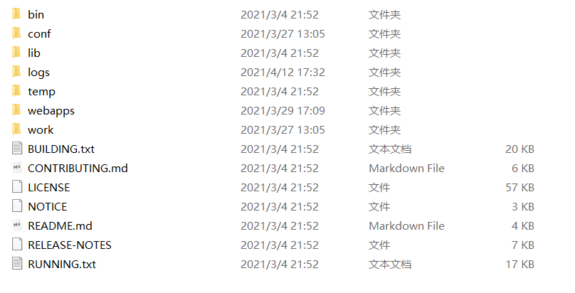
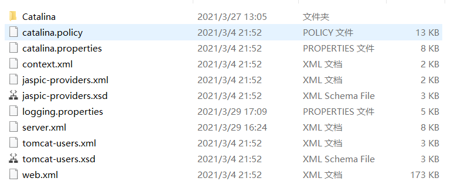
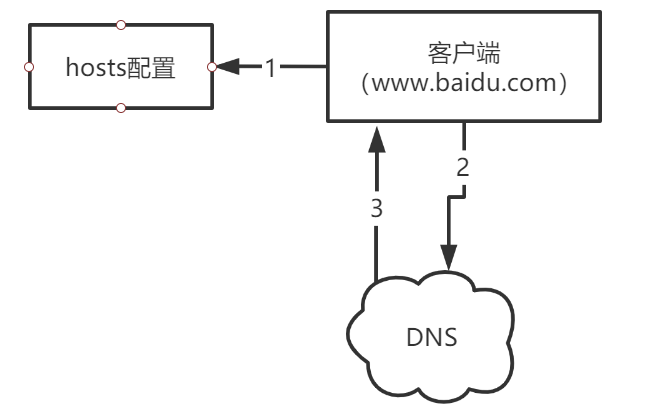
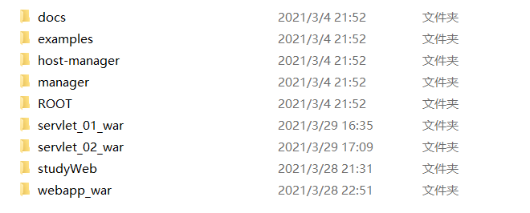
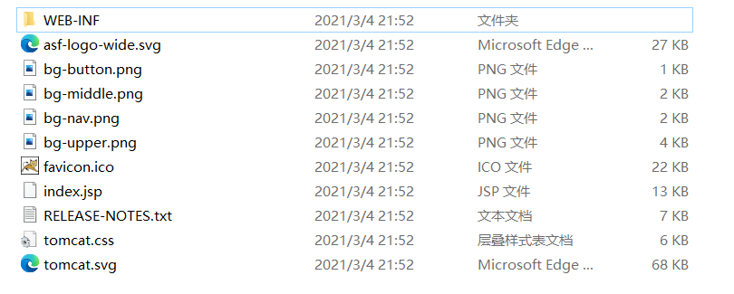

# Tomcat

* 默认端口：8080, 访问服务器： localhost:8080

* 目录结构：



* 配置文件在conf 目录下：



​	其中 server.xml 为服务器**核心配置文件**。其中：

```xml
<Connector port="8080" protocol="HTTP/1.1"
               connectionTimeout="20000"
               redirectPort="8443" 
               URIEncoding="UTF-8"/>
```

port： 指定了服务器端口，默认是8080端口，可以自己更改。

在<Engine> 标签中，有：

```xml
<Host name="localhost"  appBase="webapps"
            unpackWARs="true" autoDeploy="true">

        <!-- SingleSignOn valve, share authentication between web applications
             Documentation at: /docs/config/valve.html -->
        <!--
        <Valve className="org.apache.catalina.authenticator.SingleSignOn" />
        -->

        <!-- Access log processes all example.
             Documentation at: /docs/config/valve.html
             Note: The pattern used is equivalent to using pattern="common" -->
        <Valve className="org.apache.catalina.valves.AccessLogValve" directory="logs"
               prefix="localhost_access_log" suffix=".txt"
               pattern="%h %l %u %t &quot;%r&quot; %s %b" />

      </Host>
```

name：主机名，如localhost ，注意要能够域名解析。

appBase：指定web应用存放位置。

**网站是如何被访问的？**

1. 输入一个域名
2. 检测本机的 hosts 配置文件中有没有这个域名映射？
   1. 有：直接返回域名的ip地址
   2. 无：去DNS 找



* web应用在 webapps 路径下：



​	每个目录都是一个web应用，tomcat默认开启的是ROOT应用。


## web应用结构



```java
---webapps  : Tomcat 服务器的目录名
    -ROOT
    -studyWeb: 网站的目录名
        -WEB-INF
        	-classes : java 程序
            -lib:   web应用所依赖的jar包
            -web.xml:  网站配置文件
        -index.html: 默认网站首页
        -static  :网站静态文件（css,js,img,....）
```


