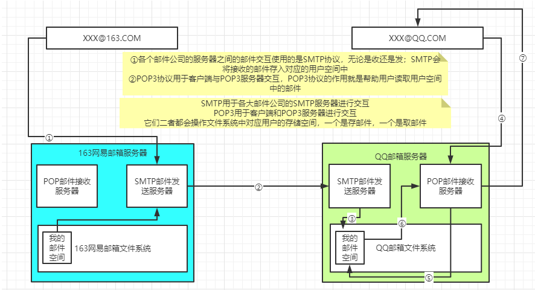
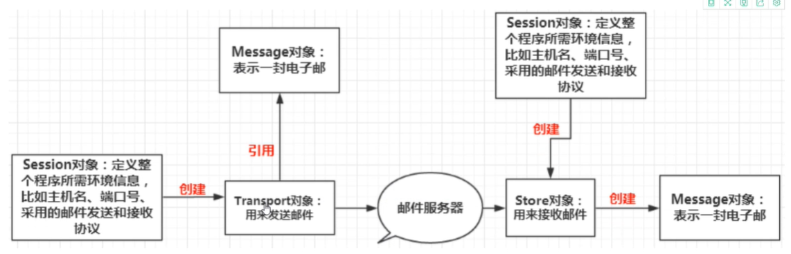
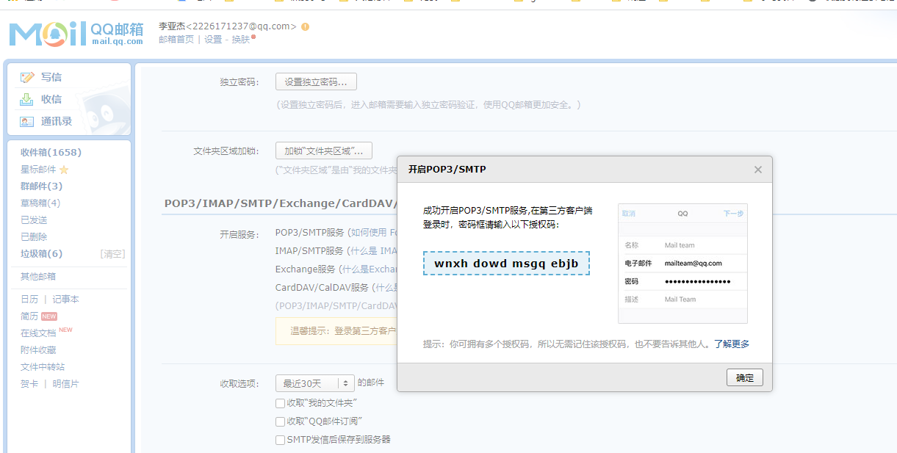
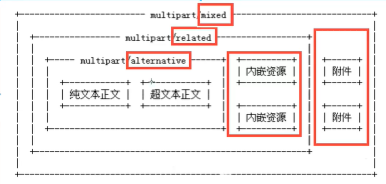

# 邮件发送




①SMTP邮件服务器：替用户发送邮件和接收外面发送给本地用户的邮件，处理用户SMTP请求

 ②POP3/IMAP邮件服务器：帮助用户读取SMTP邮件服务器接收进来的邮件，处理用户POP3请求

## 需要的jar 包：

使用java 普通程序就可以了，无需使用web环境。

mail.jar

activation.jar

```xml
<dependency>
    <groupId>javax.mail</groupId>
    <artifactId>mail</artifactId>
    <version>1.4.7</version>
</dependency>
<!-- https://mvnrepository.com/artifact/javax.activation/activation -->
<dependency>
    <groupId>javax.activation</groupId>
    <artifactId>activation</artifactId>
    <version>1.1.1</version>
</dependency>
```



## 简单邮件发送

邮件内容只是纯文本。

发送邮件要开启 SMTP和POP3服务。



授权码：wnxhdowdmsgqebjb

```java
package com.liyajie.email;

import com.sun.mail.util.MailSSLSocketFactory;

import javax.mail.*;
import javax.mail.internet.InternetAddress;
import javax.mail.internet.MimeMessage;
import java.security.GeneralSecurityException;
import java.util.Properties;
// 简单邮件发送
public class SimpleEmail {

    // QQ邮件授权码：wnxhdowdmsgqebjb
    public static void main(String[] args) throws GeneralSecurityException, MessagingException {
        Properties prop=new Properties();
        prop.setProperty("mail.host","smtp.qq.com");// 设置QQ邮件服务器
        prop.setProperty("mail.transport.protocol","smtp");// 邮件发送协议
        prop.setProperty("mail.smtp.auth","true");// 需要验证用户名和密码

        // QQ邮件还需设置SSL加密
        MailSSLSocketFactory sf=new MailSSLSocketFactory();
        sf.setTrustAllHosts(true);
        prop.put("mail.smtp.ssl.enable","true");
        prop.put("mail.smtp.ssl.socketFactory",sf);

        // ------------- 发送的5个步骤-------------------
        // 1. 创建定义整个应用程序所需要的环境信息的Session对象
        Session session=Session.getDefaultInstance(prop, new Authenticator() {
            @Override
            protected PasswordAuthentication getPasswordAuthentication() {
                // 发件人邮件用户名和授权码
                return new PasswordAuthentication("2226171237@qq.com","wnxhdowdmsgqebjb");
            }
        });  // QQ才有，其他没有

        // 开启debug 模式，可以打印信息
        session.setDebug(true);
        // 2. 通过Session 得到transport对象
        Transport transport = session.getTransport();

        // 3. 使用邮箱的用户名和授权码连上邮件服务器
        transport.connect();

        // 4. 创建邮件
        MimeMessage message=new MimeMessage(session);
        // 指明邮件发件人
        message.setFrom(new InternetAddress("2226171237@qq.com"));
        // 指明邮件收件人，现在收件人和发件人是一个
        message.setRecipient(Message.RecipientType.TO,new InternetAddress("2226171237@qq.com"));
        // 邮件主题
        message.setSubject("邮件测试");
        // 邮件内容
        message.setContent("你好","text/html;charset=utf-8");

        // 5. 发送邮件
        transport.sendMessage(message,message.getAllRecipients());

        transport.close();
    }
}
```


## 复杂邮件发送

邮件内容包含图片，二进制文件等附件内容。

发送附件需要 MimeBodyPart 类和MimeMultipart类

MimeBodyPart 代表一个MIME消息，MimeMultipart代表组合多个MIME消息，一个MimeMultipart对象可以包含多个代表MIME消息的MimeBodyPart 对象。



只包含文本，则mutipart 设置为alternative, 还包含内嵌资源，则设置为 related，还包含附件则设置为 mixed。一般设置为mixed 就都可以使用。

```java
package com.liyajie.email;

import com.sun.mail.util.MailSSLSocketFactory;

import javax.activation.DataHandler;
import javax.activation.FileDataSource;
import javax.mail.*;
import javax.mail.internet.InternetAddress;
import javax.mail.internet.MimeBodyPart;
import javax.mail.internet.MimeMessage;
import javax.mail.internet.MimeMultipart;
import java.io.IOException;
import java.security.GeneralSecurityException;
import java.util.Properties;
import java.util.logging.FileHandler;

public class CompectEmail {
    public static void main(String[] args) throws GeneralSecurityException, MessagingException {
        Properties prop=new Properties();
        prop.setProperty("mail.host","smtp.qq.com");// 设置QQ邮件服务器
        prop.setProperty("mail.transport.protocol","smtp");// 邮件发送协议
        prop.setProperty("mail.smtp.auth","true");// 需要验证用户名和密码

        // QQ邮件还需设置SSL加密
        MailSSLSocketFactory sf=new MailSSLSocketFactory();
        sf.setTrustAllHosts(true);
        prop.put("mail.smtp.ssl.enable","true");
        prop.put("mail.smtp.ssl.socketFactory",sf);

        // ------------- 发送的5个步骤-------------------
        // 1. 创建定义整个应用程序所需要的环境信息的Session对象
        Session session=Session.getDefaultInstance(prop, new Authenticator() {
            @Override
            protected PasswordAuthentication getPasswordAuthentication() {
                // 发件人邮件用户名和授权码
                return new PasswordAuthentication("2226171237@qq.com","wnxhdowdmsgqebjb");
            }
        });  // QQ才有，其他没有

        // 开启debug 模式，可以打印信息
        session.setDebug(true);
        // 2. 通过Session 得到transport对象
        Transport transport = session.getTransport();

        // 3. 使用邮箱的用户名和授权码连上邮件服务器
        transport.connect();

        // 4. 创建邮件
        MimeMessage message=new MimeMessage(session);
        // 指明邮件发件人
        message.setFrom(new InternetAddress("2226171237@qq.com"));
        // 指明邮件收件人，现在收件人和发件人是一个
        message.setRecipient(Message.RecipientType.TO,new InternetAddress("2226171237@qq.com"));
        // 邮件主题
        message.setSubject("复杂邮件测试");
        // 邮件内容
        // 图片
        MimeBodyPart image = new MimeBodyPart();
        DataHandler dh = new DataHandler(new FileDataSource("C:\\Users\\Liyajie\\Pictures\\myImages\\aaa.jpeg"));
        image.setDataHandler(dh);
        image.setContentID("aaa.jpeg"); // 给图片设置ID，后面可以使用

        // 正文数据, cid: content id
        MimeBodyPart text = new MimeBodyPart();
        text.setContent("<h2>这是一个邮件正文，发送一个带图片的邮件</h2> " +
                           "",
                     "text/html;charset=utf-8");

        // 描述数据关系
        MimeMultipart mimeMultipart = new MimeMultipart();
        mimeMultipart.addBodyPart(text);
        mimeMultipart.addBodyPart(image);
        mimeMultipart.setSubType("related");

        message.setContent(mimeMultipart);
        message.saveChanges();
        // 5. 发送邮件
        transport.sendMessage(message,message.getAllRecipients());

        transport.close();
    }
}
```

