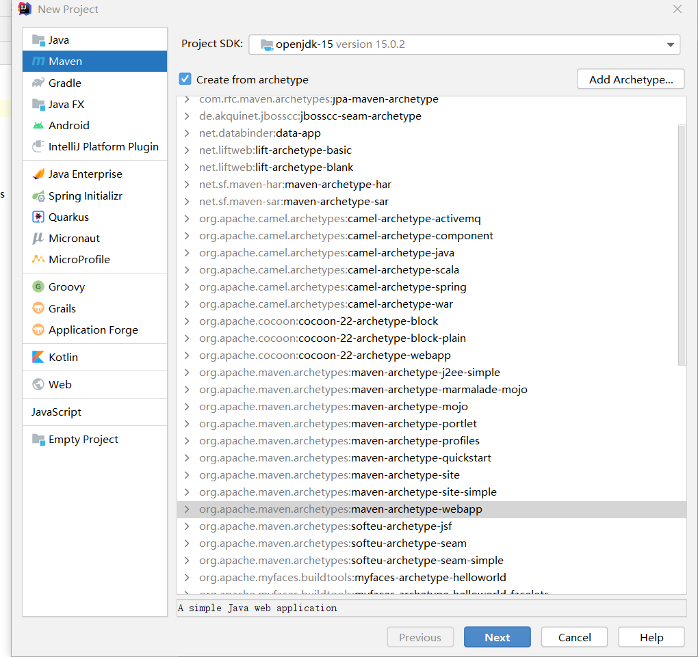
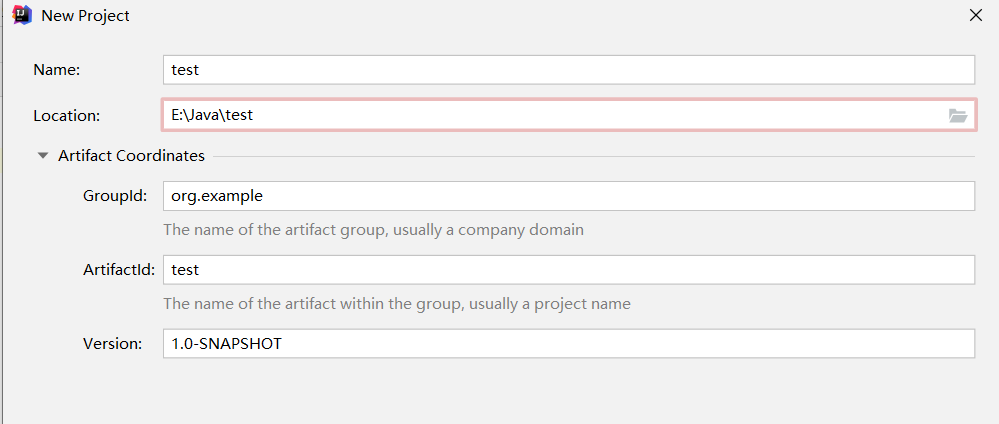

# Maven

Maven 主要服务于基于Java的项目构建，依赖管理和项目信息管理

### 安装

* 官网下载maven压缩包并解压

* 配置环境变量

  * 配置M2_HOME ：maven下的bin目录
  * 配置MAVEN_HOME：maven目录

* 验证：cmd

  `mvn -version`

### Maven配置文件

apache-maven-3.6.3-bin\apache-maven-3.6.3\conf\setting.xml

* 配置镜像

```xml
 <mirrors>
    <!-- mirror
     | Specifies a repository mirror site to use instead of a given repository. The repository that
     | this mirror serves has an ID that matches the mirrorOf element of this mirror. IDs are used
     | for inheritance and direct lookup purposes, and must be unique across the set of mirrors.
     |
    <mirror>
      <id>nexus-aliyun</id>
      <mirrorOf>central</mirrorOf>
      <name>Nexus aliyun</name>
      <url>http://maven.aliyun.com/nexus/content/groups/public</url>
    </mirror>
     -->
    <mirror>   <!--阿里镜像-->
      <id>nexus-aliyun</id>
      <mirrorOf>central</mirrorOf>
      <name>Nexus aliyun</name>
      <url>http://maven.aliyun.xcom/nexus/content/groups/public</url>
    </mirror>
  </mirrors>
```

* 配置本地仓库保存的目录

```xml
<localRepository>E:/Web/m2/repository</localRepository>
```

### 在IDEA中使用Maven





maven GAV：

G：GroupID   组名

A: ArtifactId    项目名

V:  Version      版本


### pom.xml 文件

是maven的核心配置文件

```xml
<?xml version="1.0" encoding="UTF-8"?>

// maven头文件，版本号
<project xmlns="http://maven.apache.org/POM/4.0.0" xmlns:xsi="http://www.w3.org/2001/XMLSchema-instance"
  xsi:schemaLocation="http://maven.apache.org/POM/4.0.0 http://maven.apache.org/xsd/maven-4.0.0.xsd">
  <modelVersion>4.0.0</modelVersion>

   // GAV
  <groupId>org.example</groupId>
  <artifactId>test2</artifactId>
  <version>1.0-SNAPSHOT</version>
  // 项目的打包方式 war方式。 jar:java应用，war：javeweb应用
    <packaging>war</packaging>
	
   // 没必要
  <name>test2 Maven Webapp</name>
  <!-- FIXME change it to the project's website -->
  <url>http://www.example.com</url>

    // 配置
  <properties>
    <project.build.sourceEncoding>UTF-8</project.build.sourceEncoding>  // 项目默认构建编码
     // 编译版本
    <maven.compiler.source>1.7</maven.compiler.source>  
    <maven.compiler.target>1.7</maven.compiler.target>
  </properties>
    
	// 项目依赖
  <dependencies>
    <dependency>
      <groupId>junit</groupId>
      <artifactId>junit</artifactId>
      <version>4.11</version>
      <scope>test</scope>
    </dependency>
  </dependencies>

    // 项目构建用的
  <build>
    <finalName>test2</finalName>  // 项目名
     // 插件管理
    <pluginManagement><!-- lock down plugins versions to avoid using Maven defaults (may be moved to parent pom) -->
      <plugins>
        <plugin>
          <artifactId>maven-clean-plugin</artifactId>
          <version>3.1.0</version>
        </plugin>
        <!-- see http://maven.apache.org/ref/current/maven-core/default-bindings.html#Plugin_bindings_for_war_packaging -->
        <plugin>
          <artifactId>maven-resources-plugin</artifactId>
          <version>3.0.2</version>
        </plugin>
        <plugin>
          <artifactId>maven-compiler-plugin</artifactId>
          <version>3.8.0</version>
        </plugin>
        <plugin>
          <artifactId>maven-surefire-plugin</artifactId>
          <version>2.22.1</version>
        </plugin>
        <plugin>
          <artifactId>maven-war-plugin</artifactId>
          <version>3.2.2</version>
        </plugin>
        <plugin>
          <artifactId>maven-install-plugin</artifactId>
          <version>2.5.2</version>
        </plugin>
        <plugin>
          <artifactId>maven-deploy-plugin</artifactId>
          <version>2.8.2</version>
        </plugin>
      </plugins>
    </pluginManagement>
  </build>
</project>
```

由于maven约定大于配置，我们无法导出配置的jar包
