# Servlet

## 1 简介

Servlet 是SUN公司开发动态web的一门技术，在这些api中提供了一个接口叫Servlet。只需完成两个小步骤：

* 编写一个类，实现Servlet接口
* 把开发好的java类部署到web服务器中。

把实现了Servlet接口的java程序叫做Servlet。

## 2 Hello Servlet

Servlet在sun公司有两个默认实现类：HttpServlet

1. 使用Maven建一个空项目，然后删除src目录，以后我们的学习就在这个项目里建立module，这个空工程就是maven的主工程。
2. 关于Maven父子工程的理解：父项目中pom.xml包含子项目

```xml
<modules>
   <module>servlet-01</module>
</modules>
```

子项目中会有

```xml
<parent>
    <artifactId>helloservlet</artifactId>
    <groupId>org.example</groupId>
    <version>1.0-SNAPSHOT</version>
</parent>
```

父项目中的java，子项目可以直接使用。

```java
son extends father
```

3.  maven父项目 pom.xml依赖：

```xml
<dependencies>
    <dependency>
        <groupId>javax.servlet</groupId>
        <artifactId>javax.servlet-api</artifactId>
        <version>4.0.1</version>
    </dependency>

    <!-- https://mvnrepository.com/artifact/javax.servlet.jsp/javax.servlet.jsp-api -->
    <dependency>
        <groupId>javax.servlet.jsp</groupId>
        <artifactId>javax.servlet.jsp-api</artifactId>
        <version>2.3.3</version>
    </dependency>

</dependencies>
```

4. 创建一个子项目，并选择为maven的 webapp项目。在main中创建目录 java和resource

   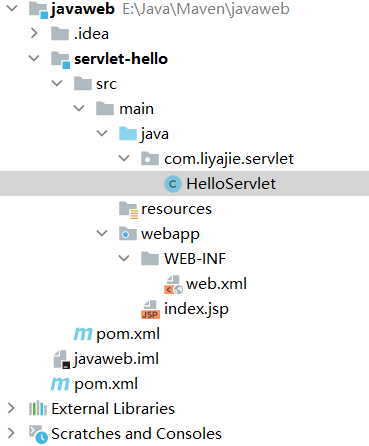


1. 编写一个servlet程序

   ```java
   public class HelloServlet extends HttpServlet {
       // get或post只是请求实现的不同方式，可以相互调用，业务逻辑都一样
       @Override
       protected void doGet(HttpServletRequest req, HttpServletResponse resp) throws ServletException, IOException {
           PrintWriter writer=resp.getWriter(); // 响应流
           writer.print("Hello Servlet");
   
       }
   
       @Override
       protected void doPost(HttpServletRequest req, HttpServletResponse resp) throws ServletException, IOException {
           doGet(req,resp);
       }
   }
   ```

2. 编写Servlet的映射

   我们写的是java程序，但是要通过浏览器访问，而浏览器需要连接web服务器，所以我们需要在web服务器中注册我们写的Servlet，还需给他一个浏览器能够的路径。配置文件 webapp/WEB-INF/web.xml

   ```xml
   file: web.xml中
   <!--注册servlet-->
     <servlet>
       <servlet-name>hello</servlet-name>
       <servlet-class>com.liyajie.servlet.HelloServlet</servlet-class>
     </servlet>
   
     <!--servlet请求路径-->
     <servlet-mapping>
       <servlet-name>hello</servlet-name>
       <url-pattern>/hello</url-pattern>
     </servlet-mapping>
   ```

   

3. 配置tomcat

   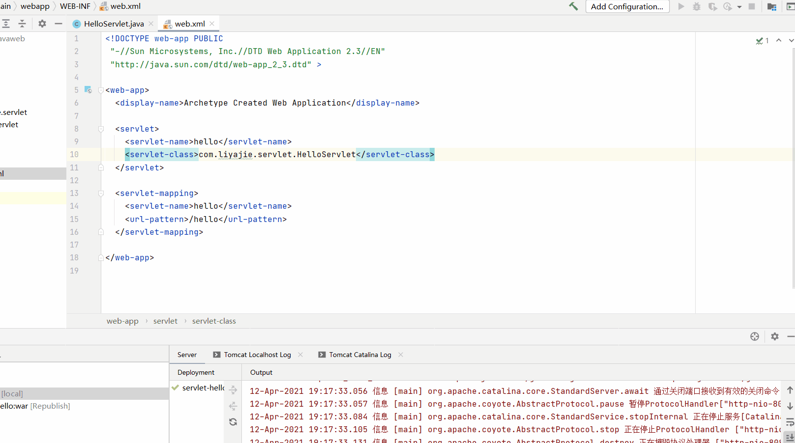

4. 启动测试


## 3 Servlet原理

Servlet是由Web服务器调用，web服务器在收到浏览器请求后，首次访问会产生实现的Servlet类，会：

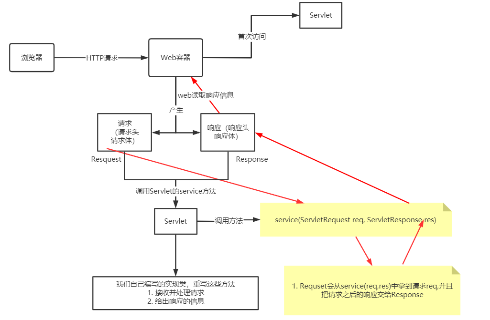

## 4 Mapping

1. 一个Servlet可以指定一个映射路径

   ```xml
   <servlet-mapping>
       <servlet-name>hello</servlet-name>
       <url-pattern>/hello</url-pattern>
     </servlet-mapping>
   ```

2. 一个Servlet可以指定多个映射路径

   ```xml
   <servlet-mapping>
       <servlet-name>hello</servlet-name>
       <url-pattern>/hello1</url-pattern>
     </servlet-mapping>
   <servlet-mapping>
       <servlet-name>hello</servlet-name>
       <url-pattern>/hello2</url-pattern>
     </servlet-mapping>
   <servlet-mapping>
       <servlet-name>hello</servlet-name>
       <url-pattern>/hello3</url-pattern>
     </servlet-mapping>
   ```

3. 一个Servlet可以指定通用的映射路径，使用通配符 " * " 。

   ```xml
   <servlet-mapping>
       <servlet-name>hello</servlet-name>
       <url-pattern>/hello/*</url-pattern>
     </servlet-mapping>
   ```

4. 或加其他，* 前面不能加项目映射的路径

   ```xml
   <servlet-mapping>
       <servlet-name>hello</servlet-name>
       <url-pattern>*.do</url-pattern>  // 自定义后缀实现 *前面不能加项目映射的路径（如：/hello/*.do）
     </servlet-mapping>
   ```

5.  优先级问题

   通配符的优先级最低。

## 5 ServletContext

web容器在启动时，它会为每个web程序都创建一个对应的ServletContext对象，它代表当前的web应用（类似PCB）。

* 共享数据 （不同的Servlet程序都可以使用），可实现不同servlet之间通信。(不同Servlet对象共享同一个context)

  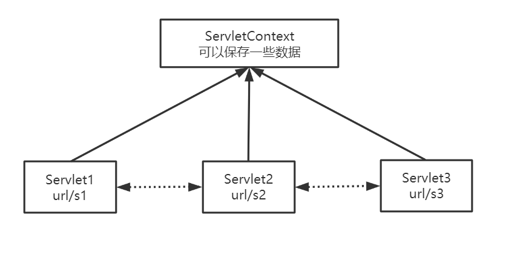

  ```java
  public class HelloServlet  extends HttpServlet {
      @Override
      protected void doGet(HttpServletRequest req, HttpServletResponse resp) throws ServletException, IOException {
          ServletContext context=this.getServletContext();
          String userName="Liyajie";
          context.setAttribute("userName",userName);  // 发送数据
      }
  
      @Override
      protected void doPost(HttpServletRequest req, HttpServletResponse resp) throws ServletException, IOException {
          doGet(req,resp);
      }
  }
  
  public class GetServlet extends HttpServlet {
  
      @Override
      protected void doGet(HttpServletRequest req, HttpServletResponse resp) throws ServletException, IOException {
          ServletContext context=this.getServletContext();
          String usrName=(String) context.getAttribute("userName");  // 获取数据
          System.out.println(usrName);
          
          resp.setContentType("text/html");
          resp.setCharacterEncoding("utf-8");
          resp.getWriter().print("名字: "+username);
      }
  
      @Override
      protected void doPost(HttpServletRequest req, HttpServletResponse resp) throws ServletException, IOException {
          doGet(req, resp);
      }
  }
  ```

  

* web.xml 配置：

  ```xml
  <!DOCTYPE web-app PUBLIC
   "-//Sun Microsystems, Inc.//DTD Web Application 2.3//EN"
   "http://java.sun.com/dtd/web-app_2_3.dtd" >
  
  <web-app>
    <display-name>Archetype Created Web Application</display-name>
    
    <servlet>
      <servlet-name>put</servlet-name>
      <servlet-class>com.liyajie.servlet.HelloServlet</servlet-class>
    </servlet>
    
    <servlet>
      <servlet-name>get</servlet-name>
      <servlet-class>com.liyajie.servlet.GetServlet</servlet-class>
    </servlet>
  
  <!--=============================================================-->
    <servlet-mapping>
      <servlet-name>put</servlet-name>
      <url-pattern>/put</url-pattern>
    </servlet-mapping>
  
    <servlet-mapping>
      <servlet-name>get</servlet-name>
      <url-pattern>/get</url-pattern>
    </servlet-mapping>
  
  </web-app>
  ```

## 6 ServletContext 应用

* 获取初始化参数：

  1. 在web.xml 中初始化的参数：

     ```xml
     <web-app>
       <display-name>Archetype Created Web Application</display-name>
       
     	<!--初始化的参数-->    
       <context-param>
         <param-name>url</param-name>
         <param-value>jdbc:mysql://localhost:3306/mybatis</param-value>
       </context-param>
     
       <servlet>
         <servlet-name>getp</servlet-name>
         <servlet-class>com.liyajie.servlet.ServletDemoOne</servlet-class>
       </servlet>
       
       <servlet-mapping>
         <servlet-name>getp</servlet-name>
         <url-pattern>/getp</url-pattern>
       </servlet-mapping>
     </web-app>
     ```

  2.  Servlet 实现类：

     ```java
     public class ServletDemoOne extends HttpServlet {
     
         @Override
         protected void doGet(HttpServletRequest req, HttpServletResponse resp) throws ServletException, IOException {
             ServletContext context = this.getServletContext();
             String url = context.getInitParameter("url");  // 获取 url 参数
     
             resp.getWriter().print(url);
         }
     
         @Override
         protected void doPost(HttpServletRequest req, HttpServletResponse resp) throws ServletException, IOException {
             doGet(req, resp);
         }
     }
     ```

* 请求转发，访问路径不会改变，项另一个路径里请求资源。

  ```java
  public class ServletDemoTwo extends HttpServlet {
  
      @Override
      protected void doGet(HttpServletRequest req, HttpServletResponse resp) throws ServletException, IOException {
          ServletContext context = this.getServletContext();
          // 参数为要转发的请求地址，即它去/getp中拿东西
          RequestDispatcher requestDispatcher = context.getRequestDispatcher("/getp");
          requestDispatcher.forward(req,resp); // 调用forward方法实现请求转发。
      }
  
      @Override
      protected void doPost(HttpServletRequest req, HttpServletResponse resp) throws ServletException, IOException {
          doGet(req, resp);
      }
  }
  ```

* 读取文件，使用流，如读取properties文件

  db.properties

  ```
  username=root
  password=123456
  ```

  Servlet 实现类：

  ```java
  public class ServletDemoThree extends HttpServlet {
  
      @Override
      protected void doGet(HttpServletRequest req, HttpServletResponse resp) throws ServletException, IOException {
          ServletContext context = this.getServletContext();
          InputStream resourceStream = context.getResourceAsStream("/WEB-INF/classes/db.properties");
          Properties properties=new Properties();
          properties.load(resourceStream);
          String user=properties.getProperty("username");
          String pwd=properties.getProperty("password");
  
          PrintWriter writer = resp.getWriter();
          writer.println("User: "+user);
          writer.println("Password: "+pwd);
      }
  
      @Override
      protected void doPost(HttpServletRequest req, HttpServletResponse resp) throws ServletException, IOException {
          doGet(req, resp);
      }
  }
  ```


## 7 HttpServletResponse

响应。web服务器接收客户端的http请求，针对这个请求，分别创建一个代表请求的HttpServletRequest对象和代表响应的一个HttpServletResponse：

* 如果要获取客户端请求过来的参数：找 HttpServletRequest
* 如果要给客户端响应一些信息：找 HttpServletResponse

### 7.1 方法简单分类

* 负责向浏览器发送数据的方法：

  ```java
  public ServletOutputStream getOutputStream() throws IOException;
  
  public PrintWriter getWriter() throws IOException;
  ```

* 负责向浏览器发送响应头：

  ```java
   public void setCharacterEncoding(String charset);
  
  public void setContentLength(int len);
  
  public void setContentLengthLong(long len);
  
  public void setContentType(String type);
  
  public void setDateHeader(String name, long date);
  
  public void addDateHeader(String name, long date);
  
  public void setHeader(String name, String value);
  
  public void addHeader(String name, String value);
  
  public void setIntHeader(String name, int value);
  .....
  ```

* 响应的状态码

  ```java
  public static final int SC_OK = 200;
  
  public static final int SC_MULTIPLE_CHOICES = 300;
  
  public static final int SC_NOT_FOUND = 404;
  
  public static final int SC_SERVICE_UNAVAILABLE = 503;
  ....
  ```

### 7.2 常见应用

1. 向浏览器输出消息；

2. 下载文件

   1. 要获取下载文件的路径
   2. 下载文件名是什么
   3. 设置想办法让浏览器能够支持下载的东西
   4. 获取下载文件的输入流
   5. 创建缓存区
   6. 获取OutputStream 对象
   7. 将FileOutputStream 流写入buffer缓存区
   8. 使用outputStream 将缓存区中的数据输出到客户端。

   ```java
   package com.liyajie.servlet;
   
   import javax.servlet.ServletException;
   import javax.servlet.ServletOutputStream;
   import javax.servlet.http.HttpServlet;
   import javax.servlet.http.HttpServletRequest;
   import javax.servlet.http.HttpServletResponse;
   import java.io.FileInputStream;
   import java.io.IOException;
   import java.net.URLEncoder;
   
   public class FileServlet extends HttpServlet {
   
       @Override
       protected void doGet(HttpServletRequest req, HttpServletResponse resp) throws ServletException, IOException {
   //        1. 要获取下载文件的路径
           String realPath = "E:\\Java\\Maven\\javaweb\\servlet-04-response\\src\\main\\resources\\m7.jpg";
           System.out.println("下载文件的路径： "+realPath);
   //        2. 下载文件名是什么
           String fileName = realPath.substring(realPath.lastIndexOf("\\") + 1);
   //        3. 设置想办法让浏览器能够支持下载的东西,使用utf-8 解决中文乱码
           resp.setHeader("Content-disposition","attachment;filename="+ URLEncoder.encode(fileName,"utf-8"));
   //        4. 获取下载文件的输入流
           FileInputStream in = new FileInputStream(realPath);
   //        5. 创建缓存区
           int len=1024;
           byte[] buffer=new byte[1024];
   //        6. 获取OutputStream 对象
           ServletOutputStream outputStream = resp.getOutputStream();
   //        7. 将FileOutputStream 流写入buffer缓存区
           while (in.read(buffer)!=-1){
               outputStream.write(buffer,0,len);
           }
   //        8. 使用outputStream 将缓存区中的数据输出到客户端。
           in.close();
           outputStream.close();
       }
   
       @Override
       protected void doPost(HttpServletRequest req, HttpServletResponse resp) throws ServletException, IOException {
           doGet(req, resp);
       }
   }
   ```

3.  实现验证码

   * 前端实现

   * 后端实现，需要用到 java的图片类，产生图片

     ```java
     package com.liyajie.servlet;
     
     import javax.imageio.ImageIO;
     import javax.servlet.ServletException;
     import javax.servlet.http.HttpServlet;
     import javax.servlet.http.HttpServletRequest;
     import javax.servlet.http.HttpServletResponse;
     import java.awt.*;
     import java.awt.image.BufferedImage;
     import java.io.IOException;
     import java.util.Random;
     
     public class ImageServlet extends HttpServlet {
     
         private String makeNum(){
             Random random = new Random();
             String num=String.valueOf(random.nextInt(999999));
             StringBuffer stringBuffer=new StringBuffer();
             for(int i=0;i<6-num.length();i++){
                 stringBuffer.append("0");
             }
             num = stringBuffer.toString()+num;
             return num;
         }
     
         @Override
         protected void doGet(HttpServletRequest req, HttpServletResponse resp) throws ServletException, IOException {
             // 如何让浏览3秒刷新一次
             resp.setHeader("refresh","3");
     
             // 在内存中创建一个图片
             BufferedImage image = new BufferedImage(80, 20, BufferedImage.TYPE_INT_RGB);
     
             // 得到图片
             Graphics2D graphics = (Graphics2D)image.getGraphics(); // 得到2d画笔
             graphics.setColor(Color.white); // 设置画笔颜色
             graphics.fillRect(0,0,80,20); // 使用颜色填充矩形框
     
             // 给图片写数据
             graphics.setColor(Color.blue);
             graphics.setFont(new Font(null,Font.BOLD,20));
             graphics.drawString(makeNum(),0,20);
     
             //告诉浏览器这个请求用浏览器打开
             resp.setContentType("image/jpeg");
     
             // 网站存在缓存，不让浏览器缓存
             resp.setDateHeader("expires",-1);
             resp.setHeader("Cache-Control","no-cache");
             resp.setHeader("Pragram","no-cache");
     
             // 把图片写给浏览器
             ImageIO.write(image, "jpg",resp.getOutputStream());
         }
     
         @Override
         protected void doPost(HttpServletRequest req, HttpServletResponse resp) throws ServletException, IOException {
             doGet(req, resp);
         }
     }
     ```

4.  重定向

   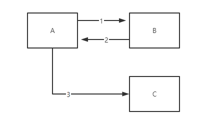

   A先找B要资源，B说不在这，在C那，然后A就去C那拿资源。

   一个web资源收到客户端请求后，他会通知客户端区访问另一个web资源，这个过程叫做重定向。

   ```java
   resp.sendRedirect();
   ```

   常见场景：

   * **页面跳转**

     ```java
     public class RedirectServlet extends HttpServlet {
         @Override
         protected void doGet(HttpServletRequest req, HttpServletResponse resp) throws ServletException, IOException {
     
             resp.sendRedirect("/servlet_04_response_war/image"); // web的绝对路径
         }
     
         @Override
         protected void doPost(HttpServletRequest req, HttpServletResponse resp) throws ServletException, IOException {
             doGet(req, resp);
         }
     }
     ```

     ```xml
     <servlet>
     
       <servlet-name>image</servlet-name>
         <servlet-class>com.liyajie.servlet.ImageServlet</servlet-class>
       </servlet>
       <servlet>
         <servlet-name>jump</servlet-name>
         <servlet-class>com.liyajie.servlet.RedirectServlet</servlet-class>
       </servlet>
       
     
       <servlet-mapping>
         <servlet-name>image</servlet-name>
         <url-pattern>/image</url-pattern>
       </servlet-mapping>
     
       <servlet-mapping>
         <servlet-name>jump</servlet-name>
         <url-pattern>/jump</url-pattern>
       </servlet-mapping>
     </servlet>
     ```

   重定向和转发的区别：

   * 相同点：页面都会实现跳转
   * 不同点：
     * 请求转发的时候，url不会产生变化
     * 重定向时，url会发送变化，变为重定向的url。

   **简单的的登录示例：**

   目录结构：

   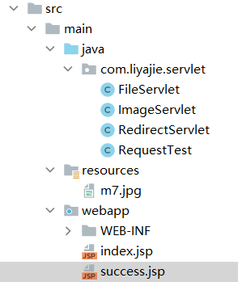

   1. 创建 index.jsp, 里面一个表单

      ```jsp
      <html>
          <body>
              <h2>Hello World!</h2>
      
              <%--这里提交的路径，需要寻找到项目的路径--%>
              <form action="/servlet_04_response_war/login" method="get">
                  UserName: <input type="text" name="username"><br>
                  PassWord: <input type="password" name="password"><br>
                  <input type="submit">
              </form>
      
          </body>
      </html>
      ```

      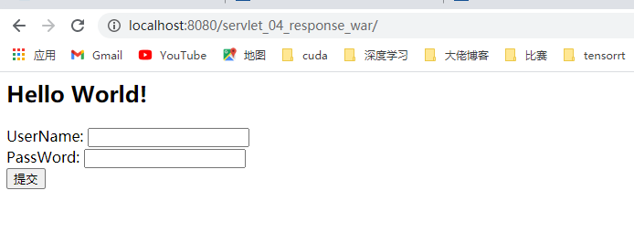

   2. 创建一个success.jsp

      ```jsp
      <%@ page contentType="text/html;charset=UTF-8" language="java" %>
      <html>
          <head>
              <title>Success</title>
          </head>
          <body>
              <h1>Success</h1>
          </body>
      </html>
      
      ```

   3. 实现类：

      ```java
      public class RequestTest extends HttpServlet {
          @Override
          protected void doGet(HttpServletRequest req, HttpServletResponse resp) throws ServletException, IOException {
              String username = req.getParameter("username");
              String password = req.getParameter("password");
              System.out.println(username);
              System.out.println(password);
              // 注意这里的路径，否则404错误
              resp.sendRedirect("/servlet_04_response_war/success.jsp");
          }
      
          @Override
          protected void doPost(HttpServletRequest req, HttpServletResponse resp) throws ServletException, IOException {
              doGet(req, resp);
          }
      }
      ```

## 8 HttpServletRequest

HttpServletRequest 代表客户端的请求，用户通过HTTP协议访问服务器，http请求中的所有信息会被封装到 HttpServletRequest ，通过这个HttpServletRequest ，获得客户端的所有信息。

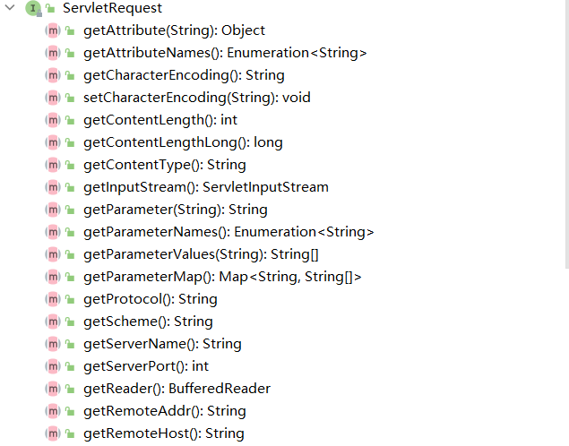

### 8.1 获取前端传递的参数

```
public String getParameter(String name); // 单个

public String[] getParameterValues(String name); // 多个
```


### 8.2 请求转发

```
public RequestDispatcher getRequestDispatcher(String path);
```


例子：

1. 登录界面 index.jsp

   ```jsp
   <%@ page contentType="text/html;charset=UTF-8" language="java" isELIgnored="false" %>
   <html>
       <head>
           <title>Login</title>
       </head>
       <body>
           <h1>登录</h1>
           <div style="text-align: center">
               <%--以post方式提交表单，${pageContext.request.contextPath}为当前web路径,并在首行加入isELIgnored="false"--%>
               <form action="${pageContext.request.contextPath}/login" method="post">
                   用户名：<input type="text" name="username"><br>
                   密  码：<input type="password" name="password"><br>
                   爱  好：
                   <input type="checkbox" name="hobbys" value="code"> 编程
                   <input type="checkbox" name="hobbys" value="movie"> 电影
                   <input type="checkbox" name="hobbys" value="music"> 音乐<br>
                   <input type="submit">
               </form>
           </div>
   
       </body>
   </html>
   ```

   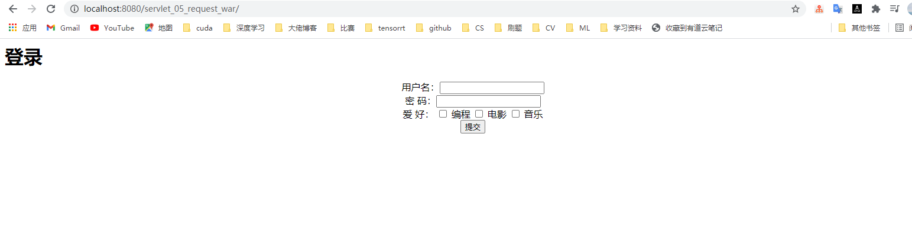

2. 登录成功后界面的跳转：success.jsp

   ```jsp
   <%@ page contentType="text/html;charset=UTF-8" language="java" %>
   <html>
   <head>
       <title>Success</title>
   </head>
       <body>
           <h1 style="text-align: center">Login Success</h1>
       </body>
   </html>
   ```

   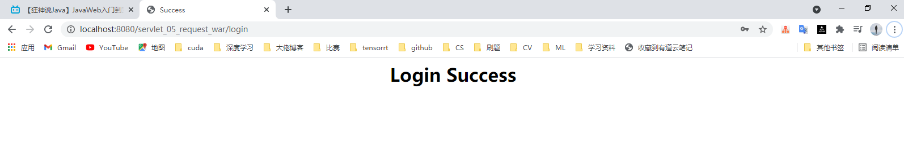

3. Servlet 实现类：

   ```java
   package com.liyajie.servlet;
   
   import javax.servlet.ServletException;
   import javax.servlet.http.HttpServlet;
   import javax.servlet.http.HttpServletRequest;
   import javax.servlet.http.HttpServletResponse;
   import java.io.IOException;
   import java.util.Arrays;
   
   public class LoginServlet extends HttpServlet {
   
       @Override
       protected void doGet(HttpServletRequest req, HttpServletResponse resp) throws ServletException, IOException {
   
           req.setCharacterEncoding("utf-8"); // 处理接收中文乱码问题
           resp.setCharacterEncoding("utf-8"); // 响应设置utf-8编码
   
           String username = req.getParameter("username");
           String password = req.getParameter("password");
           String[] hobbys = req.getParameterValues("hobbys");
   
           System.out.println("===============================");
           System.out.println(username);
           System.out.println(password);
           System.out.println(Arrays.asList(hobbys).toString());
           System.out.println("===============================");
   		
           // 两种方式页面跳转
           // 重定向，页面跳转转发,req.getContextPath() 获取当前web路径
           // resp.sendRedirect(req.getContextPath()+"/success.jsp");
   
           // 请求转发,页面跳转  / 代表当前web应用
           req.getRequestDispatcher("/success.jsp").forward(req,resp);
       }
   
       @Override
       protected void doPost(HttpServletRequest req, HttpServletResponse resp) throws ServletException, IOException {
           doGet(req, resp);
       }
   }
   
   ```

## 9 Cookie 和Session

session: 用户打开一个浏览器，点击了很多超链接，访问很多web资源，关闭浏览器，这个过程就叫会话。

一个网站怎么证明你来过？

有状态会话：一个客户端访问过服务器，下来再访问，服务器就知道，该客户端已经来过了。

服务端给客户端一个cookie,客户端下次访问服务器时带上cookie：cookie

服务器登记你来过了,客户端下次访问就知道你已经来过了 :    session

* 保存会话的两种方式：

  1. cookie

     客户端技术，客户端每次访问带上cookie（请求，响应）

  2. session

     服务器技术，利用这个技术可以保存用户会话信息，我们可以把信息或数据放在session中。


### 9.1 Cookie

* 请求中拿到cookie: 

  ```java
  Cookie[] cookies = req.getCookies(); // 数组，cookie 可能存在多个
  ```

* 响应cookie,并设置有效期

  ```java
  Cookie cookie =new Cookie("lastLoginTime",String.valueOf(System.currentTimeMillis()));
  cookie.setMaxAge(24*60*60); // cookie 有效期为1天，浏览器关闭了，cookie还存在,直到过期
  resp.addCookie(cookie);
  ```

* 例子，获取上次访问时间

  ```java
  package com.liyajie.servlet;
  
  import javax.servlet.ServletException;
  import javax.servlet.http.Cookie;
  import javax.servlet.http.HttpServlet;
  import javax.servlet.http.HttpServletRequest;
  import javax.servlet.http.HttpServletResponse;
  import java.io.IOException;
  import java.io.PrintWriter;
  import java.util.Date;
  
  public class CookieServlet extends HttpServlet {
      @Override
      protected void doGet(HttpServletRequest req, HttpServletResponse resp) throws ServletException, IOException {
          req.setCharacterEncoding("utf-8");
          resp.setCharacterEncoding("utf-8");
          resp.setContentType("text/html");
  
          PrintWriter out = resp.getWriter();
  
          //Cookie 服务端从客户端获取
          Cookie[] cookies = req.getCookies(); // 数组，cookie 可能存在多个
          
          // 判断cookie 是否存在
          if(cookies!=null){
              out.println("你上次访问的时间：");
              for(int i=0;i<cookies.length;i++){
                  String name = cookies[i].getName(); // 获取cookie 名字
                  out.println("Cookie Name: "+name);
                  if(name.equals("lastLoginTime")){  // 获取第一次访问的时间
                      String value = cookies[i].getValue();// 获取cookie的值
                      out.println("Time: "+new Date(Long.valueOf(value)));
                  }
              }
          } else {
              out.println("这是你第一次访问服务器");
  
          }
          // 服务器给客户端响应一个cookie
          Cookie cookie =new Cookie("lastLoginTime",String.valueOf(System.currentTimeMillis()));
          cookie.setMaxAge(24*60*60); // cookie 有效期为1天，浏览器关闭了，cookie还存在,直到过期
          resp.addCookie(cookie);
      }
  
      @Override
      protected void doPost(HttpServletRequest req, HttpServletResponse resp) throws ServletException, IOException {
          doGet(req, resp);
      }
  }
  ```

cookie 一般会保留在本地的用户目录下 appdata。

一个网站保存的cookie是否存在上限？

* 一个cookie只能保存一个信息  key:value
* 一个web站点可以给浏览器发送多个cookie， 浏览器最大发送300个cookie，每个web站点最多20个
* 所有cookie大小限制4kb

删除cookie:

* 不设置有效期，关闭浏览器自动删除cookie
* 设置有效期为0，响应后，立马过期

中文编码解码：

```java
URLEncoding.encode(...)
URLEncoding.decode(...)
```


### 9.2 Session(重点）

cookie 用的少，一般使用session。服务器会给**每个用户(浏览器）**创建一个Session对象，一个Session独占一个浏览器，只要浏览器没关，对象就存在。

场景：用户登录之后，整个网站都可以访问。----> 保存用户的信息

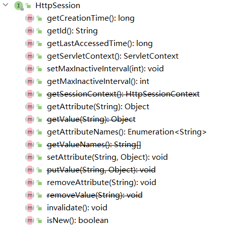


不仅可以存字符串，还可以存 对象。**可以使用session 替代ServletContext 实现共享数据，尽量使用session,而不使用ServletContext** 

```java
public class SessionServlet extends HttpServlet {

    @Override
    protected void doGet(HttpServletRequest req, HttpServletResponse resp) throws ServletException, IOException {
        // 解决乱码问题
        req.setCharacterEncoding("utf-8");
        resp.setCharacterEncoding("utf-8");
        resp.setContentType("text/html;charset=utf-8");

        // 得到session
        HttpSession session = req.getSession(); // 浏览器打开瞬间就存在了，服务器创建

        // session 创建的时候做了：
        // 添加cookie
        //    Cookie cookie = new Cookie("JSESSIONID",sessionId);
        //    resp.addCookie(cookie);

        // 给sesssion 中存东西
        session.setAttribute("name","李亚杰");
        session.setAttribute("user",new User("liyajie",20));
        // 获取session 的id
        String id = session.getId();

        // 判断session是不是新建的
        if (session.isNew()){
            resp.getWriter().write("session 创建成功，session id="+id);
        } else {
            resp.getWriter().write("session 已经创建，session id="+id);
        }

    }

    @Override
    protected void doPost(HttpServletRequest req, HttpServletResponse resp) throws ServletException, IOException {
        doGet(req, resp);
    }
}


public class GetSessionServlet extends HttpServlet {
    @Override
    protected void doGet(HttpServletRequest req, HttpServletResponse resp) throws ServletException, IOException {

        req.setCharacterEncoding("utf-8");
        resp.setCharacterEncoding("utf-8");
        resp.setContentType("text/html;charset=utf-8");

        HttpSession session = req.getSession();
        String name = (String) session.getAttribute("name");
        System.out.println(name);

        User user=(User) session.getAttribute("user");
        System.out.println(user);
    }

    @Override
    protected void doPost(HttpServletRequest req, HttpServletResponse resp) throws ServletException, IOException {
        doGet(req, resp);
    }
}

```

注销session:

* ```
  session.invalidate()
  注销后，在打开会生成新的session
  ```

* 或在 web.xml中配置

  ```xml
  <session-config>
      <!--1 分钟后session失效-->
      <session-timeout>1</session-timeout>
  </session-config>
  ```

**Session和Cookie的区别：**

* Cookie是把用户的数据写给用户的浏览器，浏览器保存（可以保存多个），用户每次请求都会携带cookie
* Session把用户的数据写到用户独占的session中，服务器端保存，不需要response（保留中重要的数据，减少服务器资源的浪费）,用户第一次访问服务器会为其创建一个全局唯一ID的Session，并将sessionID通过cookie传给用户。
* Session对象由服务器创建。

使用场景：

* 保存一个登录用户的信息
* 购物车信息
* 在整个网站中,经常会使用的数据，我们将他保存在session中，不用每次向客户端要取。

**可以使用session 替代ServletContext 实现同一用户不同访问共享数据，尽量使用session,而不使用ServletContext** .

如何让不同的用户共享数据呢？**使用ServletContext.**