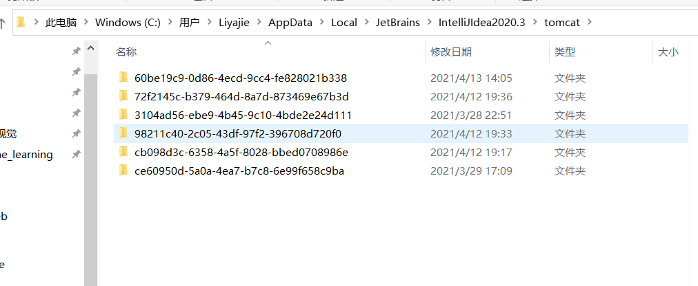

# JSP

## 1 什么是JSP

JSP: Java Server Pages ： Java 服务器端页面，也和Servlet一样，用于动态Web技术

最大特点：

* 写JSP就像写HTML
* 区别：
  * HTML只给用户提供静态的数据
  * JSP页面中可以嵌入JAVA代码，为用户提供动态数据。

## 2 JSP原理

JSP到底怎么执行的？

* 代码层面没有任何问题

* 服务器内部工作：

  * tomcat 中由一个wok目录，里面存放不同的web应用

  * 在IDEA 中 tomcat目录：C:\Users\Liyajie\AppData\Local\JetBrains\IntelliJIdea2020.3\tomcat

    

  每个目录都是一个web项目，以第一个为例：C:\Users\Liyajie\AppData\Local\JetBrains\IntelliJIdea2020.3\tomcat\60be19c9-0d86-4ecd-9cc4-fe828021b338\work\Catalina\localhost\servlet_07_session_war\org\apache\jsp目录下存在：**JSP最终也会被转换成java类。**

  

  浏览器向服务器发送请求，不管访问什么资源，其实都是在访问Servlet！

  **JSP最终也会被转换成java类。**

  

  **JSP 本质上就是一个Servlet。**

  index.jsp:

  ```jsp
  <html>
  <body>
  <h2>Hello World!</h2>
  </body>
  </html>
  ```

  

   index_jsp.java:

  ```java
  public void _jspInit() {  // 初始化
    }
  
    public void _jspDestroy() { // 销毁
    }
  
  // JSPServer
    public void _jspService(final javax.servlet.http.HttpServletRequest request, final javax.servlet.http.HttpServletResponse response)
  ```

  _jspService 方法中：

  1. 判断请求

     ```java
     if (!javax.servlet.DispatcherType.ERROR.equals(request.getDispatcherType())) {
           final java.lang.String _jspx_method = request.getMethod();
           if ("OPTIONS".equals(_jspx_method)) {
             response.setHeader("Allow","GET, HEAD, POST, OPTIONS");
             return;
           }
           if (!"GET".equals(_jspx_method) && !"POST".equals(_jspx_method) && !"HEAD".equals(_jspx_method)) {
             response.setHeader("Allow","GET, HEAD, POST, OPTIONS");
             response.sendError(HttpServletResponse.SC_METHOD_NOT_ALLOWED, "JSP 只允许 GET、POST 或 HEAD。Jasper 还允许 OPTIONS");
             return;
           }
         }
     ```

     

  2. 内置一些对象

     ```java
     final javax.servlet.jsp.PageContext pageContext; // 页面上下文
     javax.servlet.http.HttpSession session = null;   // session
     final javax.servlet.ServletContext application;  // application 就是 ServletContext
     final javax.servlet.ServletConfig config;        // ServletConfig config
     javax.servlet.jsp.JspWriter out = null;          //  JspWriter out  
     final java.lang.Object page = this;              // page 当前
     javax.servlet.jsp.JspWriter _jspx_out = null;
     javax.servlet.jsp.PageContext _jspx_page_context = null;
     
     HttpServletRequest request    // 请求
     HttpServletResponse response  // 响应
     ```

     

  3. 输出页面前增加的代码

     ```java
     response.setContentType("text/html");  // 设置响应的页面类型
     pageContext = _jspxFactory.getPageContext(this, request, response,
                                               null, true, 8192, true);
     _jspx_page_context = pageContext;
     application = pageContext.getServletContext();
     config = pageContext.getServletConfig();
     session = pageContext.getSession();
     out = pageContext.getOut();
     _jspx_out = out;
     ```

  4. 以上的这些对象可以在jsp文件中直接使用。

     

  5. 输出页面：

     ```java
     out.write("<html>\n");
     out.write("<body>\n");
     out.write("<h2>Hello World!</h2>\n");
     out.write("</body>\n");
     out.write("</html>\n");
     ```

  

  在JSP页面中，只要是java代码就会原封不动输出，只要是HTML代码，就会被转化成 out.write(...)。

  

## 3  JSP基础语法和指令

项目依赖

```xml
<!-- Servlet 依赖-->
<dependency>
    <groupId>javax.servlet</groupId>
    <artifactId>javax.servlet-api</artifactId>
    <version>4.0.1</version>
</dependency>
<!-- jsp 依赖-->
<dependency>
    <groupId>javax.servlet.jsp</groupId>
    <artifactId>javax.servlet.jsp-api</artifactId>
    <version>2.3.3</version>
</dependency>
<!-- jsp 表达式依赖-->
<dependency>
    <groupId>javax.servlet.jsp.jstl</groupId>
    <artifactId>jstl-api</artifactId>
    <version>1.2</version>
</dependency>
<!-- jsp 表达式的标准标签依赖-->
<dependency>
    <groupId>taglibs</groupId>
    <artifactId>standard</artifactId>
    <version>1.1.2</version>
</dependency>
```


### 3.1 JSP语法

java所有语法 JSP都支持，还有一些扩充语法（了解即可，很少使用）。

1. 注释：

   ```jsp
   <%--这是一个注释--%>
   ```

2. jsp表达式，将程序的输出，输出到客户端：

   ```jsp
   <%= 变量或者表达式 %>
   <%= new java.util.Date()%>
   ```

3. JSP 脚本片段：

   ```jsp
   <%
   	.....;
       .....;
   %>
   
   <%
   	int sum=0;
   	for(int i=0;i<100;i++){
           sum+=i;
       }
   	out.println("<h1>Sum="+sum+"</h1>");
   %>
   ```

4. 脚本片段再实现：

   ```jsp
   <%
       int sum=0;
       for(int i=0;i<100;i++){
           sum+=i;
       }
       out.println("<h1>Sum="+sum+"</h1>");
   %>
   <p>这是一个JSP文档</p>
   <%
       out.println(sum); // 可以引用上面的变量，其实是再一个方法作用域内。
   %>
   ```

5. 在代码里插入HTML：

   ```jsp
   <%
       for(int i=0;i<5;i++){
   %>
   <h1>Hello world  <%=i%></h1>
   <%
       }
   %>
   ```

   会输出5行Heloo world 加上i。

6. JSP声明：定于全局变量：在方法外定义一内容,被定义在类下面，作用域提示。

   ```jsp
   <%! 全局内容 %>
   
   <%!
       static{
       System.out.println("Loading...");
   }
   private int age=10;
   private void show(){
        System.out.println("Show....");
   }
   %>
   ```

7. EL表达式：

   其实可以使用 ${} 替换 <%= %>:

   ```jsp
   ${pageContext.request.contextPath}
   ```

   这个叫做 **EL表达式**，${...}
   
   EL 表达式有效，要设置： isELIgnored="false"
   
   ```jsp
    <%@ page contentType="text/html;charset=UTF-8" language="java" isELIgnored="false" %>
   ```

声明会编译到Java类中，其他都会被编译到_jspService 方法中。

jsp的注释不会在客户端显示，HTML注释会显示。


### 3.2 JSP指令

语法：```<%@ page 属性  %>```,  ```<%@ include 属性  %>```，  ```<%@ taglib 属性  %>```, 一般放在文件头部

#### 3.2.1 page

如，导入包

```jsp
<%@ page contentType="text/html;charset=UTF-8" language="java" %>
<%@ page import="java.util.Date" %>
<html>
<head>
    <title>Title</title>
</head>
<body>
    <h1>自定义500的错误界面</h1>
    <%=new Date()%>

</body>
</html>
```

自定义500错误界面：

```jsp
<%@page errorPage="error.jsp" %>
```

或者，修改web.xml 定制错误界面：

```xml
<!DOCTYPE web-app PUBLIC
 "-//Sun Microsystems, Inc.//DTD Web Application 2.3//EN"
 "http://java.sun.com/dtd/web-app_2_3.dtd" >

<web-app>
  <display-name>Archetype Created Web Application</display-name>
  
  <error-page>
    <error-code>500</error-code>
    <location>/500.jsp</location>
  </error-page>
  <error-page>
    <error-code>404</error-code>
    <location>/404.jsp</location>
  </error-page>
</web-app>
```

显示声明一个页面为错误界面：

```jsp
<%@page isErrorPage="true" %>
```

#### 3.2.2 include

一般用来提取公共页面，一些网页有公共的部分，不网页头，网页脚。


如创建一个header.jsp, 不是完整页面代码，只是片段

```jsp
<%@ page contentType="text/html;charset=UTF-8" language="java" %>
<h1>我是网页头</h1>
```

如创建一个footer.jsp, 不是完整页面代码，只是片段

```
<%@ page contentType="text/html;charset=UTF-8" language="java" %>
<h1>我是网页尾</h1>
```

则，使用如下：

```jsp
<%@ page contentType="text/html;charset=UTF-8" language="java" %>
<html>
<head>
    <title>Title</title>
</head>
<body>
    <%@include file="header.jsp"%>
    <h1>网页主体</h1>
    <%@include file="footer.jsp"%>
</body>
</html>
```

结果：


或使用jsp标签：<jsp:incldue..... />

```jsp
<%@ page contentType="text/html;charset=UTF-8" language="java" %>
<html>
<head>
    <title>Title</title>
</head>
<body>

	<%--JSP标签--%>
    <jsp:include page="header.jsp"/>
    <h1>网页主体</h1>
    <jsp:include page="footer.jsp"/>
</body>
</html>
```

@include 会将引入的页面包含进来，复制一份，合成一份HTML，本质是一个；而jsp标签是拼接页面，引用外部文件，本质是2个。


#### 3.2.3 taglib

用来引入标签库


## 4 JSP内置对象及作用域

### 4.1 内置对象

```java
final javax.servlet.jsp.PageContext pageContext; // 页面上下文
javax.servlet.http.HttpSession session = null;   // session
final javax.servlet.ServletContext application;  // application 就是 ServletContext
final javax.servlet.ServletConfig config;        // ServletConfig config
javax.servlet.jsp.JspWriter out = null;          //  JspWriter out  
final java.lang.Object page = this;              // page 当前
javax.servlet.jsp.JspWriter _jspx_out = null;
javax.servlet.jsp.PageContext _jspx_page_context = null;

HttpServletRequest request    // 请求
HttpServletResponse response  // 响应

response.setContentType("text/html");  // 设置响应的页面类型
pageContext = _jspxFactory.getPageContext(this, request, response,
                                          null, true, 8192, true);
_jspx_page_context = pageContext;
application = pageContext.getServletContext();
config = pageContext.getServletConfig();
session = pageContext.getSession();
out = pageContext.getOut();
_jspx_out = out;
```

9大内置对象：

* pageContext // 存东西    保存的数据，只在该页面内有效
* reuqest   // 存东西     只在一次请求中有效，请求转发中也会携带
* response   
* session    // 存东西       在一次会话中有效（打开浏览器，到关闭浏览器）
* application    // 存东西     在服务器web应用中有效（打开服务器web应用到关闭服务器）
* config
* out
* page
* exception  

```jsp
<%@ page contentType="text/html;charset=UTF-8" language="java" isELIgnored="false" %>
<html>
<head>
    <title>Title</title>
</head>
<body>
<%--内置对象--%>
<%
    pageContext.setAttribute("name1","Li1"); // 保存的数据，只在该页面内有效
    request.setAttribute("name2","Li2");     // 只在一次请求中有效，请求转发中也会携带
    session.setAttribute("name3","Li3");     // 在一次会话中有效（打开浏览器，到关闭浏览器）
    application.setAttribute("name4","Li4"); // 在服务器web应用中有效（打开服务器web应用到关闭服务器）
%>
<%--取对象--%>
<%
   	String name1 = (String) pageContext.findAttribute("name1");
    String name2 = (String) pageContext.findAttribute("name2");
    String name3 = (String) pageContext.findAttribute("name3");
    String name4 = (String) pageContext.findAttribute("name4");

%>
<%--输出，使用EL表达式--%>
<h1>值为=</h1>
<h2>${name1}</h2>
<h2>${name2}</h2>
<h2>${name3}</h2>
<h2>${name4}</h2>

</body>
</html>
```


pageContext 里有一个重载属性的方法：可根据scope设置属性。

```java
/*
Register the name and value specified with appropriate scope semantics.
If the value passed in is null, this has the same effect as calling removeAttribute( name, scope ).
Params:
name – the name of the attribute to set
value – the object to associate with the name, or null if the attribute is to be removed from the specified scope.
scope – the scope with which to associate the name/object
Throws:
NullPointerException – if the name is null
IllegalArgumentException – if the scope is invalid
IllegalStateException – if the scope is PageContext.SESSION_SCOPE but the page that was requested does not participate in a session or the session has been invalidated.
*/
public void setAttribute(String name, Object value, int scope);
```

其中 scope代表作用域:

```java
 
/**
     * Page scope: (this is the default) the named reference remains available
     * in this PageContext until the return from the current Servlet.service()
     * invocation.
     */

public static final int PAGE_SCOPE		= 1;

/**
     * Request scope: the named reference remains available from the 
     * ServletRequest associated with the Servlet until the current request 
     * is completed.
     */

public static final int REQUEST_SCOPE	= 2;

/**
     * Session scope (only valid if this page participates in a session):
     * the named reference remains available from the HttpSession (if any)
     * associated with the Servlet until the HttpSession is invalidated.
     */

public static final int SESSION_SCOPE	= 3;

/**
     * Application scope: named reference remains available in the 
     * ServletContext until it is reclaimed.
     */

public static final int APPLICATION_SCOPE	= 4;
```

当从pageConext 中取数据时：

```java
String name1 = (String) pageContext.findAttribute("name1");
```

从底层到高层作用域找：page->request->session->application。

直到第一次找到，获得取值。page中没找到则去request中找，还找不到则去session找，最后去applicaton中找，都找不到，则说找不到。

比如 request和session 都有name属性，则最终获取的是request中的name的值。


request： 客户端向服务器发送请求，产生的数据，用户看完就没用了，比如：新闻，用户看完就没用了。

session：客户端向服务器发送请求，产生的数据，用户用完一会还会使用，比如：购物车

application：客户端向服务器发送请求，产生的数据，一个用户用完了，其他用户还可能使用，比如：聊天数据。


## 5 JSP标签，JSTL标签，EL表达式

依赖包：

```xml
 <dependency>
     <groupId>javax.servlet.jsp.jstl</groupId>
     <artifactId>jstl-api</artifactId>
     <version>1.2</version>
</dependency>

<dependency>
    <groupId>taglibs</groupId>
    <artifactId>standard</artifactId>
    <version>1.1.2</version>
</dependency>
```

### 5.1 JSP标签

* jsp:include   引用公共jsp片段

  ```jsp
  <body>
  	<%--JSP标签--%>
      <jsp:include page="header.jsp"/>
      <h1>网页主体</h1>
      <jsp:include page="footer.jsp"/>
  </body>
  ```

* jsp:forward     请求转发，和 `request.getRequestDispatcher(..).forward()` 作用一样

  ```jsp
  <jsp:forward page="page2.jsp"/>
  ```

  转发时，还可以携带值： 

  ```jsp
  <jsp:forward page="page2.jsp">
      <jsp:param name="name" value="LiYajie"/>
      <jsp:param name="age" value="12"/>
  </jsp:forward>
  ```

  上面相当于：http://localhost:8080/page2.jsp?name=Liyajie&age=12

  page2.jsp中取出参数:

  * jsp表达式

    ```
    <%=request.getParameter("name")%>
    <%=request.getParameter("age")%>
    ```

### 5.2 JSTL 表达式

核心标签是最常用的 JSTL标签。**引用核心标签库**的语法如下：

```jsp
<%@ taglib prefix="c" uri="http://java.sun.com/jsp/jstl/core" %>
```

JSTL 的使用就是弥补HTML标签的不足。它自定义了许多标签，标签的功能和java代码一样。

* **核心标签** （掌握部分就可）

  | 标签           | 描述                                                         |
  | :------------- | :----------------------------------------------------------- |
  | \<c:out\>      | 用于在JSP中显示数据，就像<%= ... >                           |
  | \<c:set\>      | 用于保存数据                                                 |
  | \<c:remove\>   | 用于删除数据                                                 |
  | \<c:if>        | 与我们在一般程序中用的if一样                                 |
  | \<c:choose>    | 本身只当做<c:when>和<c:otherwise>的父标签                    |
  | \<c:when>      | <c:choose>的子标签，用来判断条件是否成立                     |
  | \<c:otherwise> | <c:choose>的子标签，接在<c:when>标签后，当<c:when>标签判断为false时被执行 |
  | \<c:forEach>   | 基础迭代标签，接受多种集合类型                               |
  | \<c:url>       | 使用可选的查询参数来创造一个URL                              |

* 格式化标签

* SQL标签

* XML标签

例子：

if 测试：

```jsp
<%@ page contentType="text/html;charset=UTF-8" language="java" isELIgnored="false" %>
<%@ taglib prefix="c" uri="http://java.sun.com/jsp/jstl/core" %>
<html>
<head>
    <title>Title</title>
</head>
<body>

<h1> if 测试</h1>
<hr>

<form action="coreif.jsp" method="get">
    <%--El表达式获取表单数据， ${param.参数名}}--%>
    <input type="text" name="username" value="${param.username}">
    <input type="submit" value="登录">
</form>

<c:if test="${param.username}=='admin'" var="isAdmin">
    <c:out value="登录成功"/>
</c:if>
<c:out value="${isAdmin}"/>

</body>
</html>

```


### 5.3 EL表达式 ${}

* **获取数据**
* **执行运算**
* **获取web开发的常用对象**
* ~~调用java方法~~


## 6 JavaBean

即使实体类

JavaBean的特定写法：

* 必须有一个无参构造
* 属性必须私有化
* 必须有对应的 set/get 方法

一般用来和数据库做映射。


```java
public class User {
    private int id;
    private String name;
    private int age;

    public User() {
    }

    public int getId() {
        return id;
    }

    public void setId(int id) {
        this.id = id;
    }

    public String getName() {
        return name;
    }

    public void setName(String name) {
        this.name = name;
    }

    public int getAge() {
        return age;
    }

    public void setAge(int age) {
        this.age = age;
    }
}
```


jsp 中使用：

一种使用java代码：

```jsp
<%
	User user=new User();
%>
```

另一种使用useBean:

```jsp
<jsp:useBean id="user" class="com.liyajie.pojo.User" scope="page"/>
<%-- 设置属性--%>
<jsp:setProperty name="user" property="id" value="1"/>
<jsp:setProperty name="user" property="name" value="Liyajie"/>
<jsp:setProperty name="user" property="age" value="20"/>
<%-- 获取属性--%>
ID: <jsp:getProperty name="user" property="id"/>
姓名：<jsp:getProperty name="user" property="name"/>
年龄：<jsp:getProperty name="user" property="age"/>
```


