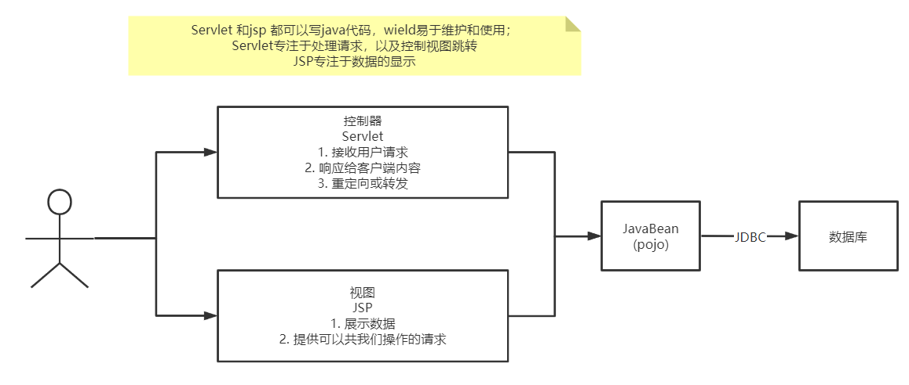
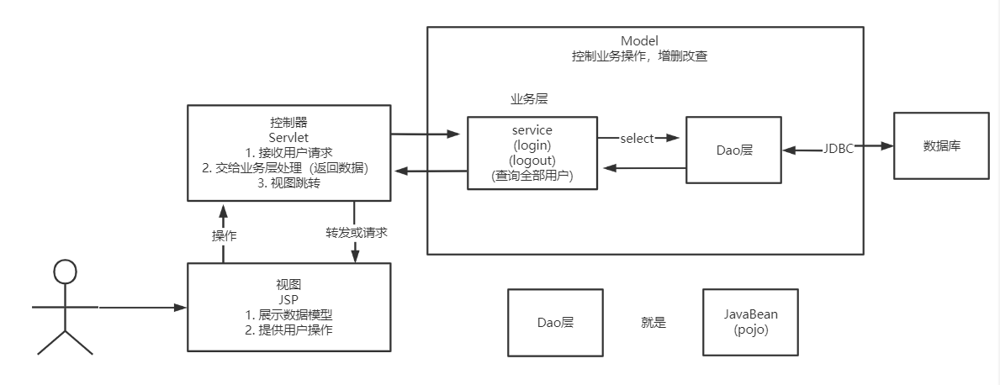

## MVC三层架构

Model, View, Controller   ： 模型、视图、控制器

模型：数据库

视图： jsp页面

控制器：Servlet

  

早期，直接在Servlet中使用JDBC访问数据库，弊端：程序十分复杂，不易维护。

Servlet 需要：处理请求、视图跳转、处理JDBC、处理业务代码、处理逻辑代码。

现在是三层架构：

Model：

* 处理业务：业务逻辑（Service 业务层）
* 数据持久化层：增删改查 （Dao）

View:

* 展示数据
* 提供链接，发起Servlet请求

Controller:

* 接收用户的请求：（request:,,,）
* 交给业务层处理对应的代码
* 控制视图的跳转

以登录为例：

>用户点击登录（视图）---> 接收用户的登录请求（控制器）----> 处理用户的请求（控制器获得用户的登录参数 username和password）----->交给业务层处理登录业务（业务层，判断用户密码是否正确：事务）---> Dao层查询用户名和密码是否正确---> 数据库

