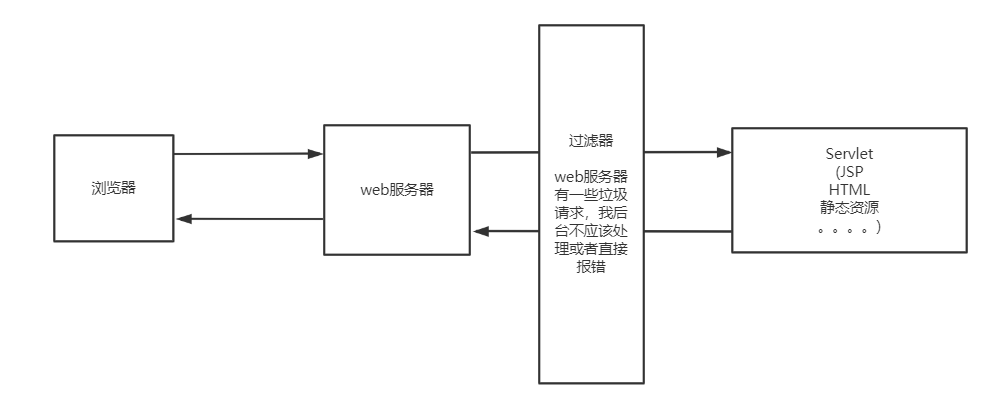

# Filter（重点）

Filter: 用来过滤网站的数据；

* 处理中文的乱码
* 登录验证



其实 过滤器和Serlvet一模一样，只不过过滤器实现过滤器接口，serlvet实现Servlet接口。

1. 导入的包：

```xml
<dependency>
    <groupId>javax.servlet</groupId>
    <artifactId>javax.servlet-api</artifactId>
    <version>4.0.1</version>
    <scope>compile</scope>
</dependency>

<dependency>
    <groupId>javax.servlet.jsp</groupId>
    <artifactId>javax.servlet.jsp-api</artifactId>
    <version>2.3.3</version>
</dependency>
```

2. 实现一个Servlet 类,处理请求，响应没设置编码，会出现中文乱码问题

   ```java
   public class ShowServlet extends HttpServlet {
       @Override
       protected void doGet(HttpServletRequest req, HttpServletResponse resp) throws ServletException, IOException {
           resp.getWriter().println("<h1>你好，世界</h1>");
       }
   
       @Override
       protected void doPost(HttpServletRequest req, HttpServletResponse resp) throws ServletException, IOException {
           doGet(req, resp);
       }
   }
   ```

3.  web.xml 注册servlet

   ```xml
   <servlet>
       <servlet-name>show</servlet-name>
       <servlet-class>com.liyajie.servlet.ShowServlet</servlet-class>
     </servlet>
   
   
     <servlet-mapping>
       <servlet-name>show</servlet-name>
       <url-pattern>/servlet/show</url-pattern>
     </servlet-mapping>
   ```

   访问路径为  /servlet/show 

   

4. 编写过滤器，处理中文乱码问题

   实现 javax.servlet.Filter 的Filter 接口

       // FilterChain 是过滤器链，有很多个过滤器，依次过滤
       // 1. 过滤中的所有代码，在过滤特定请求时侯都会执行
       // 2. 一定要让过滤器向下传播，否则拦截，chain.doFilter(request,response)
   ```java
   // 处理中文乱码
   public class CharacterEncodingFilter implements Filter {
   
       // 初始化,web服务器启动时就已经初始化了，为了随时监听过滤对象
       @Override
       public void init(FilterConfig filterConfig) throws ServletException {
           System.out.println("CharacterEncodingFilter 初始化");
       }
   
       // FilterChain 是过滤器链，有很多个过滤器，依次过滤
       // 1. 过滤中的所有代码，在过滤特定请求时侯都会执行
       // 2. 一定要让过滤器向下传播，否则拦截，chain.doFilter(request,response)
       @Override
       public void doFilter(ServletRequest request, ServletResponse response, FilterChain chain) throws IOException, ServletException {
           request.setCharacterEncoding("utf-8");
           response.setCharacterEncoding("utf-8");
           response.setContentType("text/html;charset=UTF-8");
   
           System.out.println("CharacterEncodingFilter执行前");
           chain.doFilter(request,response); // 我们的请求送入下一个过滤器链，如果不写，则程序到这就被拦截了。
           System.out.println("CharacterEncodingFilter执行后");
       }
   
       // 销毁，web服务器关闭时就已经销毁
       @Override
       public void destroy() {
           System.out.println("CharacterEncodingFilter 销毁");
       }
   }
   ```

5. web.xml 中注册过滤器：

   ```xml
   <filter>
       <filter-name>charfilter</filter-name>
       <filter-class>com.liyajie.filter.CharacterEncodingFilter</filter-class>
     </filter>
   
     <filter-mapping>
       <filter-name>charfilter</filter-name>
       <!--过滤/servlet下的任何请求-->
       <url-pattern>/servlet/*</url-pattern>
     </filter-mapping>
   ```

# 监听器Listener

实现一个监听器的接口；有N种方式。

例子：统计网站在线人数，就是统计有多少个session

```java
package com.liyajie.listener;

import javax.servlet.ServletContext;
import javax.servlet.http.HttpSessionEvent;
import javax.servlet.http.HttpSessionListener;

public class OnLineCountLinstener implements HttpSessionListener {
    // 创建session 的监听
    public void sessionCreated(HttpSessionEvent se) {
        ServletContext context = se.getSession().getServletContext();
        Integer count = (Integer)context.getAttribute("onlineCount");
        if(count==null){
            count= 1;
        } else{
            count++;
        }
        context.setAttribute("onlineCount",count);
    }

    // 销毁session 的监听
    public void sessionDestroyed(HttpSessionEvent se) {
        ServletContext context = se.getSession().getServletContext();
        Integer count = (Integer)context.getAttribute("onlineCount");
        context.setAttribute("onlineCount",count--);
    }
}
```

在 web.xml 中配置：

```xml
<listener>
    <listener-class>com.liyajie.listener.OnLineCountLinstener</listener-class>
  </listener>
```

监听器一般在GUI中监听事件用的比较多。


# Filter 实现权限拦截

用户登录之后才能进入主页，注销后不能进行主页。


