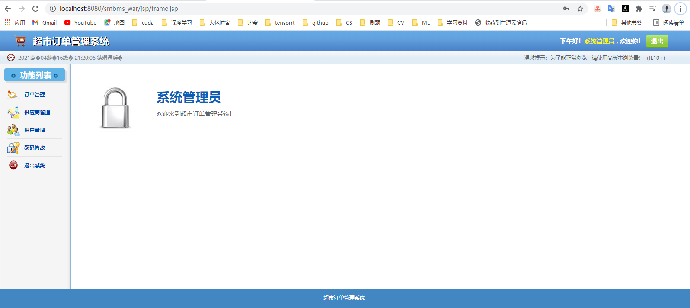
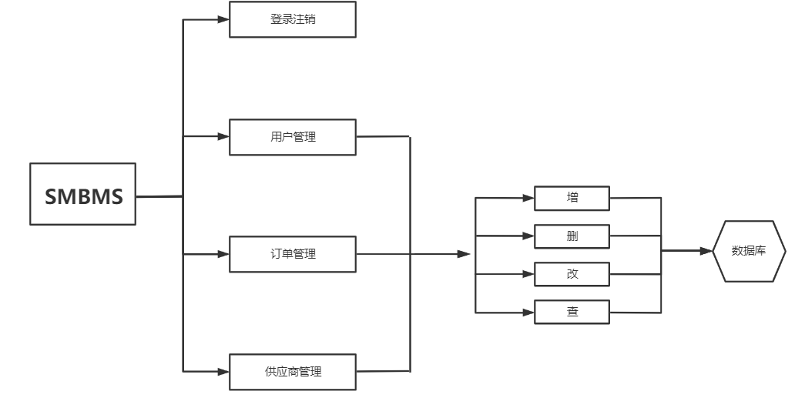
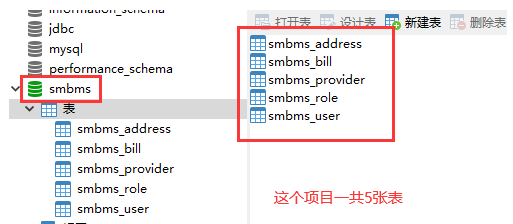
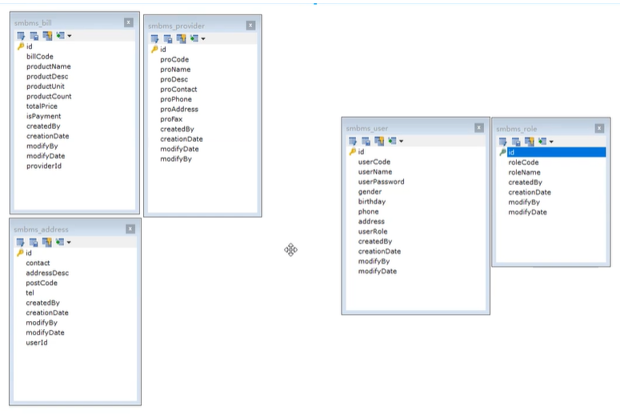
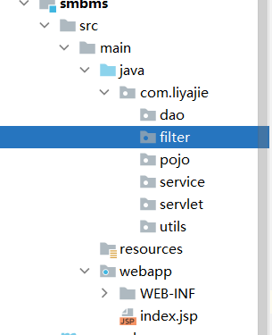
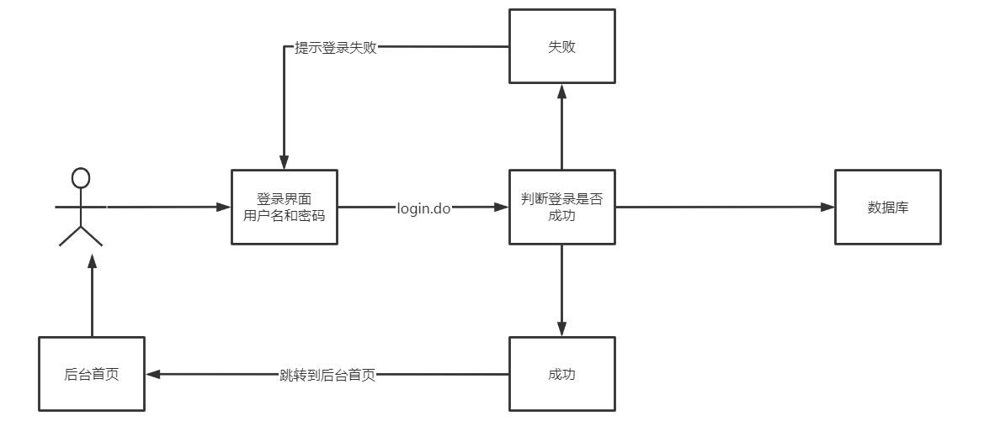
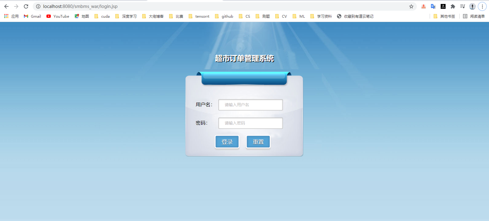
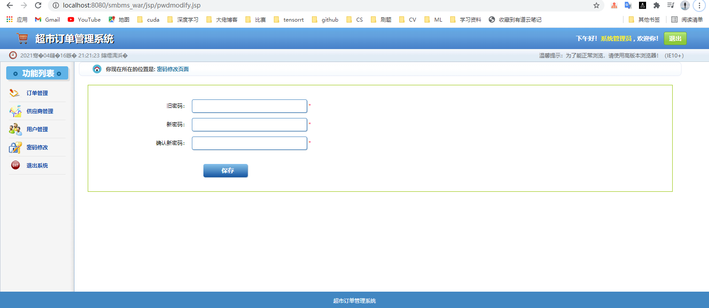
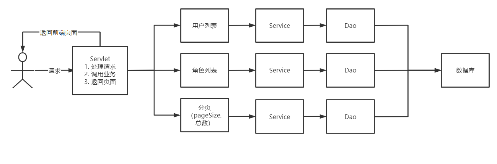

# SMBMS

订单管理系统









```sql
DROP TABLE IF EXISTS `smbms_address`;
CREATE TABLE `smbms_address`  (
  `id` BIGINT(20) NOT NULL AUTO_INCREMENT COMMENT '主键ID',
  `contact` VARCHAR(15) CHARACTER SET utf8 COLLATE utf8_unicode_ci NULL DEFAULT NULL COMMENT '联系人姓名',
  `addressDesc` VARCHAR(50) CHARACTER SET utf8 COLLATE utf8_unicode_ci NULL DEFAULT NULL COMMENT '收货地址明细',
  `postCode` VARCHAR(15) CHARACTER SET utf8 COLLATE utf8_unicode_ci NULL DEFAULT NULL COMMENT '邮编',
  `tel` VARCHAR(20) CHARACTER SET utf8 COLLATE utf8_unicode_ci NULL DEFAULT NULL COMMENT '联系人电话',
  `createdBy` BIGINT(20) NULL DEFAULT NULL COMMENT '创建者',
  `creationDate` DATETIME NULL DEFAULT NULL COMMENT '创建时间',
  `modifyBy` BIGINT(20) NULL DEFAULT NULL COMMENT '修改者',
  `modifyDate` DATETIME NULL DEFAULT NULL COMMENT '修改时间',
  `userId` BIGINT(20) NULL DEFAULT NULL COMMENT '用户ID',
  PRIMARY KEY (`id`) USING BTREE
) ENGINE = INNODB AUTO_INCREMENT = 7 CHARACTER SET = utf8 COLLATE = utf8_unicode_ci ROW_FORMAT = COMPACT;

-- ----------------------------
-- Records of smbms_address
-- ----------------------------
INSERT INTO `smbms_address` VALUES (1, '王丽', '北京市东城区东交民巷44号', '100010', '13678789999', 1, '2016-04-13 00:00:00', NULL, NULL, 1);
INSERT INTO `smbms_address` VALUES (2, '张红丽', '北京市海淀区丹棱街3号', '100000', '18567672312', 1, '2016-04-13 00:00:00', NULL, NULL, 1);
INSERT INTO `smbms_address` VALUES (3, '任志强', '北京市东城区美术馆后街23号', '100021', '13387906742', 1, '2016-04-13 00:00:00', NULL, NULL, 1);
INSERT INTO `smbms_address` VALUES (4, '曹颖', '北京市朝阳区朝阳门南大街14号', '100053', '13568902323', 1, '2016-04-13 00:00:00', NULL, NULL, 2);
INSERT INTO `smbms_address` VALUES (5, '李慧', '北京市西城区三里河路南三巷3号', '100032', '18032356666', 1, '2016-04-13 00:00:00', NULL, NULL, 3);
INSERT INTO `smbms_address` VALUES (6, '王国强', '北京市顺义区高丽营镇金马工业区18号', '100061', '13787882222', 1, '2016-04-13 00:00:00', NULL, NULL, 3);

-- ----------------------------
-- Table structure for smbms_bill
-- ----------------------------
DROP TABLE IF EXISTS `smbms_bill`;
CREATE TABLE `smbms_bill`  (
  `id` BIGINT(20) NOT NULL AUTO_INCREMENT COMMENT '主键ID',
  `billCode` VARCHAR(20) CHARACTER SET utf8 COLLATE utf8_unicode_ci NULL DEFAULT NULL COMMENT '账单编码',
  `productName` VARCHAR(20) CHARACTER SET utf8 COLLATE utf8_unicode_ci NULL DEFAULT NULL COMMENT '商品名称',
  `productDesc` VARCHAR(50) CHARACTER SET utf8 COLLATE utf8_unicode_ci NULL DEFAULT NULL COMMENT '商品描述',
  `productUnit` VARCHAR(10) CHARACTER SET utf8 COLLATE utf8_unicode_ci NULL DEFAULT NULL COMMENT '商品单位',
  `productCount` DECIMAL(20, 2) NULL DEFAULT NULL COMMENT '商品数量',
  `totalPrice` DECIMAL(20, 2) NULL DEFAULT NULL COMMENT '商品总额',
  `isPayment` INT(10) NULL DEFAULT NULL COMMENT '是否支付（1：未支付 2：已支付）',
  `createdBy` BIGINT(20) NULL DEFAULT NULL COMMENT '创建者（userId）',
  `creationDate` DATETIME NULL DEFAULT NULL COMMENT '创建时间',
  `modifyBy` BIGINT(20) NULL DEFAULT NULL COMMENT '更新者（userId）',
  `modifyDate` DATETIME NULL DEFAULT NULL COMMENT '更新时间',
  `providerId` INT(20) NULL DEFAULT NULL COMMENT '供应商ID',
  PRIMARY KEY (`id`) USING BTREE
) ENGINE = INNODB AUTO_INCREMENT = 24 CHARACTER SET = utf8 COLLATE = utf8_unicode_ci ROW_FORMAT = COMPACT;

-- ----------------------------
-- Records of smbms_bill
-- ----------------------------
INSERT INTO `smbms_bill` VALUES (1, 'BILL2016_001', '洗发水、护发素', '日用品-洗发、护发', '瓶', 500.00, 25000.00, 2, 1, '2014-12-14 13:02:03', NULL, NULL, 13);
INSERT INTO `smbms_bill` VALUES (2, 'BILL2016_002', '香皂、肥皂、药皂', '日用品-皂类', '块', 1000.00, 10000.00, 2, 1, '2016-03-23 04:20:40', NULL, NULL, 13);
INSERT INTO `smbms_bill` VALUES (3, 'BILL2016_003', '大豆油', '食品-食用油', '斤', 300.00, 5890.00, 2, 1, '2014-12-14 13:02:03', NULL, NULL, 6);
INSERT INTO `smbms_bill` VALUES (4, 'BILL2016_004', '橄榄油', '食品-进口食用油', '斤', 200.00, 9800.00, 2, 1, '2013-10-10 03:12:13', NULL, NULL, 7);
INSERT INTO `smbms_bill` VALUES (5, 'BILL2016_005', '洗洁精', '日用品-厨房清洁', '瓶', 500.00, 7000.00, 2, 1, '2014-12-14 13:02:03', NULL, NULL, 9);
INSERT INTO `smbms_bill` VALUES (6, 'BILL2016_006', '美国大杏仁', '食品-坚果', '袋', 300.00, 5000.00, 2, 1, '2016-04-14 06:08:09', NULL, NULL, 4);
INSERT INTO `smbms_bill` VALUES (7, 'BILL2016_007', '沐浴液、精油', '日用品-沐浴类', '瓶', 500.00, 23000.00, 1, 1, '2016-07-22 10:10:22', NULL, NULL, 14);
INSERT INTO `smbms_bill` VALUES (8, 'BILL2016_008', '不锈钢盘碗', '日用品-厨房用具', '个', 600.00, 6000.00, 2, 1, '2016-04-14 05:12:13', NULL, NULL, 14);
INSERT INTO `smbms_bill` VALUES (9, 'BILL2016_009', '塑料杯', '日用品-杯子', '个', 350.00, 1750.00, 2, 1, '2016-02-04 11:40:20', NULL, NULL, 14);
INSERT INTO `smbms_bill` VALUES (10, 'BILL2016_010', '豆瓣酱', '食品-调料', '瓶', 200.00, 2000.00, 2, 1, '2013-10-29 05:07:03', NULL, NULL, 8);
INSERT INTO `smbms_bill` VALUES (11, 'BILL2016_011', '海之蓝', '饮料-国酒', '瓶', 50.00, 10000.00, 1, 1, '2016-04-14 16:16:00', NULL, NULL, 1);
INSERT INTO `smbms_bill` VALUES (12, 'BILL2016_012', '芝华士', '饮料-洋酒', '瓶', 20.00, 6000.00, 1, 1, '2016-09-09 17:00:00', NULL, NULL, 1);
INSERT INTO `smbms_bill` VALUES (13, 'BILL2016_013', '长城红葡萄酒', '饮料-红酒', '瓶', 60.00, 800.00, 2, 1, '2016-11-14 15:23:00', NULL, NULL, 1);
INSERT INTO `smbms_bill` VALUES (14, 'BILL2016_014', '泰国香米', '食品-大米', '斤', 400.00, 5000.00, 2, 1, '2016-10-09 15:20:00', NULL, NULL, 3);
INSERT INTO `smbms_bill` VALUES (15, 'BILL2016_015', '东北大米', '食品-大米', '斤', 600.00, 4000.00, 2, 1, '2016-11-14 14:00:00', NULL, NULL, 3);
INSERT INTO `smbms_bill` VALUES (16, 'BILL2016_016', '可口可乐', '饮料', '瓶', 2000.00, 6000.00, 2, 1, '2012-03-27 13:03:01', NULL, NULL, 2);
INSERT INTO `smbms_bill` VALUES (17, 'BILL2016_017', '脉动', '饮料', '瓶', 1500.00, 4500.00, 2, 1, '2016-05-10 12:00:00', NULL, NULL, 2);
INSERT INTO `smbms_bill` VALUES (18, 'BILL2016_018', '哇哈哈', '饮料', '瓶', 2000.00, 4000.00, 2, 1, '2015-11-24 15:12:03', NULL, NULL, 2);
INSERT INTO `smbms_bill` VALUES (20, 'BILL2016_020', '洗洁精', '日用品-厨房清洁', '瓶', 500.00, 7000.00, 2, 1, '2018-08-27 13:19:12', NULL, NULL, 9);
INSERT INTO `smbms_bill` VALUES (21, '123', '123', NULL, '个', 123.00, 123.00, 1, 1, '2018-09-26 21:38:08', NULL, NULL, 1);
INSERT INTO `smbms_bill` VALUES (23, '12312', '1231', NULL, '123', 5000.00, 123.00, 2, 1, '2018-09-26 21:46:39', 1, '2018-09-26 22:26:30', 18);

-- ----------------------------
-- Table structure for smbms_provider
-- ----------------------------
DROP TABLE IF EXISTS `smbms_provider`;
CREATE TABLE `smbms_provider`  (
  `id` BIGINT(20) NOT NULL AUTO_INCREMENT COMMENT '主键ID',
  `proCode` VARCHAR(20) CHARACTER SET utf8 COLLATE utf8_unicode_ci NULL DEFAULT NULL COMMENT '供应商编码',
  `proName` VARCHAR(20) CHARACTER SET utf8 COLLATE utf8_unicode_ci NULL DEFAULT NULL COMMENT '供应商名称',
  `proDesc` VARCHAR(50) CHARACTER SET utf8 COLLATE utf8_unicode_ci NULL DEFAULT NULL COMMENT '供应商详细描述',
  `proContact` VARCHAR(20) CHARACTER SET utf8 COLLATE utf8_unicode_ci NULL DEFAULT NULL COMMENT '供应商联系人',
  `proPhone` VARCHAR(20) CHARACTER SET utf8 COLLATE utf8_unicode_ci NULL DEFAULT NULL COMMENT '联系电话',
  `proAddress` VARCHAR(50) CHARACTER SET utf8 COLLATE utf8_unicode_ci NULL DEFAULT NULL COMMENT '地址',
  `proFax` VARCHAR(20) CHARACTER SET utf8 COLLATE utf8_unicode_ci NULL DEFAULT NULL COMMENT '传真',
  `createdBy` BIGINT(20) NULL DEFAULT NULL COMMENT '创建者（userId）',
  `creationDate` DATETIME NULL DEFAULT NULL COMMENT '创建时间',
  `modifyDate` DATETIME NULL DEFAULT NULL COMMENT '更新时间',
  `modifyBy` BIGINT(20) NULL DEFAULT NULL COMMENT '更新者（userId）',
  PRIMARY KEY (`id`) USING BTREE
) ENGINE = INNODB AUTO_INCREMENT = 19 CHARACTER SET = utf8 COLLATE = utf8_unicode_ci ROW_FORMAT = COMPACT;

-- ----------------------------
-- Records of smbms_provider
-- ----------------------------
INSERT INTO `smbms_provider` VALUES (1, 'BJ_GYS001', '北京三木堂商贸有限公司', '长期合作伙伴，主营产品:茅台、五粮液、郎酒、酒鬼酒、泸州老窖、赖茅酒、法国红酒等', '张国强', '13566667777', '北京市丰台区育芳园北路', '010-58858787', 1, '2013-03-21 16:52:07', NULL, NULL);
INSERT INTO `smbms_provider` VALUES (4, 'GZ_GYS002', '深圳市喜来客商贸有限公司', '长期合作伙伴，主营产品：坚果炒货.果脯蜜饯.天然花茶.营养豆豆.特色美食.进口食品.海味零食.肉脯肉', '林妮1', '18599897645', '广东省深圳市福龙工业区B2栋3楼西', '0755-67772341', 1, '2013-03-22 16:52:07', '2018-09-24 21:28:07', 1);
INSERT INTO `smbms_provider` VALUES (8, 'ZJ_GYS001', '慈溪市广和绿色食品厂', '长期合作伙伴，主营产品：豆瓣酱、黄豆酱、甜面酱，辣椒，大蒜等农产品', '薛圣丹1', '18099953223', '浙江省宁波市慈溪周巷小安村', '0574-34449090', 1, '2013-11-21 06:02:07', '2018-09-28 19:54:31', 1);
INSERT INTO `smbms_provider` VALUES (9, 'GX_GYS001', '优百商贸有限公司', '长期合作伙伴，主营产品：日化产品', '李立国', '13323566543', '广西南宁市秀厢大道42-1号', '0771-98861134', 1, '2013-03-21 19:52:07', NULL, NULL);
INSERT INTO `smbms_provider` VALUES (18, '12', '234', '123', '234', '15815891967', '213', '123', 1, '2018-09-26 12:55:42', NULL, NULL);

-- ----------------------------
-- Table structure for smbms_role
-- ----------------------------
DROP TABLE IF EXISTS `smbms_role`;
CREATE TABLE `smbms_role`  (
  `id` BIGINT(20) NOT NULL AUTO_INCREMENT COMMENT '主键ID',
  `roleCode` VARCHAR(15) CHARACTER SET utf8 COLLATE utf8_unicode_ci NULL DEFAULT NULL COMMENT '角色编码',
  `roleName` VARCHAR(15) CHARACTER SET utf8 COLLATE utf8_unicode_ci NULL DEFAULT NULL COMMENT '角色名称',
  `createdBy` BIGINT(20) NULL DEFAULT NULL COMMENT '创建者',
  `creationDate` DATETIME NULL DEFAULT NULL COMMENT '创建时间',
  `modifyBy` BIGINT(20) NULL DEFAULT NULL COMMENT '修改者',
  `modifyDate` DATETIME NULL DEFAULT NULL COMMENT '修改时间',
  PRIMARY KEY (`id`) USING BTREE
) ENGINE = INNODB AUTO_INCREMENT = 8 CHARACTER SET = utf8 COLLATE = utf8_unicode_ci ROW_FORMAT = COMPACT;

-- ----------------------------
-- Records of smbms_role
-- ----------------------------
INSERT INTO `smbms_role` VALUES (1, 'SMBMS_ADMIN', '系统管理员', 1, '2016-04-13 00:00:00', NULL, NULL);
INSERT INTO `smbms_role` VALUES (2, 'SMBMS_MANAGER', '经理', 1, '2016-04-13 00:00:00', NULL, NULL);
INSERT INTO `smbms_role` VALUES (3, 'SMBMS_EMPLOYEE', '普通员工', 1, '2016-04-13 00:00:00', NULL, NULL);
INSERT INTO `smbms_role` VALUES (5, '11', '测试员', 1, '2016-04-13 00:00:00', NULL, NULL);
INSERT INTO `smbms_role` VALUES (7, 'SMBMS_MANA', '董事长', 1, '2018-09-30 20:11:48', 1, '2018-10-08 13:53:02');

-- ----------------------------
-- Table structure for smbms_user
-- ----------------------------
DROP TABLE IF EXISTS `smbms_user`;
CREATE TABLE `smbms_user`  (
  `id` BIGINT(20) NOT NULL AUTO_INCREMENT COMMENT '主键ID',
  `userCode` VARCHAR(15) CHARACTER SET utf8 COLLATE utf8_unicode_ci NULL DEFAULT NULL COMMENT '用户编码',
  `userName` VARCHAR(15) CHARACTER SET utf8 COLLATE utf8_unicode_ci NULL DEFAULT NULL COMMENT '用户名称',
  `userPassword` VARCHAR(15) CHARACTER SET utf8 COLLATE utf8_unicode_ci NULL DEFAULT NULL COMMENT '用户密码',
  `gender` INT(10) NULL DEFAULT NULL COMMENT '性别（1:女、 2:男）',
  `birthday` DATE NULL DEFAULT NULL COMMENT '出生日期',
  `phone` VARCHAR(15) CHARACTER SET utf8 COLLATE utf8_unicode_ci NULL DEFAULT NULL COMMENT '手机',
  `address` VARCHAR(30) CHARACTER SET utf8 COLLATE utf8_unicode_ci NULL DEFAULT NULL COMMENT '地址',
  `userRole` INT(10) NULL DEFAULT NULL COMMENT '用户角色（取自角色表-角色id）',
  `createdBy` BIGINT(20) NULL DEFAULT NULL COMMENT '创建者（userId）',
  `creationDate` DATETIME NULL DEFAULT NULL COMMENT '创建时间',
  `modifyBy` BIGINT(20) NULL DEFAULT NULL COMMENT '更新者（userId）',
  `modifyDate` DATETIME NULL DEFAULT NULL COMMENT '更新时间',
  `idPicPath` VARCHAR(255) CHARACTER SET utf8 COLLATE utf8_unicode_ci NULL DEFAULT NULL COMMENT '证件照路径',
  `workPicPath` VARCHAR(255) CHARACTER SET utf8 COLLATE utf8_unicode_ci NULL DEFAULT NULL COMMENT '工作证照片路径',
  PRIMARY KEY (`id`) USING BTREE
) ENGINE = INNODB AUTO_INCREMENT = 52 CHARACTER SET = utf8 COLLATE = utf8_unicode_ci ROW_FORMAT = COMPACT;

-- ----------------------------
-- Records of smbms_user
-- ----------------------------
INSERT INTO `smbms_user` VALUES (1, 'admin', '系统管理员', '1234567', 1, '1983-10-28', '13688889999', '北京市海淀区成府路207号', 1, 1, '2013-03-21 16:52:07', 1, '2018-09-28 13:21:12', NULL, NULL);
INSERT INTO `smbms_user` VALUES (2, 'liming', '李明', '0000000', 2, '1983-12-10', '13688884457', '北京市东城区前门东大街9号', 2, 1, '2013-03-21 00:00:00', NULL, NULL, NULL, NULL);
INSERT INTO `smbms_user` VALUES (5, 'hanlubiao', '韩路彪', '0000000', 2, '1984-06-05', '18567542321', '北京市朝阳区北辰中心12号', 2, 1, '2014-12-31 19:52:09', NULL, NULL, NULL, NULL);
INSERT INTO `smbms_user` VALUES (6, 'zhanghua', '张华', '0000000', 1, '1983-06-15', '13544561111', '北京市海淀区学院路61号', 3, 1, '2013-02-11 10:51:17', NULL, NULL, NULL, NULL);
INSERT INTO `smbms_user` VALUES (7, 'wangyang', '王洋', '0000000', 2, '1982-12-31', '13444561124', '北京市海淀区西二旗辉煌国际16层', 3, 1, '2014-06-11 19:09:07', NULL, NULL, NULL, NULL);
INSERT INTO `smbms_user` VALUES (10, 'sunlei', '孙磊', '0000000', 2, '1981-01-30', '13387676765', '北京市朝阳区管庄新月小区12楼', 2, 1, '2015-05-06 10:52:07', 1, '2018-09-28 13:20:56', NULL, NULL);
INSERT INTO `smbms_user` VALUES (14, 'yangguo', '杨过', '0000000', 2, '1980-01-01', '13388886623', '北京市朝阳区北苑家园茉莉园20号楼', 3, 1, '2015-02-01 03:52:07', NULL, NULL, NULL, NULL);
INSERT INTO `smbms_user` VALUES (39, 'ass', '邓振良', '1231231', 2, '2018-09-10', '15815891967', '北大青鸟', 1, 1, NULL, NULL, NULL, NULL, NULL);
INSERT INTO `smbms_user` VALUES (47, '测试1', '测试1', '123123123', 1, '2018-10-23', '15815891967', '测试1', 5, 1, '2018-09-29 14:01:46', 1, '2018-09-30 17:27:26', '1538201180302_Personal.jpg', '1538201110952_Personal.jpg');
INSERT INTO `smbms_user` VALUES (48, 'admin1', '张晨12', '123123123', 1, '2018-09-28', '15815891967', '测试1', 5, 1, '2018-09-29 16:15:34', NULL, NULL, '1538209618900_Personal.jpg', '1538209900746_Personal.jpg');
INSERT INTO `smbms_user` VALUES (49, 'aa', '1231', '123123123', 1, '2018-09-12', '15815189167', '北大青鸟', 5, 1, '2018-09-29 17:19:54', NULL, NULL, '1538213548680_Personal.jpg', '1538213001444_Personal.jpg');
INSERT INTO `smbms_user` VALUES (50, '测试11111', '12312312', '123123123', 1, '2018-10-09', '15815891967', '测试1', 7, 1, '2018-10-08 14:03:44', NULL, NULL, '1538979518768_Personal.jpg', '1538978729725_Personal.jpg');
INSERT INTO `smbms_user` VALUES (51, 'ADMINs', 'huaa', '1231231', 1, '2018-10-08', '15815891967', '测试1', 3, 1, '2018-10-08 14:21:02', NULL, NULL, '1538979676349_Personal.jpg', '1538979979076_Personal.jpg');

SET FOREIGN_KEY_CHECKS = 1;
```

## 1.  环境搭建

1. 导入jar 包：

```xml
<dependency>
    <groupId>javax.servlet</groupId>
    <artifactId>javax.servlet-api</artifactId>
    <version>4.0.1</version>
</dependency>

<!-- https://mvnrepository.com/artifact/javax.servlet.jsp/javax.servlet.jsp-api -->
<dependency>
    <groupId>javax.servlet.jsp</groupId>
    <artifactId>javax.servlet.jsp-api</artifactId>
    <version>2.3.3</version>
</dependency>

<dependency>
    <groupId>mysql</groupId>
    <artifactId>mysql-connector-java</artifactId>
    <version>8.0.23</version>
</dependency>

<dependency>
    <groupId>javax.servlet.jsp.jstl</groupId>
    <artifactId>jstl-api</artifactId>
    <version>1.2</version>
</dependency>

<dependency>
    <groupId>taglibs</groupId>
    <artifactId>standard</artifactId>
    <version>1.1.2</version>
</dependency>
```

2. 创建项目结构：

   

3. 写实体类

   class User, Role, Provider, Bill

4. 配置数据库 db.properties

   ```properties
   driver=com.mysql.cj.jdbc.Driver
   url=jdbc:mysql://localhost:3306/smbsm?useUnicode=true&characterEncoding=utf-8
   username=root
   password=
   ```

5. 操作数据库的基本工具类

   ```java
   package com.liyajie.dao;
   
   import java.io.IOException;
   import java.io.InputStream;
   import java.sql.*;
   import java.util.Properties;
   
   public class BaseDao {
       private static String driver;
       private static String url;
       private static String username;
       private static String password;
   
       static {
           InputStream is = BaseDao.class.getClassLoader().getResourceAsStream("db.properties");
           Properties properties = new Properties();
           try {
               properties.load(is);
           } catch (IOException e) {
               e.printStackTrace();
           }
           driver=properties.getProperty("driver");
           url=properties.getProperty("url");
           username=properties.getProperty("username");
           password=properties.getProperty("password");
   
           // 加载驱动，驱动只用加载一次
           try {
               Class.forName(driver);
           } catch (ClassNotFoundException e) {
               e.printStackTrace();
           }
       }
   
       // 获取数据库链接
       public  static Connection getConnection() throws SQLException {
           return DriverManager.getConnection(url, username, password);
       }
   
       // 编写查询公共方法
       public static ResultSet execute(Connection connection,String sql,Object[] params,
                                       PreparedStatement statement,ResultSet resultSet) throws SQLException {
           statement = connection.prepareStatement(sql);
           for(int i=0;i<params.length;i++){
               statement.setObject(i+1,params[i]);
           }
           resultSet = statement.executeQuery();
           return resultSet;
       }
   
       // 编写增删改公共方法
       public static int execute(Connection connection,String sql,Object[] params,
                                       PreparedStatement statement) throws SQLException {
           statement = connection.prepareStatement(sql);
           for(int i=0;i<params.length;i++){
               statement.setObject(i+1,params[i]);
           }
           int updateRows = statement.executeUpdate();
           return updateRows;
       }
   
       // 释放资源
       public  static void release(Connection connection, Statement statement, ResultSet resultSet){
           if(resultSet!=null) {
               try {
                   resultSet.close();
               } catch (SQLException throwables) {
                   throwables.printStackTrace();
               }
           }
           if(statement!=null){
               try {
                   statement.close();
               } catch (SQLException throwables) {
                   throwables.printStackTrace();
               }
           }
           if(connection!=null){
               try {
                   connection.close();
               } catch (SQLException throwables) {
                   throwables.printStackTrace();
               }
           }
   
       }
   
   }
   ```

6.  编写网页字符过滤1器，持处理乱码问题,并注册

   ```java
   public class CharacterEncondingFilter implements Filter {
       @Override
       public void init(FilterConfig filterConfig) throws ServletException {
   
       }
   
       @Override
       public void doFilter(ServletRequest request, ServletResponse response, FilterChain chain) throws IOException, ServletException {
           request.setCharacterEncoding("utf-8");
           response.setCharacterEncoding("utf-8");
           response.setContentType("text/html;charset=utf-8");
           chain.doFilter(request,response);
       }
   
       @Override
       public void destroy() {
   
       }
   }
   ```

   web.xml中注册

   ```xml
   <filter>
       <filter-name>encodingfilter</filter-name>
       <filter-class>com.liyajie.filter.CharacterEncondingFilter</filter-class>
   </filter>
   <filter-mapping>
       <filter-name>encodingfilter</filter-name>
       <url-pattern>/*</url-pattern>
   </filter-mapping>
   ```

7. 导入静态资源


## 2. 登录流程实现



1. 编写前端页面：

   login.jsp，并在web.xml设置欢迎页为login.jsp

   ```xml
   <!--  设置欢迎界面 就不走index.jsp -->
     <welcome-file-list>
       <welcome-file>login.jsp</welcome-file>
     </welcome-file-list>
   ```

   

2. 编写Dao层得到用户登录的接口：

   ```java
   public interface UserDao {
       // 得到要登录的用户
       public User getLoginUser(Connection connection,String userCode);
   }
   ```

3. 编写Dao接口的实现类：

   ```java
   public class UserDaoImpl implements UserDao {
       // 得到用户数据
       @Override
       public User getLoginUser(Connection connection, String userCode) {
           String sql="select * from smbms_user where userCode=?";
           Object[] params={userCode};
           PreparedStatement statement=null;
           ResultSet resultSet=null;
           User user=null;
           try {
               resultSet = BaseDao.execute(connection, statement, resultSet, sql, params);
               if (resultSet.next()){
                   user=new User();
                   user.setId(resultSet.getInt("id"));
                   user.setUserCode(resultSet.getString("userCode"));
                   user.setUserName(resultSet.getString("userName"));
                   user.setUserPassword(resultSet.getString("userPassword"));
                   user.setGender(resultSet.getInt("gender"));
                   user.setBirthday(resultSet.getDate("birthday"));
                   user.setPhone(resultSet.getString("phone"));
                   user.setAddress(resultSet.getString("address"));
                   user.setUserRole(resultSet.getInt("userRole"));
                   user.setCreatedBy(resultSet.getInt("createBy"));
                   user.setCreationDate(resultSet.getTimestamp("creationDate"));
                   user.setModifyBy(resultSet.getInt("modifyBy"));
                   user.setModifyDate(resultSet.getTimestamp("modifyDate"));
               }
               BaseDao.release(null,statement,resultSet);
           } catch (SQLException throwables) {
               throwables.printStackTrace();
           }
           return user;
       }
   }
   ```

4. 编写业务层接口

   ```java
   public interface UserService {
   
       // 用户登录
       public User login(String userCode, String password);
   }
   ```

5. 业务层实现：

   ```java
   public class UserServiceImpl implements UserService {
       private UserDao userDao;
   
       public UserServiceImpl(){
           userDao=new UserDaoImpl();
       }
       @Override
       public User login(String userCode, String password) {
           Connection connection=null;
           User user=null;
           connection= BaseDao.getConnection();
   
           // 通过业务层调用对应的具体数据库操作
           user= userDao.getLoginUser(connection, userCode);
           BaseDao.release(connection,null,null);
           if(user!=null ){
               if(user.getUserPassword().equals(password))
                   return user;
               else
                   return null;
           }
           return null;
       }
   
       @Test
       public void test(){
           UserServiceImpl userService=new UserServiceImpl();
           User admin = userService.login("admin", "1234567");
           System.out.println(admin.getUserPassword());
       }
   }
   ```

6.  LoginServlet 实现处理请求 login.do

   ```java
   package com.liyajie.servlet;
   
   import com.liyajie.pojo.User;
   import com.liyajie.service.UserServiceImpl;
   import com.liyajie.utils.Constants;
   
   import javax.servlet.ServletException;
   import javax.servlet.http.HttpServlet;
   import javax.servlet.http.HttpServletRequest;
   import javax.servlet.http.HttpServletResponse;
   import javax.servlet.http.HttpSession;
   import java.io.IOException;
   
   public class LoginServlet extends HttpServlet {
   
       // Servlet 控制层调用业务层代码
       @Override
       protected void doGet(HttpServletRequest req, HttpServletResponse resp) throws ServletException, IOException {
           // 获取用户名和密码
           String userCode = req.getParameter("userCode");
           String userPassword = req.getParameter("userPassword");
   
           // 和数据库中密码进行对比
           UserServiceImpl userService = new UserServiceImpl();
           User user = userService.login(userCode, userPassword);
           if(user!=null){ // 查有此人，可以登录
               // 将用户的信息放在session
               HttpSession session = req.getSession();
               session.setAttribute(Constants.USER_SESSION,user);
   
               // 跳转到主页
               resp.sendRedirect("jsp/frame.jsp");
           } else{ // 查无此人，
               // 转发会登录页面，顺带提示登录错误
               req.setAttribute("error","用户名或密码不正确");
               req.getRequestDispatcher("login.jsp").forward(req,resp);
           }
       }
   
       @Override
       protected void doPost(HttpServletRequest req, HttpServletResponse resp) throws ServletException, IOException {
           doGet(req,resp);
       }
   }
   ```

   注册servlet

   ```xml
   <servlet>
       <servlet-name>login</servlet-name>
       <servlet-class>com.liyajie.servlet.LoginServlet</servlet-class>
     </servlet>
     <servlet-mapping>
       <servlet-name>login</servlet-name>
       <url-pattern>/login.do</url-pattern>
     </servlet-mapping>
   ```

7. 用户注销

   思路：移除session。返回到login 界面

   ```java
   public class LogoutServlet extends HttpServlet {
   
       @Override
       protected void doGet(HttpServletRequest req, HttpServletResponse resp) throws ServletException, IOException {
           HttpSession session = req.getSession();
           session.removeAttribute(Constants.USER_SESSION); // 移除用户
           // 回到登录界面
   
           resp.sendRedirect(req.getContextPath()+"/login.jsp");
       }
   
       @Override
       protected void doPost(HttpServletRequest req, HttpServletResponse resp) throws ServletException, IOException {
           doGet(req, resp);
       }
   }
   ```

   注册 servlet

   ```xml
   <servlet>
       <servlet-name>logout</servlet-name>
       <servlet-class>com.liyajie.servlet.LogoutServlet</servlet-class>
   </servlet>
   
   
   <servlet-mapping>
       <servlet-name>logout</servlet-name>
       <url-pattern>/logout.do</url-pattern>
   </servlet-mapping>
   ```

8. 登录拦截优化

   ```java
   public class SysFilter implements Filter {
       @Override
       public void init(FilterConfig filterConfig) throws ServletException {
   
       }
   
       @Override
       public void doFilter(ServletRequest request, ServletResponse response, FilterChain chain) throws IOException, ServletException {
   
           HttpServletRequest req=(HttpServletRequest)request;
           HttpServletResponse resp=(HttpServletResponse)response;
   
           // 从session中获取用户
           Object user = req.getSession().getAttribute(Constants.USER_SESSION);
           if(user==null){
               // 用户已经注销，或没有登录
               resp.sendRedirect(req.getContextPath()+"/error.jsp");
           } else{
               chain.doFilter(request,response);
           }
       }
   
       @Override
       public void destroy() {
   
       }
   }
   ```

   注册：

   ```xml
   
   <filter>
       <filter-name>loginfilter</filter-name>
       <filter-class>com.liyajie.filter.SysFilter</filter-class>
   </filter>
   
   <filter-mapping>
       <filter-name>loginfilter</filter-name>
       <url-pattern>/jsp/*</url-pattern>
   </filter-mapping>
   ```

   

## 3 密码修改



1. UserDao:

   ```java
   public interface UserDao {
       // 得到要登录的用户
       public User getLoginUser(Connection connection,String userCode);
   
       // 修改当前用户密码
       public int updatePwd(Connection connection,int id,String password);
   }
   ```

2. UserDaoImpl实现类：

   ```java
    @Override
   public int updatePwd(Connection connection, int id, String password) {
       PreparedStatement statement=null;
       String sql="select smbms_user set userPassword=? where id=?";
       Object[] params={id,password};
       int result = 0;
       if(connection!=null){
           try {
               result=BaseDao.execute(connection,statement,sql,params);
           } catch (SQLException throwables) {
               throwables.printStackTrace();
           }
           BaseDao.release(connection,statement,null);
       }
       return result;
   }
   ```

3. UserService 接口

   ```java
   public interface UserService {
   
       // 用户登录
       public User login(String userCode, String password);
   
       // 根据id 修改用户密码
       public boolean updatePwd(int id, String password);
   }
   
   ```

4. UserServiceImpl

   ```java
   @Override
   public boolean updatePwd(int id, String password) {
       Connection connection=null;
       connection  = BaseDao.getConnection();
       int result = userDao.updatePwd(connection, id, password);
       BaseDao.release(connection,null,null);
       return result>0;
   }
   ```

5. Servlet 实现

   ```java
   package com.liyajie.servlet;
   
   import com.liyajie.pojo.User;
   import com.liyajie.service.UserService;
   import com.liyajie.service.UserServiceImpl;
   import com.liyajie.utils.Constants;
   import com.mysql.cj.util.StringUtils;
   
   import javax.servlet.ServletException;
   import javax.servlet.http.HttpServlet;
   import javax.servlet.http.HttpServletRequest;
   import javax.servlet.http.HttpServletResponse;
   import javax.servlet.http.HttpSession;
   import java.io.IOException;
   
   // 使用Servlet 复用
   public class UserServlet extends HttpServlet {
       @Override
       protected void doGet(HttpServletRequest req, HttpServletResponse resp) throws ServletException, IOException {
           String method = req.getParameter("method");
           if(method!=null && method.equals("savepwd")){
               updatePwd(req, resp);
           }
       }
   
       @Override
       protected void doPost(HttpServletRequest req, HttpServletResponse resp) throws ServletException, IOException {
           doGet(req, resp);
       }
   
       public void updatePwd(HttpServletRequest req, HttpServletResponse resp){
           HttpSession session = req.getSession();
           Object user = session.getAttribute(Constants.USER_SESSION);
   
           String newpassword = req.getParameter("newpassword");
           if(user!=null && !StringUtils.isNullOrEmpty(newpassword)){
               UserServiceImpl userService = new UserServiceImpl();
               boolean isOk=userService.updatePwd(((User)user).getId(),newpassword);
               if(isOk){
                   req.setAttribute("message","修改密码成功，请退出使用新密码登录");
                   // 密码修改成功，移除 session
                   req.getSession().removeAttribute(Constants.USER_SESSION);
               } else{
                   req.setAttribute("message","修改密码失败");
               }
           } else {
               req.setAttribute("message","新密码错误");
           }
           try {
               req.getRequestDispatcher("pwdmodify.jsp").forward(req,resp);
           } catch (ServletException e) {
               e.printStackTrace();
           } catch (IOException e) {
               e.printStackTrace();
           }
       }
   }
   ```

6. 优化密码，使用Ajax 进行旧密码验证

   ```java
   
   protected void doGet(HttpServletRequest req, HttpServletResponse resp) throws ServletException, IOException {
           String method = req.getParameter("method");
           if(method!=null && method.equals("savepwd")){
               updatePwd(req, resp);
           } else if (method.equals("pwdmodify")){
               checkOldPassword(req,resp);
           }
       }
   
   
   public void checkOldPassword(HttpServletRequest req, HttpServletResponse resp){
       User user = (User)req.getSession().getAttribute(Constants.USER_SESSION);
       String oldpassword = req.getParameter("oldpassword");
   
       HashMap<String,String> resultMap=new HashMap<>();
   
       if(user==null){  // session 失效
           resultMap.put("result","sessionerror");
       } else if (StringUtils.isNullOrEmpty(oldpassword)){
           resultMap.put("result","error");
       }else{
           if(user.getUserPassword().equals(oldpassword)){
               resultMap.put("result","true");
           } else{
               resultMap.put("result","false");
           }
       }
       resp.setContentType("application/json");
       try {
           resp.getWriter().write(JSONArray.toJSONString(resultMap)); // 阿里的工具类
       } catch (IOException e) {
           e.printStackTrace();
       }
   }
   ```

## 4 用户管理底层实现



1. 实现分页的工具类

   ```java
   package com.liyajie.utils;
   
   public class PageSupport {
       //当前页码-来自于用户输入
       private int currentPageNo = 1;
   
       //总数量（表）
       private int totalCount = 0;
   
       //页面容量
       private int pageSize = 0;
   
       //总页数-totalCount/pageSize（+1）
       private int totalPageCount = 1;
   
       public int getCurrentPageNo() {
           return currentPageNo;
       }
   
       public void setCurrentPageNo(int currentPageNo) {
           if(currentPageNo > 0){
               this.currentPageNo = currentPageNo;
           }
       }
   
       public int getTotalCount() {
           return totalCount;
       }
   
       public void setTotalCount(int totalCount) {
           if(totalCount > 0){
               this.totalCount = totalCount;
               //设置总页数
               this.setTotalPageCountByRs();
           }
       }
       public int getPageSize() {
           return pageSize;
       }
   
       public void setPageSize(int pageSize) {
           if(pageSize > 0){
               this.pageSize = pageSize;
           }
       }
   
       public int getTotalPageCount() {
           return totalPageCount;
       }
   
       public void setTotalPageCount(int totalPageCount) {
           this.totalPageCount = totalPageCount;
       }
   
       public void setTotalPageCountByRs(){
           if(this.totalCount % this.pageSize == 0){
               this.totalPageCount = this.totalCount / this.pageSize;
           }else if(this.totalCount % this.pageSize > 0){
               this.totalPageCount = this.totalCount / this.pageSize + 1;
           }else{
               this.totalPageCount = 0;
           }
       }
   
   }
   ```

   

2. 用户列表导入 userlist.jsp

3. UserDaoImpl

   ```java
   @Override
   public int getUserCount(Connection connection, String username, int userRole) throws SQLException {
       PreparedStatement statement=null;
       ResultSet resultSet=null;
       int count=0;
       if(connection!=null){
           StringBuffer sql=new StringBuffer();
           sql.append("select count(1) as count from smbms_user u,smbms_role r where u.userRole=r.id ");
   
           ArrayList<Object> list = new ArrayList<>(); //存放参数
           if(!StringUtils.isNullOrEmpty(username)){
               sql.append("and u.userName like ? ");
               list.add("%"+username+"%");
           }
           if(userRole>0){
               sql.append("and u.userRole=? ");
               list.add(userRole);
           }
   
           Object[] params= list.toArray();
   
           try {
               resultSet = BaseDao.execute(connection, statement, resultSet, sql.toString(), params);
           } catch (SQLException throwables) {
               throwables.printStackTrace();
           }
           if(resultSet!=null && resultSet.next()){
               count=resultSet.getInt("count");
           }
           BaseDao.release(connection,statement,resultSet);
       }
       return count;
   }
   ```

4. UserServiceImpl

   ```java
   @Override
   public int getUserCount(String username, int userRole) {
       Connection connection = BaseDao.getConnection();
       int userCount=0;
       try {
           userCount = userDao.getUserCount(connection, username, userRole);
       } catch (SQLException throwables) {
           throwables.printStackTrace();
       } finally {
           BaseDao.release(connection,null,null);
       }
       return userCount;
   }
   ```

5. 获取用户列表，类似。

   ```java
   public List<User> getUserList(Connection connection, String username, int userRole,
                                 int currentPageNo,int pageSize) throws SQLException{
       PreparedStatement statement=null;
       ResultSet resultSet=null;
   
       List<User> userList=new ArrayList<>();
   
       if(connection!=null){
           StringBuffer sql=new StringBuffer();
           sql.append("select u.*,r.roleName as userRoleName as count from smbms_user u,smbms_role r where u.userRole=r.id ");
   
           ArrayList<Object> list = new ArrayList<>(); //存放参数
           if(!StringUtils.isNullOrEmpty(username)){
               sql.append("and u.userName like ? ");
               list.add("%"+username+"%");
           }
           if(userRole>0){
               sql.append("and u.userRole=? ");
               list.add(userRole);
           }
   
           sql.append("order by creationDate DESC limit ?,?");
           currentPageNo=(currentPageNo-1)*pageSize;
           list.add(currentPageNo);
           list.add(pageSize);
           Object[] params= list.toArray();
   
           try {
               resultSet = BaseDao.execute(connection, statement, resultSet, sql.toString(), params);
           } catch (SQLException throwables) {
               throwables.printStackTrace();
           }
           while (resultSet!=null && resultSet.next()){
               User _user=new User();
               _user.setId(resultSet.getInt("id"));
               _user.setUserCode(resultSet.getString("userCode"));
               _user.setUserName(resultSet.getString("userName"));
               _user.setGender(resultSet.getInt("gender"));
               _user.setBirthday(resultSet.getDate("birthday"));
               _user.setPhone(resultSet.getString("phone"));
               _user.setUserRole(resultSet.getInt("userRole"));
               _user.setUserRoleName(resultSet.getString("userRoleName"));
               userList.add(_user);
           }
           BaseDao.release(connection,statement,resultSet);
       }
       return userList;
   }
   ```

   