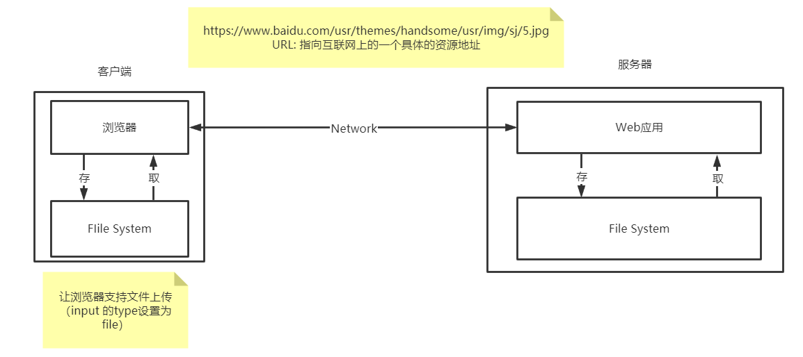

# 文件上传


## 文件下传：

```java
public class FileServlet extends HttpServlet {

    @Override
    protected void doGet(HttpServletRequest req, HttpServletResponse resp) throws ServletException, IOException {
//        1. 要获取下载文件的路径
        String realPath = "E:\\Java\\Maven\\javaweb\\servlet-04-response\\src\\main\\resources\\m7.jpg";
        System.out.println("下载文件的路径： "+realPath);
//        2. 下载文件名是什么
        String fileName = realPath.substring(realPath.lastIndexOf("\\") + 1);
//        3. 设置想办法让浏览器能够支持下载的东西,使用utf-8 解决中文乱码
        resp.setHeader("Content-disposition","attachment;filename="+ URLEncoder.encode(fileName,"utf-8"));
//        4. 获取下载文件的输入流
        FileInputStream in = new FileInputStream(realPath);
//        5. 创建缓存区
        int len=1024;
        byte[] buffer=new byte[1024];
//        6. 获取OutputStream 对象
        ServletOutputStream outputStream = resp.getOutputStream();
//        7. 将FileOutputStream 流写入buffer缓存区
        while (in.read(buffer)!=-1){
            outputStream.write(buffer,0,len);
        }
//        8. 使用outputStream 将缓存区中的数据输出到客户端。
        in.close();
        outputStream.close();
    }

    @Override
    protected void doPost(HttpServletRequest req, HttpServletResponse resp) throws ServletException, IOException {
        doGet(req, resp);
    }
}
```



## 文件上传

依赖的jar 包：

```xml
<!-- https://mvnrepository.com/artifact/commons-io/commons-io -->
<dependency>
    <groupId>commons-io</groupId>
    <artifactId>commons-io</artifactId>
    <version>2.8.0</version>
</dependency>
<!-- https://mvnrepository.com/artifact/commons-fileupload/commons-fileupload -->
<dependency>
    <groupId>commons-fileupload</groupId>
    <artifactId>commons-fileupload</artifactId>
    <version>1.3.3</version>
</dependency>
```

1. 文件上传的注意事项（调优）：

   1. 为例保证服务器安全，上传文件应该放在外界无法直接访问的目录下，比如放于WEB-INF目录下
   2. 为防止文件覆盖的发生，要为上传的文件产生一个唯一的文件名
   3. 要限制上传文件的最大值
   4. 可以限制上传文件的类型，在收到上传文件名时，判断后缀名是否合法。

2. 需要用到的类：

   **ServletFileUpload** 负责处理上传的文件数据，并将表单中每个输入项封装成一个**FileItem**对象，再使用ServletFileUpload对象解析请求时需要**DiskFileItemFactory**对象。所以，我们需要在进行解析工作前构造好DiskFileItemFactory对象，通过ServletFileUpload对象的构造方法或者setFileItemFactory() 方法设置ServletFileUpload 对象的**fileItemFactory**属性。

* **FIleItem 类**

在HTML页面中必须有一个 input 

```html
<input type="file" name="filename">
```

表单中如果包含文件上传输入项的话，这个表单的enctype属性必须设置为 mutipart/form-data:

```html
<form action="${pageContext.request.contextPath}/upload.do" enctype="mutipart/form-data"  method="post">
    上传用户：<input type="text" name="username"><br>
    上传文件1：<input type="file" name="file1"><br>
    上传文件2：<input type="file" name="file2"><br>
    <input type="sumbit" value="提交">
</form>

```

设置为 mutipart/form-data 在浏览器就需要使用流获取。

index.jsp

```jsp
<%@ page contentType="text/html;charset=UTF-8" language="java" isELIgnored="false" %>
<html>
    <head>
        <title>Title</title>
    </head>
    <body>
        <%--
        通过表单上传文件，
        get: 上传文件大小有限制
        post: 上传文件大小没有限制
        --%>
        <form action="${pageContext.request.contextPath}/upload.do" method="post" enctype="multipart/form-data">
            用户名：<input type="text" name="username"><br>
            <p> <input type="file" name="filename1"></p>
            <p> <input type="file" name="filename2"></p>
            <p><input type="submit" value="上传"></p>
        </form>
    </body>
</html>
```

常用方法：

```java
//isFormFile方法用于判断FileItem类对象封装的数据是一个普通文本表单
//还是一个文件表单，如果时普通表单字段则返回true，否则返回false
boolean isField();

//getFieldName方法用于返回表单标签name属性的值
String getFieldName();
//getString方法用于将FileItem对象中保存的数据流内容以一个字符串返回
String getString();

//getName方法用于获得文件上传字段中的文件名。
String getName();

//以流的形式返回上传文件的数据内容。
InputStream getInputStream();

//delete方法用来清空FileItem类对象中存放的主体内容
//如果主体内容被保存在临时文件中，delete方法将删除该临时文件
void delete();
```

* **ServletFileUpload类**

负责处理上传的文件数据，并将表单中每个输入项封装成一个FilteItem对象，使用其 parseRequest(HttpServletRequest) 方法可以将通过表单中每一个html标签提交的数据封装成一个FileItem对象，然后以List列表的形式返回。使用该方法处理上传文件简单易用。

* 代码编写

```JAVA
package com.liyajie.servlet;

import org.apache.commons.fileupload.FileItem;
import org.apache.commons.fileupload.FileUploadException;
import org.apache.commons.fileupload.ProgressListener;
import org.apache.commons.fileupload.disk.DiskFileItemFactory;
import org.apache.commons.fileupload.servlet.ServletFileUpload;

import javax.servlet.*;
import javax.servlet.http.*;
import java.io.File;
import java.io.FileOutputStream;
import java.io.IOException;
import java.io.InputStream;
import java.util.List;
import java.util.UUID;

public class FileServlet extends HttpServlet {
    @Override
    protected void doGet(HttpServletRequest request, HttpServletResponse response) throws ServletException, IOException {
        // 1. 判断上传的文件是普通表单还是带文件的表单
        if(!ServletFileUpload.isMultipartContent(request)){
            return;
        }
        // 2. 创建上传文件的保存路径
        String uploadPath = this.getServletContext().getRealPath("/WEB-INF/upload");
        File uploadFileDir=new File(uploadPath);
        if(!uploadFileDir.exists()){
            // 目录不存在
            uploadFileDir.mkdir();
        }

        // 3. 缓存，临时文件，假如文件超过了预期的大小，我们就把它放在一个临时文件中，果几天自动删除，或者提醒用户转存为永久。
        String tmpPath = this.getServletContext().getRealPath("/WEB-INF/tmp");
        File tmpFileDir=new File(tmpPath);
        if(!tmpFileDir.exists()){
            // 目录不存在
            tmpFileDir.mkdir();
        }

        // 4. 处理上传的文件一般都使用流来获取，我们可以使用request.getInputStream() 原生态的文件上传流获取。十分麻烦
        // 但是我们都建议使用Apache 的文件上传组件来实现， common-fileupload, 他需要依赖于 common-io 组件
        // 1. 创建DiskFileItemFactory对象，处理文件上传路径或者大小限制
        DiskFileItemFactory factory=new DiskFileItemFactory();
        // 通过这个工厂设置一个缓存区，当上传文件大于这个缓存区时，将它放在临时文件中。,下面有默认值，可以设置
        factory.setSizeThreshold(1024*1024); // 缓冲区大小为1MB, 字节为单位
        factory.setRepository(tmpFileDir); // 临时文件的目录，需要一个File

        // 2.获取ServletFileUpload
        ServletFileUpload servletFileUpload = new ServletFileUpload(factory);
        // 监听文件上传进度
        servletFileUpload.setProgressListener(new ProgressListener() {

            // pContentLength 文件大小
            // pBytesRead 已读取文件大小
            @Override
            public void update(long pBytesRead, long pContentLength, int pItems) {
                System.out.println("总大小： "+pContentLength+"已上传："+pBytesRead);
            }
        });
        // 处理乱码问题
        servletFileUpload.setHeaderEncoding("UTF-8");
        // 设置单个文件的最大值
        servletFileUpload.setFileSizeMax(1024*1024*10);
        // 设置总共能够上传的文件大小
        servletFileUpload.setSizeMax(1024*1024*10);

        // 3. 处理上传文件
        try {
            // 把前端请求解析，封装成一个FileItem对象
            List<FileItem> fileItems = servletFileUpload.parseRequest(request);
            for(FileItem fileItem:fileItems){
                // 判断上传的文件是普通表单还是带文件的表单
                if(fileItem.isFormField()){
                    // 前端表单空间的name
                    String fieldName = fileItem.getFieldName();
                    String value = fileItem.getString("UTF-8");// 处理乱码
                    System.out.println(fieldName+": "+value);
                } else{  // 文件
                    // ===================处理文件
                    // 获取文件名
                    String uploadFileName=fileItem.getName();
                    // 可能存在文件名不合法
                    if(uploadFileName.trim().equals("")||uploadFileName==null){
                        continue;
                    }

                    // 获取上传的文件名
                    String fileName=uploadFileName.substring(uploadFileName.lastIndexOf("/")+1);

                    //使用UUDI（唯一识别的通用码），保证文件名的唯一。
                    fileName=UUID.randomUUID().toString()+fileName;

                    System.out.println(fileName);
                    // 网络传输的东西，都需要序列化
                    //pojo实体类，，如果想要在多个电脑上运行，传输=====》需要把对象都序列化


                    //=========== 文件传输
                    // 获取文件流
                    InputStream inputStream = fileItem.getInputStream();
                    // 创建文件输出流
                    FileOutputStream fout = new FileOutputStream(uploadFileDir + "/" + fileName);

                    // 创建一个缓存区
                    byte[]  buffer=new byte[1024*1024];

                    // 判断是否读取完毕
                    int len=0;
                    // 如果大于0，则存在数据
                    while ((len=inputStream.read(buffer))>0){
                        fout.write(buffer,0,len);
                    }
                    fout.close();
                    inputStream.close();
                    fileItem.delete();

                }
            }
            request.setAttribute("msg","上传成功");
            request.getRequestDispatcher("/info.jsp").forward(request,response);
        } catch (FileUploadException e) {
            e.printStackTrace();
        }

    }

    @Override
    protected void doPost(HttpServletRequest request, HttpServletResponse response) throws ServletException, IOException {
        doGet(request,response);
    }
}
```

