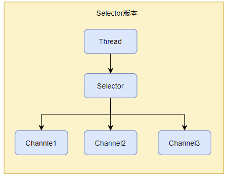
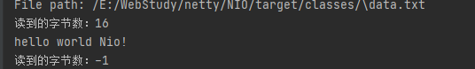

# NIO

non-blocking  IO ： 非阻塞IO

# 1. NIO三大组件

## 1.1 Channel和Buffer

channel是一个类似于stream,它就是读写数据的**双向通道**，可以从channel将数据读入buffer，也可以将buffer的数据写入channel，而之前的stream要么是输入，要么就是输出，channel比stream更为底层。


常见的Channel有：

* FileChannel : 用于文件传输
* DatagramChannel: 用于UDP协议
* SocketChannel: 用于TCP客户端
* ServerSocketChannel: 用于TCP的服务端

常见的Buffer有

* **ByteBuffer**
  * MappedByteNBuffer
  * DirectByteBuffer
  * HeapByteBuffer
* ShortBuffer
* LongBuffer
* DoubleBuffer
* FloatBuffer
* CharBuffer

## 1.2 Selector

:red_circle: 多线程设计版本


缺点：

* 内存占用高
* 线程上下文切换成本高
* 只适合连接数少的情况

:red_circle:线程池版本


缺点：

* 阻塞模式下，线程仅能处理一个socket连接，等待socket1连接断开后，Thread1才能处理Socket2的连接。
* 仅适合短连接场景。

:red_circle:Selector版本



selector的作用就是配合一个线程来管理多个channel，**获取这些channel上发生的事件**（交给thread处理），这些channel工作在非阻塞模式下，不会让线程吊死在一个channel上。适合连接数多，但流量低的场景（channel1,channel2,channel3同时发生事件的机会少）。（事件驱动的）

调用selector的select()会阻塞直到channel发生读写就绪事件，这些事件发生，select方法就会返回这些事件交给Thread进行处理。

# 2. ByteBuffer

一个普通文本 data.txt:

```txt
hello world NIO!
```

使用FileChannel来读取文件内容：

```java
public static void main(String[] args) {
        String filePath = ByteBufferTest.class.getResource("./").getPath() + File.separator + "data.txt";
        System.out.println("File path: " + filePath);
        try (RandomAccessFile file = new RandomAccessFile(filePath, "rw")) {
            FileChannel fileChannel = file.getChannel();
            ByteBuffer buffer = ByteBuffer.allocate(20);
            do {
                // 写入buffer
                int len = fileChannel.read(buffer);
                System.out.println("读到的字节数：" + len);
                if (len == -1) {
                    break;
                }
                // 开始读模式
                buffer.flip();
                while (buffer.hasRemaining()) {
                    System.out.print((char) buffer.get());
                }
                System.out.println();
                // 开始写模式
                buffer.clear();
            } while (true);
        } catch (Exception e) {
            e.printStackTrace();
        }
	}
```

输出：



## 2.1 ByteBuffer内部结构

主要有以下重要属性

* capacity
* position
* limit


写模式下：position是当前写入的位置，limit是写入限制的位置，如下图，写入4个字节后：


flip动作发生后，position切换到读取的位置，limit切换到读取的限制位置，如下图：


clear动作发生后：开始写模式


compact方法是把未读完的部分向前压缩，然后切换到写模式：


## 2.2 ByteBuffer方法

* 分配空间：

  ```java
  // 创建HeapByteBuffer  --  java的堆内存， 读取效率低，受到GC影响
  ByteBuffer buffer = ByteBuffer.allocate(20);
  // 创建DirectByteBuffer  -- 直接内存，读取效率高（少一次内存拷贝），是系统内存，不受到GC影响，要调系统内核，分配效率低。
  ByteBuffer buffer = ByteBuffer.allocateDirect(20);
  ```

* 写入数据：

  ```java
  int readBytes = channel.read(buffer);
  // 或
  buf.put((byte)127);
  ```

* 读取数据：

  ```java
  int writeBytes = channel.write(buffer);
  // 或
  byte b = buffer.get();
  ```

* rewind:

  rewind 方法：重头开始读

* mark & reset方法：

  mark: 记录position位置做个标记， reset则是将position重置到mark的位置

## 2.3 String与ByteBuffer互转

* String转为ByteBuffer

  ```java
  // 方法1
  ByteBuffer buffer = ByteBuffer.allocate(20);
  buffer.put("hello".getBytes())
  // 方法2, 写完自动切换到读模式
  ByteBuffer buffer = StandardCharsets.UTF_8.encode("hello");
  // 方法3 wrap, 写完自动切换到读模式
  ByteBuffer buffer = ByteBuffer.wrap("hello".getBytes());
  ```

* ByteBuffer转为String

  ```java
  // 方法1
  buffer.flip();// 切到读模式
  String data  = StandardCharsets.UTF_8.decode(buffer).toString();
  // 方法2, 写完自动切换到读模式
  buffer.flip()
  new String(buffer.array())
  ```

## 2.4 分散读取

有个文本data.txt,如下，想分散读取获取 one, two, three三个字符串：

```
onetwothree
```

可以创建三个ByteBuffer,分散读取：

```java
String filePath = ByteBufferTest.class.getResource("./").getPath() + File.separator + "data.txt";
System.out.println("File path: " + filePath);
try (RandomAccessFile file = new RandomAccessFile(filePath, "rw")) {
    ByteBuffer one = ByteBuffer.allocate(3);
    ByteBuffer two = ByteBuffer.allocate(3);
    ByteBuffer three = ByteBuffer.allocate(5);
    FileChannel fileChannel = file.getChannel();
    // 分散读取
    fileChannel.read(new ByteBuffer[]{one, two, three});
    one.flip();
    two.flip();
    three.flip();
    System.out.println(new String(one.array()));
    System.out.println(new String(two.array()));
    System.out.println(new String(three.array()));
} catch (Exception e) {
    e.printStackTrace();
}
```

## 2.5 集中写入

```java
String filePath = ByteBufferTest.class.getResource("./").getPath() + File.separator + "data.txt";
System.out.println("File path: " + filePath);
try (RandomAccessFile file = new RandomAccessFile(filePath, "rw")) {
    ByteBuffer buffer1 = ByteBuffer.wrap("hello".getBytes(StandardCharsets.UTF_8));
    ByteBuffer buffer2 = ByteBuffer.wrap("world".getBytes(StandardCharsets.UTF_8));
    ByteBuffer buffer3 = ByteBuffer.wrap("nio".getBytes(StandardCharsets.UTF_8));
    FileChannel fileChannel = file.getChannel();
    // 集中写入
    fileChannel.write(new ByteBuffer[]{buffer1, buffer2, buffer3});
} catch (Exception e) {
    e.printStackTrace();
}
```

