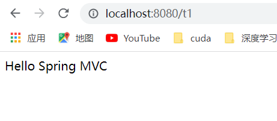
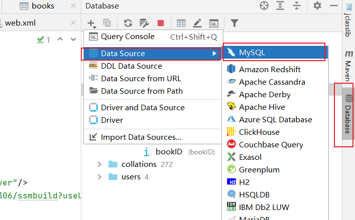
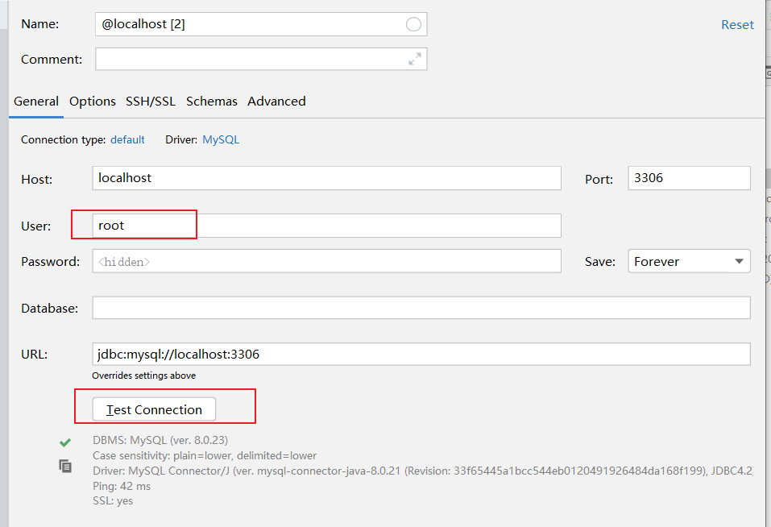
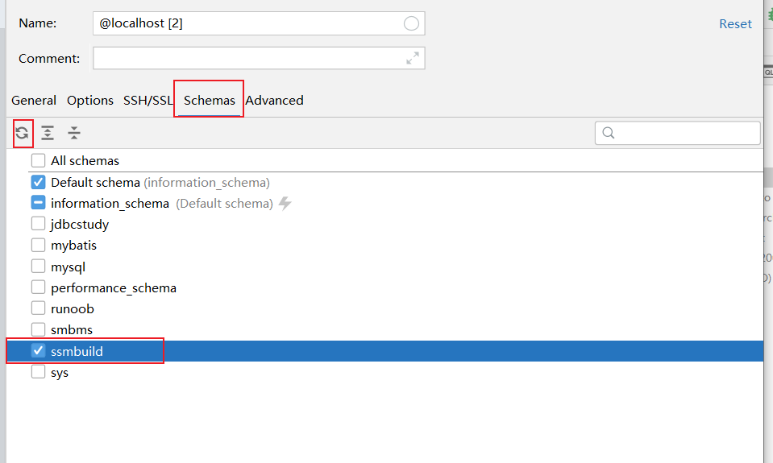

# SpringMVC

导入根项目依赖：

```xml
<dependencies>
    <dependency>
        <groupId>org.springframework</groupId>
        <artifactId>spring-webmvc</artifactId>
        <version>5.2.0.RELEASE</version>
    </dependency>
    <dependency>
        <groupId>junit</groupId>
        <artifactId>junit</artifactId>
        <version>4.12</version>
    </dependency>

    <dependency>
        <groupId>javax.servlet</groupId>
        <artifactId>javax.servlet-api</artifactId>
        <version>4.0.1</version>
    </dependency>

    <dependency>
        <groupId>javax.servlet.jsp</groupId>
        <artifactId>javax.servlet.jsp-api</artifactId>
        <version>2.3.3</version>
    </dependency>
    <dependency>
        <groupId>javax.servlet.jsp.jstl</groupId>
        <artifactId>jstl-api</artifactId>
        <version>1.2</version>
    </dependency>
</dependencies>
```

##  1. 回顾Servlet

* 实现Servlet类

  ```java
  public class HelloServlet extends HttpServlet {
  
      @Override
      protected void doGet(HttpServletRequest req, HttpServletResponse resp) throws ServletException, IOException {
          // 1. 获取前端参数
          String method=req.getParameter("method");
  
          if(method.equals("add")){
              req.getSession().setAttribute("msg","执行了add方法");
          } else if(method.equals("delete")){
              req.getSession().setAttribute("msg","执行了delete方法");
          }
  
          // 2. 调用业务层
  
          // 3. 视图转发
          req.getRequestDispatcher("/WEB-INF/jsp/test.jsp").forward(req,resp);
      }
  
      @Override
      protected void doPost(HttpServletRequest req, HttpServletResponse resp) throws ServletException, IOException {
          doGet(req, resp);
      }
  }
  ```

* index.jsp中创建一个表单

  ```xml
  <%@ page contentType="text/html;charset=UTF-8" language="java" isELIgnored="false" %>
  <html>
    <head>
      <title>$Title$</title>
    </head>
    <body>
    <form action="${pageContext.request.contextPath}/hello" method="post">
      <input type="text" name="method"><br>
      <input type="submit">
    </form>
    </body>
  </html>
  ```

* 在WEB-INF/jsp 目录中创建 test.jsp

  ```jsp
  <%@ page contentType="text/html;charset=UTF-8" language="java" isELIgnored="false" %>
  <html>
  <head>
      <title>Title</title>
  </head>
  <body>
   ${msg}
  </body>
  </html>
  ```

* 注册servelt

  ```xml
  <?xml version="1.0" encoding="UTF-8"?>
  <web-app xmlns="http://xmlns.jcp.org/xml/ns/javaee"
           xmlns:xsi="http://www.w3.org/2001/XMLSchema-instance"
           xsi:schemaLocation="http://xmlns.jcp.org/xml/ns/javaee http://xmlns.jcp.org/xml/ns/javaee/web-app_4_0.xsd"
           version="4.0">
  
      <servlet>
          <servlet-name>hello</servlet-name>
          <servlet-class>com.liyajie.servlet.HelloServlet</servlet-class>
      </servlet>
      
      <servlet-mapping>
          <servlet-name>hello</servlet-name>
          <url-pattern>/hello</url-pattern>
      </servlet-mapping>
  </web-app>
  ```

* 配置tomcat执行测试

##  2. 初识SpringMVC

文档：https://www.docs4dev.com/docs/zh/spring-framework/4.3.21.RELEASE/reference/mvc.html

SpringMVC 的特点：

* 轻量级，简单易学
* 高效，基于请求与响应的MVC框架
* 与Spring无缝结合
* 约定优于配置
* 功能强大：RESTful，数据验证，格式化，本地化，主题等
* 简介灵活

Spring的web框架围绕DispatcherServlet设计，它可以认为使一个调度器，作用是将请求分发到不同的处理器（Handler）（方法和类）。

SpringMVC框架像许多其他MVC框架一样，**以请求为驱动，围绕一个中心Servlet分派请求及提供其他功能，DispatcherServlet是一个实际的Servlet（它继承自HttpServlet基类）。**


SpringMVC 原理图：


## 3. Hello SpringMVC

1. 配置web.xml, 注册DispatcherServlet

```xml
<?xml version="1.0" encoding="UTF-8"?>
<web-app xmlns="http://xmlns.jcp.org/xml/ns/javaee"
         xmlns:xsi="http://www.w3.org/2001/XMLSchema-instance"
         xsi:schemaLocation="http://xmlns.jcp.org/xml/ns/javaee http://xmlns.jcp.org/xml/ns/javaee/web-app_4_0.xsd"
         version="4.0">

    <!--1. 注册DispatcherServlet-->
    <servlet>
        <servlet-name>springmvc</servlet-name>
        <servlet-class>org.springframework.web.servlet.DispatcherServlet</servlet-class>
        <!--关联一个springmvc配置文件：【servlet-name】-servlet.xml-->
        <init-param>
            <param-name>contextConfigLocation</param-name>
            <param-value>classpath:springmvc-servlet.xml</param-value>
        </init-param>
        <!--启动级别-1-->
        <load-on-startup>1</load-on-startup>
    </servlet>

    <!--  / 匹配所有的请求，（不包含.jsp）-->
    <!--  /* 匹配所有的请求，（包含.jsp）-->
    <servlet-mapping>
        <servlet-name>springmvc</servlet-name>
        <url-pattern>/</url-pattern>
    </servlet-mapping>
    
</web-app>
```

2. springmvc配置文件, springmvc-servlet.xml

```xml
<?xml version="1.0" encoding="UTF-8"?>
<beans xmlns="http://www.springframework.org/schema/beans"
       xmlns:xsi="http://www.w3.org/2001/XMLSchema-instance"
       xsi:schemaLocation="
        http://www.springframework.org/schema/beans
        http://www.springframework.org/schema/beans/spring-beans.xsd">

    <bean class="org.springframework.web.servlet.handler.BeanNameUrlHandlerMapping"/>
    <bean class="org.springframework.web.servlet.mvc.SimpleControllerHandlerAdapter"/>

    <!--视图解析器：DispatcherServlet给它的MoelAndView-->
    <!--1. 获取ModelAndView的数据
        2. 解析ModelAndView视图名字
        3. 拼接视图名字，找到对应的视图
        4. 将数据渲染在视图上-->
    <bean class="org.springframework.web.servlet.view.InternalResourceViewResolver" id="internalResourceViewResolver">
        <property name="prefix" value="/WEB-INF/jsp/"/>
        <property name="suffix" value=".jsp"/>
    </bean>

</beans>
```

3. 添加一个Controller:

```java
package com.liyajie.controller;

import org.springframework.web.servlet.ModelAndView;
import org.springframework.web.servlet.mvc.Controller;

import javax.servlet.http.HttpServletRequest;
import javax.servlet.http.HttpServletResponse;

public class HelloController implements Controller {
    @Override
    public ModelAndView handleRequest(HttpServletRequest request, HttpServletResponse response) throws Exception {
        // ModelAndView 模型和视图
        ModelAndView mv=new ModelAndView();

        // 封装对象，放在ModelAndView中。 Model
        mv.addObject("msg","HelloSpringMVC");
        // 封装要跳转的视图，放在ModelAndView中
        mv.setViewName("hello"); // /WEB-INF/jsp/hello.jsp
        return mv;
    }
}
```

4. 将自己的类交给SpringIOC容器， springmvc-servlet.xml中注册bean:

```xml
<!--Handler-->
<bean id="/hello" class="com.liyajie.controller.HelloController"/>
```

5. 跳转页面 hello.jsp

```jsp
<%@ page contentType="text/html;charset=UTF-8" language="java"  isELIgnored="false" %>
<html>
<head>
    <title>Hello</title>
</head>
<body>
<h1>Hello SpringMVC</h1>
<h2>${msg}</h2>
</body>
</html>
```


出现404问题解决：

打开项目结构：


在WEB-INF中新建一个lib目录，导入所有jar 包。

## 4. SpringMVC执行原理


实线部分都是SpringMVC做好的，我们只要做虚线部分就可以了。

1. DispatcherServlet就是前端控制器，它是整个SPringMVC的控制中心，用户发出请求，DispatcherServlet接收请求并拦截请求。
   * 我们假设请求的url为 ： https://localhost:8080/SpringMVC/hello
   * 如上url拆分为三个部分：
     * https://localhost:8080 服务器域名
     * SpringMVC部署在服务器上的web站点
     * hello 表示控制器
   * 通过分析，如上url表示为：情求位于服务器localhost:8080上的SpringMVC站点的hello控制器。
2. HandlerMapping 为处理器映射。DispatcherServlet调用，HandlerMapping 根据请求url查找Handler
3. HandlerExecution 表示具体的Handler，其主要作用就是根据url查找控制器，如上url查找控制器为 hello。
4. HandlerExecution 将解析后的信息传递给DispatcherServlet，如解析控制器映射等。
5. HandlerAdapter 表示处理器适配器，其按照特定的规则去执行Handler
6. Handler 让具体的Controller 执行。
7. Controller 将具体的执行信息返回给HandlerAdapter，如ModelAndView
8. HanlderAdapter 将视图逻辑名或模型传递给DispatcherServlt
9. DispatcherServlt调用视图解析器（ViewResolver）来解析HanlderAdapter 传递的逻辑视图名
10. 视图解析器架构解析的逻辑视图名传给DispatcherServlt
11. DispatcherServlt根据视图解析器解析的视图结果，调用具体的视图
12. 最终视图呈现给用户。

## 5. 注解开发

1. 配置spring启动配置文件 springmvc-servlet.xml

   ```xml
   <context:component-scan base-package="com.liyajie.controller"/>
   
   <!--让spring mvc不处理静态资源-->
   <mvc:default-servlet-handler/>
   
   <!--
       支持mvc注解驱动
           在spring中一般采用@RequestMapping注解来完成映射关系
           要想使@RequestMapping注解生效
           必须向上下文中注册DefaultAnnotationHandlerMapping
           和一个AnnotationAdapter实例
           这两个实例分别在类级别和方法级别处理
           而annotation-driven配置帮助我们自动完成上述两个实例的注入
       -->
   <mvc:annotation-driven/>
   
   <!--视图解析器-->
   <bean class="org.springframework.web.servlet.view.InternalResourceViewResolver" id="internalResourceViewResolver">
       <property name="prefix" value="/WEB-INF/jsp/"/>
       <property name="suffix" value=".jsp"/>
   </bean>
   ```

2. 配置web.xml

```xml
<servlet>
    <servlet-name>springmvc</servlet-name>
    <servlet-class>org.springframework.web.servlet.DispatcherServlet</servlet-class>
    <init-param>
      <param-name>contextConfigLocation</param-name>
      <param-value>classpath:springmvc-servlet.xml</param-value>
    </init-param>
    <load-on-startup>1</load-on-startup>
  </servlet>

  <servlet-mapping>
    <servlet-name>springmvc</servlet-name>
    <url-pattern>/</url-pattern>
  </servlet-mapping>
```

3. Hellocontroller.java

   ```java
   @Controller
   public class HelloController {
   
       // 真实访问的地址： /hello
       @RequestMapping("/hello")
       public String sayHello(Model model){
           model.addAttribute("msg","HELLO SPRING MVC");
           return "hello"; // 返回的字符串会被视图解析器处理
       }
   }
   ```

4. hello.jsp

   ```jsp
   <%@ page contentType="text/html;charset=UTF-8" language="java" isELIgnored="false" %>
   <html>
   <head>
       <title>Title</title>
   </head>
   <body>
   ${msg}
   </body>
   </html>
   ```

## 6. Controller配置总结

* Controller 负责提供访问应用程序的行为，通常通过接口定义或者注解定义两种方式实现。
* 负责解析用户的请求，并将其转换为一个模型
* Controller中可以对应多个方法

1. 实现Controller接口

   ```java
   // 实现改接口获得控制器的功能
   public interface Controller {
       // 处理请求，且返回一个模型与视图的对象
       ModelAndView handleRequest(HttpServletRequest req, HttpServletResponse resp) throws Exception;
   }
   ```

   编写一个ControllerTest 类，实现该接口

   ```java
   public class ControllerTest01 implements Controller {
       @Override
       public ModelAndView handleRequest(HttpServletRequest request, HttpServletResponse response) throws Exception {
           ModelAndView modelAndView = new ModelAndView();
           modelAndView.addObject("msg", "Hello Spring MVC");
           modelAndView.setViewName("hello");
           return modelAndView;
       }
   }
   ```

   springmvc-servlet.xml增加bean:

   ```
   <bean id="/t1" class="com.liyajie.controller.ControllerTest01"/>
   ```

   测试：

   http://localhost:8080/t1

   

   缺点：

   * 一个控制器只能写一个请求处理方法。

2. 使用@Controller注解

   ```java
   @Controller
   public class HelloController {
   
       // 真实访问的地址： /hello
       @RequestMapping("/hello")
       public String sayHello(Model model){
           model.addAttribute("msg","HELLO SPRING MVC");
           return "hello"; // 返回的字符串会被视图解析器处理
       }
   }
   ```

## 7. RequestMapping

作用：映射URL到控制器或一个特定的方法上，可用于类或方法上，用于类表示所有响应请求的方法都是以该地址作为父地址。

```java
@Controller
@RequestMapping("/say")
public class HelloController {

    // 真实访问的地址： /say/hello
    @RequestMapping("/hello")
    public String sayHello(Model model){
        model.addAttribute("msg","HELLO SPRING MVC say hello");
        return "hello"; // 返回的字符串会被视图解析器处理
    }
    
     // 真实访问的地址： /say/bye
    @RequestMapping("/bye")
    public String sayBye(Model model){
        model.addAttribute("msg","HELLO SPRING MVC say bye");
        return "bye"; // 返回的字符串会被视图解析器处理
    }
}
```

## 8. SSM:Spring-Spring-MVC-Mybatis

### 8.1 Mybatis层

1. 建立mysql数据库：

   ```sql
   CREATE DATABASE `ssmbuild`;
   
   USE `ssmbuild`;
   
   DROP TABLE IF EXISTS `books`;
   
   CREATE TABLE `books`(
   	`bookID` INT(10) NOT NULL AUTO_INCREMENT,
   	`bookName` VARCHAR(100) NOT NULL,
   	`bookCount` INT(11) NOT NULL,
   	`detail` VARCHAR(200) NOT NULL,
   	KEY `bookID` (`bookID`)
   ) ENGINE=INNODB DEFAULT CHARSET=utf8;
   
   INSERT  INTO `books` (`bookID`,`bookName`,`bookCount`,`detail`) VALUES
   (1, 'Java' , 1, "从入门到放弃"),
   (2,'MySQL',10,"从删库到跑路"),
   (3,'Linux',5,"从入门到入狱");
   ```

2. 搭建基本环境

   * 导入依赖

     ```xml
     <!--数据库驱动-->
     <dependency>
         <groupId>mysql</groupId>
         <artifactId>mysql-connector-java</artifactId>
         <version>5.1.47</version>
     </dependency>
     <!--数据库连接池-->
     <dependency>
         <groupId>com.mchange</groupId>
         <artifactId>c3p0</artifactId>
         <version>0.9.5.2</version>
     </dependency>
     <!--mybatis-->
     <dependency>
         <groupId>org.mybatis</groupId>
         <artifactId>mybatis</artifactId>
         <version>3.5.2</version>
     </dependency>
     <dependency>
         <groupId>org.mybatis</groupId>
         <artifactId>mybatis-spring</artifactId>
         <version>2.0.2</version>
     </dependency>
     <!--Spring-->
     <dependency>
         <groupId>org.springframework</groupId>
         <artifactId>spring-webmvc</artifactId>
         <version>5.2.0.RELEASE</version>
     </dependency>
     <dependency>
         <groupId>org.springframework</groupId>
         <artifactId>spring-jdbc</artifactId>
         <version>5.2.0.RELEASE</version>
     </dependency>
     <dependency>
         <groupId>junit</groupId>
         <artifactId>junit</artifactId>
         <version>4.12</version>
         <scope>test</scope>
     </dependency>
     <!--servlet-->
     <dependency>
         <groupId>javax.servlet</groupId>
         <artifactId>javax.servlet-api</artifactId>
         <version>4.0.1</version>
     </dependency>
     <dependency>
         <groupId>javax.servlet.jsp</groupId>
         <artifactId>javax.servlet.jsp-api</artifactId>
         <version>2.3.3</version>
     </dependency>
     <dependency>
         <groupId>javax.servlet.jsp.jstl</groupId>
         <artifactId>jstl-api</artifactId>
         <version>1.2</version>
     </dependency>
     ```

   * IDEA连接数据库

     

   

   

   * resources中新增数据库配置文件database.properties

     ```properties
     jdbc.driver=com.mysql.jdbc.Driver
     # 如果使用的使MySQL8.0+还要增加一个时区的配置 &serverTimezone=Asia/Shanghai
     jdbc.url=jdbc:mysql://localhost:3306/ssmbuild?useSSL=true&useUnicode=true&characterEncoding=utf8
     jdbc.username=root
     jdbc.password=
     ```

   * 在resources中增加mybatis-config.xml 的mybatis配置文件

     1. mybatis-config.xml

     ```xml
     <?xml version="1.0" encoding="utf8" ?>
     <!DOCTYPE configuration
             PUBLIC "-//mybatis.org//DTD Config 3.0//EN"
             "http://mybatis.org/dtd/mybatis-3-config.dtd">
     
     <!--核心配置-->
     <configuration>
         <!--配置数据源，交给了spring去做了，这里不需要了-->
         <typeAliases>
             <package name="com.liyajie.pojo"/>
         </typeAliases>
     
         <mappers>
             <mapper class="com.liyajie.dao.BookMapper"/>
         </mappers>
     </configuration>
     ```

   * pojo实体类 Books.java

     ```java
     public class Books {
         private int bookID;
         private String bookName;
         private int bookCount;
         private String detail;
     }
     ```

   * Dao层Mapper 接口， BookMapper.java

     ```java
     public interface BookMapper {
         // 增加一本书
         int addBook(Books books);
     
         // 删除一本书
         int deleteBookById(@Param("bookID") int id);
     
         // 更新一本书
         int updateBook(Books books);
     
         // 查询一本书
         Books queryBookById(@Param("bookID") int id);
     
         // 查询所有的书
         List<Books> queryAllBooks();
     }
     ```

   * 在 BookMapper.java同路径下，写 BookMapper.xml

     ```xml
     <?xml version="1.0" encoding="utf8" ?>
     <!DOCTYPE mapper
             PUBLIC "-//mybatis.org//DTD Config 3.0//EN"
             "http://mybatis.org/dtd/mybatis-3-mapper.dtd">
     <mapper namespace="com.liyajie.dao.BookMapper">
         <insert id="addBook" parameterType="com.liyajie.pojo.Books">
             insert into ssmbuild.books (bookName, bookCount, detail)
             values (#{bookName}, #{bookCount}, #{detail})
         </insert>
     
         <delete id="deleteBookById" parameterType="int">
             delete
             from ssmbuild.books
             where bookID = #{bookID}
         </delete>
     
         <update id="updateBook" parameterType="com.liyajie.pojo.Books">
             update ssmbuild.books
             set bookName=#{bookName},
                 bookCount=#{bookCount},
                 detail=#{detail}
             where bookID = #{bookID}
         </update>
     
         <select id="queryBookById" resultType="com.liyajie.pojo.Books" parameterType="int">
             select *
             from ssmbuild.books
             where bookID = #{bookID}
         </select>
     
         <select id="queryAllBooks" resultType="com.liyajie.pojo.Books">
             select *
             from ssmbuild.books
         </select>
     </mapper>
     ```

   * service层接口定义：

     ```java
     public interface BookService {
         // 增加一本书
         int addBook(Books books);
     
         // 删除一本书
         int deleteBookById(int id);
     
         // 更新一本书
         int updateBook(Books books);
     
         // 查询一本书
         Books queryBookById(int id);
     
         // 查询所有的书
         List<Books> queryAllBooks();
     }
     ```

   * service实现类

     ```java
     public class BookServiceImpl implements BookService {
         @Setter
         private BookMapper bookMapper;
     
         @Override
         public int addBook(Books book) {
             return bookMapper.addBook(book);
         }
     
         @Override
         public int deleteBookById(int id) {
             return bookMapper.deleteBookById(id);
         }
     
         @Override
         public int updateBook(Books book) {
             return bookMapper.updateBook(book);
         }
     
         @Override
         public Books queryBookById(int id) {
             return bookMapper.queryBookById(id);
         }
     
         @Override
         public List<Books> queryAllBooks() {
             return bookMapper.queryAllBooks();
         }
     }
     ```

### 8.2 Spring层

1. 在resources下增加spring配置文件spring-dao.xml, spring整合mybatis

   ```xml
   <?xml version="1.0" encoding="UTF-8"?>
   <beans xmlns="http://www.springframework.org/schema/beans"
          xmlns:xsi="http://www.w3.org/2001/XMLSchema-instance"
          xmlns:context="http://www.springframework.org/schema/context"
          xsi:schemaLocation="
           http://www.springframework.org/schema/beans
           http://www.springframework.org/schema/beans/spring-beans.xsd
           http://www.springframework.org/schema/context
           http://www.springframework.org/schema/context/spring-context.xsd">
   
       <!--1.关联数据库配置文件-->
       <context:property-placeholder location="classpath:database.properties"/>
   
       <!--2. 数据库连接池
           dbcp  半自动化操作，不能自动连接
           c3p0   自动化操作，自动加载配置文件，并可以自动设置到对象中
           druid
           hikari
       -->
       <bean id="dataSource" class="com.mchange.v2.c3p0.ComboPooledDataSource">
           <property name="driverClass" value="${jdbc.driver}"/>
           <property name="jdbcUrl" value="${jdbc.url}"/>
           <property name="user" value="${jdbc.username}"/>
           <property name="password" value="${jdbc.password}"/>
           <!--c3p0连接池私有属性-->
           <property name="maxPoolSize" value="30"/>
           <property name="minPoolSize" value="10"/>
           <!--关闭连接后不自动commit-->
           <property name="autoCommitOnClose" value="false"/>
           <!--获取连接超时时间-->
           <property name="checkoutTimeout" value="10000"/>
           <!--当获取连接失败时，重试次数-->
           <property name="acquireRetryAttempts" value="2"/>
       </bean>
       
       <!--3. sqlSessionFactory-->
       <bean id="sqlSessionFactory" class="org.mybatis.spring.SqlSessionFactoryBean">
           <property name="dataSource" ref="dataSource"/>
           <property name="configLocation" value="classpath:mybatis-config.xml"/>
       </bean>
   
       <!--配置dao接口扫描，动态的实现dao接口注入到Spring容器中-->
       <bean class="org.mybatis.spring.mapper.MapperScannerConfigurer">
           <!--注入sqlSessionFactory-->
           <property name="sqlSessionFactoryBeanName" value="sqlSessionFactory"/>
           <!--扫描的dao包-->
           <property name="basePackage" value="com.liyajie.dao"/>
       </bean>
   </beans>
   ```

2. spring整合service层，在resources下增加spring-service.xml

   ```xml
   <?xml version="1.0" encoding="UTF-8"?>
   <beans xmlns="http://www.springframework.org/schema/beans"
          xmlns:xsi="http://www.w3.org/2001/XMLSchema-instance"
          xmlns:context="http://www.springframework.org/schema/context"
          xsi:schemaLocation="
           http://www.springframework.org/schema/beans
           http://www.springframework.org/schema/beans/spring-beans.xsd
           http://www.springframework.org/schema/context
           http://www.springframework.org/schema/context/spring-context.xsd">
   
       <!--扫描service的包-->
       <context:component-scan base-package="com.liyajie.service"/>
   
       <!--所有业务类注入到spring，可以通过配置，或者注解实现-->
       <bean class="com.liyajie.service.BookServiceImpl" id="bookService">
           <property name="bookMapper" value="bookMapper"/>
       </bean>
   
       <!--声明事务配置-->
       <bean class="org.springframework.jdbc.datasource.DataSourceTransactionManager" id="transactionManager">
           <property name="dataSource" ref="dataSource"/>
       </bean>
   </beans>
   ```

   还需要在resources/applicationContext.xml中关联两个xml文件

   ```xml
   <?xml version="1.0" encoding="UTF-8"?>
   <beans xmlns="http://www.springframework.org/schema/beans"
          xmlns:xsi="http://www.w3.org/2001/XMLSchema-instance"
          xsi:schemaLocation="
           http://www.springframework.org/schema/beans
           http://www.springframework.org/schema/beans/spring-beans.xsd">
       <import resource="classpath:spring-dao.xml"/>
       <import resource="classpath:spring-service.xml"/>
   </beans>
   ```

### 8.3 Spring-MVC层

1. 增加web项目的支持

2. web.xml配置

   ```xml
   <?xml version="1.0" encoding="UTF-8"?>
   <web-app xmlns="http://xmlns.jcp.org/xml/ns/javaee"
            xmlns:xsi="http://www.w3.org/2001/XMLSchema-instance"
            xsi:schemaLocation="http://xmlns.jcp.org/xml/ns/javaee http://xmlns.jcp.org/xml/ns/javaee/web-app_4_0.xsd"
            version="4.0">
       
       <servlet>
           <servlet-name>springmvc</servlet-name>
           <servlet-class>org.springframework.web.servlet.DispatcherServlet</servlet-class>
           <init-param>
               <param-name>contextConfigLocation</param-name>
               <param-value>classpath:spring-mvc.xml</param-value>
           </init-param>
           <load-on-startup>1</load-on-startup>
       </servlet>
       
       <servlet-mapping>
           <servlet-name>springmvc</servlet-name>
           <url-pattern>/</url-pattern>
       </servlet-mapping>
       
       <!--乱码过滤-->
       <filter>
           <filter-name>encodingFilter</filter-name>
           <filter-class>org.springframework.web.filter.CharacterEncodingFilter</filter-class>
           <init-param>
               <param-name>encoding</param-name>
               <param-value>utf-8</param-value>
           </init-param>
       </filter>
       <filter-mapping>
           <filter-name>encodingFilter</filter-name>
           <url-pattern>/*</url-pattern>
       </filter-mapping>
   
       <!--session过期时间-->
       <session-config>
           <session-timeout>10000</session-timeout>
       </session-config>
   </web-app>
   ```

3. spring-mvc.xml配置

   ```xml
   <?xml version="1.0" encoding="UTF-8"?>
   <beans xmlns="http://www.springframework.org/schema/beans"
          xmlns:xsi="http://www.w3.org/2001/XMLSchema-instance" xmlns:mvc="http://www.springframework.org/schema/mvc"
          xmlns:context="http://www.springframework.org/schema/context"
          xsi:schemaLocation="http://www.springframework.org/schema/beans
           http://www.springframework.org/schema/beans/spring-beans.xsd http://www.springframework.org/schema/mvc https://www.springframework.org/schema/mvc/spring-mvc.xsd http://www.springframework.org/schema/context https://www.springframework.org/schema/context/spring-context.xsd">
   
       <!--1. 注解驱动-->
       <mvc:annotation-driven/>
   
       <!--2. 静态资源过滤-->
       <mvc:default-servlet-handler/>
   
       <!--3. 扫描包： controller-->
       <context:component-scan base-package="com.liyajie.controller"/>
   
       <!--4. 视图解析器-->
       <bean class="org.springframework.web.servlet.view.InternalResourceViewResolver" id="internalResourceViewResolver">
           <property name="prefix" value="/WEB-INF/jps/"/>
           <property name="suffix" value=".jsp"/>
       </bean>
   
   </beans>
   ```

4. 整合spring配置文件applicationContext.xml

   ```xml
   <?xml version="1.0" encoding="UTF-8"?>
   <beans xmlns="http://www.springframework.org/schema/beans"
          xmlns:xsi="http://www.w3.org/2001/XMLSchema-instance"
          xsi:schemaLocation="
           http://www.springframework.org/schema/beans
           http://www.springframework.org/schema/beans/spring-beans.xsd">
       <import resource="classpath:spring-dao.xml"/>
       <import resource="classpath:spring-service.xml"/>
       <import resource="classpath:spring-mvc.xml"/>
   </beans>
   ```

   
