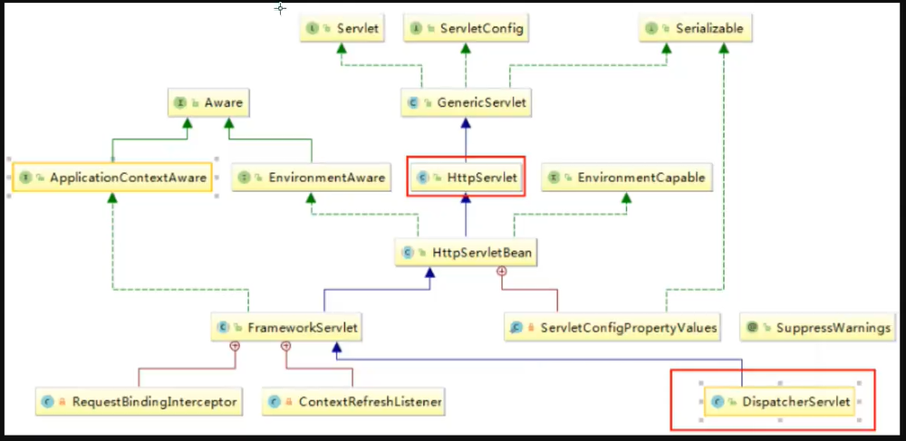
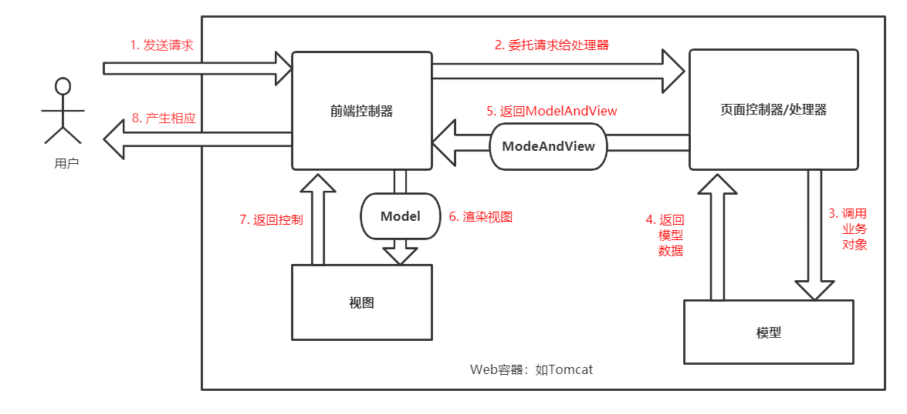
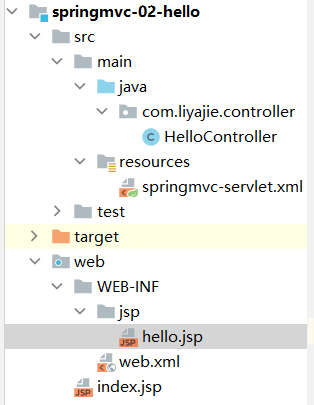
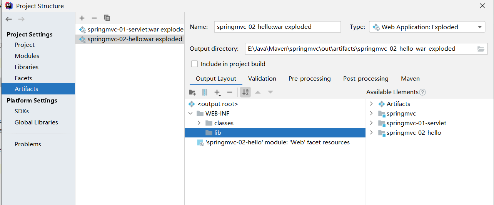
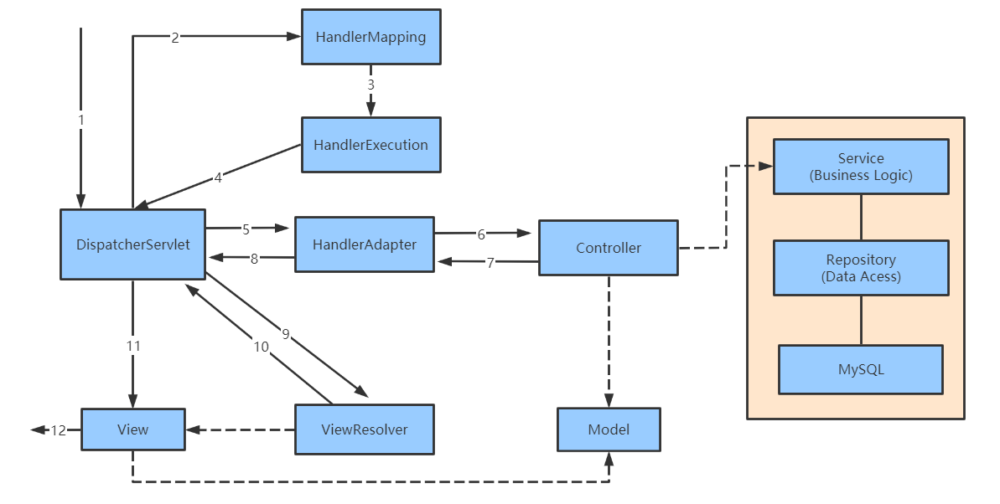

# SpringMVC

导入根项目依赖：

```xml
<dependencies>
    <dependency>
        <groupId>org.springframework</groupId>
        <artifactId>spring-webmvc</artifactId>
        <version>5.2.0.RELEASE</version>
    </dependency>
    <dependency>
        <groupId>junit</groupId>
        <artifactId>junit</artifactId>
        <version>4.12</version>
    </dependency>

    <dependency>
        <groupId>javax.servlet</groupId>
        <artifactId>javax.servlet-api</artifactId>
        <version>4.0.1</version>
    </dependency>

    <dependency>
        <groupId>javax.servlet.jsp</groupId>
        <artifactId>javax.servlet.jsp-api</artifactId>
        <version>2.3.3</version>
    </dependency>
    <dependency>
        <groupId>javax.servlet.jsp.jstl</groupId>
        <artifactId>jstl-api</artifactId>
        <version>1.2</version>
    </dependency>
</dependencies>
```

##  1. 回顾Servlet

* 实现Servlet类

  ```java
  public class HelloServlet extends HttpServlet {
  
      @Override
      protected void doGet(HttpServletRequest req, HttpServletResponse resp) throws ServletException, IOException {
          // 1. 获取前端参数
          String method=req.getParameter("method");
  
          if(method.equals("add")){
              req.getSession().setAttribute("msg","执行了add方法");
          } else if(method.equals("delete")){
              req.getSession().setAttribute("msg","执行了delete方法");
          }
  
          // 2. 调用业务层
  
          // 3. 视图转发
          req.getRequestDispatcher("/WEB-INF/jsp/test.jsp").forward(req,resp);
      }
  
      @Override
      protected void doPost(HttpServletRequest req, HttpServletResponse resp) throws ServletException, IOException {
          doGet(req, resp);
      }
  }
  ```

* index.jsp中创建一个表单

  ```xml
  <%@ page contentType="text/html;charset=UTF-8" language="java" isELIgnored="false" %>
  <html>
    <head>
      <title>$Title$</title>
    </head>
    <body>
    <form action="${pageContext.request.contextPath}/hello" method="post">
      <input type="text" name="method"><br>
      <input type="submit">
    </form>
    </body>
  </html>
  ```

* 在WEB-INF/jsp 目录中创建 test.jsp

  ```jsp
  <%@ page contentType="text/html;charset=UTF-8" language="java" isELIgnored="false" %>
  <html>
  <head>
      <title>Title</title>
  </head>
  <body>
   ${msg}
  </body>
  </html>
  ```

* 注册servelt

  ```xml
  <?xml version="1.0" encoding="UTF-8"?>
  <web-app xmlns="http://xmlns.jcp.org/xml/ns/javaee"
           xmlns:xsi="http://www.w3.org/2001/XMLSchema-instance"
           xsi:schemaLocation="http://xmlns.jcp.org/xml/ns/javaee http://xmlns.jcp.org/xml/ns/javaee/web-app_4_0.xsd"
           version="4.0">
  
      <servlet>
          <servlet-name>hello</servlet-name>
          <servlet-class>com.liyajie.servlet.HelloServlet</servlet-class>
      </servlet>
      
      <servlet-mapping>
          <servlet-name>hello</servlet-name>
          <url-pattern>/hello</url-pattern>
      </servlet-mapping>
  </web-app>
  ```

* 配置tomcat执行测试

##  2. 初识SpringMVC

文档：https://www.docs4dev.com/docs/zh/spring-framework/4.3.21.RELEASE/reference/mvc.html

SpringMVC 的特点：

* 轻量级，简单易学
* 高效，基于请求与响应的MVC框架
* 与Spring无缝结合
* 约定优于配置
* 功能强大：RESTful，数据验证，格式化，本地化，主题等
* 简介灵活

Spring的web框架围绕DispatcherServlet设计，它可以认为使一个调度器，作用是将请求分发到不同的处理器（Handler）（方法和类）。

SpringMVC框架像许多其他MVC框架一样，**以请求为驱动，围绕一个中心Servlet分派请求及提供其他功能，DispatcherServlet是一个实际的Servlet（它继承自HttpServlet基类）。**



SpringMVC 原理图：



## 3. Hello SpringMVC

1. 配置web.xml, 注册DispatcherServlet

```xml
<?xml version="1.0" encoding="UTF-8"?>
<web-app xmlns="http://xmlns.jcp.org/xml/ns/javaee"
         xmlns:xsi="http://www.w3.org/2001/XMLSchema-instance"
         xsi:schemaLocation="http://xmlns.jcp.org/xml/ns/javaee http://xmlns.jcp.org/xml/ns/javaee/web-app_4_0.xsd"
         version="4.0">

    <!--1. 注册DispatcherServlet-->
    <servlet>
        <servlet-name>springmvc</servlet-name>
        <servlet-class>org.springframework.web.servlet.DispatcherServlet</servlet-class>
        <!--关联一个springmvc配置文件：【servlet-name】-servlet.xml-->
        <init-param>
            <param-name>contextConfigLocation</param-name>
            <param-value>classpath:springmvc-servlet.xml</param-value>
        </init-param>
        <!--启动级别-1-->
        <load-on-startup>1</load-on-startup>
    </servlet>

    <!--  / 匹配所有的请求，（不包含.jsp）-->
    <!--  /* 匹配所有的请求，（包含.jsp）-->
    <servlet-mapping>
        <servlet-name>springmvc</servlet-name>
        <url-pattern>/</url-pattern>
    </servlet-mapping>
    
</web-app>
```

2. springmvc配置文件, springmvc-servlet.xml

```xml
<?xml version="1.0" encoding="UTF-8"?>
<beans xmlns="http://www.springframework.org/schema/beans"
       xmlns:xsi="http://www.w3.org/2001/XMLSchema-instance"
       xsi:schemaLocation="
        http://www.springframework.org/schema/beans
        http://www.springframework.org/schema/beans/spring-beans.xsd">

    <bean class="org.springframework.web.servlet.handler.BeanNameUrlHandlerMapping"/>
    <bean class="org.springframework.web.servlet.mvc.SimpleControllerHandlerAdapter"/>

    <!--视图解析器：DispatcherServlet给它的MoelAndView-->
    <!--1. 获取ModelAndView的数据
        2. 解析ModelAndView视图名字
        3. 拼接视图名字，找到对应的视图
        4. 将数据渲染在视图上-->
    <bean class="org.springframework.web.servlet.view.InternalResourceViewResolver" id="internalResourceViewResolver">
        <property name="prefix" value="/WEB-INF/jsp/"/>
        <property name="suffix" value=".jsp"/>
    </bean>

</beans>
```

3. 添加一个Controller:

```java
package com.liyajie.controller;

import org.springframework.web.servlet.ModelAndView;
import org.springframework.web.servlet.mvc.Controller;

import javax.servlet.http.HttpServletRequest;
import javax.servlet.http.HttpServletResponse;

public class HelloController implements Controller {
    @Override
    public ModelAndView handleRequest(HttpServletRequest request, HttpServletResponse response) throws Exception {
        // ModelAndView 模型和视图
        ModelAndView mv=new ModelAndView();

        // 封装对象，放在ModelAndView中。 Model
        mv.addObject("msg","HelloSpringMVC");
        // 封装要跳转的视图，放在ModelAndView中
        mv.setViewName("hello"); // /WEB-INF/jsp/hello.jsp
        return mv;
    }
}
```

4. 将自己的类交给SpringIOC容器， springmvc-servlet.xml中注册bean:

```xml
<!--Handler-->
<bean id="/hello" class="com.liyajie.controller.HelloController"/>
```

5. 跳转页面 hello.jsp

```jsp
<%@ page contentType="text/html;charset=UTF-8" language="java"  isELIgnored="false" %>
<html>
<head>
    <title>Hello</title>
</head>
<body>
<h1>Hello SpringMVC</h1>
<h2>${msg}</h2>
</body>
</html>
```



出现404问题解决：

打开项目结构：



在WEB-INF中新建一个lib目录，导入所有jar 包。

## 4. SpringMVC执行原理




实线部分都是SpringMVC做好的，我们只要做虚线部分就可以了。

1. DispatcherServlet就是前端控制器，它是整个SPringMVC的控制中心，用户发出请求，DispatcherServlet接收请求并拦截请求。
   * 我们假设请求的url为 ： https://localhost:8080/SpringMVC/hello
   * 如上url拆分为三个部分：
     * https://localhost:8080 服务器域名
     * SpringMVC部署在服务器上的web站点
     * hello 表示控制器
   * 通过分析，如上url表示为：情求位于服务器localhost:8080上的SpringMVC站点的hello控制器。
2. HandlerMapping 为处理器映射。DispatcherServlet调用，HandlerMapping 根据请求url查找Handler
3. HandlerExecution 表示具体的Handler，其主要作用就是根据url查找控制器，如上url查找控制器为 hello。
4. HandlerExecution 将解析后的信息传递给DispatcherServlet，如解析控制器映射等。
5. HandlerAdapter 表示处理器适配器，其按照特定的规则去执行Handler
6. Handler 让具体的Controller 执行。
7. Controller 将具体的执行信息返回给HandlerAdapter，如ModelAndView
8. HanlderAdapter 将视图逻辑名或模型传递给DispatcherServlt
9. DispatcherServlt调用视图解析器（ViewResolver）来解析HanlderAdapter 传递的逻辑视图名
10. 视图解析器架构解析的逻辑视图名传给DispatcherServlt
11. DispatcherServlt根据视图解析器解析的视图结果，调用具体的视图
12. 最终视图呈现给用户。

