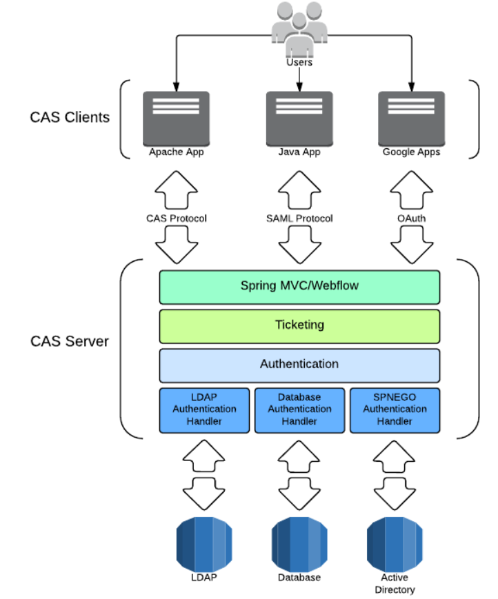
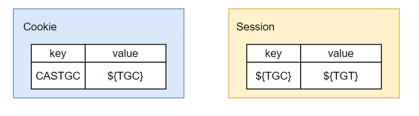
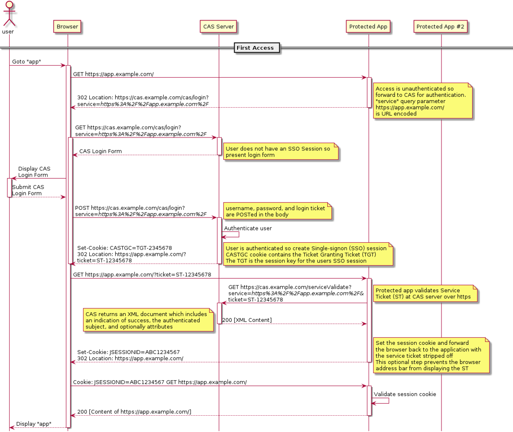
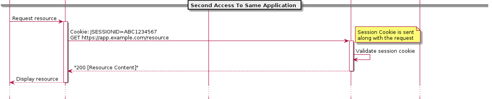
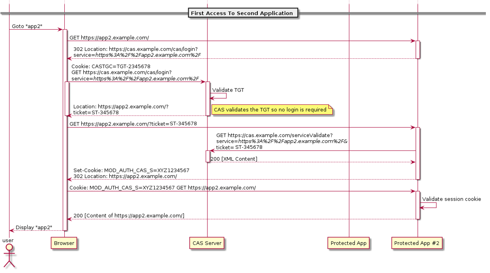

# 1. CAS

**中心认证服务**（**Central Authentication Service, CAS**）是一种单点登录SSO的协议。其目的是允许用户访问多个应用程序，同时仅需向认证服务器提供一次凭证（例如用户 ID 和密码）。它还允许 Web 应用程序对用户进行身份验证，而无需访问用户的安全凭证，例如密码。

CAS 协议至少涉及三部分：**客户端**Web 浏览器、请求身份验证的 **Web应用程序**和**CAS 服务器**。它还可能涉及**后端服务**，例如数据库服务器，它没有自己的 HTTP 接口但与 Web 应用程序通信。

当**客户端**访问需要身份验证的应用程序时，应用程序会将其重定向到 CAS。CAS 通常通过查询数据库检查用户名和密码来验证客户端的真实性。如果身份验证成功，CAS 将客户端返回给应用程序，并传递服务票证 Service Ticket。然后，应用程序携带自己的**服务标识**和**票证**通过安全连接方式访问CAS来验证票证。然后 CAS 向应用程序提供有关特定用户是否已成功通过身份验证的可信信息。

## 1.1 主要架构

CAS系统结构由**CAS Server**和**CAS Client**组成。它们之间可以通过不同的协议进行通信，如CAS协议，SAML协议，OAuth协议等。

CAS Server：在spring框架下使用java servlet构建而成，它的主要职责是通过发布和验证票证，对用户进行身份验证并授予对CAS Client的访问权。用户登录成功后，Server会向用户下发TGT (ticket-granting ticket, 票证授予票证)，此时会创建单点登录会话。服务票证ST（Service Ticket ）在用户的请求下通过浏览器重定向，使用 TGT 作为令牌发布给Service。

CAS Client：与web集成并通过CAS协议与CAS服务器交互的应用。

## 1.2 CAS协议

### 1.2.1 主要名词介绍：

* **术语**

1. **Client**: 指终端用户或WEB浏览器
2. **CAS Client**：指与web集成并通过CAS协议与CAS服务器交互的应用
3. **Server**：指CAS服务器
4. **Service**：指客户端试图访问的web应用程序

* **票证**

1. **ST**：Service Ticket 服务票证，ST 是 CAS 为用户签发的访问**某一 service 的票证**。用户访问 service 时，service 发现用户没有 ST，则要求用户去 CAS 获取 ST。用户向 CAS 发出获取 ST 的请求，CAS 发现用户有 TGT，则签发一个 ST，返回给用户。用户拿着 ST 去访问 service，service 拿 ST 去 CAS 验证，验证通过后，允许用户访问资源。
2. **TGC**：Ticket  Granting Cookie 票证授予Cookie, CAS Server 生成TGT放入自己的 Session 中，而 TGC 就是这个 Session 的唯一标识（SessionId），以 Cookie 形式放到浏览器端，是 CAS Server 用来明确用户身份的凭证。
3. **TGT**：Ticket  Granting Ticket 票证授予票证，它是 CAS 为用户签发的登录票证，拥有了 TGT，用户就可以证明自己在 CAS 成功登录过。TGT 封装了 Cookie 值以及此 Cookie 值对应的用户信息。当 HTTP 请求到来时，CAS 以此 Cookie 值（TGC）为 key 查询缓存中有无 TGT ，如果有的话，则相信用户已登录过。

* **接口**

1.  /login：登录接口，用于登录到中心服务器。

2.  /logout：登出接口，用于从中心服务器登出。

3.  /validate：用于验证用户是否登录中心服务器。

4. /serviceValidate：用于让各个 service 验证用户是否登录中心服务器。

### 1.2.2 Web flow diagram

* **用户首次访问应用程序：**

  

  假设有两个应用：app1和app2，都配置了单点登录功能。当首次访问app1应用时：

  1：用户向 app1应用发送GET请求,url=app.example.com。

  2:   由于请求中没有携带app1的cookie，app1不给予认证通过，因此发生一个302重定向，重定向的url是CAS服务器的地址，同时url中的query参数service指明登录成功后回跳的url地址。

  3：浏览器向CAS服务器发生GET请求，由于没有请求中没有携带TGC cookie，所以cas服务器判定用户没有登录，给用户响应一个登录界面，用户在登录界面上进行登录操作。

  4：cas服务器对用户名和密码进行验证，验证通过后，为用户创建TGT、TGC Cookie和ST，Cookie的值是TGT的key。

  5：用户携带票证ST向app1发送请求。

  6：app1根据请求中的票证ST，向cas服务器验证ST的有效性。

  7：验证成功后，app1知道用户已经在cas上登录了，于是app1创建一个用户登录的session，并将具有sessionId的cookie写入浏览器，此处的session和cookie保存的是用户在app1应用程序上的登录状态，与cas无关。

  8：之后用户使用上一步的cookie访问app1,app1只需验证session即可判断用户登录状态。

  

* **用户第二次访问应用程序**

用户使用app1生产的cookie访问app1,app1只需验证session即可判断用户登录状态。

* **用户首次访问另一个应用程序**

当用户开始访问另一个应用程序 app2时：

1. 用户向 app1应用发送GET请求,url=app.example.com。
2. 由于请求中没有携带app1的cookie，app1不给予认证通过，因此发生一个302重定向，重定向的url是CAS服务器的地址，同时url中的query参数service指明登录成功后回跳的url地址。
3. 由于第一个应用程序已经成功登录cas服务器，并在浏览器中创建了时cas服务器的TGC Cookie，因此在浏览器重定向到CAS服务器时回携带TGC Cookie。
4. CAS服务器根据TGC去查找TGT，如果找到则判断用户已经登录过了，并为用户创建一个ST，（每次生成的ST是不一样的，它的时效短）。
5. CAS服务器返回一个重定向，并携带生成的ST。
6. 浏览器携带ST重定向到app2应用程序。
7. app2根据请求中的票证ST，向cas服务器验证ST的有效性
8. 验证成功后，app2知道用户已经在cas上登录了，于是app2创建一个用户登录的session，并将具有sessionId的cookie写入浏览器，此处的session和cookie保存的是用户在app2应用程序上的登录状态，与cas无关。
9. 之后用户使用上一步的cookie访问app2,app2只需验证session即可判断用户登录状态。

### 1.2.3 安全性问题

CAS 的安全性仅仅依赖于 SSL ，使用的是 secure cookie 。

#### 1.2.3.1 TGC安全性

对于一个 CAS 用户来说，最重要是要保护它的 TGC ，如果 TGC 不慎被黑客获得， 黑客能够找到该 TGC ，然后冒充 CAS 用户访问 **所有 **授权资源。TGC 是 CAS Server 通过 SSL 方式发送给终端用户，因此，要截取 TGC 难度非常大，从而确保 CAS 的安全性。

#### 1.2.3.2  ST安全性

ST 是通过 Http 传送的，因此网络中黑客可以窃取ST 。 CAS 通过以下几方面来使 ST 变得更加安全(事实上都是可以配置的)：

1. ST只使用一次：

   CAS 协议规定，无论ST验证是否成功， CAS Server 都会清除服务端缓存中的该Ticket ，从而可以确保一个 Service Ticket 不被使用两次。

2. ST时效短：

   CAS 规定 ST 只能存活一定的时间，然后 CAS Server 会让它失效。默认有效时间为 5 分钟。

3. ST是基于随机数生成的：

   ST 必须足够随机，如果 ST 生成规则被猜出， 黑客就等于绕过 CAS 认证，直接访问对应的服务。

#### 1.2.3.4 问题

* **有了TGC就可以了为什么还要ST？**

ST是通过url参数传输的，容易被盗取，ST时效短（单次使用），可以在url中传输；TGC时效长(默认120分钟），不能这样传输。

