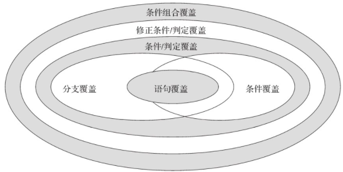
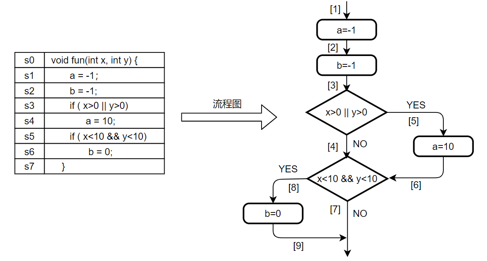
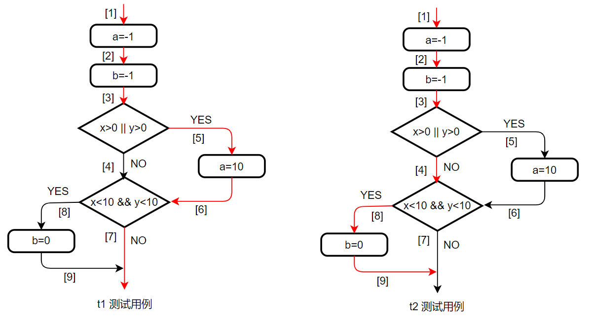
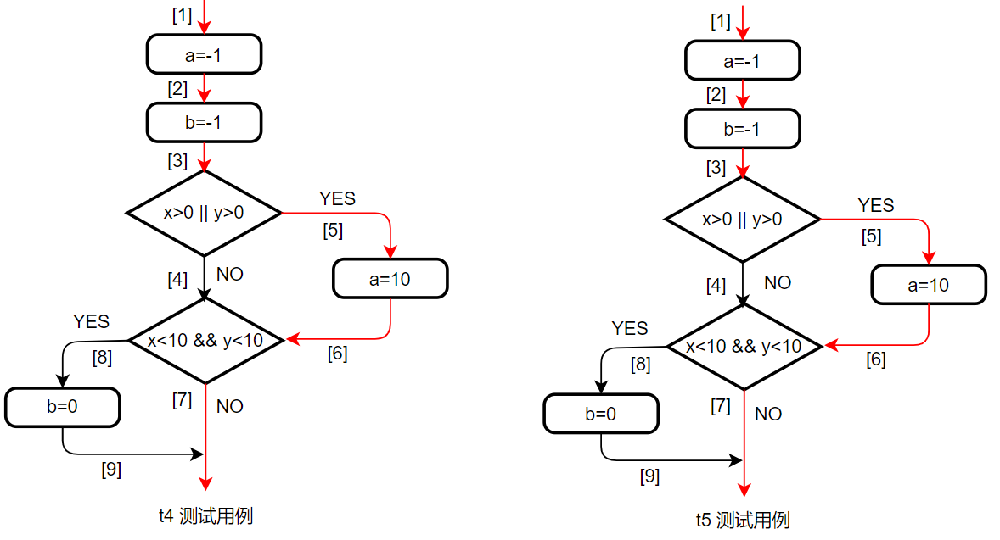
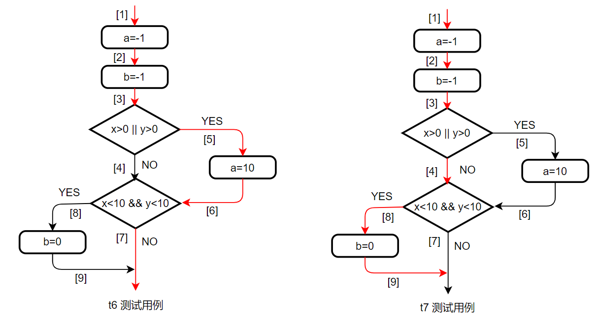
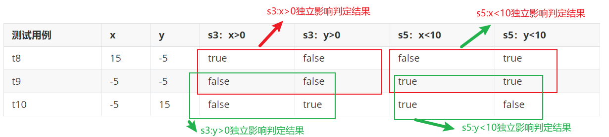
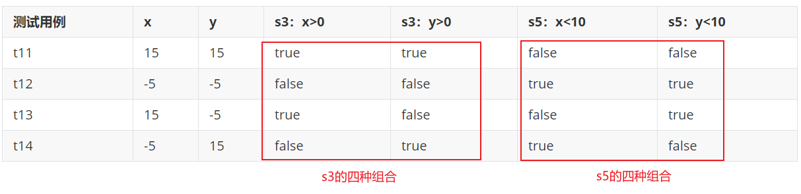
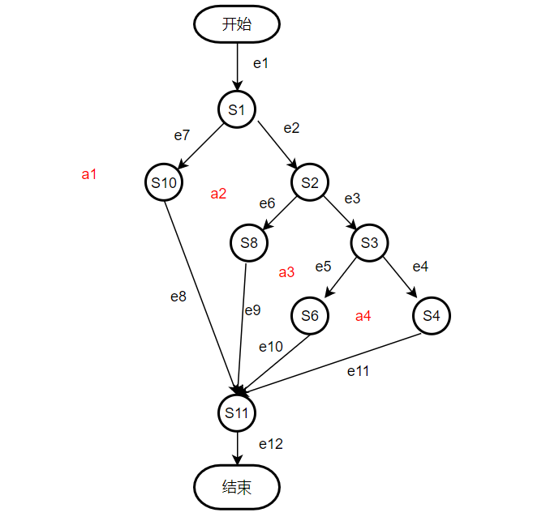

# 测试

## 1. 一些概念

开发者需要对自己开发的程序代码承担质量责任。开发者首先自行对自己编写的代码进行审查和测试，并保证提交的代码已达到一定的质量标准。开发者测试中的**单元测试**和**集成测试**主要采用白盒测试方法，要求测试人员对软件代码非常熟悉。

**单元测试**：对一个模块、一个函数或者一个类来进行正确性检验的测试工作。java程序测试时通常会把类中的一个方法作为一个单元进行测试。单元测试有如下优点：

1）测试粒度小，可以带来更高的测试覆盖率；

2）快速的定位问题，减少调试的难度，提高工作效率；

3）自带运行示例，具有注释能力；

4）可以更加自信的重构，能够一定程度上证明重构的可行性。

**集成测试**：它是单元测试的逻辑扩展，是在单元测试的基础上，依据软件概要设计书，将多个经单元测试验证的模块组装后再进行测试的过程。集成测试用于检测程序在单元测试时难以发现的问题，确保各单元组合在一起后能够按既定要求协作运行。集成测试前必须确保相应的单元测试没有问题，否则很难判断出错误出现在单元内，还是单元之间的交互过程中。

**黑盒测试**：不知道系统内部的状态与行为，测试仅仅依赖于系统外部接口来验证它的正确性。

**白盒测试**：软件内部的逻辑结构是可见的，测试人员需要清楚程序内部的逻辑结构和执行过程，有针对性地设计测试用例，以对程序的逻辑结构、执行路径等进行覆盖测试，并可通过在程序中设立检查点来检查程序的状态，以验证程序的实际执行状态与预期状态是否一致。逻辑覆盖测试和路径覆盖测试是基本的白盒测试方法。

## 2. 测试覆盖

### 2.1 逻辑测试覆盖

逻辑测试覆盖就是程序在测试运行时实现对其逻辑结构的覆盖。常见的逻辑覆盖有：语句覆盖、分支覆盖、条件覆盖、条件\判断覆盖、修正条件\判定覆盖、条件组合覆盖。他们的强弱关系如下图所示，条件覆盖率具有最高的测试强度，语句覆盖率强度最低。

测试强度：给定两个覆盖标准X和Y。如果在任意情况下，满足X标准的测试用例也满足Y标准，则称X标准强于Y标准。



一个简单的程序例子：



（1）语句覆盖：要求程序中的每条语句至少被运行一次。即程序中s1,s2,s3,s4,s5,s6都会被运行至少一次。其中s1,s2,s3,s5必然会被运行，s4,s6的运行依赖与s3和s5，因此需要针对s3和s5所包含的控制条件进行测试用例设计，以使得s4和s6可以被运行到。一直简单的方式是针对每个分支设计一个用例，使其覆盖响应分支，但是从解决成本的方面考虑，希望使用最少的用例达到覆盖要求。因此可以设计一个满足所有分支条件的用例。如用例t1={x=5,y=5} 满足 x>0 || y>0 和x<10&& y<10 的两个分支条件。

（2）分支覆盖：又称判定覆盖，要求程序中每个条件判定语句的真值结果和假值结果都至少出现一次。也就是流程中的[4],[5],[7],[8] 都至少执行一次。可以设计测试用例 t2={x=20,y=20}, t3={x=-2,y=-2} 满足要求。

| 测试用例 | x    | y    | x>0\|\|y>0 | x<10 && y<10 |
| -------- | ---- | ---- | ---------- | ------------ |
| t2       | 20   | 20   | true       | false        |
| t3       | -2   | -2   | false      | true         |



分支覆盖不仅考虑了各个条件判定语句的覆盖需求，还考虑了这些语句分支的覆盖需求，因而较语句覆盖测试强度更高。

（3）条件覆盖：要求程序中每个条件判定语句的每个条件至少取一次真值和一次假值。如，s3语句的if判断依赖 x>0和y>0两个条件，s5语句的if判断依赖 x<10和y<10两个条件。条件覆盖要求对上述的每一个条件都至少取一次真值和一次假值。可以设计用例 t4={x=20,y=-20}， t5={x=-2,y=20}。

| 测试用例 | x    | y    | s3：x>0 | s3：y>0 | s5：x<10 | s5：y<10 |
| -------- | ---- | ---- | ------- | ------- | -------- | -------- |
| t4       | 20   | -20  | true    | false   | false    | true     |
| t5       | -2   | 20   | false   | true    | true     | false    |



虽然条件覆盖满足了所有的条件，但是不一定满足所有的分支，如上图，第二个分支没有被覆盖，所有条件覆盖不一定强于分支覆盖。

（4）条件\判定覆盖：是条件覆盖和分支覆盖的结合，要求程序中每个条件判定语句的真值结果和假值结果都至少出现一次，且每个条件判定语句中的每个条件至少取一次真值和一次假值。可以设计测试用例：t6={x=20,y=20},t7={x=-2,y=-2}

| 测试用例 | x    | y    | s3：x>0 | s3：y>0 | s5：x<10 | s5：y<10 |
| -------- | ---- | ---- | ------- | ------- | -------- | -------- |
| t6       | 20   | 20   | true    | true    | false    | false    |
| t7       | -2   | -2   | false   | false   | true     | true     |



条件/判定覆盖要求测试用例既满足条件覆盖需求，也满足分支覆盖需求，因而与条件覆盖和分支覆盖相比其测试强度更高。

（5）修正条件\判定覆盖：在满足条件/判定覆盖的基础上，修正条件/判定覆盖要求测试用例还要同时满足以下两个条件：1）程序中的每个入口点和出口点至少被执行一次；2）每个条件都曾独立地影响判定结果，即在其他所有条件不变的情况下，改变该条件的值使得判定结果发生改变。

修正条件/判定要求与s3、s5相关的真假分支[4]、[5]、[7]、[8]至少被运行一次，且每一个条件至少取一次真值和一次假值。同时，修正条件/判定还要求P1中每个入口节点（语句s1）和出口节点（语句s3和s6）至少被执行一次，每个条件都可独立地影响判定结果，即条件“s3:(x>0)”和“s3:(y>0)”可以影响判定式“x>0||y>0”，条件“s5:(x<10)”和“s5:(y<10)”可以影响判定式“x<10&&y<10”。

| 测试用例 | x    | y    | s3：x>0 | s3：y>0 | s5：x<10 | s5：y<10 |
| -------- | ---- | ---- | ------- | ------- | -------- | -------- |
| t8       | 15   | -5   | true    | false   | false    | true     |
| t9       | -5   | -5   | false   | false   | true     | true     |
| t10      | -5   | 15   | false   | true    | true     | false    |



（6）条件组合覆盖：要求每条条件判定语句中条件取值的各种组合至少出现一次。程序中每条分支判定语句各包含两个条件，因而针对每条分支判定语句至少需要设计“真-真”、“真-假”、“假-真”、“假-假”等四个测试用例来测试每条分支判定语句的各种条件组合。

| 测试用例 | x    | y    | s3：x>0 | s3：y>0 | s5：x<10 | s5：y<10 |
| -------- | ---- | ---- | ------- | ------- | -------- | -------- |
| t11      | 15   | 15   | true    | true    | false    | false    |
| t12      | -5   | -5   | false   | false   | true     | true     |
| t13      | 15   | -5   | true    | false   | false    | true     |
| t14      | -5   | 15   | false   | true    | true     | false    |



满足条件组合覆盖的测试用例一定同时满足分支覆盖、条件覆盖和条件/判定覆盖。因此，条件组合覆盖的测试强度要高于分支覆盖、条件覆盖和条件/判定覆盖的测试强度。

### 2.2 程序环复杂度

环复杂度：程序复杂度度量的常用方法。程序的控制路径越复杂，其所产生的程序环路越多，研发人员理解和分析程序时所须考虑的因素就越多。因此，环复杂度可用于定量分析程序的逻辑复杂度。环复杂度v可通过程序控制流图g中区域、节点、判定节点和边的数目$num_{area}$、$num_{node}$、$num_{node\_branch}$、$num_{edge}$来计算。其中，在控制流图中由节点和边所围成的部分称为区域。具体可包括以下三种方法：
1）基于区域数目的计算方法：
$$
v(g)=num_{area}
$$
2）基于边和节点数目的计算方法：
$$
v(g)=num_{edge}-num_{node}+2
$$
3）基于判定节点数目的计算方法：
$$
v(g)=num_{node\_branch}+1
$$
以计算闰年为例：

```java
s0   int isLeap(int year){
s1       if(year%4==0){
s2           if(year%100==0){
s3                if(year%400==0){
s4                   leap=1;
s5               } else {
s6                   leap=0;}
s7           } else {
s8               leap=1;}
s9       } else {
s10           leap=0;}
s11       retrun leap;
s12   }
```

控制流程图如下：



流程图将平面分成四个区域 a1,a2,a3,a4，则v(g)=4。共8个节点12个边，v(g)=12-8=4。s1,s2,s3为判定节点，v(g)=3+1=4。


未完。。。。。。


