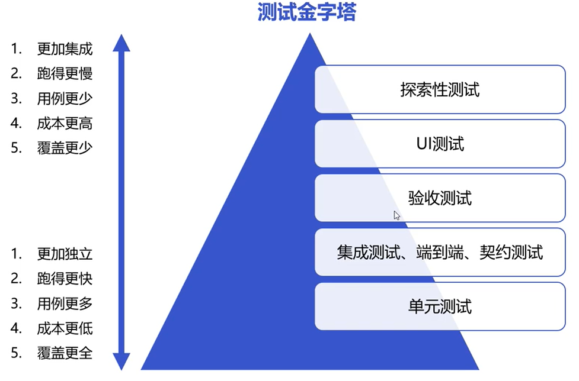
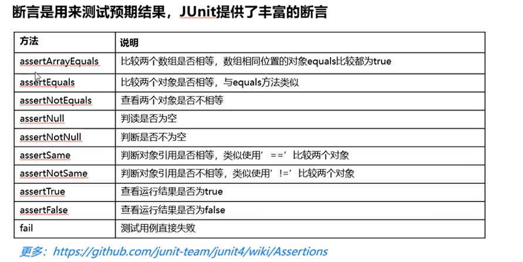
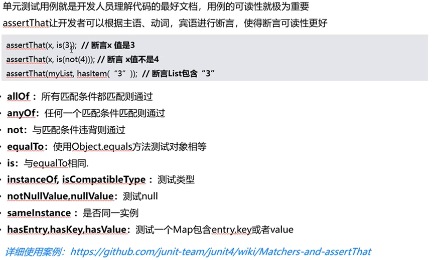
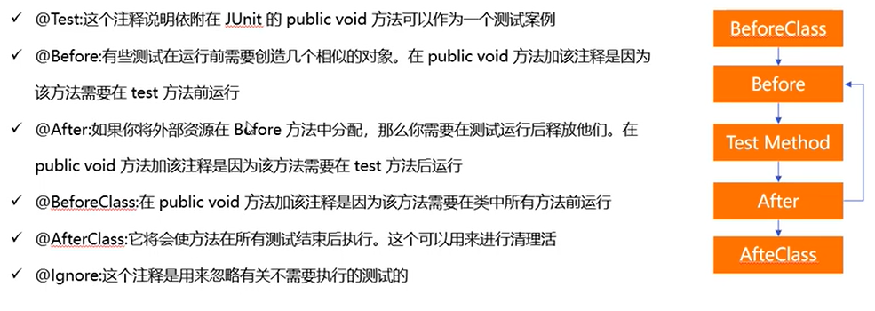
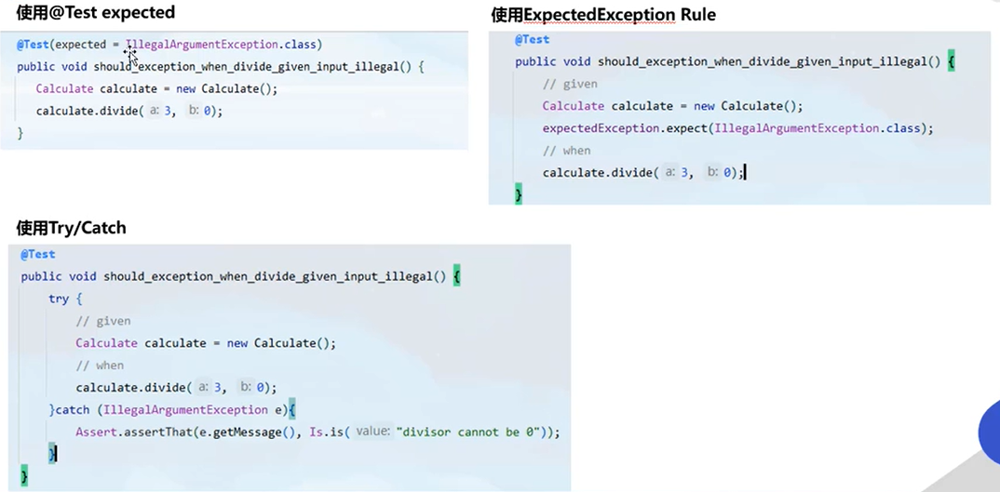
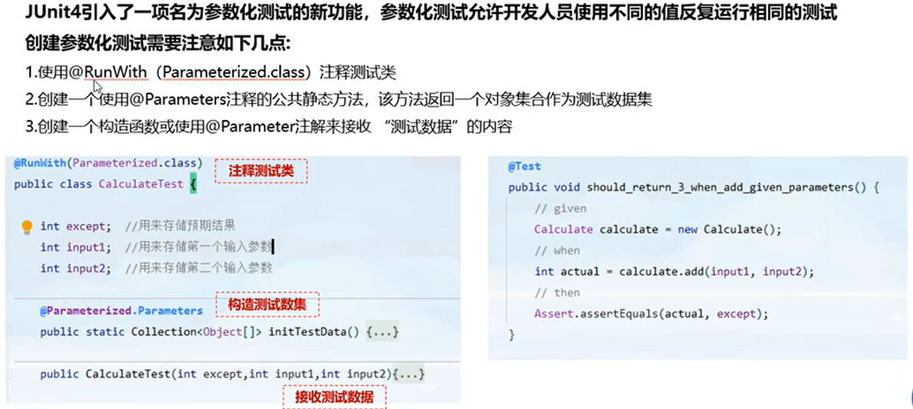
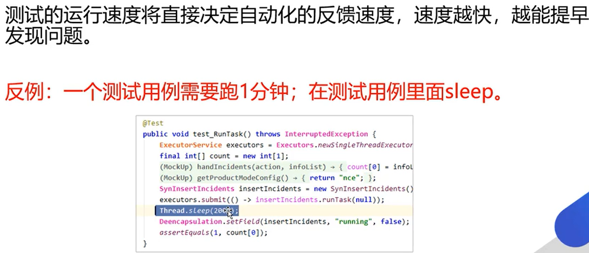
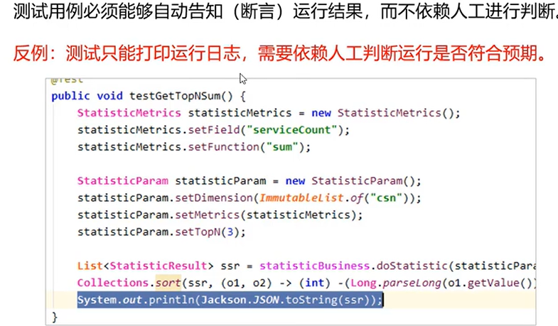
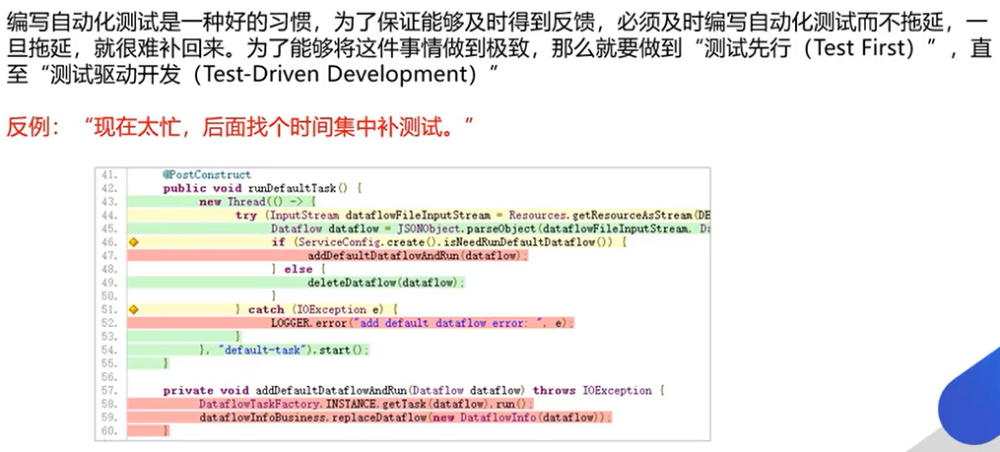

# 1 单元测试概念

单元测试（Unit Testing, UT）又称模块测试，是针对程序模块（软件设计的最小单元）来进行正确性检验的测试工作。程序单元是应用的最小可测试部件。在过程化编程中，一个单元就是单个程序、函数、过程等；**对于面向对象编程，最小单元就是方法、包括基类、抽象类、或者派生类中的方法。**

单元测试由程序员自己完成，最终受益的也是程序员自己。

单元测试在集成测试之前做，并且每次修改代码后也需要跑单元测试。

# 2 测试分类



# 3 怎么做单元测试

## 3.1 环境搭建

* 命令行方式：

  1. 下载 Junit jar包
  2. 增加CLASSPATH环境变量，并把 JUnit jar放在CLASSPATH

* Maven方式

  ```xml
  <dependency>
  	<groupId>junit</groupId>
      <artifactId>junit</artifactId>
      <version>4.12</version>
      <scope>test</scope>
  </dependency>
  ```

IDEA：在类名上按 alt+insert 快捷键，然后点击Test选项。

测试代码要加 @Test注解。

## 3.2 断言



## 3.3 高级断言



## 3.4 Junit注解



```java
public class Computer {

    public void test(){
        System.out.println("test");
    }
}
```

```java
package com.liyajie.pojo;
import org.junit.*;

public class ComputerTest {

    @BeforeClass
    public static void beforeClass() {
        System.out.println("beforeClass");
    }

    @AfterClass
    public static void afterClass() {
        System.out.println("afterClass");
    }

    @Before
    public void before() {
        System.out.println("before");
    }

    @After
    public void after() {
        System.out.println("after");
    }

    @Test
    public void test1() {
        Computer computer=new Computer();
        computer.test();
    }
}
```

## 3.5 异常测试

有三种方式：



* 使用@Test(expected=IllegalArgumentException.class)

  ```java
  public class Computer {
  
      public int add(int a,int b){
          return a+b;
      }
  
      public int divide(int a,int b){
          if(b==0){
              throw new IllegalArgumentException("divide cannot be 0");
          }
          return a/b;
      }
  }
  
  public class ComputerTest {
      
  	@Test(expected = IllegalArgumentException.class)  // 异常测试
      public void testDivide() {
          Computer computer=new Computer();
          int result=computer.divide(2,0);
      }
  }
  ```

  

* 使用ExpectedException Rule

  ```java
  public class ComputerTest {
      
  	@Rule
      public ExpectedException expectedException=ExpectedException.none();
      
      @Test
      public void testDivide() {
          Computer computer=new Computer();
          expectedException.expect(IllegalArgumentException.class);
          expectedException.expectMessage("divide cannot be 0");// 断言异常信息是否一样
          int result=computer.divide(2,0);
      }
  }
  ```

  

* 使用 try/catch

  ```java
  @Test
  public void testDivide() {
      try {
          Computer computer=new Computer();
          int result=computer.divide(2,0);
      } catch (IllegalArgumentException ex){
          Assert.assertThat(ex.getMessage(), Is.is("divide cannot be 0"));
      }
  }
  ```

## 3.6 参数化测试



```java
@RunWith(Parameterized.class)
public class ComputerTest {

    int except; // 存储预期的结果
    int input1; // 存储第一个输入参数
    int input2; // 存储第二个输入参数

    @Parameterized.Parameters
    public static Collection<Object[]> initTestData(){
        return Arrays.asList(new Object[][]{
                {3,1,2},{10,5,5},{6,4,2},{7,3,4}
        });
    }

    public ComputerTest(int except,int input1,int input2){
        this.except=except;
        this.input1=input1;
        this.input2=input2;
    }

    @Test
    public void testAdd(){
        Computer computer=new Computer();
        int result=computer.add(input1,input2);
        Assert.assertEquals(except,result);
    }
}
```


## 2.7 测试套件Suite

在实际项目中，随着项目的进度的开展，单元测试的类会越来越多，可是直到现在我们还只会一个一个的单独运行测试类，这在实际项目实践中肯定不行的。为了解决这个问题，Junit提供了一种批量运行测试类的方法：**测试套件**。

```java
@RunWith(Suite.class)
@Suit.SuitClasses({Test1.class,Test2.class})
public class Test3{
    ....
}
```

## 2.8 什么是MOCK?

消除外部依赖。

对于某些不容易构造（如HttpServletReques必须在Servlet容器中才能构造）或者不容易获取 比较复杂的对象（如JDBC中的ResultSet对象），用一个虚拟的对象（Mock）来创建，以便测试。

```java
class MyFileReader{
    String readFileFromServer(){
        // 调用服务器端口接收数据
        return "";
    }
}
public class FileExport {
    boolean export() {
        MyFileReader fileReader=new MyFileReader();
        String context=fileReader.readFileFromServer();
        System.out.println("context is "+ context);
        return true;
    }
}
```

```java
@RunWith(JMockit.class)   // 要引入JMockit jar包
public class FileExportTest {

    @Test
    public void export() {
        MockUp<MyFileReader> fileReaderMockUp=new MockUp<MyFileReader>(){
            @Mock
            String readFileServer(){
                return "test";
            }
        };

        FileExport fileExport=new FileExport(); 
        Assert.assertTrue(fileExport.export());// 会从上面打桩的方法调用，即模拟的数据获取
    }
}
```

* 为什么要使用Mock测试？
  1. 解决不同单元之间由于耦合而难于测试的问题
  2. 通过模拟依赖以分解单元测试耦合的部分
  3. 验证所调用的依赖的行为。

* Mock对象适用的场景
  1. 真实对象具有不可确定的行为
  2. 真实对象很难被创建
  3. 真实对象某些行为很难触发
  4. 真实情况程序的运行速度很慢
  5. 真实对象有用户界面
  6. 测试时需要了解真实对象如何被调用
  7. 真实对象实际上不存在

# 4 单元测试原则

## 4.1 Fast(快速)



## 4.2 Isolated(独立)


## 4.3 Repeatable(可重复)


## 4.4 Self-Validating(自验证)



## 4.5 Timly (及时)



