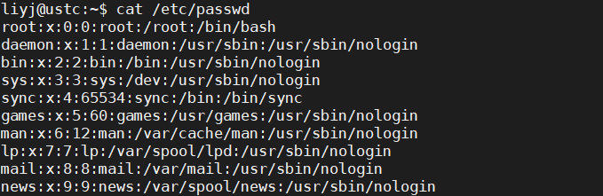
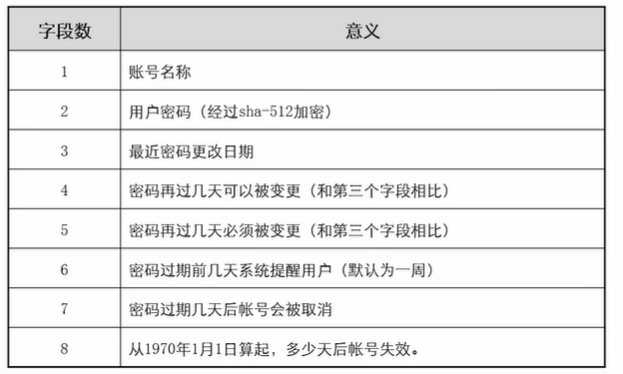
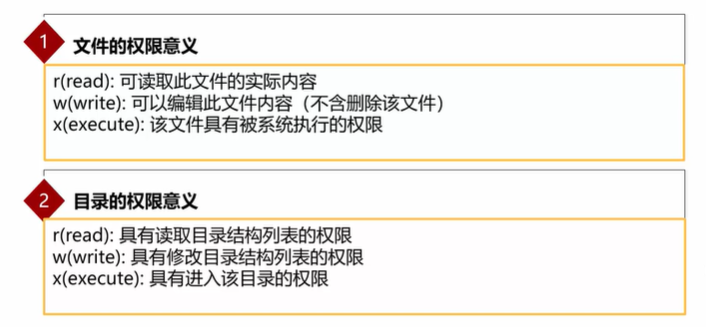

# Linux

## 1 用户管理

### 1.1 用户标识符：UID和GID

* Linux通过ID来区分用户，ID分为User ID和Group ID,用户名或者组名只是方便人们记忆。
* 用户ID保存路径：/etc/passwd
* 组ID保存路径：/etc/group


### 1.2 /etc/passwd文件结构

* 记录每个用户的登录信息。
* 每一行代表一个用户，用冒号 “ ：”分割成七段，记录了用户的七项基本信息。



* 七个字段的意义：


### 1.3  /etc/shadow文件结构

用户密码信息存储在此文件中，文件中每行表示一个系统用户的密码记录，用冒号分成八项，支持密码过期设定等功能。


意义如下：



### 1.4 /etc/group文件结构

记录GID和组名的对应关系，以及群组中包含的用户。


组名：组的密码（加密使用x替代）：GID：组中包含的用户(多个用户之间用逗号隔开)

### 1.5 组管理

* **新建组**

语法：groupadd [-option] group_name

新建组并指定GID：groupadd -g group_id group_name

```bash
groupadd new1
groupadd -g 2000 new2
```

* **修改组**

语法: groupmod [-g n] group_name

-g: 修改GID

-n：修改组名

```
groupmod -g 2500 -n new_name old_name
```

* **删除组**

语法：groupdel group_name

### 1.6 用户管理

* **新增用户**

语法： useradd [-option] user_name

-d: 设置用户home目录

-m：如果home目录不存在，则自动创建

-u：设置用户UID，如果不带此参数，系统自动设置UID

-g：设置初始GID或组名，若不带此参数，系统会建立和用户同名的组或根据配置文件自动设置

-G：设置用户加入其他群组（非初始化群组，/etc/group第四个字段）

-s：指定用户的shell，如/bin/bash

```
useradd -d /home/ipcc -m -u 2000 -g new3 -s /bin/csh ipcc
```

* **设置用户密码**

语法：passwd [用户名]

* **修改用户属性**

语法：usermod [-option] [用户名]

-d: 修改用户home目录

-e: 修改用户密码失效日期

-g: 修改初始化群组

```
usermod -e "2020-09-18" mmsc
```

* **删除用户**

语法：userdel [-option] [用户名]

-r：连home目录一同删除

* **用户查询相关命令**

who: 查询当前登录系统的所有用户

id: 查询当前用户的GID和UID

finger：查询用户的属性信息。


* **切换用户**

语法：su [-] [用户名]

su 用户名: 保留前面用户的环境变量，而不使用开启的用户的环境变量

su - 用户名: 不保留前面用户的环境变量，而使用开启的用户的环境变量

## 2 文件和目录管理

*  显示当前工作目录： pwd

### 文件权限



### 文件属性和权限说明


* **修改文件所有者**

语法：chown [-R] 文件主 文件

* **修改文件所属组**

语法:  chgrp [-R] 所属组 文件

*  **修改文件权限**

语法： chmod [-option] mode files,... 或 chmod [ugoa]  {+|-|=} [rwx] 文件

* **新建文件**

语法：touch 文件名

* **新增目录**

语法：mkdir [-m 模式] 【-p】目录名

-m：按指定存取模式建立目录

-p：建立目录时建立其所有不存在的父目录。

```
mkdir -m 777 temp
mkdir -p /a/b/c
```

* **文件查找**

语法： find path [-option] [查找条件]

-name: 根据文件名查找

* **查找文件的内容**

语法：grep [-cin] "目标字符串" filename

-c：计算找到的行数

-i: 忽略大小写

-n: 顺便输出行号

-l：根据文件内容查找文件，只显示包含该内容的文件名

-r: 根据文件内容递归查找文件，并打印对应的内容。

* **管道命令 “|”**

一个命令的输出送入另一个命令的输入。

eg: cat /etc/passwd | grep  sbin

* **输出重定向**

stdin,stdout,stderr 对应的文件描述符为0、1、2.

输出重定向：> （覆盖导入），>> （从文件末尾导入）

输入重定向：<

eg:

```bash
ls -l > ls.out 
find / -name filename 2> find.txt  (将命令错误输出到重定向文件中)
find / -name filename > find.txt   (将命令正确输出重定向文件中)
find / -name filename &> find.txt   (将所有输出重定向文件中)
```


## 3 Vim编辑器

### 3.1 vim 三种模式

一般模式、编辑模式、指令模式


* 一般模式下按键说明


* 编辑模式说明


* 指令模式说明


## 4 Linux文件系统管理


### 4.1 文件系统

* 文件系统的分类：
  * 是否有日志：传统文件系统（ext2）和日志文件系统（ext4 默认）
  * 是否查找数据：索引式文件系统(类似有详细的头信息存放文件的权限，大小，所有的block位置等)和非索引式文件系统(类似链表结构)


* 目录树的读取

从文件系统的顶层读取，获取inode号，验证inode权限，然后根据该inode读取block内的文件名，再一层一层往下读取到正确的档案内容。


### 4.2 Linux磁盘分区

主分区：3个；扩展分区：1个；逻辑分区：N个 。或只有4个主分区。

* 查看分区：fdisk -l

* 创建分区：fdisk 设备名     eg: fdisk /dev/sda

* 创建文件系统： mkfs [-t 类型] 【-b block大小】 设备名

  -t: 指定文件系统类型 ，如 ext3

  -b: 指定block大小，单位bytes

* 手动挂载文件系统：mount 设备名 挂载点

* 自动挂载文件系统：配置 /etc/fstab 文件

  

### 4.3  管理Linux文件系统

* df 查看文件系统磁盘空间占用情况。

  df  -h：以容易理解的格式打印文件系统大小，如136KB，24MB

  df  -i： 显示inode信息而非块使用量。

  

* du 查看文件或目录的磁盘使用空间。

  -a: 显示全部目录和子目录下每个档案所占的磁盘空间

  -s: 只显示大小的总和

  -h: 以容易理解的格式显示文件大小信息。

  

* lsof 查看打开的文件，必须以root用户运行。

  * lsof  目录   ：指定目录下打开的文件
  * lsof -u user_name: 指定用户打开的文件

  

## 5 网络管理

### 5.1 配置网络接口

* ifconfig 接口 [-option]

用于查看或设置网络接口的参数，如IP，掩码等。

* 手动编辑配置文件配置网络接口

配置文件在：/etc/sysconfig/network-scripts/ （ubuntu配置文件为/etc/network/interfaces）

配置文件命名格式为 ifcfg-[网卡号]

* route 查看路由表


 新增路由：route add [-net|-host] [netmask Nm] [gw Gw] [dev]  (重启后失效)

eg: route add -net 192.168.101.0 netmask 255.255.255.0 dev enp3s0

删除路由： route del

### 5.2 网络侦测

* ping ：用来检查网络是否通畅或者网络连接速度。

  ping [-option] address

  -c：执行ping的次数

  -s：定义ICMP包的大小，默认64bytes

* traceroute：用于探测数据包从源到目的地经过的路由器的IP。

  traceroute [-option]  <ipaddr or domain name>

  -n: 不进行主机名解析，仅仅使用IP，速度快

  -l:  后面接网络接口，如eth1，设定跟踪路由的源网卡。

## 6 Linux进程管理和服务管理

### 61. 进程

用户进程：用过通过终端加载的进程

守护进程：与终端无关的系统进程，可基于时间或事件启动。（常驻在内存中）

* 查看进程： ps 命令可静态查看某一时间点进程信息。

  使用format参数可将输出信息按照一定格式组织，如 ps ax --format 'cputime %C,nice %n,name %c'

  ps aux 查看所有进程相关信息

  top 命令连续观察进程动态。

  pstree 可以显示树状结构，清楚表达进程间的互相关系。

* 结束进程： kill和killall

  kill 命令结束进程时跟进程号PID

  killall命令结束同一进程组内的所有进程，跟进程名。

### 6.2 任务管理

任务：登录系统取得shell后，在单一终端接口下启动的进行。在任务管理的行为当中，每个任务都是当前的shell的子进程，无法在一个shell下面去管理另外一个shell下面的任务。

前台：在终端接口上，可以出现提示符让用户操作的环境

后台：不显示在终端接口的环境

任务管理的意义：可以多项任务并行，比如一边复制文件，一边搜索资料，一边使用vim。

* 使用 & 符号将任务放在后台运行。 eg: cp filename1 fielname2 &。 使用jobs命令可以查看当前shell下的子任务

* ctrl+z 将vim先暂时放在后台执行

* fg  jobID 将任务放入前台

* bg jobID  将任务放入后台

* fg bg不加jobID表示对当前任务进行操作

* crontab  [-u user] [-e| -l -r]: 周期计划任务 

  -u: 指定用户，只有root才能使用该参数，帮其他用户建立、移除任务

  -e: 编辑计划任务

  -l: 查看计划任务

  -r: 移除所有的计划任务

  

### 6.3 服务管理

* systemd管理服务
  * systemctl 管理服务： systemctl start | stop | status service
  * journalctl 查看系统日志。journalctl -u A.service 查看A服务的日志；journalctl --system --since=today 查看当天系统服务以及内核日志

## 7 Linux系统监控

### 7.1 系统监控

监控系统是否正常启动、系统负载如何、系统是否有非法用户登录。


### 7.2 查看登录信息

who，finger, w，last,lastlog

w: 查看登录系统的用户，w [option] [user], 可查看登录系统的用户以及用户当前的工作，比who更详细

-u: 后接 user，产看具体用户信息。

## 温故知新


## Linux三剑客

