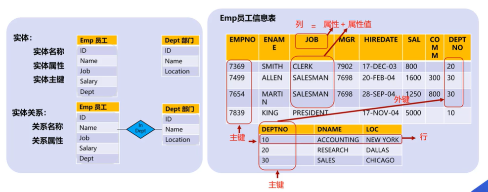

# 数据库

## 1. 数据库与数据库管理软件

* 数据库（Database）： 存储数据的仓库，以一定方式存储在一起、能为多个用户共享、具有尽可能小的冗余度、与应用程序彼此独立的数据集合，它具有完整性、共享性。
* 数据库管理软件（Database Management System）： 一种操纵和管理数据库的大型软件，用于建立、使用和维护数据库，简称DBMS。它对数据进行统一管理和控制，以保证数据库的安全性、完整性、共享性等。主要有：Oracle 、SQL Server、MySQL等。

## 2 数据存储管理的发展阶段

## 3 什么是关系型数据库

关系型数据库是建立在关系模型基础上的数据库，借助于集合代数等数学概念和方法来处理数据库中的数据。现实世界中的各种实体以及实体之间的各种联系均用关系型来表示。标准数据查询语言SQL就是一种基于关系性数据库的语言，这种语言执行对关系数据库中数据的检索和操作。

