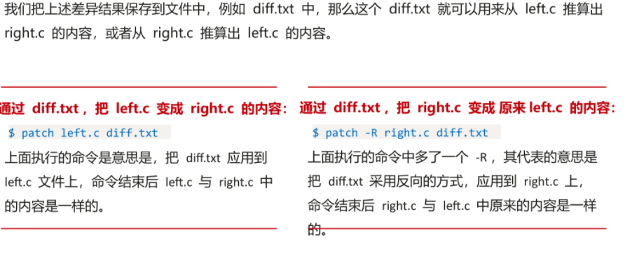

# 1. 版本控制工具简介

## 1.1 版本控制的起源：diff与patch

* diff: 用来比较两个文件或者目录之间的差异。

  

* patch: 是diff的反向操作。

  

之后出现集中式版本控制工具：CVS和SVN

* CVS：有史一俩第一个被大规模使用的版本控制工具，不支持原子操作，网络传输效率低。
* SVN：目的是创建一个更好用的版本控制系统取代CVS，可以进行原子操作，并优化服务器内容存储，局域网之外操作延迟高。

还有就是提交需要排队，不能同时修改，缺乏代码门禁。

## 1.2 Git 分布式版本控制工具

集中式 VS 分布式： **记录差异**还是**记录快照**。

* Git与其他版本控制系统的主要差别在于 **Git对待数据的方法**。

* 概念上来区分，其他大部分系统以文件变更列表的方式存储信息。CVS、Subversion,Perforce等这类系统将保存的信息看作式一组基本文件和每个文件随时间逐步累积的差异。

  

* Git 不按照以上方式对待或保存数据，反之，Git更像是把数据看作是对小型文件系统的一组快照。
* 每次提交更新，或在Git中保存项目状态时，它主要对当前的全部文件制作一个快照并保存这个快照的索引。
* 为了高效，如果文件没有修改，Git不会重新存储文件，而是保留一个链接指向之前存储的文件。Git对待数据更像是一个**快照流**。

集中式只有一个服务器，每个操作都要与之交互，易出现单点故障。分布式每个电脑都是服务器，数据安全，无带宽性能瓶颈。

Git不适合的领域：

* 不适合Word等二进制文件的版本控制。
* 因为Git无锁定、解锁模式，因此不能排他式修改。
* 整体的读授权，不能将读授权精细到目录级别，解决方案：版本库按照目录拆分。

## 1.3 Git 基本命令操作

### 1.3.1 Git版本控制下的三种工程区域&文件状态

* 三种工程区域：

  * 版本库（Repository）

    在工作区中有一个隐藏的目录`.git` ,这个文件夹就是Git的版本库，里面存放了Git用来管理该工程的所有版本数据，也叫做本地仓库。

  * 工作区（Working Directory）

    日常工作的代码文件或者文档所在的文件夹。

  * 暂存区（stage）

    一般存放在工程根目录`.git/index` 文件中，所以也称索引index。

* 文件三种状态：

  * 已提交（committed）

    该文件已经被安全保存到本地数据库中了。

  * 已修改（modified）

    修改了某个文件，但还没有提交保存。

  * 已暂存（staged）

    把已经修改的问价放在下次提交时要保存的清单中。

### 1.3.2 常用命令

* 工程准备：

  工程克隆------- `git clone`

* 查看工作区：

  查看工作区的修改内容------ `git diff`

  查看工作区文件状态------ `git status`

* 文件修改后提交推送：

  新增/删除/移动文件到暂存区------ `git add / git rm / git mv`

  提交更改的文件------ `git commit`

  推送到远端仓库------ `git push`

* 查看日志：

  查看当前分支上的提交日志------ `git log`

* 分支管理：

  列出本地分支------ `git branch`

  新建分支------ `git branch / git checkout -b`

  删除分支------ `git branch -d`

  切换分支------ `git checkout`

  更新分支------ `git pull`

  合并分支------ `git merge`

* 撤销操作：

  强制回退到历史节点------ `git reset`

  回退本地所有修改而未提交的----- `git checkout . / git checkout -filename / git checkout commit_id`  

* 分支合并：

  合并目标分支内容到当前分支------ `git merge / get rebase`

